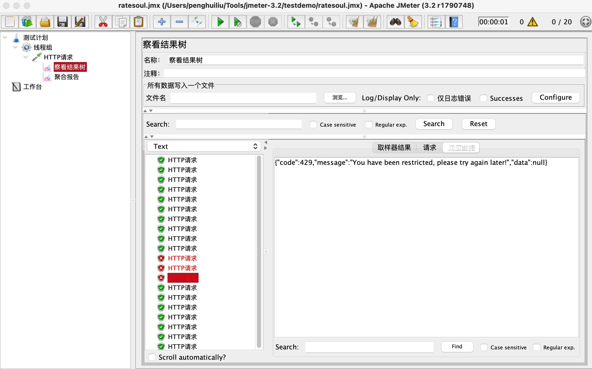

# soul网关源码分析之-限流插件

## 目标

- 集成限流（rate_limiter）插件
- 压测接口触发限流
- soul网关限流插件源码分析
- 总结


## 简介Soul网关限流插件

​    soul网关的限流插件是对流量管控的核心，soul网关的限流粒度可以是接口或者参数级别，soul网关的限流插件是基于redis实现的令牌桶算法，所以在集成soul网关之前要搭建一个redis。

## 网关集成限流插件

- **pom**

```
  <dependency>
      <groupId>org.dromara</groupId>
      <artifactId>soul-spring-boot-starter-plugin-ratelimiter</artifactId>
      <version>${soul-version}</version>
  </dependency>
```

## soul-admin限流插件配置

​    使用限流插件一定要正确的将redis配置到限流插件上，并且将限流插件开启，然后一定要新建选择器和对应的限流规则，并且限流的规则也一定要配置正确，否则限流可能就不生效了，如果插件中redis配置不对实际上请求都完全不通的。

- **开启限流插件**


- **选择器配置**


- **规则配置**


## 压测接口触发限流

- 压测工具：jmeter3.2
- 压测参数：1秒，20并发，执行一个循环
- 限流规则参数：容量10，速率10
- 查看限流结果



## 限流插件源码分析

​    网关集成了限流的starter，所以我们先看starter中配置类，这里就不详细的说一个请求的完整处理流程了，之前也分析过，soul网关使用责任链模式来匹配执行插件链，所以我们就直接先看限流插件。

- **RateLimiterPluginConfiguration**

```
@Configuration
public class RateLimiterPluginConfiguration {
    
    /**
     * 限流插件配置
     */
    @Bean
    public SoulPlugin rateLimiterPlugin() {
        // RedisRateLimiter是处理限流的类
        return new RateLimiterPlugin(new RedisRateLimiter());
    }
    
    /**
     * redis客户端的初始化
     */
    @Bean
    public PluginDataHandler rateLimiterPluginDataHandler() {
        return new RateLimiterPluginDataHandler();
    }
}
```

- **RateLimiterPluginDataHandler redis连接池的初始化**

```
public class RateLimiterPluginDataHandler implements PluginDataHandler {
    
    @Override
    public void handlerPlugin(final PluginData pluginData) {
        if (Objects.nonNull(pluginData) && pluginData.getEnabled()) {
            // 初始化redis的配置参数
            RateLimiterConfig rateLimiterConfig = GsonUtils.getInstance().fromJson(pluginData.getConfig(), RateLimiterConfig.class);
            // 如果reactiveRedisTemplate空的，或者redis配置参数对象空的，去创建redis客户端（连接池）
            if (Objects.isNull(Singleton.INST.get(ReactiveRedisTemplate.class))
                    || Objects.isNull(Singleton.INST.get(RateLimiterConfig.class))
                    || !rateLimiterConfig.equals(Singleton.INST.get(RateLimiterConfig.class))) {
                LettuceConnectionFactory lettuceConnectionFactory = createLettuceConnectionFactory(rateLimiterConfig);
                lettuceConnectionFactory.afterPropertiesSet();
                RedisSerializer<String> serializer = new StringRedisSerializer();
                RedisSerializationContext<String, String> serializationContext =
                        RedisSerializationContext.<String, String>newSerializationContext().key(serializer).value(serializer).hashKey(serializer).hashValue(serializer).build();
                ReactiveRedisTemplate<String, String> reactiveRedisTemplate = new ReactiveRedisTemplate<>(lettuceConnectionFactory, serializationContext);
                // 创建reactiveRedisTemplate，这里注意，创建的reactiveRedisTemplate和rateLimiterConfig是单例的
                Singleton.INST.single(ReactiveRedisTemplate.class, reactiveRedisTemplate);
                Singleton.INST.single(RateLimiterConfig.class, rateLimiterConfig);
            }
        }
    }
    
    @Override
    public String pluginNamed() {
        return PluginEnum.RATE_LIMITER.getName();
    }
    
    // 创建基于Lettuce的redis连接池
    private LettuceConnectionFactory createLettuceConnectionFactory(final RateLimiterConfig rateLimiterConfig) {
        LettuceClientConfiguration lettuceClientConfiguration = getLettuceClientConfiguration(rateLimiterConfig);
        if (RedisModeEnum.SENTINEL.getName().equals(rateLimiterConfig.getMode())) {
            return new LettuceConnectionFactory(redisSentinelConfiguration(rateLimiterConfig), lettuceClientConfiguration);
        }
        if (RedisModeEnum.CLUSTER.getName().equals(rateLimiterConfig.getMode())) {
            return new LettuceConnectionFactory(redisClusterConfiguration(rateLimiterConfig), lettuceClientConfiguration);
        }
        return new LettuceConnectionFactory(redisStandaloneConfiguration(rateLimiterConfig), lettuceClientConfiguration);
    }
    
    private LettuceClientConfiguration getLettuceClientConfiguration(final RateLimiterConfig rateLimiterConfig) {
        return LettucePoolingClientConfiguration.builder().poolConfig(getPoolConfig(rateLimiterConfig)).build();
    }
    // redis连接池配置
    private GenericObjectPoolConfig<?> getPoolConfig(final RateLimiterConfig rateLimiterConfig) {
        GenericObjectPoolConfig<?> config = new GenericObjectPoolConfig<>();
        config.setMaxTotal(rateLimiterConfig.getMaxActive());
        config.setMaxIdle(rateLimiterConfig.getMaxIdle());
        config.setMinIdle(rateLimiterConfig.getMinIdle());
        if (rateLimiterConfig.getMaxWait() != null) {
            config.setMaxWaitMillis(rateLimiterConfig.getMaxWait().toMillis());
        }
        return config;
    }
    
    /**
     * 单点的redis
     */
    protected final RedisStandaloneConfiguration redisStandaloneConfiguration(final RateLimiterConfig rateLimiterConfig) {
        RedisStandaloneConfiguration config = new RedisStandaloneConfiguration();
        String[] parts = StringUtils.split(rateLimiterConfig.getUrl(), ":");
        assert parts != null;
        config.setHostName(parts[0]);
        config.setPort(Integer.parseInt(parts[1]));
        if (rateLimiterConfig.getPassword() != null) {
            config.setPassword(RedisPassword.of(rateLimiterConfig.getPassword()));
        }
        config.setDatabase(rateLimiterConfig.getDatabase());
        return config;
    }
    /**
    * Cluster的redis集群
    */
    private RedisClusterConfiguration redisClusterConfiguration(final RateLimiterConfig rateLimiterConfig) {
        RedisClusterConfiguration config = new RedisClusterConfiguration();
        config.setClusterNodes(createRedisNode(rateLimiterConfig.getUrl()));
        if (rateLimiterConfig.getPassword() != null) {
            config.setPassword(RedisPassword.of(rateLimiterConfig.getPassword()));
        }
        return config;
    }
    
    // Sentinel（哨兵）模式的redis集群
    private RedisSentinelConfiguration redisSentinelConfiguration(final RateLimiterConfig rateLimiterConfig) {
        RedisSentinelConfiguration config = new RedisSentinelConfiguration();
        config.master(rateLimiterConfig.getMaster());
        config.setSentinels(createRedisNode(rateLimiterConfig.getUrl()));
        if (rateLimiterConfig.getPassword() != null) {
            config.setPassword(RedisPassword.of(rateLimiterConfig.getPassword()));
        }
        config.setDatabase(rateLimiterConfig.getDatabase());
        return config;
    }
    
    private List<RedisNode> createRedisNode(final String url) {
        List<RedisNode> redisNodes = new ArrayList<>();
        List<String> nodes = Lists.newArrayList(Splitter.on(";").split(url));
        for (String node : nodes) {
            String[] parts = StringUtils.split(node, ":");
            Assert.state(Objects.requireNonNull(parts).length == 2, "Must be defined as 'host:port'");
            redisNodes.add(new RedisNode(parts[0], Integer.parseInt(parts[1])));
        }
        return redisNodes;
    }
}
```

- **RedisRateLimiter处理执行限流**

```
@Slf4j
public class RedisRateLimiter {

		// lua脚本
    private final RedisScript<List<Long>> script;
		// 限流器初始化成功标记
    private final AtomicBoolean initialized = new AtomicBoolean(false);

    /**
     * Instantiates a new Redis rate limiter.
     */
    public RedisRateLimiter() {
        this.script = redisScript();
        initialized.compareAndSet(false, true);
    }

    /**
     * This uses a basic token bucket algorithm and relies on the fact that Redis scripts
     * execute atomically. No other operations can run between fetching the count and
     * writing the new count.
     *
     * @param id            is rule id
     * @param replenishRate replenishRate
     * @param burstCapacity burstCapacity
     * @return {@code Mono<Response>} to indicate when request processing is complete
     */
    @SuppressWarnings("unchecked")
    public Mono<RateLimiterResponse> isAllowed(final String id, final double replenishRate, final double burstCapacity) {
        // 限流器是否成功初始化
        if (!this.initialized.get()) {
            throw new IllegalStateException("RedisRateLimiter is not initialized");
        }
        // redis key
        List<String> keys = getKeys(id);
        // lua脚本
        List<String> scriptArgs = Arrays.asList(replenishRate + "", burstCapacity + "", Instant.now().getEpochSecond() + "", "1");
        // 执行限流
        Flux<List<Long>> resultFlux = Singleton.INST.get(ReactiveRedisTemplate.class).execute(this.script, keys, scriptArgs);
        // 处理结果
        return resultFlux.onErrorResume(throwable -> Flux.just(Arrays.asList(1L, -1L)))
                .reduce(new ArrayList<Long>(), (longs, l) -> {
                    longs.addAll(l);
                    return longs;
                }).map(results -> {
                    boolean allowed = results.get(0) == 1L;
                    Long tokensLeft = results.get(1);
                    RateLimiterResponse rateLimiterResponse = new RateLimiterResponse(allowed, tokensLeft);
                    log.info("RateLimiter response:{}", rateLimiterResponse.toString());
                    return rateLimiterResponse;
                }).doOnError(throwable -> log.error("Error determining if user allowed from redis:{}", throwable.getMessage()));
    }

    private static List<String> getKeys(final String id) {
        String prefix = "request_rate_limiter.{" + id;
        String tokenKey = prefix + "}.tokens";
        String timestampKey = prefix + "}.timestamp";
        return Arrays.asList(tokenKey, timestampKey);
    }
		// lua脚本存储位置 /META-INF/scripts/request_rate_limiter.lua
    @SuppressWarnings("unchecked")
    private RedisScript<List<Long>> redisScript() {
        DefaultRedisScript redisScript = new DefaultRedisScript<>();
        redisScript.setScriptSource(new ResourceScriptSource(new ClassPathResource("/META-INF/scripts/request_rate_limiter.lua")));
        redisScript.setResultType(List.class);
        return redisScript;
    }

}
```

- **RateLimiterPlugin限流插件**

```
public class RateLimiterPlugin extends AbstractSoulPlugin {

    private final RedisRateLimiter redisRateLimiter;

    /**
     * Instantiates a new Rate limiter plugin.
     *
     * @param redisRateLimiter  the redis rate limiter
     */
    public RateLimiterPlugin(final RedisRateLimiter redisRateLimiter) {
        this.redisRateLimiter = redisRateLimiter;
    }

    @Override
    public String named() {
        return PluginEnum.RATE_LIMITER.getName();
    }

    @Override
    public int getOrder() {
        return PluginEnum.RATE_LIMITER.getCode();
    }
    // 执行插件
    @Override
    protected Mono<Void> doExecute(final ServerWebExchange exchange, final SoulPluginChain chain, final SelectorData selector, final RuleData rule) {
        // 从规则中获取限流数据
        final String handle = rule.getHandle();
        // 限流数据反序列化成RateLimiterHandle对象
        final RateLimiterHandle limiterHandle = GsonUtils.getInstance().fromJson(handle, RateLimiterHandle.class);
        // 执行限流并处理返回结果数据
        return redisRateLimiter.isAllowed(rule.getId(), limiterHandle.getReplenishRate(), limiterHandle.getBurstCapacity())
                .flatMap(response -> {
                    // 是否被限流
                    if (!response.isAllowed()) {
                        exchange.getResponse().setStatusCode(HttpStatus.TOO_MANY_REQUESTS);
                        Object error = SoulResultWrap.error(SoulResultEnum.TOO_MANY_REQUESTS.getCode(), SoulResultEnum.TOO_MANY_REQUESTS.getMsg(), null);
                        // 被限流，处理接口返回
                        return WebFluxResultUtils.result(exchange, error);
                    }
                    // 执行插件链
                    return chain.execute(exchange);
                });
    }

}
```

- **request_rate_limiter.lua 限流令牌桶算法的lua脚本，该脚本代码逻辑后续分析，这里使用lua脚本的好处是，能够保证redis操作的原子性**

```
--
-- Licensed to the Apache Software Foundation (ASF) under one or more
-- contributor license agreements.  See the NOTICE file distributed with
-- this work for additional information regarding copyright ownership.
-- The ASF licenses this file to You under the Apache License, Version 2.0
-- (the "License"); you may not use this file except in compliance with
-- the License.  You may obtain a copy of the License at
--
--    http://www.apache.org/licenses/LICENSE-2.0
--
-- Unless required by applicable law or agreed to in writing, software
-- distributed under the License is distributed on an "AS IS" BASIS,
-- WITHOUT WARRANTIES OR CONDITIONS OF ANY KIND, either express or implied.
-- See the License for the specific language governing permissions and
-- limitations under the License.
--

local tokens_key = KEYS[1]
local timestamp_key = KEYS[2]
--redis.log(redis.LOG_WARNING, "tokens_key " .. tokens_key)

local rate = tonumber(ARGV[1])
local capacity = tonumber(ARGV[2])
local now = tonumber(ARGV[3])
local requested = tonumber(ARGV[4])

local fill_time = capacity/rate
local ttl = math.floor(fill_time*2)

--redis.log(redis.LOG_WARNING, "rate " .. ARGV[1])
--redis.log(redis.LOG_WARNING, "capacity " .. ARGV[2])
--redis.log(redis.LOG_WARNING, "now " .. ARGV[3])
--redis.log(redis.LOG_WARNING, "requested " .. ARGV[4])
--redis.log(redis.LOG_WARNING, "filltime " .. fill_time)
--redis.log(redis.LOG_WARNING, "ttl " .. ttl)

local last_tokens = tonumber(redis.call("get", tokens_key))
if last_tokens == nil then
  last_tokens = capacity
end
--redis.log(redis.LOG_WARNING, "last_tokens " .. last_tokens)

local last_refreshed = tonumber(redis.call("get", timestamp_key))
if last_refreshed == nil then
  last_refreshed = 0
end
--redis.log(redis.LOG_WARNING, "last_refreshed " .. last_refreshed)

local delta = math.max(0, now-last_refreshed)
local filled_tokens = math.min(capacity, last_tokens+(delta*rate))
local allowed = filled_tokens >= requested
local new_tokens = filled_tokens
local allowed_num = 0
if allowed then
  new_tokens = filled_tokens - requested
  allowed_num = 1
end

--redis.log(redis.LOG_WARNING, "delta " .. delta)
--redis.log(redis.LOG_WARNING, "filled_tokens " .. filled_tokens)
--redis.log(redis.LOG_WARNING, "allowed_num " .. allowed_num)
--redis.log(redis.LOG_WARNING, "new_tokens " .. new_tokens)

redis.call("setex", tokens_key, ttl, new_tokens)
redis.call("setex", timestamp_key, ttl, now)

return { allowed_num, new_tokens }
```

## 总结

​    soul网关集成使用限流插件非常简单，要注意的是一定要正确的配置插件的redis信息，自行创建选择器，限流规则要根据业务选择适合的匹配模式即可；后续我们又对限流插件的源码进行了大致的分析，依托于soul网关责任链处理插件的模式，限流插件作为责任链的一个链也是根据插件的匹配规则处理的，在redis服务方面soul网关支持单点redis，cluster集群，Sentinel集群模式，soul网关redis客户端配置使用的Lettuce配置的redis连接池，并且为了保障redis操作的原子性，soul网关的限流算法是使用lua脚本实现的。