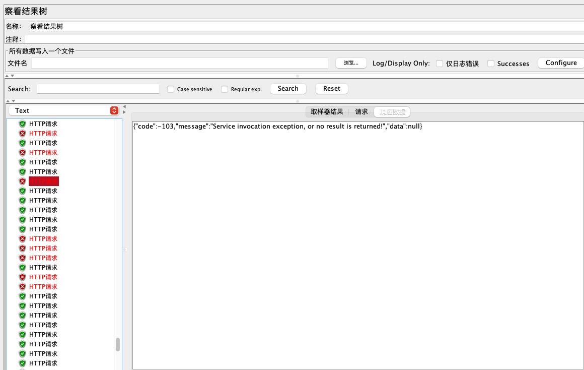

# soul网关源码分析之hystrix熔断插件-1

## 目标

- soul网关集成并配置熔断插件
- 测试不通熔断参数的熔断结果
- 分析soul网关熔断插件的原理
- 总结

## soul网关集成病配置熔断插件

​    soul网关的hystrix插件是网关用来对流量进行熔断的核心实现，使用信号量的方式来处理请求

- soul网关集成hystrix插件

```
        <dependency>
            <groupId>org.dromara</groupId>
            <artifactId>soul-spring-boot-starter-plugin-hystrix</artifactId>
            <version>${soul-version}</version>
        </dependency>  
```

- soul-admin开启hystrix插件


hystrix插件选择器创建


hystrix插件规则创建


Hystrix处理详解：

1. 跳闸最小请求数量 ：最小的请求量，至少要达到这个量才会触发熔断

2. 错误半分比阀值 ： 这段时间内，发生异常的百分比。

3. 最大并发量 ： 最大的并发量

4. 跳闸休眠时间(ms) ：熔断以后恢复的时间。

5. 分组Key： 一般设置为:contextPath

6. 命令Key: 一般设置为具体的 路径接口。

## 测试不同熔断参数的熔断结果

- **case-1**

  - 熔断插件配置：跳闸最小请求数量50，错误百分比阀值50，最大并发量50测试正常情况
  - 测试条件：jmeter脚本并发50，跑10s
  - 测试结果：未达到熔断条件，未熔断


- **case-2**

  - 熔断插件配置：跳闸最小请求数量50，错误百分比阀值50，最大并发量50测试正常情况
  - 测试条件：jmeter脚本并发60，跑10s
  - 测试结果：达到熔断条件，熔断，聚合报告指出有百分之9.5的请求被熔断掉



- **case-3**

  - 熔断插件配置：跳闸最小请求数量50，错误百分比阀值20，最大并发量50测试正常情况
  - 测试条件：jmeter脚本并发20，业务程序模拟无法对外提供服务（请求超时）
  - 测试结果：业务服务无法对外提供服务，触发熔断


- **case-4**

  - 熔断插件配置：跳闸最小请求数量50，错误百分比阀值20，最大并发量50测试正常情况
  - 测试条件：jmeter脚本并发20，业务程序模拟无法对外提供服务，直接停掉业务服务
  - 测试结果：业务服务无法对外提供服务，触发熔断


## 分析soul网关熔断插件的原理

​    soul网关是通过集成Netflix的hystrix实现的熔断，所以在使用，深入了解soul网关的熔断插件时应该对hystrix有一定的了解。

- **Hystrix设计目标：**

  - 对来自依赖的延迟和故障进行防护和控制——这些依赖通常都是通过网络访问的
  - 阻止故障的连锁反应
  - 快速失败并迅速恢复
  - 回退并优雅降级
  - 提供近实时的监控与告警

- **Hystrix遵循的设计原则：**

  - 防止任何单独的依赖耗尽资源（线程）
  - 过载立即切断并快速失败，防止排队
  - 尽可能提供回退以保护用户免受故障
  - 使用隔离技术（例如隔板，泳道和断路器模式）来限制任何一个依赖的影响
  - 通过近实时的指标，监控和告警，确保故障被及时发现
  - 通过动态修改配置属性，确保故障及时恢复
  - 防止整个依赖客户端执行失败，而不仅仅是网络通信

- **Hystrix实现**

  - 使用命令模式将所有对外部服务（或依赖关系）的调用包装在HystrixCommand或HystrixObservableCommand对象中，并将该对象放在单独的线程中执行；
  - 每个依赖都维护着一个线程池（或信号量），线程池被耗尽则拒绝请求（而不是让请求排队）。
  - 记录请求成功，失败，超时和线程拒绝。
  - 服务错误百分比超过了阈值，熔断器开关自动打开，一段时间内停止对该服务的所有请求。
  - 请求失败，被拒绝，超时或熔断时执行降级逻辑。
  - 近实时地监控指标和配置的修改。

## 总结

​    soul网关熔断插件的集成和使用都比较简单，并且我们也通过了几个小case验证了soul网关的熔断插件；此外，soul网关的熔断插件是通过集成Netflix的hystrix实现的，这里也简单的介绍了一下hystrix，具体的hystrix原理，实现和实战可以参考的转载的一篇文章[Hystrix原理与实战](https://blog.csdn.net/qq_31279701/article/details/113448879)；下一篇文章将具体的说一下soul网关熔断插件的处理流程。
