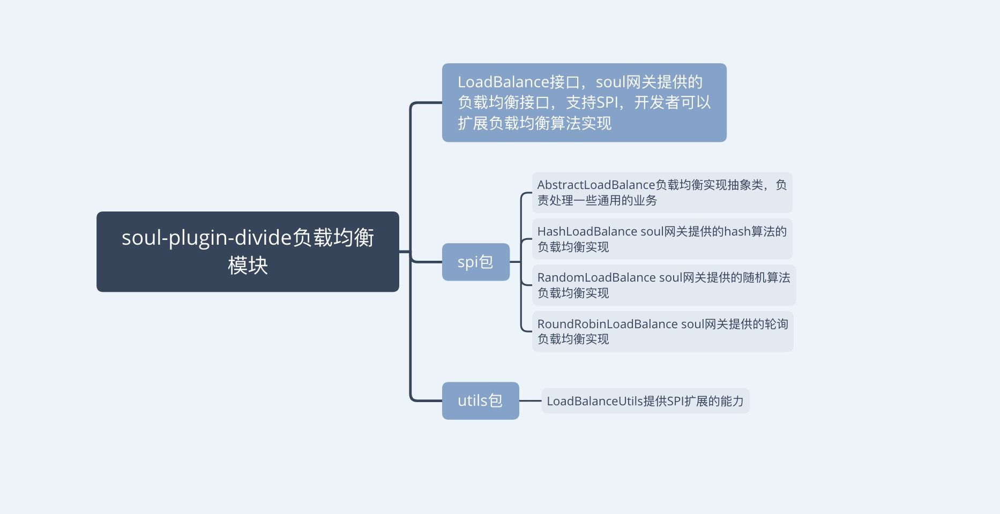

# suol网关源码分析第二周总结 

## 总结内容

- divide插件底层原理，负载均衡
- ip端口检测
- 限流插件
- 熔断插件初探
- 下周学习安排


## divide插件底层原理，负载均衡

### divide插件负载均衡模块总结



### divide插件负载核心接口介绍

- **LoadBalance接口**

&nbsp; &nbsp; 这是一个`SPI`的接口，所以soul网关的负载均衡实现是可扩展的，开发者可以根据自己的业务需求，系统情况来实现自己的负载均衡，该接口提供了一个select方法，返回一个`DivideUpstream`对象，该对象包含一下属性：

1. upstreamHost：存活的ip

2. protocol：协议

3. upstreamUrl：请求地址

4. weight：权重

5. status：状态，默认是true

6. timestamp：时间戳
7. warmup：热度

```
@SPI
public interface LoadBalance {

    /**
     * this is select one for upstream list.
     *
     * @param upstreamList upstream list
     * @param ip ip
     * @return divide upstream
     */
    DivideUpstream select(List<DivideUpstream> upstreamList, String ip);
}
```

- **AbstractLoadBalance类**

&nbsp; &nbsp; 该类是soul网关支持的负载均衡算法的基类，实现了LoadBalance接口，重写select方法，提供了抽象方法doSelect，负载均衡的具体实现类会重写doSelect方法，doSelect方法才是具体的负载均衡算法的实现，还提供了一个`getWeight`方法，这里特别注意一下`calculateWarmupWeight`方法，该方法是根据时间差，接口热度，权重计算实际权重的方法。

- **DivideUpstream**

&nbsp; &nbsp; 该类是提供负载参数的核心对象，该对象对应的数据，在网关端是缓存在JVM中，在执行divide插件时会根据`selectorId`获取到`DivideUpstream`对象。

- **LoadBalanceUtils**

  &nbsp; &nbsp; 该类为divide插件提供统一的负载均衡处理，提供`selector`方法，方法入参`DivideUpstream列表`、`algorithm负载算法`、`ip`，该方法支持`SPI`的处理。


## ip端口检测

&nbsp; &nbsp; 在soul-admin 会有一个定时任务来扫描 配置的ip端口，如果发现下线，则会除该 ip + port；不只是在soul-admin端会有定时的探活，在soul网关侧也有ip+端口的探活，soul网关ip+端口的探活是针对`selectorData`变化监测的，就是说当soul-admin端探活ip+端口到变化时，会发布选择器数据变化，网关侧进行选择器数据同步，网关端会启动一个定时任务，每次任务的执行逻辑就是对`selectorData`中的ip+端口进行探活，然后更新网关端的`DivideUpstream`缓存。


### soul-admin端IP+端口探活


&nbsp;&nbsp;soul-admin端是否开启ip端口探活和探活的频率是可以配置的如果不配置的默认是检查的，并且频率就是十秒，配置如下：

```
soul.upstream.check:true  默认为 ture，设置为false，不检测
soul.upstream.scheduledTime:10
```


&nbsp;&nbsp;在soul-admin端是通过`UpstreamCheckService`进行的探活的处理，下面这段代码可以看到`@PostConstruct`注解，该注解的作用是在spring项目启动容器初始化时候会被执行他的执行顺序是`Constructor >> @Autowired >> @PostConstruct`，下面代码是`UpstreamCheckService`


### soul网关侧IP+端口探活

&nbsp; &nbsp; soul网关侧实现IP+端口探活的主要类是`UpstreamCacheManager`，这个类是单例的，触发探活定时任务是通过`UpstreamCacheManager`的构造函数实现的，由于`UpstreamCacheManager`是单例的，所以只会在被初始化一次，`UpstreamCacheManager`对象是在数据同步时`DividePluginDataHandler`的动作初始化的，这里忽略数据同步的流程，只关心`IP+端口探活`的逻辑。


### ip+端口探活的核心处理工具类


## 限流插件

&nbsp; &nbsp; soul网关的限流是基于redis实现的令牌桶算法实现的，并且为了保证redis操作的原子性，令牌桶算法使用的lua脚本，下面是限流插件的核心处理类，限流插件的具体集成，使用，测试结果，源码分析可以见[soul网关源码分析之-限流插件](https://blog.csdn.net/qq_31279701/article/details/113362077)，在详细分析源码时最好先对令牌桶限流算法有一定的了解。


&nbsp; &nbsp; 下面是soul网关官网给出的限流插件的流程图


## 熔断插件初探

&nbsp; &nbsp; 目前对于限流插件还是停留在使用和测试阶段，通过几个case体验soul网关的熔断能力，soul网关熔断是通过集成`Netflix`的`hystrix`实现的，这里也简单的介绍了一下`hystrix`，对于限流插件的深入理解还是需要深入理解`Netflix` 的`hystrix`组件，建议参考文章[Hystrix原理与实战](https://blog.csdn.net/qq_31279701/article/details/113448879)；

- **Hystrix设计目标：**
  - 对来自依赖的延迟和故障进行防护和控制——这些依赖通常都是通过网络访问的
  - 阻止故障的连锁反应
  - 快速失败并迅速恢复
  - 回退并优雅降级
  - 提供近实时的监控与告警
- **Hystrix遵循的设计原则：**
  - 防止任何单独的依赖耗尽资源（线程）
  - 过载立即切断并快速失败，防止排队
  - 尽可能提供回退以保护用户免受故障
  - 使用隔离技术（例如隔板，泳道和断路器模式）来限制任何一个依赖的影响
  - 通过近实时的指标，监控和告警，确保故障被及时发现
  - 通过动态修改配置属性，确保故障及时恢复
  - 防止整个依赖客户端执行失败，而不仅仅是网络通信
- **Hystrix实现**
  - 使用命令模式将所有对外部服务（或依赖关系）的调用包装在HystrixCommand或HystrixObservableCommand对象中，并将该对象放在单独的线程中执行；
  - 每个依赖都维护着一个线程池（或信号量），线程池被耗尽则拒绝请求（而不是让请求排队）。
  - 记录请求成功，失败，超时和线程拒绝。
  - 服务错误百分比超过了阈值，熔断器开关自动打开，一段时间内停止对该服务的所有请求。
  - 请求失败，被拒绝，超时或熔断时执行降级逻辑。
  - 近实时地监控指标和配置的修改。


## 下周学习安排

- **Hystrix实现细节分析**
- **soul网关waf插件**
- **搭建网关集群环境，并进行测试**

