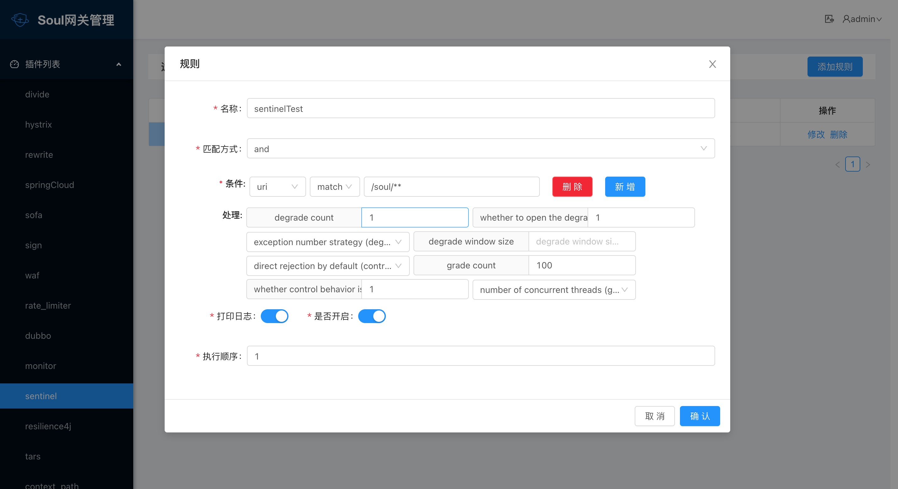
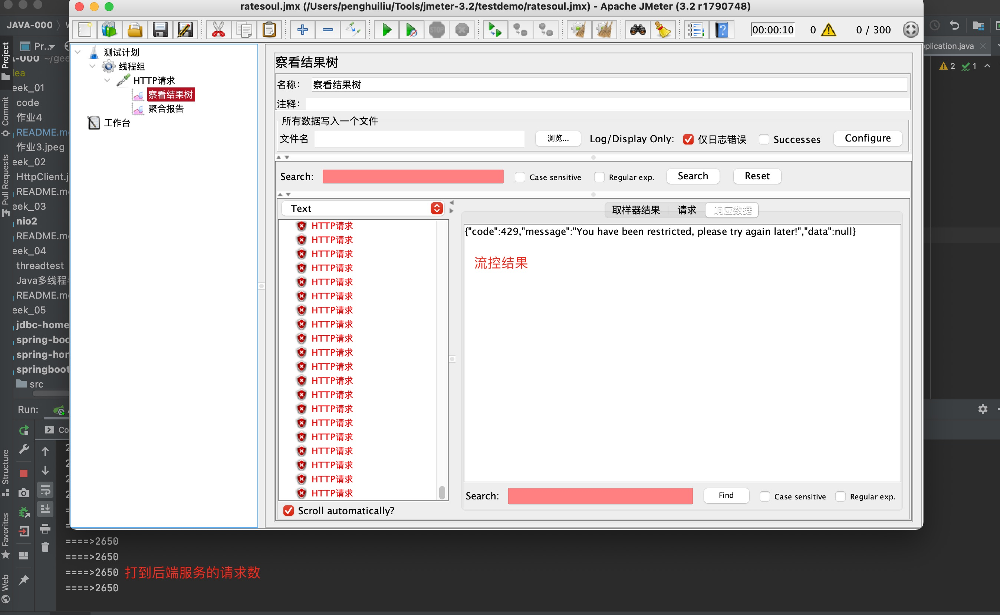

# suol网关源码分析之sentinel插件、resilience4j插件

## 目标

- 集成sentinel插件并跑通
- 集成resilience4j插件并跑通

## 集成sentinel插件并并跑通

- **介绍**

1. sentinel插件是网关用来对流量进行限流与熔断的可选选择之一。
2. sentinel为网关熔断限流提供能力。

- **插件使用**

1. 在soul-admin端开启插件
2. 在soul网关端配置如下：
```
  <dependency>
      <groupId>org.dromara</groupId>
      <artifactId>soul-spring-boot-starter-plugin-sentinel</artifactId>
       <version>${soul-version}</version>
  </dependency>
```
3. 选择器配置

- Sentinel处理详解：
   - 是否开启流控(1或0) ：是否开启sentinel的流控。
   - 流控效果 ： 流控效果（直接拒绝 / 排队等待 / 慢启动模式），不支持按调用关系限流。
   - 限流阈值类型 ： 限流阈值类型，QPS 或线程数模式。
   - 是否开启熔断(1或0) ：是否开启sentinel熔断。
   - 熔断类型： 熔断策略，支持秒级 RT/秒级异常比例/分钟级异常数。
   - 熔断阈值: 阈值。
   - 熔断窗口大小: 降级的时间，单位为 s。
   - 熔断URI: 熔断后的降级uri。



4. 测试效果



## 集成resilience4j插件并跑通

- **介绍**

1. resilience4j插件是网关用来对流量进行限流与熔断的可选选择之一
2. resilience4j为网关熔断限流提供能力

- **插件使用**

1. 在soul-admin端开启插件
2. 在soul网关端配置如下：
```
  <dependency>
      <groupId>org.dromara</groupId>
      <artifactId>soul-spring-boot-starter-plugin-resilience4j</artifactId>
       <version>${soul-version}</version>
  </dependency>
```
3. 选择器配置

- Resilience4j处理详解：
   - timeoutDurationRate：等待获取令牌的超时时间，单位ms，默认值：5000。
   - limitRefreshPeriod：刷新令牌的时间间隔，单位ms，默认值：500。
   - limitForPeriod：每次刷新令牌的数量，默认值：50。
   - circuitEnable：是否开启熔断，0：关闭，1：开启，默认值：0。
   - timeoutDuration：熔断超时时间，单位ms，默认值：30000。
   - fallbackUri：降级处理的uri。
   - slidingWindowSize：滑动窗口大小，默认值：100。
   - slidingWindowType：滑动窗口类型，0：基于计数，1：基于时间，默认值：0。
   - minimumNumberOfCalls：开启熔断的最小请求数，超过这个请求数才开启熔断统计，默认值：100。
   - waitIntervalFunctionInOpenState：熔断器开启持续时间，单位ms，默认值：10。
   - permittedNumberOfCallsInHalfOpenState：半开状态下的环形缓冲区大小，必须达到此数量才会计算失败率，默认值：10。
   - failureRateThreshold：错误率百分比，达到这个阈值，熔断器才会开启，默认值50。
   - automaticTransitionFromOpenToHalfOpenEnabled：是否自动从open状态转换为half-open状态，,true：是，false：否，默认值：false。

4. 测试效果

5. 在测试resilience4j的一开始就遇到了两个问题，需要提issue

   - soul-admin端的参数如果不填，在请求时会报json转换javabean错误，报错代码为以下Resilience4JPlugin.java：

    ```
    Resilience4JHandle resilience4JHandle = GsonUtils.getGson().fromJson(rule.getHandle(), Resilience4JHandle.class); 
    ```
    - soul-admin端degrade opening duration参数必须是大于1000，不然会报错Illegal argument interval: 0 millis is less than 1，这个错误其实是resilience4j报出来的，意思是秒不能等于0，错误代码如下Resilience4JBuilder.java的57行：

    ```
    Duration.ofSeconds(handle.getWaitIntervalFunctionInOpenState() / 1000
    ```