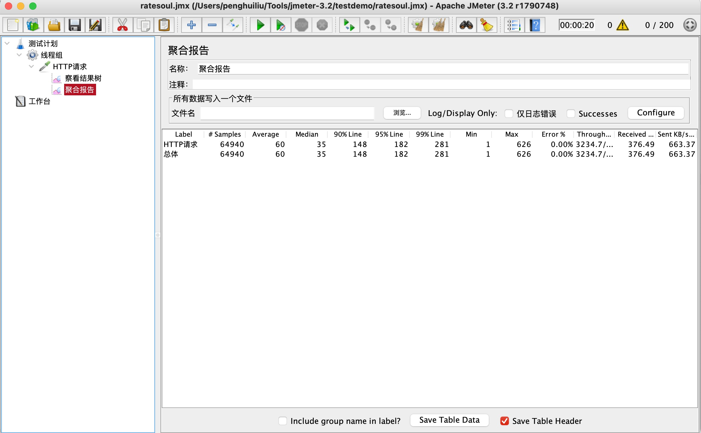
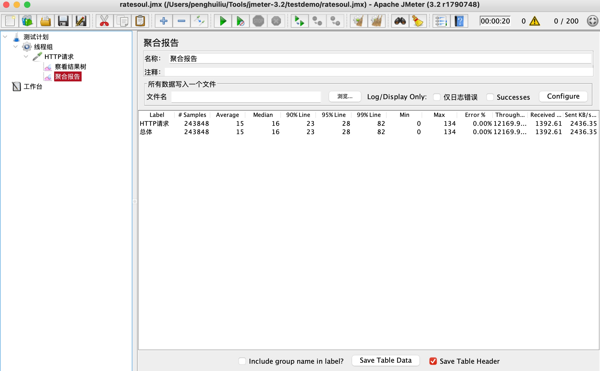

# suol网关源码分析之压测网关与压测值连对比

## 目标

- 压测网关代理结果
- 压测值连的结果
- 对比

## 压测网关代理结果

## 压测值连的结果

## 对比

可以看到性能差了将近四倍，这个压测之有可能不准确，毕竟我业务接口，网关，soul-admin全部部署在自己的电脑上，而且我的电脑又充当压力机的角色，压测的值肯定会有比较大的偏差，但有一点是肯定的，直接连的性能一定是好过于使用网关代理，毕竟在架构上使用网关多了一跳。

