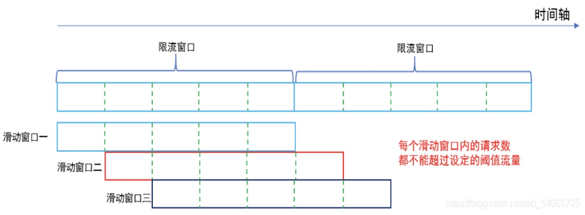

#  soul 限流和熔断分享

## 分享内容

- soul网关限流插件
- soul网关熔断插件
- 梦码总结

## soul网关限流插件

### 为什么要限流

- 限流的目的很简单，就是为了保护系统不被瞬时大流量冲垮

- 业务用户量不断攀升
- 各种促销
- 网络爬虫
- ……

### 常见的限流算法

- 计数器固定窗口法
- 计数器滑动窗口法
- 漏桶算法
- 令牌桶算法

### 计数器固定窗口算法

​    通过维护一个单位时间内的计数值，每当一个请求通过时，就将计数值加1，当计数值超过预先设定的阈值时，就拒绝单位时间内的其他请求。如果单位时间已经结束，则将计数器清零，开启下一轮的计数。


​    窗口切换时可能会产生两倍于阈值流量的请求。


### 计数器滑动窗口算法

​    计数器滑动窗口算法是计数器固定窗口算法的改进，解决了固定窗口切换时可能会产生两倍于阈值流量请求的缺点。



### 漏桶算法

​    水（请求）先进入到漏桶里，漏桶以一定的速度出水，当水流入速度过大会直接溢出（拒绝服务）


缺点：

- 无法面对突发的大流量

   比如：请求处理速率为1000/s，容量为5000，来了一波2000/s的请求持续10s，那么5s后会有大量的请求被丢弃。

- 无法有效利用网络资源

   比如：服务器的处理能力是1000/s，连续5s每秒请求量分别为1200、1300、1200、500、800，平均下来QPS也是1000/s，但是有700个请求被拒绝。

### 令牌桶算法

- 系统以恒定的速率产生令牌，然后将令牌放入令牌桶中。
- 令牌桶有一个容量，当令牌桶满了的时候，再向其中放入的令牌就会被丢弃。
- 每次一个请求过来，需要从令牌桶中获取一个令牌，如果有令牌，则提供服务；如果没有令牌，则拒绝服务。


特点：

- 能够限制调用的平均速率
- 允许一定程度的突发调用


### 限流算法总结

- 计数器固定窗口算法
   实现简单，容易理解，但是在窗口切换时可能会产生两倍于阈值流量的请求。
- 计数器滑动窗口算法
   作为计数器固定窗口算法的一种改进，有效解决了窗口切换时可能会产生两倍于阈值流量请求的问题
- 漏桶算法
   能够对流量起到整流的作用，让随机不稳定的流量以固定的速率流出，但是不能解决流量突发的问题。
- 令牌桶算法
   作为漏桶算法的一种改进，除了能够起到平滑流量的作用，还允许一定程度的流量突发。

### soul网关使用的限流算法

​    soul网关使用的是基于redis实现的`令牌桶算法`，下面从`soul网关使用`，`压测限流`，`核心源码解析`三个方面说一下soul网关的限流算法

#### soul网关使用限流插件

- soul-admin配置并开启`rateLimiter`插件
- soul-admin创建`选择器`
- soul-admin创建`规则`
- soul网关侧pom文件集成`soul-spring-boot-starter-plugin-ratelimiter`


#### 压测限流插件

- 压测工具：jmeter3.2
- 压测参数：1秒，20并发，执行一个循环
- 限流规则参数：容量10，速率10
- 查看限流结果


#### 核心源码分析

- **RateLimiterPluginDataHandler redis连接池的初始化**

```
public class RateLimiterPluginDataHandler implements PluginDataHandler {
    
    @Override
    public void handlerPlugin(final PluginData pluginData) {
        if (Objects.nonNull(pluginData) && pluginData.getEnabled()) {
            // 初始化redis的配置参数
            RateLimiterConfig rateLimiterConfig = GsonUtils.getInstance().fromJson(pluginData.getConfig(), RateLimiterConfig.class);
            // 如果reactiveRedisTemplate空的，或者redis配置参数对象空的，去创建redis客户端（连接池）
            if (Objects.isNull(Singleton.INST.get(ReactiveRedisTemplate.class))
                    || Objects.isNull(Singleton.INST.get(RateLimiterConfig.class))
                    || !rateLimiterConfig.equals(Singleton.INST.get(RateLimiterConfig.class))) {
                LettuceConnectionFactory lettuceConnectionFactory = createLettuceConnectionFactory(rateLimiterConfig);
                lettuceConnectionFactory.afterPropertiesSet();
                RedisSerializer<String> serializer = new StringRedisSerializer();
                RedisSerializationContext<String, String> serializationContext =
                        RedisSerializationContext.<String, String>newSerializationContext().key(serializer).value(serializer).hashKey(serializer).hashValue(serializer).build();
                ReactiveRedisTemplate<String, String> reactiveRedisTemplate = new ReactiveRedisTemplate<>(lettuceConnectionFactory, serializationContext);
                // 创建reactiveRedisTemplate，这里注意，创建的reactiveRedisTemplate和rateLimiterConfig是单例的
                Singleton.INST.single(ReactiveRedisTemplate.class, reactiveRedisTemplate);
                Singleton.INST.single(RateLimiterConfig.class, rateLimiterConfig);
            }
        }
    }
    
    @Override
    public String pluginNamed() {
        return PluginEnum.RATE_LIMITER.getName();
    }
    
    // 创建基于Lettuce的redis连接池
    private LettuceConnectionFactory createLettuceConnectionFactory(final RateLimiterConfig rateLimiterConfig) {
        LettuceClientConfiguration lettuceClientConfiguration = getLettuceClientConfiguration(rateLimiterConfig);
        if (RedisModeEnum.SENTINEL.getName().equals(rateLimiterConfig.getMode())) {
            return new LettuceConnectionFactory(redisSentinelConfiguration(rateLimiterConfig), lettuceClientConfiguration);
        }
        if (RedisModeEnum.CLUSTER.getName().equals(rateLimiterConfig.getMode())) {
            return new LettuceConnectionFactory(redisClusterConfiguration(rateLimiterConfig), lettuceClientConfiguration);
        }
        return new LettuceConnectionFactory(redisStandaloneConfiguration(rateLimiterConfig), lettuceClientConfiguration);
    }
    
    private LettuceClientConfiguration getLettuceClientConfiguration(final RateLimiterConfig rateLimiterConfig) {
        return LettucePoolingClientConfiguration.builder().poolConfig(getPoolConfig(rateLimiterConfig)).build();
    }
    // redis连接池配置
    private GenericObjectPoolConfig<?> getPoolConfig(final RateLimiterConfig rateLimiterConfig) {
        GenericObjectPoolConfig<?> config = new GenericObjectPoolConfig<>();
        config.setMaxTotal(rateLimiterConfig.getMaxActive());
        config.setMaxIdle(rateLimiterConfig.getMaxIdle());
        config.setMinIdle(rateLimiterConfig.getMinIdle());
        if (rateLimiterConfig.getMaxWait() != null) {
            config.setMaxWaitMillis(rateLimiterConfig.getMaxWait().toMillis());
        }
        return config;
    }
    
    /**
     * 单点的redis
     */
    protected final RedisStandaloneConfiguration redisStandaloneConfiguration(final RateLimiterConfig rateLimiterConfig) {
        RedisStandaloneConfiguration config = new RedisStandaloneConfiguration();
        String[] parts = StringUtils.split(rateLimiterConfig.getUrl(), ":");
        assert parts != null;
        config.setHostName(parts[0]);
        config.setPort(Integer.parseInt(parts[1]));
        if (rateLimiterConfig.getPassword() != null) {
            config.setPassword(RedisPassword.of(rateLimiterConfig.getPassword()));
        }
        config.setDatabase(rateLimiterConfig.getDatabase());
        return config;
    }
    /**
    * Cluster的redis集群
    */
    private RedisClusterConfiguration redisClusterConfiguration(final RateLimiterConfig rateLimiterConfig) {
        RedisClusterConfiguration config = new RedisClusterConfiguration();
        config.setClusterNodes(createRedisNode(rateLimiterConfig.getUrl()));
        if (rateLimiterConfig.getPassword() != null) {
            config.setPassword(RedisPassword.of(rateLimiterConfig.getPassword()));
        }
        return config;
    }
    
    // Sentinel（哨兵）模式的redis集群
    private RedisSentinelConfiguration redisSentinelConfiguration(final RateLimiterConfig rateLimiterConfig) {
        RedisSentinelConfiguration config = new RedisSentinelConfiguration();
        config.master(rateLimiterConfig.getMaster());
        config.setSentinels(createRedisNode(rateLimiterConfig.getUrl()));
        if (rateLimiterConfig.getPassword() != null) {
            config.setPassword(RedisPassword.of(rateLimiterConfig.getPassword()));
        }
        config.setDatabase(rateLimiterConfig.getDatabase());
        return config;
    }
    
    private List<RedisNode> createRedisNode(final String url) {
        List<RedisNode> redisNodes = new ArrayList<>();
        List<String> nodes = Lists.newArrayList(Splitter.on(";").split(url));
        for (String node : nodes) {
            String[] parts = StringUtils.split(node, ":");
            Assert.state(Objects.requireNonNull(parts).length == 2, "Must be defined as 'host:port'");
            redisNodes.add(new RedisNode(parts[0], Integer.parseInt(parts[1])));
        }
        return redisNodes;
    }
}
```

-  **RateLimiterPlugin限流插件**

```
@Slf4j
public class RedisRateLimiter {

		// lua脚本
    private final RedisScript<List<Long>> script;
		// 限流器初始化成功标记
    private final AtomicBoolean initialized = new AtomicBoolean(false);

    /**
     * Instantiates a new Redis rate limiter.
     */
    public RedisRateLimiter() {
        this.script = redisScript();
        initialized.compareAndSet(false, true);
    }

    /**
     * This uses a basic token bucket algorithm and relies on the fact that Redis scripts
     * execute atomically. No other operations can run between fetching the count and
     * writing the new count.
     *
     * @param id            is rule id
     * @param replenishRate replenishRate
     * @param burstCapacity burstCapacity
     * @return {@code Mono<Response>} to indicate when request processing is complete
     */
    @SuppressWarnings("unchecked")
    public Mono<RateLimiterResponse> isAllowed(final String id, final double replenishRate, final double burstCapacity) {
        // 限流器是否成功初始化
        if (!this.initialized.get()) {
            throw new IllegalStateException("RedisRateLimiter is not initialized");
        }
        // redis key
        List<String> keys = getKeys(id);
        // lua脚本
        List<String> scriptArgs = Arrays.asList(replenishRate + "", burstCapacity + "", Instant.now().getEpochSecond() + "", "1");
        // 执行限流
        Flux<List<Long>> resultFlux = Singleton.INST.get(ReactiveRedisTemplate.class).execute(this.script, keys, scriptArgs);
        // 处理结果
        return resultFlux.onErrorResume(throwable -> Flux.just(Arrays.asList(1L, -1L)))
                .reduce(new ArrayList<Long>(), (longs, l) -> {
                    longs.addAll(l);
                    return longs;
                }).map(results -> {
                    boolean allowed = results.get(0) == 1L;
                    Long tokensLeft = results.get(1);
                    RateLimiterResponse rateLimiterResponse = new RateLimiterResponse(allowed, tokensLeft);
                    log.info("RateLimiter response:{}", rateLimiterResponse.toString());
                    return rateLimiterResponse;
                }).doOnError(throwable -> log.error("Error determining if user allowed from redis:{}", throwable.getMessage()));
    }

    private static List<String> getKeys(final String id) {
        String prefix = "request_rate_limiter.{" + id;
        String tokenKey = prefix + "}.tokens";
        String timestampKey = prefix + "}.timestamp";
        return Arrays.asList(tokenKey, timestampKey);
    }
		// lua脚本存储位置 /META-INF/scripts/request_rate_limiter.lua
    @SuppressWarnings("unchecked")
    private RedisScript<List<Long>> redisScript() {
        DefaultRedisScript redisScript = new DefaultRedisScript<>();
        redisScript.setScriptSource(new ResourceScriptSource(new ClassPathResource("/META-INF/scripts/request_rate_limiter.lua")));
        redisScript.setResultType(List.class);
        return redisScript;
    }
}
```

- **lua脚本代码分析**


## soul网关熔断插件

### 为什么要进行熔断

雪崩效应：是一种因服务提供者的不可用导致服务调用者的不可用,并将不可用逐渐放大的过程。

​    比如我们去访问一个服务的时候，发现这个服务崩了，然后我们一直在访问，后面的也一直排队等访问，但是我们有没有成功，导致后面所有的请求在排队，就越来越多的请求等待，这时候系统的资源也会被逐渐的给耗尽，导致所有的服务都可能崩。
产生的原因：
1、服务提供者出现故障导致不可用 ：短时间大量的用户请求；硬件故障：硬件损坏造成的服务器主机宕机, 网络硬件故障造成的服务提供者的不可访问；程序bug； 缓存击穿：缓存击穿一般发生在缓存应用重启, 所有缓存被清空时,以及短时间内大量缓存失效时. 大量的缓存不命中, 使请求直击后端,造成服务提供者超负荷运行,引起服务不可用；
2、开启重试机制导致流量的增加；
3、服务调用者不可用，同步等待造成的资源耗尽：当服务调用者使用同步调用 时, 会产生大量的等待线程占用系统资源. 一旦线程资源被耗尽,服务调用者提供的服务也将处于不可用状态, 于是服务雪崩效应产生了。


### soul网关支持的熔断

​    soul网关支持的目前限流插件有Hystrix插件、sentinel插件、resilience4j插件，在研究这些插件之前，我的思路是先对其进行一些简单的测试，这里由于时间原因只介绍下Hystrix插件的测试结果和简单的Hystrix原理，最后呢再简单说一下发现resilience4j插件bug的始末

### Hystrix插件

​    下面分别从`Hystrix插件使用`，`Hystrix插件测试`，`Hystrix原理的简单概述`三个方面来介绍下


#### Hystrix插件使用

- soul-admin配置并开启`Hystrix`插件
- soul-admin创建`选择器`
- soul-admin创建`规则`
- soul网关侧pom文件集成`soul-spring-boot-starter-plugin-hystrix`


- Hystrix参数详解：

1. 跳闸最小请求数量 ：最小的请求量，至少要达到这个量才会触发熔断
2. 错误半分比阀值 ： 这段时间内，发生异常的百分比。
3. 最大并发量 ： 最大的并发量
4. 跳闸休眠时间(ms) ：熔断以后恢复的时间。
5. 分组Key： 一般设置为:contextPath
6. 命令Key: 一般设置为具体的 路径接口。

#### Hystrix插件测试：

​    准备了四个测试熔断的case验证hystrix插件


- **case-1**
- 熔断插件配置：跳闸最小请求数量50，错误百分比阀值50，最大并发量50测试正常情况
  - 测试条件：jmeter脚本并发50，跑10s
  - 测试结果：未达到熔断条件，未熔断


- **case-2**

  - 熔断插件配置：跳闸最小请求数量50，错误百分比阀值50，最大并发量50测试正常情况
  - 测试条件：jmeter脚本并发60，跑10s
  - 测试结果：达到熔断条件，熔断，聚合报告指出有百分之9.5的请求被熔断掉


- **case-3**

  - 熔断插件配置：跳闸最小请求数量50，错误百分比阀值20，最大并发量50测试正常情况
  - 测试条件：jmeter脚本并发20，业务程序模拟无法对外提供服务（请求超时）
  - 测试结果：业务服务无法对外提供服务，触发熔断


- **case-4**

  - 熔断插件配置：跳闸最小请求数量50，错误百分比阀值20，最大并发量50测试正常情况
  - 测试条件：jmeter脚本并发20，业务程序模拟无法对外提供服务，直接停掉业务服务
  - 测试结果：业务服务无法对外提供服务，触发熔断


#### Hystrix原理的简单概述

​    下面的图可以大概的展示出Hystrix的工作原理，假设后端服务每个服务有200个线程处理请求，这时候假如有10000个接口请求随机的打过来，后端的每个服务的200个处理线程就被占用，再有请求的话就会等待，假如某一台机器，比如service-1，假如有5000个请求打过来，很不巧的service-1出现了某些故障，那就导致了其他4800个请求都在等待，如果后续还有很多请求继续过来，那系统就要蹦掉了，而Hystrix的原理其实是在请求于服务之间加了一个线程池（中间层，类似于下图），请求不在直接打到后端服务，而是由线程池中的空闲的线程来访问后端的service，如果线程池满了，则会进行降级处理，用户的请求不会被阻塞，至少可以看到一个执行结果，而不是无休止的等待或者看到系统崩溃。

​    Hystrix为每个依赖调用分配一个小的线程池，如果线程池已满调用将被立即拒绝，默认不采用排队.加速失败判定时间。线程数是可以被设定，如下面的第二个图，Hystrix为每个服务分配一个大小为20的线程池，如果线程池满了以后直接触发拒绝或者降级。这样的话，如果某个服务响应慢或者超时，就不会有更多的请求打到这个服务，而是直接返回，快速释放资源，相当于给这个服务资源的`喘息`的机会，如果该服务情况好转则能够恢复调用。


-  **Hystrix提供的功能**

1. 隔离（线程池隔离和信号量隔离）：限制调用分布式服务的资源使用，某一个调用的服务出现问题不会影响其他服务调用。

2. 优雅的降级机制：超时降级、资源不足时(线程或信号量)降级，降级后可以配合降级接口返回托底数据。

3. 融断：当失败率达到阀值自动触发降级(如因网络故障/超时造成的失败率高)，熔断器触发的快速失败会进行快速恢复。

4. 缓存：提供了请求缓存、请求合并实现。支持实时监控、报警、控制（修改配置）


- **Hystrix的主要执行逻辑**

​    下面的图是从网上找来的，其内容就是描述了Hystrix的主要执行逻辑

- **Hystrix的主要执行逻辑**


1. 每次调用创建一个新的HystrixCommand,把依赖调用封装在run()方法中.
2. 执行execute()/queue做同步或异步调用.
3. 判断熔断器(circuit-breaker)是否打开,如果打开跳到步骤8,进行降级策略,如果关闭进入步骤.
4. 判断线程池/队列/信号量是否跑满，如果跑满进入降级步骤8,否则继续后续步骤.
5. 调用HystrixCommand的run方法.运行依赖逻辑依赖逻辑调用超时,进入步骤8.
6. 判断逻辑是否调用成功。返回成功调用结果；调用出错，进入步骤8.
7. 计算熔断器状态,所有的运行状态(成功, 失败, 拒绝,超时)上报给熔断器，用于统计从而判断熔断器状态.
8. getFallback()降级逻辑。以下四种情况将触发getFallback调用：
   run()方法抛出非HystrixBadRequestException异常。
   run()方法调用超时
   熔断器开启拦截调用
   线程池/队列/信号量是否跑满
   没有实现getFallback的Command将直接抛出异常，fallback降级逻辑调用成功直接返回，降级逻辑调用失败抛出异常.
9. 返回执行成功结果


- **soul网关集成hystrix**

  - `HystrixPlugin.java`：该类是插件执行熔断的，主要核心方法如下：
  
  ```
      @Override
      protected Mono<Void> doExecute(final ServerWebExchange exchange, final SoulPluginChain chain, final SelectorData selector, final RuleData rule) {
          final SoulContext soulContext = exchange.getAttribute(Constants.CONTEXT);
          assert soulContext != null;
          // 熔断参数
          final HystrixHandle hystrixHandle = GsonUtils.getInstance().fromJson(rule.getHandle(), HystrixHandle.class);
          if (StringUtils.isBlank(hystrixHandle.getGroupKey())) {
              hystrixHandle.setGroupKey(Objects.requireNonNull(soulContext).getModule());
          }
          if (StringUtils.isBlank(hystrixHandle.getCommandKey())) {
              hystrixHandle.setCommandKey(Objects.requireNonNull(soulContext).getMethod());
          }
          // 获取 熔断器
          Command command = fetchCommand(hystrixHandle, exchange, chain);
          return Mono.create(s -> {
              Subscription sub = command.fetchObservable().subscribe(s::success,
                      s::error, s::success);
              s.onCancel(sub::unsubscribe);
              if (command.isCircuitBreakerOpen()) {
                  log.error("hystrix execute have circuitBreaker is Open! groupKey:{},commandKey:{}", hystrixHandle.getGroupKey(), hystrixHandle.getCommandKey());
              }
          }).doOnError(throwable -> {
              log.error("hystrix execute exception:", throwable);
              exchange.getAttributes().put(Constants.CLIENT_RESPONSE_RESULT_TYPE, ResultEnum.ERROR.getName());
              chain.execute(exchange);
          }).then();
      }
  
      private Command fetchCommand(final HystrixHandle hystrixHandle, final ServerWebExchange exchange, final SoulPluginChain chain) {
          // 基于信号量熔断器
          if (hystrixHandle.getExecutionIsolationStrategy() == HystrixIsolationModeEnum.SEMAPHORE.getCode()) {
              return new HystrixCommand(HystrixBuilder.build(hystrixHandle),
                  exchange, chain, hystrixHandle.getCallBackUri());
          }
          // 基于线程池的熔断器
          return new HystrixCommandOnThread(HystrixBuilder.buildForHystrixCommand(hystrixHandle),
              exchange, chain, hystrixHandle.getCallBackUri());
      }
  ```
    - `HystrixCommand.java`和`HystrixCommandOnThread.java`是基于`Hystrix``信号量`和`线程池`实现的限流器，这两个类实现了`Commond`接口，这里直接看一下`Command`接口，就不看两个实现类了，两个实现类就是分别集成了hystrix熔断处理，下面是`Commond`接口代码:

  ```
  public interface Command {
    /**
     * wrap fetch Observable in {@link HystrixCommand} and {@link HystrixCommandOnThread}.
     *
     * @return {@code Observable<R>} that executes and calls back with the result of command execution
     *         or a fallback if the command fails for any reason.
     */
    Observable<Void> fetchObservable();

    /**
     * whether the 'circuit-breaker'(熔断器) is open.
     *
     * @return boolean
     */
    boolean isCircuitBreakerOpen();

    /**
     * generate a error when some error occurs.
     *
     * @param exchange  the exchange
     * @param exception exception instance
     * @return error which be wrapped by {@link SoulResultWrap}
     */
    default Object generateError(ServerWebExchange exchange, Throwable exception) {
        Object error;
        if (exception instanceof HystrixRuntimeException) {
            HystrixRuntimeException e = (HystrixRuntimeException) exception;
            if (e.getFailureType() == HystrixRuntimeException.FailureType.TIMEOUT) {
                exchange.getResponse().setStatusCode(HttpStatus.GATEWAY_TIMEOUT);
                error = SoulResultWrap.error(SoulResultEnum.SERVICE_TIMEOUT.getCode(), SoulResultEnum.SERVICE_TIMEOUT.getMsg(), null);
            } else {
                exchange.getResponse().setStatusCode(HttpStatus.INTERNAL_SERVER_ERROR);
                error = SoulResultWrap.error(SoulResultEnum.SERVICE_RESULT_ERROR.getCode(), SoulResultEnum.SERVICE_RESULT_ERROR.getMsg(), null);
            }
        } else if (exception instanceof HystrixTimeoutException) {
            exchange.getResponse().setStatusCode(HttpStatus.GATEWAY_TIMEOUT);
            error = SoulResultWrap.error(SoulResultEnum.SERVICE_TIMEOUT.getCode(), SoulResultEnum.SERVICE_TIMEOUT.getMsg(), null);
        } else {
            exchange.getResponse().setStatusCode(HttpStatus.INTERNAL_SERVER_ERROR);
            error = SoulResultWrap.error(SoulResultEnum.SERVICE_RESULT_ERROR.getCode(), SoulResultEnum.SERVICE_RESULT_ERROR.getMsg(), null);
        }
        return error;
    }

    /**
     * 当发生熔断的时候会执行这个default方法进行熔断，并且这里执行使用了DispatcherHandler进行* 了一个降级，这里应该就可以解释了为啥在soul-web中即配置了`wenHandler`又配置了`DispatcherHandler`
     * do fall back when some error occurs on hystrix execute.
     * @param exchange {@link ServerWebExchange}
     * @param exception {@link Throwable}
     * @return {@code Mono<Void>} to indicate when request processing is complete.
     */
    default Mono<Void> doFallback(ServerWebExchange exchange, Throwable exception) {
        if (Objects.isNull(getCallBackUri())) {
            Object error;
            error = generateError(exchange, exception);
            return WebFluxResultUtils.result(exchange, error);
        }
        DispatcherHandler dispatcherHandler =
            SpringBeanUtils.getInstance().getBean(DispatcherHandler.class);
        ServerHttpRequest request = exchange.getRequest().mutate().uri(getCallBackUri()).build();
        ServerWebExchange mutated = exchange.mutate().request(request).build();
        return dispatcherHandler.handle(mutated);
    }

    /**
     * get call back uri.
     * @return when some error occurs in hystrix invoke it will forward to this
     */
    URI getCallBackUri();

  }
  ```
- **soul网关集成hystrix总结**

​    soul网关集成使用hystrix的分享就到这里，有关于hystrix的详细的源码分析各位同学们有兴趣可以在研究，我们私下讨论。

#### 熔断插件resilience4j发现bug的过程

​    这里再补充一个我自己在测试插件时候发现bug的一个过程，起因是我使用`resilience4j`插件，一开始发现在soul-admin端`rule`的参数命名和官网不一样，看的稀里糊涂，然后索性我就参数都没填（官网说有默认值），然后根本跑不通，网关直接抛出异常，定位到异常的代码后发现是由于我在soul-admin端没填参数但是没有默认值（其实是有默认值，默认的空字符串），这就导致了程序在将`json`转化为`javabean`的时候类型转换异常了（因为参数有好多int的），然后我在soul-admin端重写将`rule`参数填了一遍，我填的都是1，结果，还是报错，定位报错代码是有个参数规定了必须大于0，这个错误是`resilience4j`报的，归根结底导致这些问题的根本原因还是因为默认值设置不成功的原因导致的，提了个issue，最后顺利解决。


## 梦码1期总结

​    从2021年1月14日开始，到现在是24天，非常高兴能有这个机会同大家一起学习一些开源的东西和源码的解析，要感谢每一个人，从这次的活动中也深刻的理解秦老师所说的1+1>2，通过这段时间的学习其实不仅仅是学习到了soul网关的插件化、处理流程、架构，更多的还是学习了其中的设计思想，编码方式以及阅读源码的思路和学习源码的思路，经过这些天的学习我的收获真的蛮大，其实学习我觉得还是要逼一逼自己，就像到了年底，大家都很忙，无论是工作，生活都有一堆的事儿，还有我们java 0期毕业了有作业，也有毕业设计，最后这几天我其实也是逼着自己要跟住，不能落下，哪怕分享的不多研究的不深也要坚持下去，我相信坚持下去了就是进步，哪怕是一点点，最后祝大家新年快乐。

