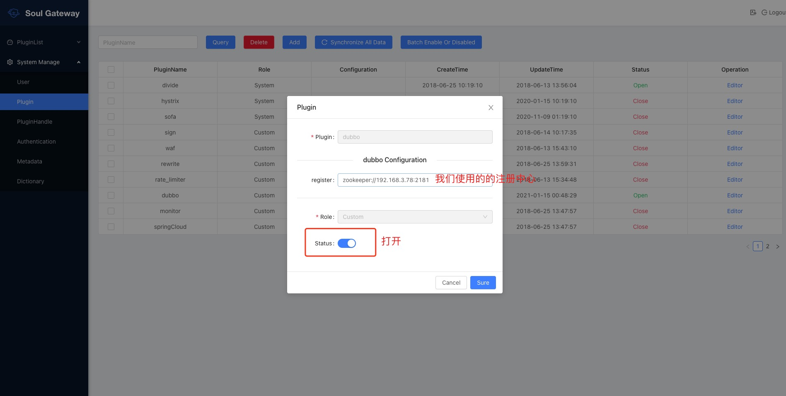

# Soul网关进阶使用

## 目标
- dubbo、springcloud集成Soul网关
- LoadBalance
- RateLimiter
- waf
- 总结

## Alibaba Dubbo + SpringBoot用户集成Soul网关

### Soul网关加入dubbo插件

- **pom**

```
         <!--soul alibaba dubbo plugin start-->
         <dependency>
             <groupId>org.dromara</groupId>
             <artifactId>soul-spring-boot-starter-plugin-alibaba-dubbo</artifactId>
              <version>${soul.version}</version>
         </dependency>
         <!-- soul  alibaba dubbo plugin end-->
         <!-- register center -->
         <dependency>
             <groupId>com.alibaba</groupId>
             <artifactId>dubbo</artifactId>
             <version>2.6.5</version>
         </dependency>
         <dependency>
             <groupId>org.apache.curator</groupId>
             <artifactId>curator-client</artifactId>
             <version>4.0.1</version>
         </dependency>
         <dependency>
             <groupId>org.apache.curator</groupId>
             <artifactId>curator-framework</artifactId>
             <version>4.0.1</version>
         </dependency>
         <dependency>
             <groupId>org.apache.curator</groupId>
             <artifactId>curator-recipes</artifactId>
             <version>4.0.1</version>
         </dependency>
```

- **重启网关**

- **网关报错**

```
/Library/Java/JavaVirtualMachines/jdk1.8.0_231.jdk/Contents/Home/bin/java -XX:TieredStopAtLevel=1 -noverify -Dspring.output.ansi.enabled=always -javaagent:/Applications/IntelliJ IDEA.app/Contents/lib/idea_rt.jar=60719:/Applications/IntelliJ IDEA.app/Contents/bin -Dcom.sun.management.jmxremote -Dspring.jmx.enabled=true -Dspring.liveBeansView.mbeanDomain -Dspring.application.admin.enabled=true -Dfile.encoding=UTF-8 -classpath /Library/Java/JavaVirtualMachines/jdk1.8.0_231.jdk/Contents/Home/jre/lib/charsets.jar:/Library/Java/JavaVirtualMachines/jdk1.8.0_231.jdk/Contents/Home/jre/lib/deploy.jar:/Library/Java/JavaVirtualMachines/jdk1.8.0_231.jdk/Contents/Home/jre/lib/ext/cldrdata.jar:/Library/Java/JavaVirtualMachines/jdk1.8.0_231.jdk/Contents/Home/jre/lib/ext/dnsns.jar:/Library/Java/JavaVirtualMachines/jdk1.8.0_231.jdk/Contents/Home/jre/lib/ext/jaccess.jar:/Library/Java/JavaVirtualMachines/jdk1.8.0_231.jdk/Contents/Home/jre/lib/ext/jfxrt.jar:/Library/Java/JavaVirtualMachines/jdk1.8.0_231.jdk/Contents/Home/jre/lib/ext/localedata.jar:/Library/Java/JavaVirtualMachines/jdk1.8.0_231.jdk/Contents/Home/jre/lib/ext/nashorn.jar:/Library/Java/JavaVirtualMachines/jdk1.8.0_231.jdk/Contents/Home/jre/lib/ext/sunec.jar:/Library/Java/JavaVirtualMachines/jdk1.8.0_231.jdk/Contents/Home/jre/lib/ext/sunjce_provider.jar:/Library/Java/JavaVirtualMachines/jdk1.8.0_231.jdk/Contents/Home/jre/lib/ext/sunpkcs11.jar:/Library/Java/JavaVirtualMachines/jdk1.8.0_231.jdk/Contents/Home/jre/lib/ext/zipfs.jar:/Library/Java/JavaVirtualMachines/jdk1.8.0_231.jdk/Contents/Home/jre/lib/javaws.jar:/Library/Java/JavaVirtualMachines/jdk1.8.0_231.jdk/Contents/Home/jre/lib/jce.jar:/Library/Java/JavaVirtualMachines/jdk1.8.0_231.jdk/Contents/Home/jre/lib/jfr.jar:/Library/Java/JavaVirtualMachines/jdk1.8.0_231.jdk/Contents/Home/jre/lib/jfxswt.jar:/Library/Java/JavaVirtualMachines/jdk1.8.0_231.jdk/Contents/Home/jre/lib/jsse.jar:/Library/Java/JavaVirtualMachines/jdk1.8.0_231.jdk/Contents/Home/jre/lib/management-agent.jar:/Library/Java/JavaVirtualMachines/jdk1.8.0_231.jdk/Contents/Home/jre/lib/plugin.jar:/Library/Java/JavaVirtualMachines/jdk1.8.0_231.jdk/Contents/Home/jre/lib/resources.jar:/Library/Java/JavaVirtualMachines/jdk1.8.0_231.jdk/Contents/Home/jre/lib/rt.jar:/Library/Java/JavaVirtualMachines/jdk1.8.0_231.jdk/Contents/Home/lib/ant-javafx.jar:/Library/Java/JavaVirtualMachines/jdk1.8.0_231.jdk/Contents/Home/lib/dt.jar:/Library/Java/JavaVirtualMachines/jdk1.8.0_231.jdk/Contents/Home/lib/javafx-mx.jar:/Library/Java/JavaVirtualMachines/jdk1.8.0_231.jdk/Contents/Home/lib/jconsole.jar:/Library/Java/JavaVirtualMachines/jdk1.8.0_231.jdk/Contents/Home/lib/packager.jar:/Library/Java/JavaVirtualMachines/jdk1.8.0_231.jdk/Contents/Home/lib/sa-jdi.jar:/Library/Java/JavaVirtualMachines/jdk1.8.0_231.jdk/Contents/Home/lib/tools.jar:/Users/penghuiliu/geek_learn/ruubypay-soul-gateway/target/classes:/Users/penghuiliu/.m2/repository/org/springframework/boot/spring-boot-starter-webflux/2.2.2.RELEASE/spring-boot-starter-webflux-2.2.2.RELEASE.jar:/Users/penghuiliu/.m2/repository/org/springframework/boot/spring-boot-starter/2.2.2.RELEASE/spring-boot-starter-2.2.2.RELEASE.jar:/Users/penghuiliu/.m2/repository/org/springframework/boot/spring-boot/2.2.2.RELEASE/spring-boot-2.2.2.RELEASE.jar:/Users/penghuiliu/.m2/repository/org/springframework/boot/spring-boot-autoconfigure/2.2.2.RELEASE/spring-boot-autoconfigure-2.2.2.RELEASE.jar:/Users/penghuiliu/.m2/repository/org/springframework/boot/spring-boot-starter-logging/2.2.2.RELEASE/spring-boot-starter-logging-2.2.2.RELEASE.jar:/Users/penghuiliu/.m2/repository/ch/qos/logback/logback-classic/1.2.3/logback-classic-1.2.3.jar:/Users/penghuiliu/.m2/repository/ch/qos/logback/logback-core/1.2.3/logback-core-1.2.3.jar:/Users/penghuiliu/.m2/repository/org/apache/logging/log4j/log4j-to-slf4j/2.12.1/log4j-to-slf4j-2.12.1.jar:/Users/penghuiliu/.m2/repository/org/apache/logging/log4j/log4j-api/2.12.1/log4j-api-2.12.1.jar:/Users/penghuiliu/.m2/repository/org/slf4j/jul-to-slf4j/1.7.29/jul-to-slf4j-1.7.29.jar:/Users/penghuiliu/.m2/repository/jakarta/annotation/jakarta.annotation-api/1.3.5/jakarta.annotation-api-1.3.5.jar:/Users/penghuiliu/.m2/repository/org/springframework/spring-core/5.2.2.RELEASE/spring-core-5.2.2.RELEASE.jar:/Users/penghuiliu/.m2/repository/org/springframework/spring-jcl/5.2.2.RELEASE/spring-jcl-5.2.2.RELEASE.jar:/Users/penghuiliu/.m2/repository/org/yaml/snakeyaml/1.25/snakeyaml-1.25.jar:/Users/penghuiliu/.m2/repository/org/springframework/boot/spring-boot-starter-json/2.2.2.RELEASE/spring-boot-starter-json-2.2.2.RELEASE.jar:/Users/penghuiliu/.m2/repository/com/fasterxml/jackson/core/jackson-databind/2.10.1/jackson-databind-2.10.1.jar:/Users/penghuiliu/.m2/repository/com/fasterxml/jackson/core/jackson-annotations/2.10.1/jackson-annotations-2.10.1.jar:/Users/penghuiliu/.m2/repository/com/fasterxml/jackson/core/jackson-core/2.10.1/jackson-core-2.10.1.jar:/Users/penghuiliu/.m2/repository/com/fasterxml/jackson/datatype/jackson-datatype-jdk8/2.10.1/jackson-datatype-jdk8-2.10.1.jar:/Users/penghuiliu/.m2/repository/com/fasterxml/jackson/datatype/jackson-datatype-jsr310/2.10.1/jackson-datatype-jsr310-2.10.1.jar:/Users/penghuiliu/.m2/repository/com/fasterxml/jackson/module/jackson-module-parameter-names/2.10.1/jackson-module-parameter-names-2.10.1.jar:/Users/penghuiliu/.m2/repository/org/springframework/boot/spring-boot-starter-reactor-netty/2.2.2.RELEASE/spring-boot-starter-reactor-netty-2.2.2.RELEASE.jar:/Users/penghuiliu/.m2/repository/io/projectreactor/netty/reactor-netty/0.9.2.RELEASE/reactor-netty-0.9.2.RELEASE.jar:/Users/penghuiliu/.m2/repository/io/netty/netty-codec-http2/4.1.43.Final/netty-codec-http2-4.1.43.Final.jar:/Users/penghuiliu/.m2/repository/io/netty/netty-handler/4.1.43.Final/netty-handler-4.1.43.Final.jar:/Users/penghuiliu/.m2/repository/io/netty/netty-handler-proxy/4.1.43.Final/netty-handler-proxy-4.1.43.Final.jar:/Users/penghuiliu/.m2/repository/io/netty/netty-codec-socks/4.1.43.Final/netty-codec-socks-4.1.43.Final.jar:/Users/penghuiliu/.m2/repository/io/netty/netty-transport-native-epoll/4.1.43.Final/netty-transport-native-epoll-4.1.43.Final-linux-x86_64.jar:/Users/penghuiliu/.m2/repository/io/netty/netty-transport-native-unix-common/4.1.43.Final/netty-transport-native-unix-common-4.1.43.Final.jar:/Users/penghuiliu/.m2/repository/org/glassfish/jakarta.el/3.0.3/jakarta.el-3.0.3.jar:/Users/penghuiliu/.m2/repository/org/springframework/boot/spring-boot-starter-validation/2.2.2.RELEASE/spring-boot-starter-validation-2.2.2.RELEASE.jar:/Users/penghuiliu/.m2/repository/jakarta/validation/jakarta.validation-api/2.0.1/jakarta.validation-api-2.0.1.jar:/Users/penghuiliu/.m2/repository/org/hibernate/validator/hibernate-validator/6.0.18.Final/hibernate-validator-6.0.18.Final.jar:/Users/penghuiliu/.m2/repository/org/jboss/logging/jboss-logging/3.3.2.Final/jboss-logging-3.3.2.Final.jar:/Users/penghuiliu/.m2/repository/com/fasterxml/classmate/1.3.4/classmate-1.3.4.jar:/Users/penghuiliu/.m2/repository/org/springframework/spring-web/5.2.2.RELEASE/spring-web-5.2.2.RELEASE.jar:/Users/penghuiliu/.m2/repository/org/springframework/spring-beans/5.2.2.RELEASE/spring-beans-5.2.2.RELEASE.jar:/Users/penghuiliu/.m2/repository/org/springframework/spring-webflux/5.2.2.RELEASE/spring-webflux-5.2.2.RELEASE.jar:/Users/penghuiliu/.m2/repository/io/projectreactor/reactor-core/3.3.1.RELEASE/reactor-core-3.3.1.RELEASE.jar:/Users/penghuiliu/.m2/repository/org/reactivestreams/reactive-streams/1.0.3/reactive-streams-1.0.3.jar:/Users/penghuiliu/.m2/repository/org/synchronoss/cloud/nio-multipart-parser/1.1.0/nio-multipart-parser-1.1.0.jar:/Users/penghuiliu/.m2/repository/org/synchronoss/cloud/nio-stream-storage/1.1.3/nio-stream-storage-1.1.3.jar:/Users/penghuiliu/.m2/repository/org/springframework/boot/spring-boot-starter-actuator/2.2.2.RELEASE/spring-boot-starter-actuator-2.2.2.RELEASE.jar:/Users/penghuiliu/.m2/repository/org/springframework/boot/spring-boot-actuator-autoconfigure/2.2.2.RELEASE/spring-boot-actuator-autoconfigure-2.2.2.RELEASE.jar:/Users/penghuiliu/.m2/repository/org/springframework/boot/spring-boot-actuator/2.2.2.RELEASE/spring-boot-actuator-2.2.2.RELEASE.jar:/Users/penghuiliu/.m2/repository/io/micrometer/micrometer-core/1.3.1/micrometer-core-1.3.1.jar:/Users/penghuiliu/.m2/repository/org/hdrhistogram/HdrHistogram/2.1.11/HdrHistogram-2.1.11.jar:/Users/penghuiliu/.m2/repository/org/latencyutils/LatencyUtils/2.0.3/LatencyUtils-2.0.3.jar:/Users/penghuiliu/.m2/repository/org/dromara/soul-spring-boot-starter-gateway/2.2.1/soul-spring-boot-starter-gateway-2.2.1.jar:/Users/penghuiliu/.m2/repository/org/dromara/soul-web/2.2.1/soul-web-2.2.1.jar:/Users/penghuiliu/.m2/repository/org/dromara/soul-plugin-api/2.2.1/soul-plugin-api-2.2.1.jar:/Users/penghuiliu/.m2/repository/org/apache/commons/commons-lang3/3.3.2/commons-lang3-3.3.2.jar:/Users/penghuiliu/.m2/repository/org/dromara/soul-spring-boot-starter-plugin-global/2.2.1/soul-spring-boot-starter-plugin-global-2.2.1.jar:/Users/penghuiliu/.m2/repository/org/dromara/soul-plugin-global/2.2.1/soul-plugin-global-2.2.1.jar:/Users/penghuiliu/.m2/repository/org/dromara/soul-plugin-base/2.2.1/soul-plugin-base-2.2.1.jar:/Users/penghuiliu/.m2/repository/org/dromara/soul-common/2.2.1/soul-common-2.2.1.jar:/Users/penghuiliu/.m2/repository/com/google/code/gson/gson/2.8.0/gson-2.8.0.jar:/Users/penghuiliu/.m2/repository/org/dromara/soul-metrics-facade/2.2.1/soul-metrics-facade-2.2.1.jar:/Users/penghuiliu/.m2/repository/org/dromara/soul-metrics-spi/2.2.1/soul-metrics-spi-2.2.1.jar:/Users/penghuiliu/.m2/repository/org/dromara/soul-metrics-prometheus/2.2.1/soul-metrics-prometheus-2.2.1.jar:/Users/penghuiliu/.m2/repository/io/prometheus/simpleclient/0.6.0/simpleclient-0.6.0.jar:/Users/penghuiliu/.m2/repository/io/prometheus/simpleclient_httpserver/0.6.0/simpleclient_httpserver-0.6.0.jar:/Users/penghuiliu/.m2/repository/io/prometheus/simpleclient_common/0.6.0/simpleclient_common-0.6.0.jar:/Users/penghuiliu/.m2/repository/io/prometheus/simpleclient_hotspot/0.6.0/simpleclient_hotspot-0.6.0.jar:/Users/penghuiliu/.m2/repository/com/google/guava/guava/30.1-jre/guava-30.1-jre.jar:/Users/penghuiliu/.m2/repository/com/google/guava/failureaccess/1.0.1/failureaccess-1.0.1.jar:/Users/penghuiliu/.m2/repository/com/google/guava/listenablefuture/9999.0-empty-to-avoid-conflict-with-guava/listenablefuture-9999.0-empty-to-avoid-conflict-with-guava.jar:/Users/penghuiliu/.m2/repository/com/google/code/findbugs/jsr305/3.0.2/jsr305-3.0.2.jar:/Users/penghuiliu/.m2/repository/org/checkerframework/checker-qual/3.5.0/checker-qual-3.5.0.jar:/Users/penghuiliu/.m2/repository/com/google/errorprone/error_prone_annotations/2.3.4/error_prone_annotations-2.3.4.jar:/Users/penghuiliu/.m2/repository/com/google/j2objc/j2objc-annotations/1.3/j2objc-annotations-1.3.jar:/Users/penghuiliu/.m2/repository/org/slf4j/slf4j-api/1.7.29/slf4j-api-1.7.29.jar:/Users/penghuiliu/.m2/repository/org/slf4j/jcl-over-slf4j/1.7.29/jcl-over-slf4j-1.7.29.jar:/Users/penghuiliu/.m2/repository/org/projectlombok/lombok/1.18.12/lombok-1.18.12.jar:/Users/penghuiliu/.m2/repository/org/dromara/soul-spring-boot-starter-sync-data-websocket/2.2.1/soul-spring-boot-starter-sync-data-websocket-2.2.1.jar:/Users/penghuiliu/.m2/repository/org/dromara/soul-sync-data-websocket/2.2.1/soul-sync-data-websocket-2.2.1.jar:/Users/penghuiliu/.m2/repository/org/dromara/soul-sync-data-api/2.2.1/soul-sync-data-api-2.2.1.jar:/Users/penghuiliu/.m2/repository/org/java-websocket/Java-WebSocket/1.5.0/Java-WebSocket-1.5.0.jar:/Users/penghuiliu/.m2/repository/org/apache/commons/commons-collections4/4.1/commons-collections4-4.1.jar:/Users/penghuiliu/.m2/repository/org/dromara/soul-spring-boot-starter-plugin-divide/2.2.1/soul-spring-boot-starter-plugin-divide-2.2.1.jar:/Users/penghuiliu/.m2/repository/org/dromara/soul-plugin-divide/2.2.1/soul-plugin-divide-2.2.1.jar:/Users/penghuiliu/.m2/repository/org/dromara/soul-spi/2.2.1/soul-spi-2.2.1.jar:/Users/penghuiliu/.m2/repository/org/dromara/soul-spring-boot-starter-plugin-httpclient/2.2.1/soul-spring-boot-starter-plugin-httpclient-2.2.1.jar:/Users/penghuiliu/.m2/repository/org/dromara/soul-plugin-httpclient/2.2.1/soul-plugin-httpclient-2.2.1.jar:/Users/penghuiliu/.m2/repository/io/netty/netty-codec-http/4.1.43.Final/netty-codec-http-4.1.43.Final.jar:/Users/penghuiliu/.m2/repository/io/netty/netty-common/4.1.43.Final/netty-common-4.1.43.Final.jar:/Users/penghuiliu/.m2/repository/io/netty/netty-buffer/4.1.43.Final/netty-buffer-4.1.43.Final.jar:/Users/penghuiliu/.m2/repository/io/netty/netty-transport/4.1.43.Final/netty-transport-4.1.43.Final.jar:/Users/penghuiliu/.m2/repository/io/netty/netty-resolver/4.1.43.Final/netty-resolver-4.1.43.Final.jar:/Users/penghuiliu/.m2/repository/io/netty/netty-codec/4.1.43.Final/netty-codec-4.1.43.Final.jar:/Users/penghuiliu/.m2/repository/io/projectreactor/addons/reactor-extra/3.3.1.RELEASE/reactor-extra-3.3.1.RELEASE.jar:/Users/penghuiliu/.m2/repository/org/dromara/soul-spring-boot-starter-plugin-alibaba-dubbo/2.2.1/soul-spring-boot-starter-plugin-alibaba-dubbo-2.2.1.jar:/Users/penghuiliu/.m2/repository/org/dromara/soul-plugin-alibaba-dubbo/2.2.1/soul-plugin-alibaba-dubbo-2.2.1.jar:/Users/penghuiliu/.m2/repository/com/alibaba/dubbo/2.6.5/dubbo-2.6.5.jar:/Users/penghuiliu/.m2/repository/org/springframework/spring-context/4.3.16.RELEASE/spring-context-4.3.16.RELEASE.jar:/Users/penghuiliu/.m2/repository/org/springframework/spring-aop/4.3.16.RELEASE/spring-aop-4.3.16.RELEASE.jar:/Users/penghuiliu/.m2/repository/org/springframework/spring-expression/4.3.16.RELEASE/spring-expression-4.3.16.RELEASE.jar:/Users/penghuiliu/.m2/repository/org/javassist/javassist/3.20.0-GA/javassist-3.20.0-GA.jar:/Users/penghuiliu/.m2/repository/org/jboss/netty/netty/3.2.5.Final/netty-3.2.5.Final.jar:/Users/penghuiliu/.m2/repository/org/apache/curator/curator-client/4.0.1/curator-client-4.0.1.jar:/Users/penghuiliu/.m2/repository/org/apache/zookeeper/zookeeper/3.5.3-beta/zookeeper-3.5.3-beta.jar:/Users/penghuiliu/.m2/repository/commons-cli/commons-cli/1.2/commons-cli-1.2.jar:/Users/penghuiliu/.m2/repository/log4j/log4j/1.2.17/log4j-1.2.17.jar:/Users/penghuiliu/.m2/repository/io/netty/netty/3.10.5.Final/netty-3.10.5.Final.jar:/Users/penghuiliu/.m2/repository/org/apache/curator/curator-framework/4.0.1/curator-framework-4.0.1.jar:/Users/penghuiliu/.m2/repository/org/apache/curator/curator-recipes/4.0.1/curator-recipes-4.0.1.jar:/Users/penghuiliu/.m2/repository/org/dromara/soul-spring-boot-starter-plugin-ratelimiter/2.2.1/soul-spring-boot-starter-plugin-ratelimiter-2.2.1.jar:/Users/penghuiliu/.m2/repository/org/dromara/soul-plugin-ratelimiter/2.2.1/soul-plugin-ratelimiter-2.2.1.jar:/Users/penghuiliu/.m2/repository/org/springframework/data/spring-data-redis/2.2.3.RELEASE/spring-data-redis-2.2.3.RELEASE.jar:/Users/penghuiliu/.m2/repository/org/springframework/data/spring-data-keyvalue/2.2.3.RELEASE/spring-data-keyvalue-2.2.3.RELEASE.jar:/Users/penghuiliu/.m2/repository/org/springframework/data/spring-data-commons/2.2.3.RELEASE/spring-data-commons-2.2.3.RELEASE.jar:/Users/penghuiliu/.m2/repository/org/springframework/spring-tx/5.2.2.RELEASE/spring-tx-5.2.2.RELEASE.jar:/Users/penghuiliu/.m2/repository/org/springframework/spring-oxm/5.2.2.RELEASE/spring-oxm-5.2.2.RELEASE.jar:/Users/penghuiliu/.m2/repository/org/springframework/spring-context-support/5.2.2.RELEASE/spring-context-support-5.2.2.RELEASE.jar:/Users/penghuiliu/.m2/repository/io/lettuce/lettuce-core/5.2.1.RELEASE/lettuce-core-5.2.1.RELEASE.jar:/Users/penghuiliu/.m2/repository/org/apache/commons/commons-pool2/2.7.0/commons-pool2-2.7.0.jar com.ruubypay.soul.bootstrap.SoulBootstrapApplication
Exception in thread "main" java.lang.AbstractMethodError: org.springframework.boot.context.config.ConfigFileApplicationListener.supportsSourceType(Ljava/lang/Class;)Z
	at org.springframework.context.event.GenericApplicationListenerAdapter.supportsSourceType(GenericApplicationListenerAdapter.java:79)
	at org.springframework.context.event.AbstractApplicationEventMulticaster.supportsEvent(AbstractApplicationEventMulticaster.java:289)
	at org.springframework.context.event.AbstractApplicationEventMulticaster.retrieveApplicationListeners(AbstractApplicationEventMulticaster.java:221)
	at org.springframework.context.event.AbstractApplicationEventMulticaster.getApplicationListeners(AbstractApplicationEventMulticaster.java:192)
	at org.springframework.context.event.SimpleApplicationEventMulticaster.multicastEvent(SimpleApplicationEventMulticaster.java:128)
	at org.springframework.context.event.SimpleApplicationEventMulticaster.multicastEvent(SimpleApplicationEventMulticaster.java:122)
	at org.springframework.boot.context.event.EventPublishingRunListener.environmentPrepared(EventPublishingRunListener.java:76)
	at org.springframework.boot.SpringApplicationRunListeners.environmentPrepared(SpringApplicationRunListeners.java:53)
	at org.springframework.boot.SpringApplication.prepareEnvironment(SpringApplication.java:345)
	at org.springframework.boot.SpringApplication.run(SpringApplication.java:308)
	at org.springframework.boot.SpringApplication.run(SpringApplication.java:1226)
	at org.springframework.boot.SpringApplication.run(SpringApplication.java:1215)
	at com.ruubypay.soul.bootstrap.SoulBootstrapApplication.main(SoulBootstrapApplication.java:14)

Process finished with exit code 1
```

- **解决**

&nbsp; &nbsp;原因是`spring版本冲突`,解决办法是在pom文件中引入以下依赖，parent的版本优先级更高
```
    <parent>
        <groupId>org.springframework.boot</groupId>
        <artifactId>spring-boot-starter-parent</artifactId>
        <version>2.2.2.RELEASE</version>
        <relativePath/>
    </parent>
```

### Dubbo业务服务接入网关

- **pom**

```
    <dependency>
        <groupId>org.dromara</groupId>
        <artifactId>soul-spring-boot-starter-client-alibaba-dubbo</artifactId>
        <version>${last.version}</version>
    </dependency>
```

- **application.properties增加配置**

```
soul.dubbo.admin-url=http://localhost:9095
soul.dubbo.context-path=/soul
soul.dubbo.app-name=account
```

- dubbo插件配置

- - 勾选soul-admin的Plugin中的dubbo插件
- - 修改dubbo插件，并且将插件中的配置中心配置成我们使用的配置中心

  

- **接口注册到网关**

- - dubbo服务实现类的，方法上加上 `@SoulDubboClient` 注解，表示该接口方法注册到网关。
- - 启动你的提供者,输出日志`dubbo client register success` 大功告成，你的dubbo接口已经发布到 soul网关.如果还有不懂的，可以参考 soul-test-dubbo项目.

- **Dubbo用户请求及参数**


- - **soul网关可以实现通过http的方式来请求dubbo服务，其实就是网关将协议转换，并且通过dubbo泛化调用来dubbo接口**
- - **soul网关通过配置的contextPath作为路由的前缀**


- - **参数传递**：
- - - 通过 http post 方式访问网关，通过body，json类型传递
- - - 单个java bean参数类型 （默认）
- - - 多参数类型支持 ,在`网关的yml配置`中新增如下配置

    ```
    soul :
        dubbo :
          parameter: multi
    ```
- - - `body`为http中body传的json字符串.
- - - `parameterTypes`: 匹配到的方法参数类型列表，如果有多个,则使用,分割
- - - Pair中，left为参数类型，right为参数值，这是dubbo泛化调用的标准
- - - 把你的类注册成Spring的bean，覆盖默认的实现，如：

    ```
    @Bean
    public DubboParamResolveService A() {
            return new A();
    }
    ```

### LoadBalance使用