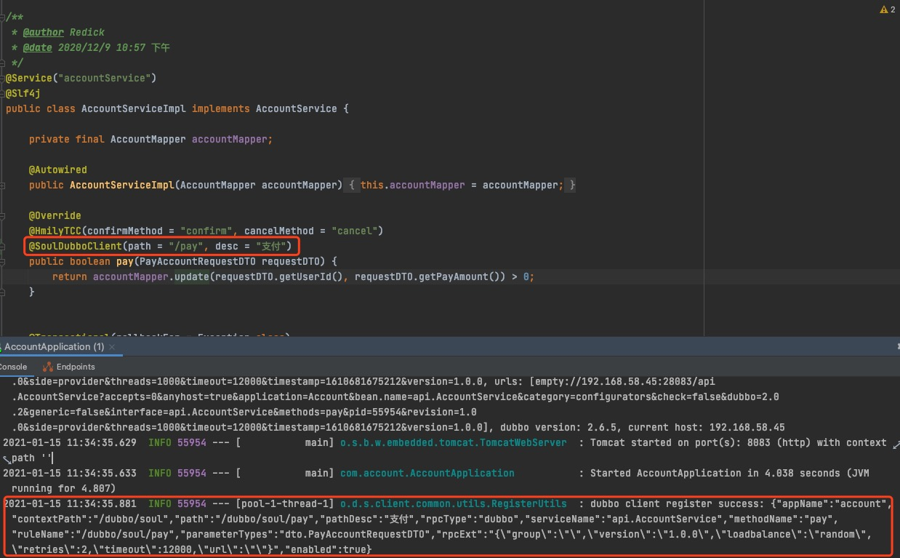
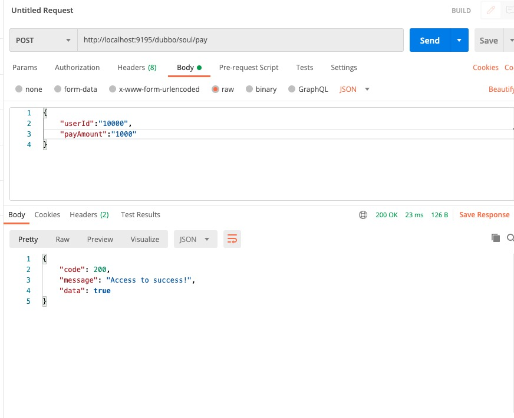
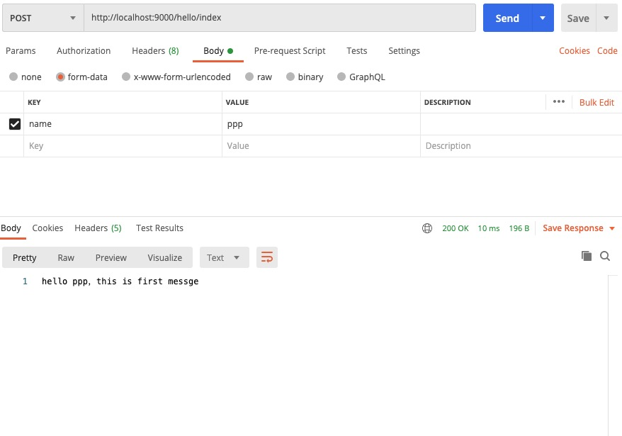
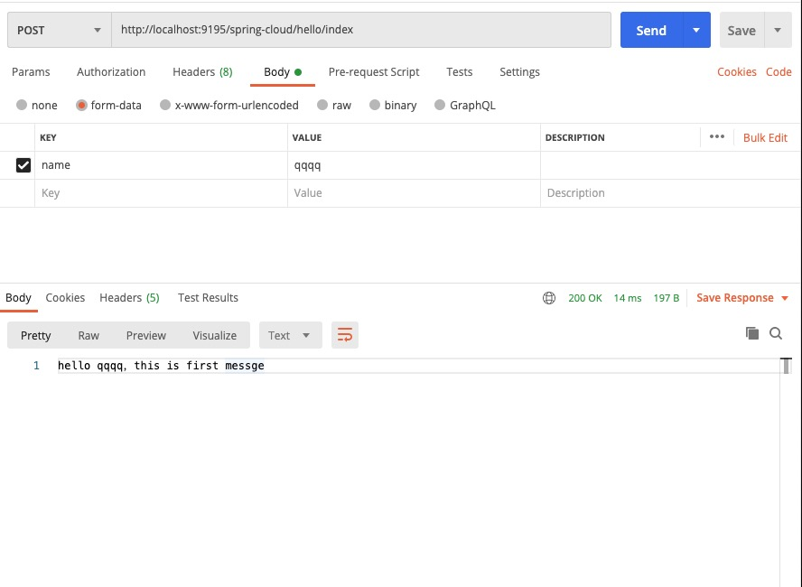

# Soul网关进阶使用

## 目标
- dubbo集成Soul网关
- springcloud集成Soul网关
- 总结

## Alibaba Dubbo + SpringBoot用户集成Soul网关

### Soul网关加入dubbo插件

- **pom**

```
         <!--soul alibaba dubbo plugin start-->
         <dependency>
             <groupId>org.dromara</groupId>
             <artifactId>soul-spring-boot-starter-plugin-alibaba-dubbo</artifactId>
              <version>${soul.version}</version>
         </dependency>
         <!-- soul  alibaba dubbo plugin end-->
         <!-- register center -->
         <dependency>
             <groupId>com.alibaba</groupId>
             <artifactId>dubbo</artifactId>
             <version>2.6.5</version>
         </dependency>
         <dependency>
             <groupId>org.apache.curator</groupId>
             <artifactId>curator-client</artifactId>
             <version>4.0.1</version>
         </dependency>
         <dependency>
             <groupId>org.apache.curator</groupId>
             <artifactId>curator-framework</artifactId>
             <version>4.0.1</version>
         </dependency>
         <dependency>
             <groupId>org.apache.curator</groupId>
             <artifactId>curator-recipes</artifactId>
             <version>4.0.1</version>
         </dependency>
```

- **重启网关**

- **网关报错**

```
Exception in thread "main" java.lang.AbstractMethodError: org.springframework.boot.context.config.ConfigFileApplicationListener.supportsSourceType(Ljava/lang/Class;)Z
	at org.springframework.context.event.GenericApplicationListenerAdapter.supportsSourceType(GenericApplicationListenerAdapter.java:79)
	at org.springframework.context.event.AbstractApplicationEventMulticaster.supportsEvent(AbstractApplicationEventMulticaster.java:289)
	at org.springframework.context.event.AbstractApplicationEventMulticaster.retrieveApplicationListeners(AbstractApplicationEventMulticaster.java:221)
	at org.springframework.context.event.AbstractApplicationEventMulticaster.getApplicationListeners(AbstractApplicationEventMulticaster.java:192)
	at org.springframework.context.event.SimpleApplicationEventMulticaster.multicastEvent(SimpleApplicationEventMulticaster.java:128)
	at org.springframework.context.event.SimpleApplicationEventMulticaster.multicastEvent(SimpleApplicationEventMulticaster.java:122)
	at org.springframework.boot.context.event.EventPublishingRunListener.environmentPrepared(EventPublishingRunListener.java:76)
	at org.springframework.boot.SpringApplicationRunListeners.environmentPrepared(SpringApplicationRunListeners.java:53)
	at org.springframework.boot.SpringApplication.prepareEnvironment(SpringApplication.java:345)
	at org.springframework.boot.SpringApplication.run(SpringApplication.java:308)
	at org.springframework.boot.SpringApplication.run(SpringApplication.java:1226)
	at org.springframework.boot.SpringApplication.run(SpringApplication.java:1215)
	at com.ruubypay.soul.bootstrap.SoulBootstrapApplication.main(SoulBootstrapApplication.java:14)

Process finished with exit code 1
```

- **解决**

&nbsp; &nbsp;原因是`spring版本冲突`,解决办法是在pom文件中引入以下依赖，parent的版本优先级更高
```
    <parent>
        <groupId>org.springframework.boot</groupId>
        <artifactId>spring-boot-starter-parent</artifactId>
        <version>2.2.2.RELEASE</version>
        <relativePath/>
    </parent>
```

### Dubbo业务服务接入网关

- **pom**

```
    <dependency>
        <groupId>org.dromara</groupId>
        <artifactId>soul-spring-boot-starter-client-alibaba-dubbo</artifactId>
        <version>${last.version}</version>
    </dependency>
```

- **application.properties增加配置**

```
soul.dubbo.admin-url=http://localhost:9095
soul.dubbo.context-path=/soul
soul.dubbo.app-name=account
```

- dubbo插件配置

- - 勾选soul-admin的Plugin中的dubbo插件
- - 修改dubbo插件，并且将插件中的配置中心配置成我们使用的配置中心

  

- **接口注册到网关**

- - dubbo服务实现类的，方法上加上 `@SoulDubboClient` 注解，表示该接口方法注册到网关。
- - 启动你的提供者,输出日志`dubbo client register success` 大功告成，你的dubbo接口已经发布到 soul网关.如果还有不懂的，可以参考 soul-test-dubbo项目.

请忽略我得`@HmilyTCC`配置
  

- **Dubbo用户请求及参数**


- - **soul网关可以实现通过http的方式来请求dubbo服务，其实就是网关将协议转换，并且通过dubbo泛化调用来dubbo接口**
- - **soul网关通过配置的contextPath作为路由的前缀**


- - **参数传递**：
- - - 通过 http post 方式访问网关，通过body，json类型传递
- - - 单个java bean参数类型 （默认）
- - - 多参数类型支持 ,在`网关的yml配置`中新增如下配置

    ```
    soul :
        dubbo :
          parameter: multi
    ```
- - - `body`为http中body传的json字符串.
- - - `parameterTypes`: 匹配到的方法参数类型列表，如果有多个,则使用,分割
- - - Pair中，left为参数类型，right为参数值，这是dubbo泛化调用的标准
- - - 把你的类注册成Spring的bean，覆盖默认的实现，如：

    ```
    @Bean
    public DubboParamResolveService A() {
            return new A();
    }
    ```
- **测试Dubbo用户集成Soul网关**

- - **启动Dubbo业务服务，出现以下日志，代表集成网关成功，将dubbo接口元信息注册到zk**

    ```
    2021-01-15 11:34:35.881  INFO 55954 --- [pool-1-thread-1] o.d.s.client.common.utils.RegisterUtils  : dubbo client register success: {"appName":"account","contextPath":"/dubbo/soul","path":"/dubbo/soul/pay","pathDesc":"支付","rpcType":"dubbo","serviceName":"api.AccountService","methodName":"pay","ruleName":"/dubbo/soul/pay","parameterTypes":"dto.PayAccountRequestDTO","rpcExt":"{\"group\":\"\",\"version\":\"1.0.0\",\"loadbalance\":\"random\",\"retries\":2,\"timeout\":12000,\"url\":\"\"}","enabled":true} 
    ```

- - **测试**

  

## SpringCloud集成Soul网关

### Soul网关加入SpringCloud插件

- **pom** 

```
        <dependency>
            <groupId>org.dromara</groupId>
            <artifactId>soul-spring-boot-starter-plugin-springcloud</artifactId>
            <version>${soul-version}</version>
        </dependency>
        <dependency>
            <groupId>org.dromara</groupId>
            <artifactId>soul-spring-boot-starter-plugin-httpclient</artifactId>
            <version>${soul-version}</version>
        </dependency>
        <!--如果是eureka，添加这个依赖-->
        <dependency>
            <groupId>org.springframework.cloud</groupId>
            <artifactId>spring-cloud-starter-netflix-eureka-client</artifactId>
            <version>2.2.0.RELEASE</version>
        </dependency>
        <dependency>
            <groupId>org.springframework.cloud</groupId>
            <artifactId>spring-cloud-commons</artifactId>
            <version>2.2.0.RELEASE</version>
        </dependency>
        <dependency>
            <groupId>org.springframework.cloud</groupId>
            <artifactId>spring-cloud-starter-netflix-ribbon</artifactId>
            <version>2.2.0.RELEASE</version>
        </dependency>
```

- **yml配置**

```
eureka:
  client:
    serviceUrl:
      # 你的eureka地址
      defaultZone: http://localhost:8000/eureka/
  instance:
    prefer-ip-address: true
```

### SpringCloud业务服务集成Soul网关

- **pom**

期间可能会遇到jar包冲突，解决即可
```
<dependency>
	  <groupId>org.springframework.cloud</groupId>
	  <artifactId>spring-cloud-starter-netflix-eureka-client</artifactId>
	  <!--你自己的版本-->
      <version>${spring-cloud.version}</version>
</dependency>
 <dependency>
      <groupId>org.dromara</groupId>
      <artifactId>soul-spring-boot-starter-client-springcloud</artifactId>
      <version>${last.version}</version>
 </dependency>
```

- **properties或yml配置，这里给出的是properties**

```
soul.springcloud.admin-url=http://localhost:9095
soul.springcloud.context-path=/spring-cloud
# 设置true 代表代理你的整个服务，false表示代理你其中某几个controller
soul.springcloud.full=false 
```

- **@SoulSpringCloudClient注解使用**

和代理SpringMvc的Controller一样

- -  代理Controller所有接口，在Controller 类上面, 里面的path属性则为前缀，如果含有 /** 代表你的整个接口需要被网关代理
```
@RestController
@RequestMapping("/hello")
@SoulSpringCloudClient(path = "/hello/**")
public class HelloController {
	
    @RequestMapping("/index")
    public String index(@RequestParam String name) {
        return "hello "+name+"，this is first messge";
    }
}
```

- - 只代理部分接口

```
@RestController
@RequestMapping("/hello")
@SoulSpringCloudClient(path = "/hello")
public class HelloController {
	
    @RequestMapping("/index")
    public String index(@RequestParam String name) {
        return "hello "+name+"，this is first messge";
    }


    @RequestMapping("/index_1")
    @SoulSpringMvcClient(path = "/index_1")
    public String index_1(@RequestParam String name) {
        return "hello_1 "+name+"，this is first messge";
    }
}
```

- - 代理整个服务

只要配置了`full: true`，整个服务都会被代理
```
soul.springcloud.full=true
```

- **设置插件**

- - 启动eureka
- - 启动soul-admin
- - 在soul-admin中开启springcloud插件
- - 启动soul网关
- - 启动springcloud业务服务

- **测试**

- - **不使用网关代理**

  

- - **使用网关代理**

 

## 总结

- Soul网关代理dubbo接口时，其实是把http请求通过注册的dubbo元数据转换成了dubbo协议，底层调用使用的是泛化调用，具体调用过程我们在下节分析
- Soul网关代理SpringCloud服务时，本质上与普通的调用http请求没有区别，只不过网关将域名或path包装了一层
- Soul网关支持的LoadBalance算法有random、roundRobin和hash
- 总的来说这两种为服务框架在集成Soul网关时比较简单，需要注意的是可能的jar包冲突（也可能是我自己jar包引的问题）和使用soul-admin配置Soul网关插件同步到网关Server不及时的问题（这个要debug）