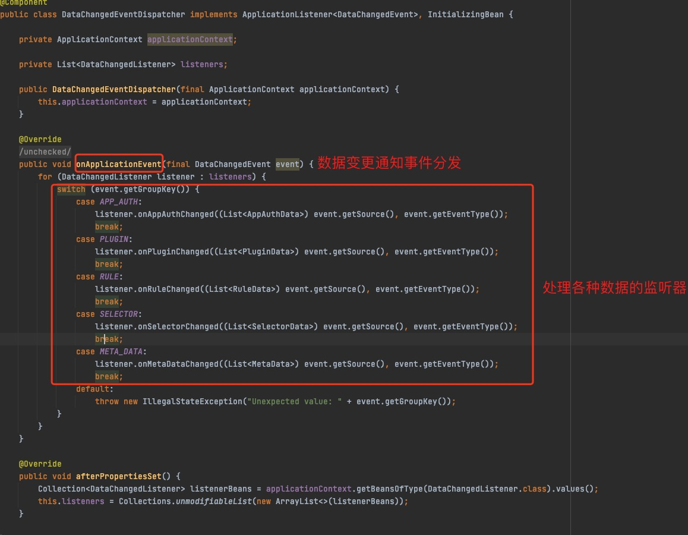

# Soul网关源码分析之soul-admin与soul-gateway数据同步

## 目标

- soul网关项目结构介绍
- soul-admin和soul网关数据同步
- 总结


## soul网关项目结构

- **从GitHub下载项目**

- - 从soul网关的`github仓库`下载`soul项目`，你也可以`fork`到你的GitHub仓库

    ```
    git clone https://github.com/dromara/soul.git
    ```

- - soul项目目录介绍

 

- - - soul-admin：soul网关管理后台服务，提供了插件的`选择器创建`，`配置变更`，`元数据查询`，`规则数据修改`，`网关数据热更新`的能力
- - - soul-bootstrap：官方提供的soul网关程序，是一个集成soul网关的程序，很简单；我们也可以不使用该项目，可以自己搭建网关。
- - - soul-client：提供`客户端发布API到网关`的能力，例如dubbo，sofa等，例如，将dubbo的元信息注册到网关
- - - soul-common：封装了soul网关的数据结构定义，常量，配置，异常和工具类等
- - - soul-dist：soul-admin和soul-bootstrap的`打包工具`
- - - soul-examples：提供了http，sofa，dubbo，springcloud，tars等接入soul网关的`例子`
- - - soul-metrics：监控插件整合
- - - soul-plugin：`soul网关的核心插件`工程，支持dubbo，http，限流，熔断，监控，防火墙等等核心插件
- - - soul-register-center：`注册中心`工程，目前这个工程定义了接口和zk，http的空实现
- - - soul-spi：soul网关提供`扩展能力`工程
- - - soul-spring-boot-starter：`soul网关自定义starter`工程，提供了soul-client，soul-plugin，soul-gateway，soul-sync-data-center的starter
- - - soul-sync-data-center：`soul数据同步`工程，目前支持`websocket`，`http长轮询`，`nacos`，`zookeeper`
- - - soul-web：`soul网关处理`请求的工程，包括请求入口，Filter等。


## soul-admin和soul网关数据同步-Websocket

&nbsp; &nbsp; soul-admin和soul网关数据同步支持http长轮询，zookeeper，websocket和nacos，这里分析下Websocket方式

&nbsp; &nbsp; websocket协议是全双工的通信方式，所以做这种数据同步，既有pull又有push的场景很合适

&nbsp; &nbsp; 从官网下载一张架构图，soul网关启动时会从Config Server拉去配置数据缓存到本地；管理员在管理后台，更新规则，配置选择器，修改流量的时候数据会同步到DB和Config Server，Soul网关使用pull或push的方式获取进行配置信息获取，并且同步到本地，而是pull还是push取决于配置。

 


### soul-admin数据同步

- **开启websocket**

yml配置
```
soul:
  sync:
    websocket:
      enabled: true
```

- **数据同步**

&nbsp; &nbsp; 管理员在更新配置，插件，规则的时候会通过spring的`ApplicationEventPublisher`发出配置变更通知，由`DataChangedEventDispatcher`处理变更通知，然后将根据对应的策略配置（websocket，zk，http还是nacos），将配置发送给事件处理器。

- **EventPublish源码分析**

`publishEvent`方法是事件发布的方法，发布事件核心代码是：
```
eventPublisher.publishEvent(new DataChangedEvent(ConfigGroupEnum.RULE, DataEventTypeEnum.UPDATE,
                Collections.singletonList(RuleDO.transFrom(ruleDO, pluginDO.getName(), conditionDataList))));
```


&emsp;

- - DataChangedEventDispatcher源码分析

&nbsp; &nbsp;  `onApplicationEvent`事件处理方法，根据事件的groupKey处理不同的组件的事件`afterPropertiesSet()`方法是从Spring的上下文（`applicationContext`）中获取到使用的数据同步策略，这里我们配置的是`websocket`所以会获取到，websocket的处理监听器



&emsp;

- - Websocket监听器配置

&nbsp; &nbsp; 在soul-admin是怎么配置的监听器呢，我们从`DataChangedEventDispatcher`可以看出，监听器是配置在了`ApplicationContext`中，这是spring的上下文，所以我们在soul-admin项目中查看`spring配置`的相关类，果不其然，发现在`DataSyncConfiguration`配置了监听器的配置，以下是配置websocket的部分，`websocketDataChangedListener()`实例化`WebsocketDataChangedListener`监听器的实例，`websocketCollector()`实例化`WebsocketCollector`，`serverEndpointExporter`实例化`ServerEndpointExporter`


&nbsp; &nbsp; 接下来我们具体看一下WebsocketDataChangedListener、WebsocketCollector
&nbsp; &nbsp; WebsocketDataChangedListener


- - WebsocketCollector源码分析

&nbsp; &nbsp; WebsocketCollector使用`@ServerEndpoint("/websocket")`注解表示websocket的Server，`onOpen`方法与客户端保持会话，`onMessage`方法当有数据时处理数据，管理员修改规则数据最后正式从这个方法将数据发送到网关`onClose`当客户端断开连接时关闭连接


&emsp;

### soul网关数据同步

- **开启websocket**

yml配置
```
soul :
  sync:
    websocket :
      # 设置成你的soul-admin地址
      urls: ws://localhost:9095/websocket
```

&emsp;


- **网关数据同步源码分析**

- - WebsocketSyncDataConfiguration分析

&nbsp; &nbsp; 我引用了`soul-spring-boot-starter-sync-data-websocket`包，我就在idea找到这个jar包，发现了`WebsocketSyncDataConfiguration`配置类，这个配置类中的参数就是在`yml`中的配置， `WebsocketSyncDataConfiguration`实例化了WebSocket的配置和同步数据的Service。


&nbsp; &nbsp; 那么 `WebsocketSyncDataConfiguration`是怎么能够自动就装配了呢，这就是SpringBoot创建bean的流程了，SpringBoot扫描到`soul-spring-boot-starter-sync-data-websocket`包下的spring.factories，内容是org.springframework.boot.autoconfigure.EnableAutoConfiguration=\
org.dromara.soul.spring.boot.starter.sync.data.websocket.WebsocketSyncDataConfiguration看到这段配置SpringBoot就会自动的执行配置，配置类就是`WebsocketSyncDataConfiguration`

&emsp;

- - WebsocketSyncDataService源码分析
  
&nbsp; &nbsp; `WebsocketSyncDataService`，该类实际上是封装了一个定时执行的线程池，首先从`WebsocketConfig`获取url列表，线程池的大小就是url列表的大小，然后根据url创建`SoulWebsocketClient`并且吧订阅的变更通知加进去，然后一个一个的吧websocket的客户端起来，最后将websocket的客户端放到线程池中执行。

&emsp;

- - SoulWebsocketClient源码分析

&nbsp; &nbsp; `SoulWebsocketClient`是Websocket的客户端，重写了onOpen，onMessage，onClose等webSocket的方法，`SoulWebsocketClient`构造器中实例化了`WebsocketDataHandler`，当有变更通知通过Websocket过来时掉用`WebsocketDataHandler`的executor方法


&emsp;

- - WebsocketDataHandler源码分析

&nbsp; &nbsp; `WebsocketDataHandler` 网关启动时将数据处理器缓存到Map中，提供`executor`用于执行变更，`executor`使用了策略模式，根据`ConfigGroupEnum`执行具体类型的数据处理器


## 总结

&nbsp; &nbsp;该篇文章介绍了soul网关项目结构以及soul-admin和soul网关数据同步流程和源码分析，具体的soul-gateway数据刷新更新的具体流程下篇文章介绍，同时下篇文章还将介绍业务接口发布到soul-gateway的源码分析，总结下来本篇文章的介绍可以套用官网的一张图

