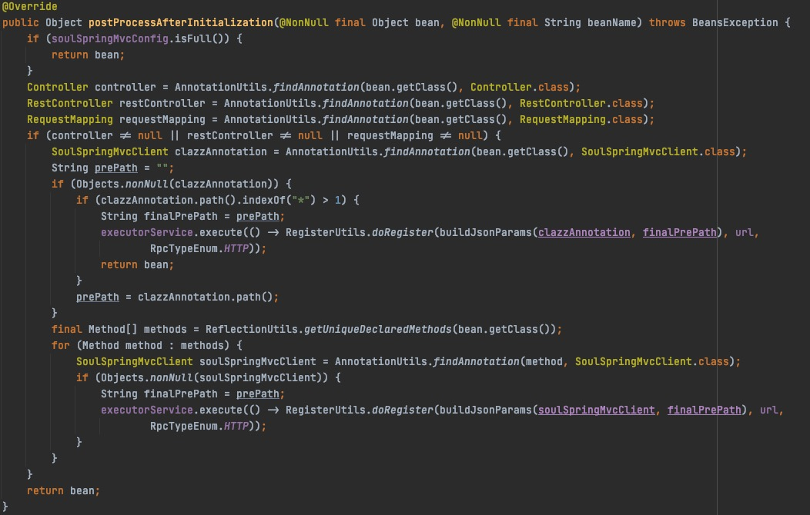
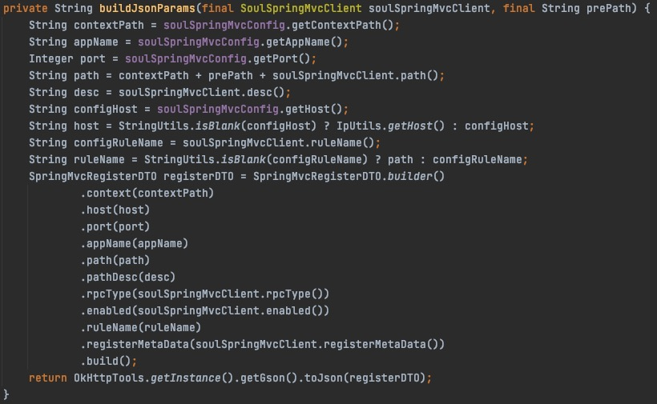

# soul网关源码分析之发布接口到网关

## 目标

- Http API发布到soul网关源码分析
- Dubbo API发布到soul网关源码分析
- 总结

## 概述

&nbsp; &nbsp; 业务系统在接口方法上加类似于`@SoulSpringMvcClient``@SoulDubboClient`注解，就能够将需要被soul网关代理的接口发布到soul-admin和soul网关，本篇文章主要分析soul网关是如何做到的自动发布API。

##  Http API发布到soul网关源码分析

- **pom依赖及yml配置**

```
    <dependency>
        <groupId>org.dromara</groupId>
        <artifactId>soul-spring-boot-starter-client-springmvc</artifactId>
        <version>${soul-version}</version>
    </dependency>  
```

```
soul:
  http:
    adminUrl: http://localhost:9095
    port: 8086
    contextPath: /soul
    appName: http
    full: true
```

- **API发布到网关流程分析**

&nbsp; &nbsp; 发布网关的client配置在`soul-spring-boot-starter-client-springmvc`包中，通过`soul-spring-boot-starter-client-springmvc`包的spring.factories的可以知道配置是`org.dromara.soul.springboot.starter.client.springmvc.SoulSpringMvcClientConfiguration`，配置的代码如下：
```
@Configuration
public class SoulSpringMvcClientConfiguration {
    
    /**
     * Spring http client bean post processor spring http client bean post processor.
     *
     * @param soulSpringMvcConfig the soul http config
     * @return the spring http client bean post processor
     */
    @Bean
    public SpringMvcClientBeanPostProcessor springHttpClientBeanPostProcessor(final SoulSpringMvcConfig soulSpringMvcConfig) {
        return new SpringMvcClientBeanPostProcessor(soulSpringMvcConfig);
    }
    
    /**
     * Context register listener context register listener.
     *
     * @param soulSpringMvcConfig the soul spring mvc config
     * @return the context register listener
     */
    @Bean
    public ContextRegisterListener contextRegisterListener(final SoulSpringMvcConfig soulSpringMvcConfig) {
        return new ContextRegisterListener(soulSpringMvcConfig);
    }
    
    /**
     * Soul http config soul http config.
     *
     * @return the soul http config
     */
    @Bean
    @ConfigurationProperties(prefix = "soul.http")
    public SoulSpringMvcConfig soulHttpConfig() {
        return new SoulSpringMvcConfig();
    }
}
```
&nbsp; &nbsp; 下面逐一看一下每个Bean的源码

- - **soulHttpConfig()源码分析**

&nbsp; &nbsp;   `soulHttpConfig()`从`yml`配置文件中读取参数然后实例化了`SoulSpringMvcConfig`

- - **SpringMvcClientBeanPostProcessor源码分析**

&nbsp; &nbsp;  `springHttpClientBeanPostProcessor`方法初始化`SpringMvcClientBeanPostProcessor`，`SpringMvcClientBeanPostProcessor`类实现了`BeanPostProcessor`，这是Spring的接口，作用是在所有的Bean对象实例化和依赖注入完毕后，在显示的调用初始化方法的前后添加我们自己的逻辑，通常该接口称为后置处理器，以下是`BeanPostProcessor`代码：
```
public interface BeanPostProcessor {
    // Bean初始化前
    @Nullable
    default Object postProcessBeforeInitialization(Object bean, String beanName) throws BeansException {
        return bean;
    }
    // Bean初始化后
    @Nullable
    default Object postProcessAfterInitialization(Object bean, String beanName) throws BeansException {
        return bean;
    }
}
```
&nbsp; &nbsp;  在`SpringMvcClientBeanPostProcessor`类中，重写的是`postProcessAfterInitialization`方法，意味着当所有的Bean初始化和依赖注入完成后要完成一些操作，操作的步骤是：
1. 从yml中读取`full`配置内容，如果是true直接返回bean不做任何操作
2. 如果是false（不代理整个服务），那就处理所有初始化完成的Bean，处理的步骤是
   - 通过反射过去每个初始化完成的Bean的`Controller``RestController``RequestMapping`注解
   - 如果获取到以上注解的任意一个那就从`class`上获取`SoulSpringMvcClient`注解
   - 如果从`class`上获取到了注解，判断注解的`path`内容是不是末尾有大于一个`*`，如果有，代表改类的所有方法都被代理，然后注册到网关
   - 如果`class`上没有`SoulSpringMvcClient`注解，那用通过反射从该类的方法上找，找到该注解就注册到网关
   - 注册到网关的内容有contextPath，网关代理后的请求路径path，appName，host，port，描述pathDesc，rpc的类型，开关，规则名称ruleName，元数据
3. 注册的`RegisterUtils`工具类就是OkHttp实现的HttpClient



构建注册数据的代码



- - **ContextRegisterListener源码分析**

&nbsp; &nbsp; `contextRegisterListener`方法初始化了`ContextRegisterListener`，`ContextRegisterListener`实现了`ApplicationListener`并且监听的是`ContextRefreshedEvent`事件，先解释下`ApplicationListener`是干什么的。
&nbsp; &nbsp; 首先，这其实是ApplicationContext的事件机制，事件机制是基于观察者的设计模式实现的，`ContextRegisterListener`监听的是`ContextRefreshedEvent`事件，它是spring的内置事件，意思是，当所有的bean都初始化完成并被成功装载后会触发该事件，触发该事件后的处理操作在重写的`onApplicationEvent`方法中，代码的意思就是如果`full`设置了`true`，代表整个服务都被代理，直接注册注册到网关即可。


- - **Http API发布到soul网关源码分析总结**

&nbsp; &nbsp; Http API发布到soul网关，使用的是spring的`BeanPostProcessor`后置处理和`ApplicationListener<ContextRefreshedEvent>`事件机制完成；`SpringMvcClientBeanPostProcessor`实现`BeanPostProcessor`当所有的Bean实例初始化和依赖注入完成后，扫描`所有实例化完成的Bean`的注册网关注解`SoulSpringMvcClient`完成注册API到网关，`SpringMvcClientBeanPostProcessor`注册的是指定的API也就是说full配置为false；如果配置为true是由`ContextRegisterListener`完成的API注册，发布到soul-admin成功后，soul-admin会与soul网关进行数据同步刷新可以参考上篇文章[Soul网关源码分析之soul-admin与soul-gateway数据同步](./soul_3.md)

##  Dubbo API发布到soul网关源码分析

- **API发布到网关流程分析**

&nbsp; &nbsp; 发布API到网关的client配置在`soul-spring-boot-starter-client-alibaba-dubbo`包中，通过`soul-spring-boot-starter-client-alibaba-dubbo`包的spring.factories的可以知道配置是`org.dromara.soul.springboot.starter.client.alibaba.dubbo.SoulAlibabaDubboClientConfiguration`，配置的代码如下：
```
@Configuration
public class SoulAlibabaDubboClientConfiguration {
    
    /**
     * Alibaba dubbo service bean post processor alibaba dubbo service bean post processor.
     *
     * @param dubboConfig the dubbo config
     * @return the alibaba dubbo service bean post processor
     */
    @Bean
    public AlibabaDubboServiceBeanPostProcessor alibabaDubboServiceBeanPostProcessor(final DubboConfig dubboConfig) {
        return new AlibabaDubboServiceBeanPostProcessor(dubboConfig);
    }
    
    /**
     * Dubbo config dubbo config.
     *
     * @return the dubbo config
     */
    @Bean
    @ConfigurationProperties(prefix = "soul.dubbo")
    public DubboConfig dubboConfig() {
        return new DubboConfig();
    }
}
```
下面逐一看一下每个Bean的源码

- - **dubboConfig()方法**

从`yml`配置文件中读取参数，实例化`DubboConfig`

- - **AlibabaDubboServiceBeanPostProcessor源码分析**

&nbsp; &nbsp; AlibabaDubboServiceBeanPostProcessor实现了`ApplicationListener`并监听`ContextRefreshedEvent`事件，之前说过`ApplicationListener`是spring的`ApplicationContext`事件机制，该机制基于观察者模式实现，当所有的bean初始化完成并被成功的装载后就会触发这个事件，触发该事件后的处理操作在重写的`onApplicationEvent`方法中，这个方法总的逻辑如下，dubbo服务启动后会将`spring的上下文`，设置到dubbo的API对象中`(ServiceBean的setApplicationContext)`，程序在后续的启动过程中会发布API到zk注册中心，当所有的bean初始化并装载完成，执行下面的方法，下面方法的逻辑是，从上下文中获取`parent`，如果是空的那就从spring上下文中获取`ServiceBean`，`ServiceBean`就是dubbo发布的API，然后遍历发布的所有发布的dubbo API，异步的进行处理，处理的逻辑就是将dubbo API发布到soul网关。

```
    // 处理ContextRefreshedEvent事件
    @Override
    public void onApplicationEvent(final ContextRefreshedEvent contextRefreshedEvent) {
        if (Objects.nonNull(contextRefreshedEvent.getApplicationContext().getParent())) {
            return;
        }
        // Fix bug(https://github.com/dromara/soul/issues/415), upload dubbo metadata on ContextRefreshedEvent
        Map<String, ServiceBean> serviceBean = contextRefreshedEvent.getApplicationContext().getBeansOfType(ServiceBean.class);
        for (Map.Entry<String, ServiceBean> entry : serviceBean.entrySet()) {
            executorService.execute(() -> handler(entry.getValue()));
        }
    }
```
&nbsp; &nbsp; 以下是将dubbo API发布到soul网关的流程，`serviceBean.getRef().getClass()`获取到dubbo API的`class`，`class`是dubbo的代理类也就是已经创建的dubbo API的代理实现，他的样子是`com.account.impl.AccountServiceImpl$$EnhancerBySpringCGLIB$$57341b22`，然后使用isCglibProxyClass判断是不是使用CGlib增强生成的代理类，是的话就获取dubbo API实现类的className(`com.account.impl.AccountServiceImpl`)，然后反射生成这个类，然后再通过反射拿到这个类所有的方法，遍历这些方法，扫描有无`SoulDubboClient`注解，如果有的话就构造发送到soul-admin的`rpc数据`和元数据`MetaDataDTO`，然后使用OkHttp发到soul-admin。

```
    // 处理发布dubbo API 到soul-admin
    private void handler(final ServiceBean<?> serviceBean) {
        Class<?> clazz = serviceBean.getRef().getClass();
        if (ClassUtils.isCglibProxyClass(clazz)) {
            String superClassName = clazz.getGenericSuperclass().getTypeName();
            try {
                clazz = Class.forName(superClassName);
            } catch (ClassNotFoundException e) {
                log.error(String.format("class not found: %s", superClassName));
                return;
            }
        }
        final Method[] methods = ReflectionUtils.getUniqueDeclaredMethods(clazz);
        for (Method method : methods) {
            SoulDubboClient soulDubboClient = method.getAnnotation(SoulDubboClient.class);
            if (Objects.nonNull(soulDubboClient)) {
                RegisterUtils.doRegister(buildJsonParams(serviceBean, soulDubboClient, method), url, RpcTypeEnum.DUBBO);
            }
        }
    }
    // 构造注册数据
    private String buildJsonParams(final ServiceBean<?> serviceBean, final SoulDubboClient soulDubboClient, final Method method) {
        String appName = dubboConfig.getAppName();
        if (StringUtils.isEmpty(appName)) {
            appName = serviceBean.getApplication().getName();
        }
        String path = dubboConfig.getContextPath() + soulDubboClient.path();
        String desc = soulDubboClient.desc();
        String serviceName = serviceBean.getInterface();
        String configRuleName = soulDubboClient.ruleName();
        String ruleName = ("".equals(configRuleName)) ? path : configRuleName;
        String methodName = method.getName();
        Class<?>[] parameterTypesClazz = method.getParameterTypes();
        String parameterTypes = Arrays.stream(parameterTypesClazz).map(Class::getName)
                .collect(Collectors.joining(","));
        MetaDataDTO metaDataDTO = MetaDataDTO.builder()
                .appName(appName)
                .serviceName(serviceName)
                .methodName(methodName)
                .contextPath(dubboConfig.getContextPath())
                .path(path)
                .ruleName(ruleName)
                .pathDesc(desc)
                .parameterTypes(parameterTypes)
                .rpcExt(buildRpcExt(serviceBean))
                .rpcType("dubbo")
                .enabled(soulDubboClient.enabled())
                .build();
        return OkHttpTools.getInstance().getGson().toJson(metaDataDTO);

    }
    // 构造rpc数据
    private String buildRpcExt(final ServiceBean<?> serviceBean) {
        MetaDataDTO.RpcExt build = MetaDataDTO.RpcExt.builder()
                .group(StringUtils.isNotEmpty(serviceBean.getGroup()) ? serviceBean.getGroup() : "")
                .version(StringUtils.isNotEmpty(serviceBean.getVersion()) ? serviceBean.getVersion() : "")
                .loadbalance(StringUtils.isNotEmpty(serviceBean.getLoadbalance()) ? serviceBean.getLoadbalance() : Constants.DEFAULT_LOADBALANCE)
                .retries(Objects.isNull(serviceBean.getRetries()) ? Constants.DEFAULT_RETRIES : serviceBean.getRetries())
                .timeout(Objects.isNull(serviceBean.getTimeout()) ? Constants.DEFAULT_CONNECT_TIMEOUT : serviceBean.getTimeout())
                .url("")
                .build();
        return OkHttpTools.getInstance().getGson().toJson(build);

    }
```

- - **Dubbo API发布到soul网关源码分析总结**

&nbsp; &nbsp; Dubbo API发布到soul网关的方法其实和Http API大同小异，都是通过spring的事件监听机制，说白了就是增强的处理，不同的就在于处理注册数据的细节，Dubbo API发布的除了soul网关的规则、元数据等信息，还发布了dubbo自身的rpc数据，soul-admin在接收到注册数据后与soul网关数据的刷新过程实际上都是一样的[Soul网关源码分析之soul-admin与soul-gateway数据同步](./soul_3.md)

## 总结

&nbsp; &nbsp; Http API和Dubbo API发布到soul网关流程总结起来，我理解的就是，在spring初始化并装载完所有的bean后，通过后置增强或者事件监听来处理带有soul网关Client注解的bean，将其组装成soul网关数据同步到soul-admin。

