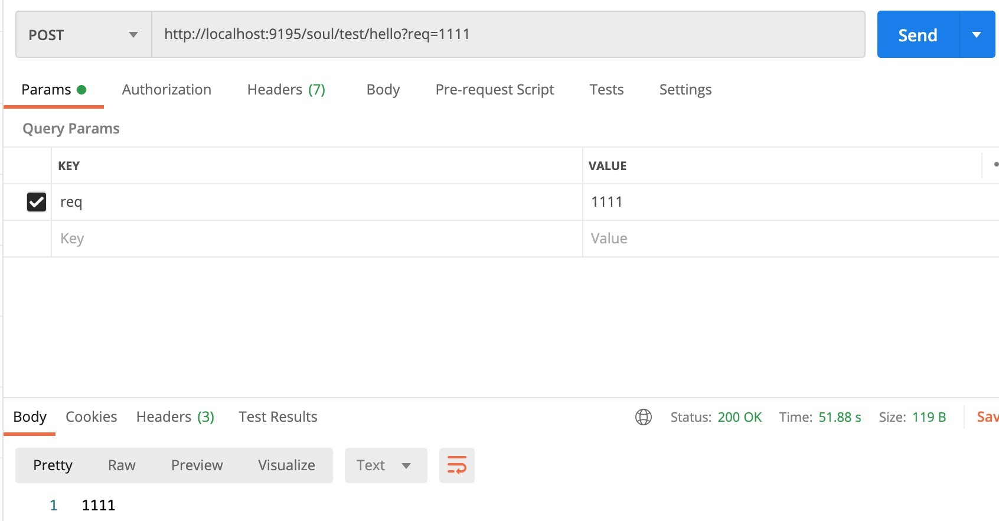
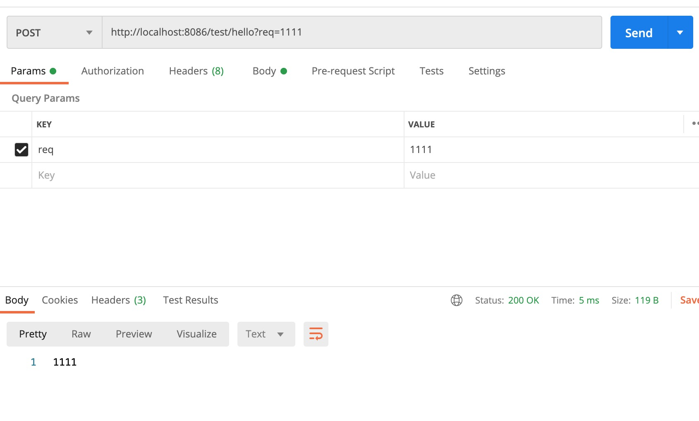
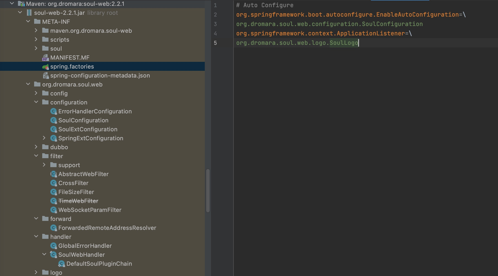
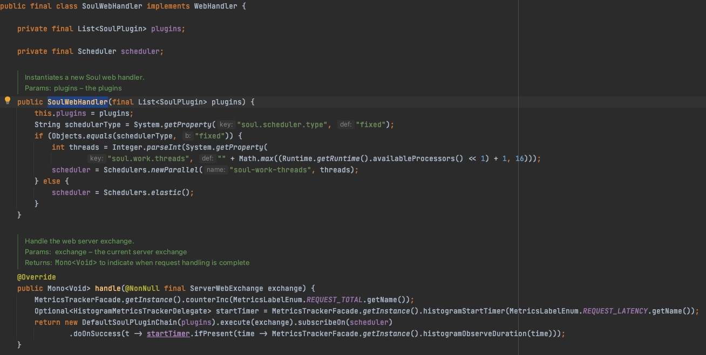
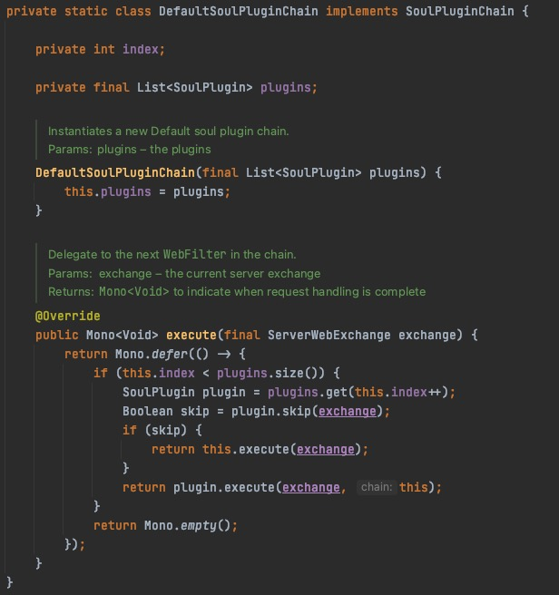
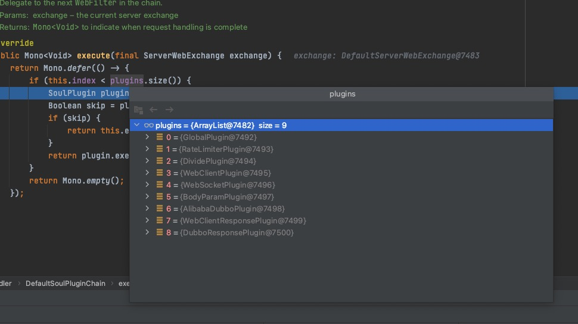

## soul网关源码分析之一个请求如何被网关代理（Http篇）

## 目标

- 分析一个被soul网关代理的http接口的处理流程
- 总结

## soul网关代理的http接口的处理流程

- **准备工作**

&nbsp; &nbsp; 启动soul-admin和soul网关，然后启动一个springMvc的rest服务，并且rest服务所暴露的接口有soul网关代理，具体的搭建网关和soul-admin流程可以参考往期文章或者直接去[soul官网](https://dromara.org/zh-cn/docs/soul)

- **测试soul网关代理和直连**

通过soul网关代理


直连


可以看到都能够获取到想要的结果，下面我们就看一下soul网关是怎样完成请求转发和响应的流程

- **源码分析**

- - **入手**

&nbsp; &nbsp; 一开始，我们很懵逼，网关就集成了一些插件，并且yml配置也看不到任何暴露程序入口痕迹，只能看到配置了网关监听的端口号，这时候还是老办法，看pom文件吧，pom文件中插件的依赖我们不用关心，之前的文档也大概分析了某些插件，这时候我们主要关注的其实就是`soul-spring-boot-starter-gateway`这个依赖包，打开这个依赖包，我们可以看到一个类都没有，这是`spring.factories`就是我们的关注点了，可以看到其内容是`provides: soul-web`，我们就知道了，这是要家在`soul-web`这个包，话不多说，直接看`soul-web`。

- - **还是那个soul-web**

&nbsp; &nbsp; 我是直接打开的网关的依赖包，当然也可以直接看soul项目中的源码，可以看到这里边指出能够`EnableAutoConfiguration`的配置类是`SoulConfiguration`



&nbsp; &nbsp; 下面是`SoulConfiguration`的代码，可以看到初始化了`SoulWebHandler`，`DispatcherHandler`，`PluginDataSubscriber`等等，看到这里，我觉得请求的接收十有八九是`SoulWebHandler`，`DispatcherHandler`来处理的，因为`PluginDataSubscriber`之前我们分析过，它是用来订阅插件数据变更的通知的，其他初始化的Bean多是些过滤器暂时先不考虑。

```
@Configuration
@ComponentScan("org.dromara.soul")
@Import(value = {ErrorHandlerConfiguration.class, SoulExtConfiguration.class, SpringExtConfiguration.class})
@Slf4j
public class SoulConfiguration {
    
    /**
     * Init SoulWebHandler.
     *
     * @param plugins this plugins is All impl SoulPlugin.
     * @return {@linkplain SoulWebHandler}
     */
    @Bean("webHandler")
    public SoulWebHandler soulWebHandler(final ObjectProvider<List<SoulPlugin>> plugins) {
        List<SoulPlugin> pluginList = plugins.getIfAvailable(Collections::emptyList);
        final List<SoulPlugin> soulPlugins = pluginList.stream()
                .sorted(Comparator.comparingInt(SoulPlugin::getOrder)).collect(Collectors.toList());
        soulPlugins.forEach(soulPlugin -> log.info("load plugin:[{}] [{}]", soulPlugin.named(), soulPlugin.getClass().getName()));
        return new SoulWebHandler(soulPlugins);
    }
    
    /**
     * init dispatch handler.
     *
     * @return {@link DispatcherHandler}.
     */
    @Bean("dispatcherHandler")
    public DispatcherHandler dispatcherHandler() {
        return new DispatcherHandler();
    }
    
    /**
     * Plugin data subscriber plugin data subscriber.
     *
     * @param pluginDataHandlerList the plugin data handler list
     * @return the plugin data subscriber
     */
    @Bean
    public PluginDataSubscriber pluginDataSubscriber(final ObjectProvider<List<PluginDataHandler>> pluginDataHandlerList) {
        return new CommonPluginDataSubscriber(pluginDataHandlerList.getIfAvailable(Collections::emptyList));
    }
    
    ...
}
```

&nbsp; &nbsp; 话不多说，赶紧看看`SoulWebHandler`，`DispatcherHandler`代码，打开`DispatcherHandler`，发现这个东西是spring的，既然是spring的那肯定不是我们自己定义的用来接收请求的，但是又不知道他是干啥的，赶紧查一下，`DispatcherHandler`在spring webflux中相当于springmvc的DispatcherServlet，多一跳过它直接看`SoulWebHandler`；


- - - **SoulWebHandler分析**

&nbsp; &nbsp; 下面是`SoulWebHandler`部分代码，我们一部分一部分分析，首先该类实现了`WebHandler`接口，这又是个啥？？赶紧查查，原来这是`springwebflux`定义的`Web请求必要的一些处理行为`的接口，其实在看这篇源码之前，我也简单了解下了springwebfulx，但其实还是不是很透彻，总之实现了这个接口并重写他的`handle`方法，那么`handle`方法就是用来处理`Web请求`的，可以看到在初始化`SoulWebHandler`的时候，将`SoulPlugin`列表也初始化了，并且还初始化了一个`Scheduler`，这里就不得不说到spring webfulx所配合的`Reactor`了，`Scheduler`其实就是`Reactor`并行运行的调度器，关于`Reactor`的知识，这里先不说了，免得跑题，接下来看`handle`方法，可以看出来它是将插件的列表作为参数初始化`DefaultSoulPluginChain`进行执行的。



&nbsp; &nbsp; 下面是`DefaultSoulPluginChain`代码，其核心的是`execute`，这里又是使用到了响应式编程`Mono.defer`，其中的逻辑是，遍历插件列表，插件满足`skip`条件时跳过，否则执行，这其实是一个`责任链`的设计模式，这其中`skip`方法设计的很有意思，是通过`SoulContext`来判断是否需要skip



我们跳过其他的插件，直接看处理请求转发的插件，以下是我配置的所有插件，先看名字再猜哪个是处理请求转发的嘛，因为是Http请求嘛，那就是WebClientPlugin插件呗。



- - - **WebClientPlugin分析**

&nbsp; &nbsp; 直接上代码，代码比较多，这里核心的处理方法是`execute`，其他各个方法的作用在代码中已经标出来了，这里执行插件列表用到的责任链模式特别巧妙，当所有的插件执行完成，这一整个请求就执行完了，但请注意，插件的执行顺序也是固定的，比如限流插件肯定要在WebClientPlugin之前执行
```
@Slf4j
public class WebClientPlugin implements SoulPlugin {

    private final WebClient webClient;

    /**
     * Instantiates a new Web client plugin.
     *
     * @param webClient the web client
     */
    public WebClientPlugin(final WebClient webClient) {
        this.webClient = webClient;
    }

    @Override
    public Mono<Void> execute(final ServerWebExchange exchange, final SoulPluginChain chain) {
        final SoulContext soulContext = exchange.getAttribute(Constants.CONTEXT);
        assert soulContext != null;
        String urlPath = exchange.getAttribute(Constants.HTTP_URL);
        if (StringUtils.isEmpty(urlPath)) {
            Object error = SoulResultWrap.error(SoulResultEnum.CANNOT_FIND_URL.getCode(), SoulResultEnum.CANNOT_FIND_URL.getMsg(), null);
            return WebFluxResultUtils.result(exchange, error);
        }
        long timeout = (long) Optional.ofNullable(exchange.getAttribute(Constants.HTTP_TIME_OUT)).orElse(3000L);
        int retryTimes = (int) Optional.ofNullable(exchange.getAttribute(Constants.HTTP_RETRY)).orElse(0);
        log.info("The request urlPath is {}, retryTimes is {}", urlPath, retryTimes);
        HttpMethod method = HttpMethod.valueOf(exchange.getRequest().getMethodValue());
        // 请求转发
        WebClient.RequestBodySpec requestBodySpec = webClient.method(method).uri(urlPath);
        return handleRequestBody(requestBodySpec, exchange, timeout, retryTimes, chain);
    }

    @Override
    public int getOrder() {
        return PluginEnum.DIVIDE.getCode() + 1;
    }

    @Override
    public String named() {
        return "webClient";
    }

    // 是否跳过该插件
    @Override
    public Boolean skip(final ServerWebExchange exchange) {
        final SoulContext soulContext = exchange.getAttribute(Constants.CONTEXT);
        assert soulContext != null;
        return !Objects.equals(RpcTypeEnum.HTTP.getName(), soulContext.getRpcType())
                && !Objects.equals(RpcTypeEnum.SPRING_CLOUD.getName(), soulContext.getRpcType());
    }

    // 构造Http请求头
    private MediaType buildMediaType(final ServerWebExchange exchange) {
        return MediaType.valueOf(Optional.ofNullable(exchange
                .getRequest()
                .getHeaders().getFirst(HttpHeaders.CONTENT_TYPE))
                .orElse(MediaType.APPLICATION_JSON_VALUE));
    }

    // 构造Http请求参数
    private Mono<Void> handleRequestBody(final WebClient.RequestBodySpec requestBodySpec,
                                         final ServerWebExchange exchange,
                                         final long timeout,
                                         final int retryTimes,
                                         final SoulPluginChain chain) {
        return requestBodySpec.headers(httpHeaders -> {
            httpHeaders.addAll(exchange.getRequest().getHeaders());
            httpHeaders.remove(HttpHeaders.HOST);
        })
                .contentType(buildMediaType(exchange))
                .body(BodyInserters.fromDataBuffers(exchange.getRequest().getBody()))
                .exchange()
                .doOnError(e -> log.error(e.getMessage()))
                .timeout(Duration.ofMillis(timeout))
                .retryWhen(Retry.onlyIf(x -> x.exception() instanceof ConnectTimeoutException)
                    .retryMax(retryTimes)
                    .backoff(Backoff.exponential(Duration.ofMillis(200), Duration.ofSeconds(20), 2, true)))
                .flatMap(e -> doNext(e, exchange, chain));

    }

    // 执行下一个责任链
    private Mono<Void> doNext(final ClientResponse res, final ServerWebExchange exchange, final SoulPluginChain chain) {
        if (res.statusCode().is2xxSuccessful()) {
            exchange.getAttributes().put(Constants.CLIENT_RESPONSE_RESULT_TYPE, ResultEnum.SUCCESS.getName());
        } else {
            exchange.getAttributes().put(Constants.CLIENT_RESPONSE_RESULT_TYPE, ResultEnum.ERROR.getName());
        }
        exchange.getAttributes().put(Constants.CLIENT_RESPONSE_ATTR, res);
        return chain.execute(exchange);
    }
}
```

## 总结
&nbsp; &nbsp; 好了，一个Http请求的具体代理流程大致就分析完了，实际上还是留下了很多细节，比如说如何判断`skip`，插件列表的执行顺序，Reactor的API的具体说明等等，这些只能是慢慢分析了，有一点很重要，就是在分析这个流程时，一定要对`Spring WebFlux`，`Reactor`的API有一定的了解，不然理解起来很费劲。