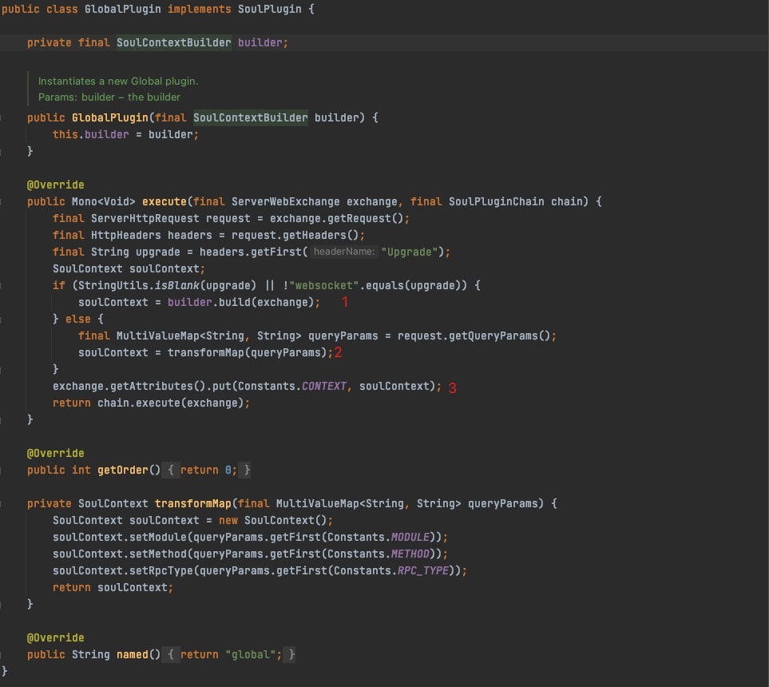
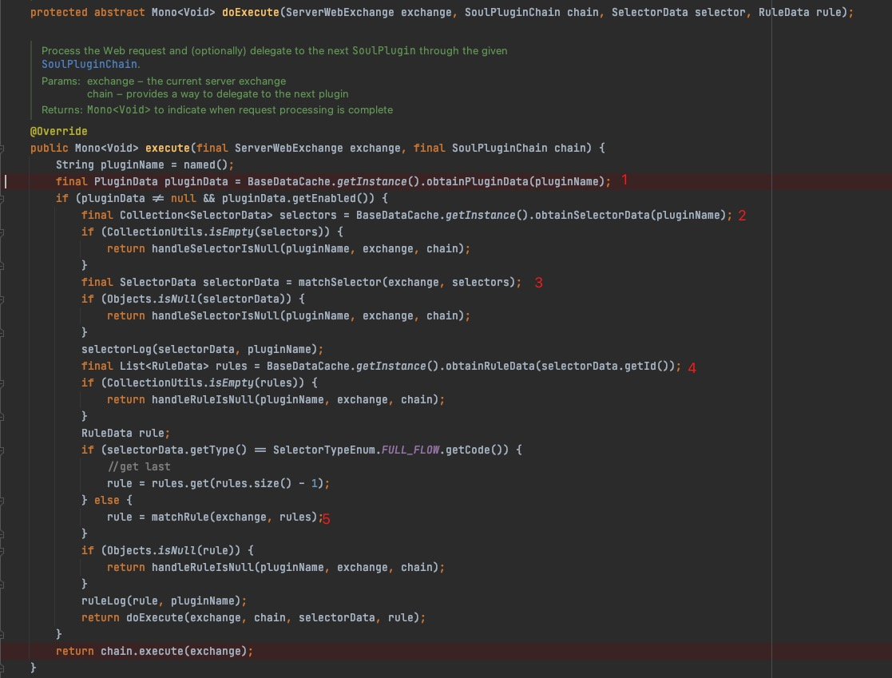
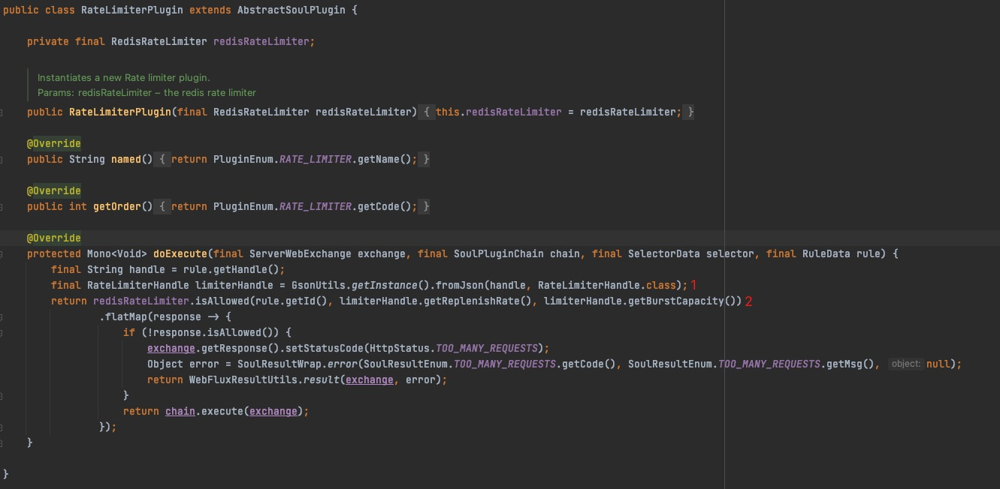
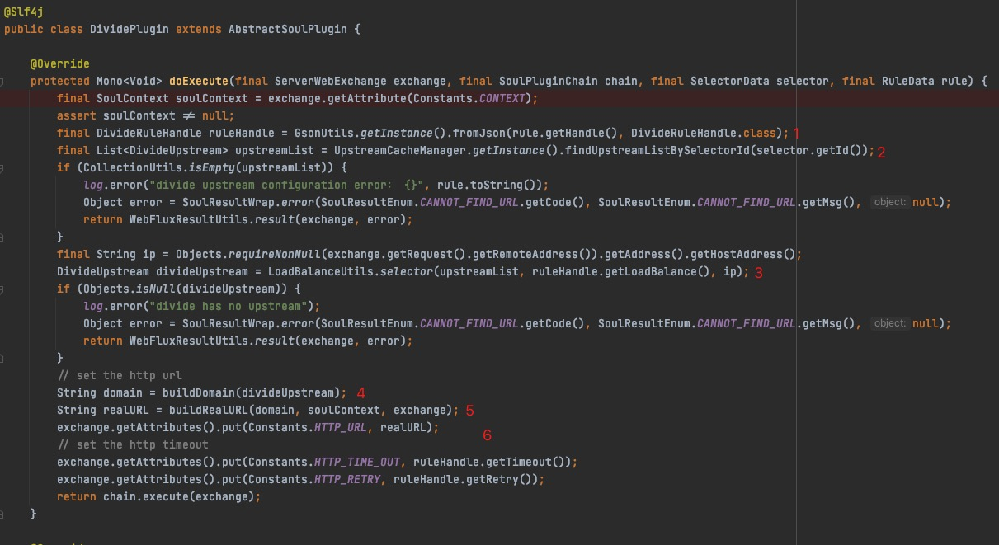
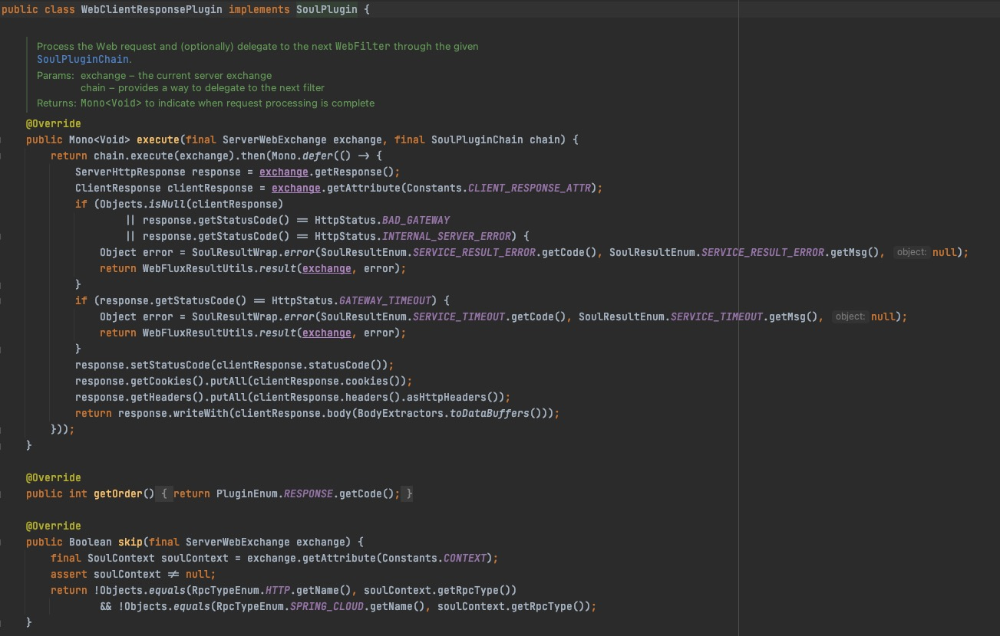

# soul网关源码分析之代理请求插件，选择器，规则的匹配

## 目标

- 基于[soul网关源码分析之一个请求如何被网关代理](./soul_6.md)分析下被soul网关代理的接口是如何匹配插件，选择器以及规则
- 总结

## 分析背景

&nbsp; &nbsp; 上篇文章简单分析了下一个被soul网关代理的接口请求是如何被转发的，先来回顾一下，soul网关是通过实现`Spring WebFlux`提供的`WebHandler`接口，来实现对外提供Web服务，接收请求的；重写的`handle`方法来处理请求，处理请求时使用责任链模式来链式的执行插件，上篇是主要分析的一个代理Http 接口的处理流程， 所以就直接看了一遍执行Web请求的插件，也就是`WebClientPlugin`插件，本篇主要来看一下soul网关是如何匹配插件，比如如何匹配限流等等插件。

## 开始分析

- **网关加载的插件**

&nbsp; &nbsp; 根据下面的图可以看出来，我们自己搭建的网关一共加载了9个插件，虽然是9个插件，但其实时刻分类的，比如这里有两个带有`Dubbo`字样的插件，这其实是用来处理Dubbo的代理的，`WebClientPlugin`是HttpClient插件，`BodyParamPlugin`从名字上看像是处理某种body参数的插件，事实上它是用来处理代理接口为Dubbo接口的参数，等等。

- **Debug分析**

&nbsp; &nbsp; 插件是按照顺序执行的，下面是具体插件的处理流程分析：

- - **GlobalPlugin**

1. 步骤1和步骤2 是构造`SoulContext`的过程， 分别是使用`DefaultSoulContextBuilder`构造和通过`reques.QueryParams()`构造
2. 步骤3 是设置将`SoulContext`设置到`ServerWebExchange`的`attributes`中，key是`context`

- - **AbstractSoulPlugin（插件的父类）**

&nbsp; &nbsp; 这里不得不插队说一下`AbstractSoulPlugin`，因为它是被定义成一个抽象方法并实现了`SoulPlugin`接口，后面的一些插件是继承了该抽象类的，它提供了一个模版方法`execute`，该方法实际上是重写的`SoulPlugin`接口方法，继承`AbstractSoulPlugin`类的插件类共用了`AbstractSoulPlugin`的模版方法`execute`，下面是`AbstractSoulPlugin`的代码和步骤分析：

1. 从插件网关缓存的插件数据中根据插件名字获取到插件数据
2. 根据插件名称获取到选择器列表，选择器数据就包括后端服务接口路径、权重、协议等信息
3. 根据匹配策略获取到选择器数据，匹配器的策略目前分为And和Or两种
4. 根据选择器Id获取到Rule数据列表，规则数据内容也包含一些路径，权重，协议等基本信息
5. 根据匹配策略获取到具体的规则数据
6. 然后执行继承`AbstractSoulPlugin`类的子类的`doExecute`方法
7. 这里暂时不看匹配策略代码

- - **RateLimiter（限流插件）**

1. 首先这个插件在我的程序中是没执行的，因为没有配置该插件，在`webHandler`，责任链处理逻辑是就`skip`掉了，但因为该插件排的靠前，就简单看一下代码逻辑
2. 获取限流处理器Handle，这里不深入分析限流处理器
3. 执行限流，是否被限流
4. 如果不允许的话`WebFluxResultUtils.result(exchange, error)`处理返回结果，允许就继续执行插件链

- - **DividePlugin插件**

1. 因为我们代理的是Http接口，并且这个所以我们已经打开了这个插件，可以看到该插件继承了`AbstractSoulPlugin`，所以执行了模版方法的所有逻辑
2. 执行自己的`doExecute`方法，步骤1是从规则的handle数据中获取到插件的规则数据，包括超时配置、loadBalance算法名称、重试次数
3. 执行LoadBalance
4. 组装domain数据
5. 组装realURL，就是真正的请求URL
6. 将realURL、Timeout、retry数据初始化到`ServerWebExchange`的`attributes`中
7. 最后执行下一个插件

- - **WebClientPlugin插件**

1. 这个插件的执行就不细说了，上篇文章的已经详细的讲到了，`ServerWebExchange`的`attributes`中已经记录了这个代理请求的协议时Http，所以`WebClientPlugin插件`不会被`skip`掉，总之这个插件的目的就是通过作为一个webclient请求后端被代理的接口

 

- - **WebSocketPlugin插件**

1. 处理`WebSocket`的插件，被`skip`掉了，后面有机会再说

 

- - **BodyParamPlugin插件**

1. 处理Dubbo协议body参数插件，被`skip`掉了，后面有机会再说

 

- - **AlibabaDubboPlugin、DubboResponsePlugin插件**

1. 一个是处理Dubbo请求的插件，一个是处理Dubbo响应数据的插件，都被`skip`掉了，后面有机会再说

 

- - **WebClientResponse插件**

1. 这是处理`HttpResponse`的插件
2. `ServerHttpResponse response = exchange.getResponse();`  获取后段接口响应
3. `ClientResponse clientResponse = exchange.getAttribute(Constants.CLIENT_RESPONSE_ATTR);`获取`ClientResponse`
4. 判断是否有响应还有响应的状态码，如果没有响应或者响应的状态码为超时，直接做出相应的响应
5. 设置`ClientResponse`的响应数据，最后写入响应数据，这也是最后一个执行的插件，最后将数据返回到客户端

## 总结

&nbsp; &nbsp; 本篇内容实际上是对上一篇接收到请求后，具体的插件链处理的一个补充，不得不说soul网关的插件热插拔，插件调用的责任链设计模式，模版方法模式，策略模式等都是非常值得我们学习的，本篇文章在说明构造`SoulContext`数据时候没有深入，其实这里的soul上下文数据来源是MetaData数据的缓存，如果没有开启元数据，那么默认RpcType是Http，如果开启了元数据那么从元数据中匹配，具体是使用`AntPathMatcher`匹配`ServerWebExchange`中的`URI`的`path`