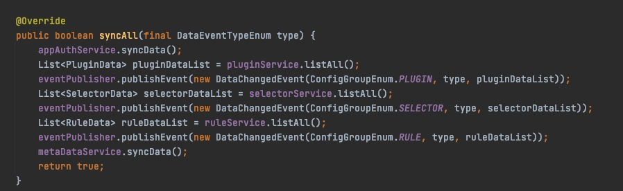

# soul网关源码分析之网关数据同步-Zookeeper

## 目标

- 分析soul网关使用zookeeper的数据同步源码
- 总结


## soul-admin与soul网关配置zookeeper数据同步

- **soul-admin的yml配置**

    关闭websocket同步方式，开启zk同步方式，配置zk
    ```
    soul:
    database:
        dialect: mysql
        init_script: "META-INF/schema.sql"
    sync:
    #  websocket:
    #    enabled: true
        zookeeper:
            url: localhost:2181
            sessionTimeout: 5000
            connectionTimeout: 2000
    ```

- **soul网关支持zookeeper**

    pom依赖，将websocket的starter换成zookeeper
    ```
        <dependency>
            <groupId>org.dromara</groupId>
            <artifactId>soul-spring-boot-starter-sync-data-zookeeper</artifactId>
            <version>${soul-version}</version>
        </dependency>
    ```
    yml配置
    ```
    soul :
        sync:
        #    websocket :
        #      # 设置成你的soul-admin地址
        #      urls: ws://localhost:9095/websocket
            zookeeper:
                url: localhost:2181
                sessionTimeout: 5000
                connectionTimeout: 2000
    ```

## 源码分析

&nbsp; &nbsp; 在进行源码之前我们先来了解一下zookeeper，并且简单的思考一下，为什么zookeeper适用于soul网关数据同步的场景

1. zk将数据存储在内存中，所以操作起来很快
2. 按照生命周期来分，zk的节点有持久结点、持久顺序结点、临时结点、临时顺序结点
3. zk节点的事件监听机制
4. 支持集群和高可用
5. 也正是因为以上特性，zk常被用作微服务的注册中心

&nbsp; &nbsp; 在未进行源码分析之前，根据zk的特性，我们大致可以猜到，soul网关数据同步的流程，应该是通过soul-admin发起数据变更会修改zk的节点数据，soul网关作为zk的一个客户端，会监听zk节点变化，如果有变化，就根据节点中数据更新网关缓存数据。

### soul-admin发起数据变更

&nbsp; &nbsp; 还是那个思路，在更新数据的controller打断点debug，这里我在soul-admin管理页面选择的是规则数据的修改，我就不上图了，之前在[websocket数据同步](./soul_3.md)时讲过，soul网关通过spring的`ApplicationEventPublisher`发出配置变更通知，由`DataChangedEventDispatcher`处理变更通知，然后将根据对应的策略配置（websocket，zk，http还是nacos），将配置发送给事件处理器，跳过事件发布和通知分发的代码，我们直接看处理事件的zookeeper的监听器的配置`ZookeeperListener`和监听器`ZookeeperDataChangedListener`
    

- - **ZookeeperListener**


- - **ZookeeperDataInit**


- - **syncAll**

syncAll方法的逻辑就是发布所有的插件数据，选择器数据，规则数据，然后Dispatcher处理



- - **ZookeeperDataChangedListener**

&nbsp; &nbsp; `ZookeeperDataChangedListener`代码是核心的处理zk同步方式的Listener，具体处理逻辑在下面代码注释中说明；我更新的是Rule数据所以完成下面代码的`onRuleChanged`，在soul-admin端的操作就结束了

```
public class ZookeeperDataChangedListener implements DataChangedListener {

    private final ZkClient zkClient;

    public ZookeeperDataChangedListener(final ZkClient zkClient) {
        this.zkClient = zkClient;
    }
    // 权限数据变更
    @Override
    public void onAppAuthChanged(final List<AppAuthData> changed, final DataEventTypeEnum eventType) {
        for (AppAuthData data : changed) {
            final String appAuthPath = ZkPathConstants.buildAppAuthPath(data.getAppKey());
            // 如果事件类型为删除，就根据appAuthPath删除zk节点
            if (eventType == DataEventTypeEnum.DELETE) {
                deleteZkPath(appAuthPath);
                continue;
            }
            // 创建or删除zk节点
            upsertZkNode(appAuthPath, data);
        }
    }
    // 元数据便变更
    @SneakyThrows
    @Override
    public void onMetaDataChanged(final List<MetaData> changed, final DataEventTypeEnum eventType) {
        for (MetaData data : changed) {
            final String metaDataPath = ZkPathConstants.buildMetaDataPath(URLEncoder.encode(data.getPath(), "UTF-8"));
            // delete
            if (eventType == DataEventTypeEnum.DELETE) {
                deleteZkPath(metaDataPath);
                continue;
            }
            // create or update
            upsertZkNode(metaDataPath, data);
        }
    }
    // 插件数据变更
    @Override
    public void onPluginChanged(final List<PluginData> changed, final DataEventTypeEnum eventType) {
        for (PluginData data : changed) {
            final String pluginPath = ZkPathConstants.buildPluginPath(data.getName());
            // delete
            if (eventType == DataEventTypeEnum.DELETE) {
                // 删除插件节点，注意是逐层的删除
                deleteZkPathRecursive(pluginPath);
                final String selectorParentPath = ZkPathConstants.buildSelectorParentPath(data.getName());
                // 删除选择器节点，注意是逐层的删除
                deleteZkPathRecursive(selectorParentPath);
                final String ruleParentPath = ZkPathConstants.buildRuleParentPath(data.getName());
                // 删除规则节点，注意是逐层的删除
                deleteZkPathRecursive(ruleParentPath);
                continue;
            }
            //创建 or 更新节点
            upsertZkNode(pluginPath, data);
        }
    }
    // 选择器数据变更
    @Override
    public void onSelectorChanged(final List<SelectorData> changed, final DataEventTypeEnum eventType) {
        if (eventType == DataEventTypeEnum.REFRESH) {
            final String selectorParentPath = ZkPathConstants.buildSelectorParentPath(changed.get(0).getPluginName());
            // 删除选择器节点，注意是逐层的删除
            deleteZkPathRecursive(selectorParentPath);
        }
        for (SelectorData data : changed) {
            final String selectorRealPath = ZkPathConstants.buildSelectorRealPath(data.getPluginName(), data.getId());
            if (eventType == DataEventTypeEnum.DELETE) {
                deleteZkPath(selectorRealPath);
                continue;
            }
            final String selectorParentPath = ZkPathConstants.buildSelectorParentPath(data.getPluginName());
            // 创建节点
            createZkNode(selectorParentPath);
            // 创建or更新节点数据
            upsertZkNode(selectorRealPath, data);
        }
    }

    @Override
    public void onRuleChanged(final List<RuleData> changed, final DataEventTypeEnum eventType) {
        if (eventType == DataEventTypeEnum.REFRESH) {
            final String selectorParentPath = ZkPathConstants.buildRuleParentPath(changed.get(0).getPluginName());
             // 删除规则节点，注意是逐层的删除
            deleteZkPathRecursive(selectorParentPath);
        }
        for (RuleData data : changed) {
            final String ruleRealPath = ZkPathConstants.buildRulePath(data.getPluginName(), data.getSelectorId(), data.getId());
            if (eventType == DataEventTypeEnum.DELETE) {
                // 删除规则数据节点
                deleteZkPath(ruleRealPath);
                continue;
            }
            final String ruleParentPath = ZkPathConstants.buildRuleParentPath(data.getPluginName());
            // 创建节点
            createZkNode(ruleParentPath);
            // 创建or更新节点数据
            upsertZkNode(ruleRealPath, data);
        }
    }
    // 创建节点
    private void createZkNode(final String path) {
        if (!zkClient.exists(path)) {
            zkClient.createPersistent(path, true);
        }
    }
    
    // 如果节点不存在创建节点并写入节点数据，如果节点存在直接写入数据
    private void upsertZkNode(final String path, final Object data) {
        if (!zkClient.exists(path)) {
            zkClient.createPersistent(path, true);
        }
        zkClient.writeData(path, data);
    }
    // 如果节点存在删除节点
    private void deleteZkPath(final String path) {
        if (zkClient.exists(path)) {
            zkClient.delete(path);
        }
    }
    //如果节点存在，逐层删除
    private void deleteZkPathRecursive(final String path) { 
        if (zkClient.exists(path)) {
            zkClient.deleteRecursive(path);
        }
    }
}
```

<br>

### soul网关监听zk节点变化并同步数据

- **soul网关zk数据同步方式配置类**

org.dromara.soul.spring.boot.sync.data.zookeeper.ZookeeperSyncDataConfiguration


- **ZookeeperSyncDataService**

&nbsp; &nbsp; 果然，就是在监听zk节点的变化，`ZookeeperSyncDataService`的`构造器`代码中监听了插件数据变化，监听了AppAuth数据变化，监听了元数据的变化，并且初始化了数据变化的订阅器`Subscribers`
```
    public ZookeeperSyncDataService(final ZkClient zkClient, final PluginDataSubscriber pluginDataSubscriber,
                                        final List<MetaDataSubscriber> metaDataSubscribers, final List<AuthDataSubscriber> authDataSubscribers) {
            this.zkClient = zkClient;
            this.pluginDataSubscriber = pluginDataSubscriber;
            this.metaDataSubscribers = metaDataSubscribers;
            this.authDataSubscribers = authDataSubscribers;
            watcherData();
            watchAppAuth();
            watchMetaData();
    }
```
<br>

&nbsp; &nbsp; `watcherData()`的逻辑是如果存在插件数据，那么就会监听插件，选择器，规则的节点变化
```
    private void watcherData() {
        final String pluginParent = ZkPathConstants.PLUGIN_PARENT;
        List<String> pluginZKs = zkClientGetChildren(pluginParent);
        for (String pluginName : pluginZKs) {
            watcherAll(pluginName);
        }
        zkClient.subscribeChildChanges(pluginParent, (parentPath, currentChildren) -> {
            if (CollectionUtils.isNotEmpty(currentChildren)) {
                for (String pluginName : currentChildren) {
                    watcherAll(pluginName);
                }
            }
        });
    }
```
<br>

&nbsp; &nbsp; `ZookeeperSyncDataService`的代码有三百多行，这里就不一一说明了，以规则（Rule）数据为例，列举一下，该类数据从监听到数据变更，到变更到soul网关内存中的流程吧

1. 首先监听规则数据的节点


2. 下面是监听规则数据节点后，规则节点数据变更操作


3. CommonPluginDataSubscriber的核心处理逻辑，之前有说过，就是根据操作操作类型就行缓存的更新或删除，更新的话就是直接覆盖数据。


4. 其他的数据类型的处理逻辑与规则数据类似，就不一一展开说明，可以自己私下看看

## 总结

&nbsp; &nbsp;有了之前分析WebSocket数据同步的经验和了解zk的特性后，分析zk的数据同步方式简单了不少，说白了思想就是 soul-admin`修改zk节点数据`，soul网关`watch节点的变更并作出相应的处理`，最后贴一张soul网关zk节点的结构图

