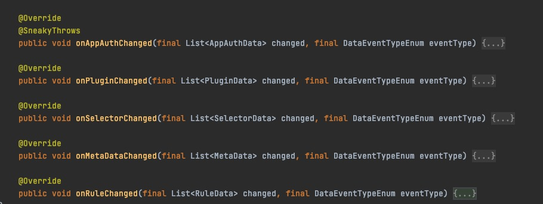
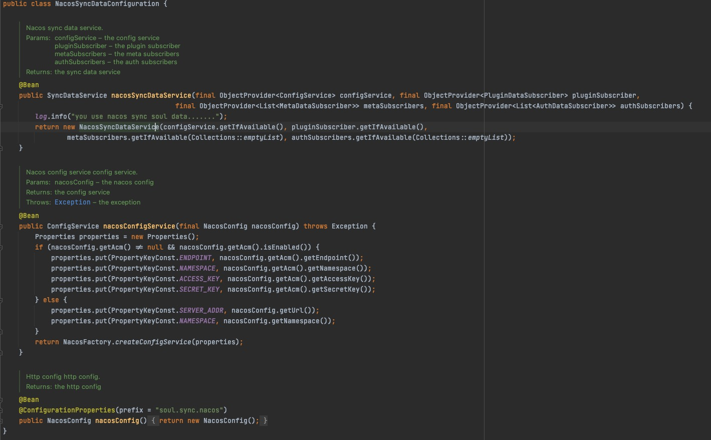
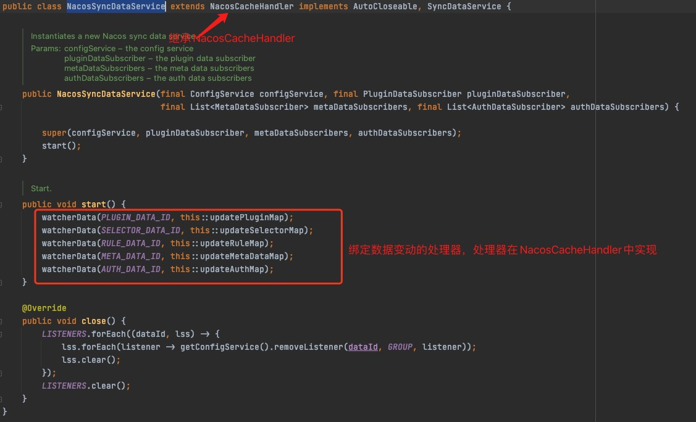
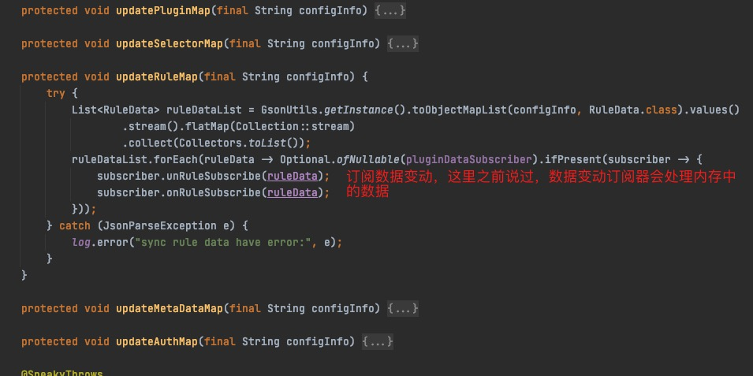

# soul网关源码分析之网关数据同步-nacos

## 目标

- 分析soul网关使用nacos的数据同步源码
- 总结

## soul-admin与soul网关配置nacos数据同步

- **soul-admin的yml配置**

    ```
    soul:
    database:
        dialect: mysql
        init_script: "META-INF/schema.sql"
    sync:
        nacos:
        url: localhost:8848
        namespace: 1c10d748-af86-43b9-8265-75f487d20c6c
        acm:
          enabled: false
          endpoint: acm.aliyun.com
          namespace:
          accessKey:
          secretKey:
    ```

- **soul网关支持nacos**

    pom依赖
    ```
        <dependency>
            <groupId>org.dromara</groupId>
            <artifactId>soul-spring-boot-starter-sync-data-nacos</artifactId>
            <version>${soul-version}</version>
        </dependency>
    ```
    yml配置
    ```
    soul :
        sync:
            nacos:
                url: localhost:8848
                namespace: 1c10d748-af86-43b9-8265-75f487d20c6c
                acm:
                    enabled: false
                    endpoint: acm.aliyun.com
                    namespace:
                    accessKey:
                    secretKey:
    ```

- **遇到问题**

&nbsp; &nbsp; 使用nacos进行数据同步时并没有之前那么顺利，在网关启动的时候会报错，以下的代码回报NullPointerException，发现在程序启动的时候是去nacos同步数据，但是`configInfo`确实null，这就导致了空指针，后经过`debug` soul-admin时发现并未将网关全量数据同步到nacos，在社区讨论时发现有其他同学也遇到过，并且这是一个bug也已经解决了，更新代码后soul-admin可以正常将数据同步到nacos

```
    protected void updateAuthMap(final String configInfo) {
        try {
            List<AppAuthData> appAuthDataList = new ArrayList<>(GsonUtils.getInstance().toObjectMap(configInfo, AppAuthData.class).values());
            appAuthDataList.forEach(appAuthData -> authDataSubscribers.forEach(subscriber -> {
                subscriber.unSubscribe(appAuthData);
                subscriber.onSubscribe(appAuthData);
            }));
        } catch (JsonParseException e) {
            log.error("sync auth data have error:", e);
        }
    }
```

## 源码分析

### soul-admin发起数据变更

- **NacosDataChangedListener**

- - 该类是soul-admin端核心处理数据同步的类，该类有两个操作nacos的方法，分别提供`get`和`push`nacos数据的能力

```
    @SneakyThrows
    private String getConfig(final String dataId) {
        String config = configService.getConfig(dataId, GROUP, 6000);
        return StringUtils.hasLength(config) ? config : EMPTY_CONFIG_DEFAULT_VALUE;
    }

    @SneakyThrows
    private void publishConfig(final String dataId, final Object data) {
        configService.publishConfig(dataId, GROUP, GsonUtils.getInstance().toJson(data));
    }
```

- - 下面是核心处理数据变通的方法



每个方法的处理逻辑差不多，这里拿插件数据改变做分析
```
    @Override
    public void onPluginChanged(final List<PluginData> changed, final DataEventTypeEnum eventType) {
        // 更新插件数据缓存
        updatePluginMap(getConfig(PLUGIN_DATA_ID));
        switch (eventType) {
            case DELETE:
                // 删除数据，从本地map中删除
                changed.forEach(plugin -> PLUGIN_MAP.remove(plugin.getName()));
                break;
            case REFRESH:
            case MYSELF:
                // 刷新数据，变动map中数据
                Set<String> set = new HashSet<>(PLUGIN_MAP.keySet());
                changed.forEach(plugin -> {
                    set.remove(plugin.getName());
                    PLUGIN_MAP.put(plugin.getName(), plugin);
                });
                PLUGIN_MAP.keySet().removeAll(set);
                break;
            default:
                // 默认的，插入map数据
                changed.forEach(plugin -> PLUGIN_MAP.put(plugin.getName(), plugin));
                break;
        }
        // 放到nacos中
        publishConfig(PLUGIN_DATA_ID, PLUGIN_MAP);
    }
```
分析到这里，发现一个nacos的特点，就是nacos数据同步他每次变动的是全量数据，而zk，websocket是首次增量以后就是增量了


### soul网关数据同步

- **nacos配置类**




- **soul网关端，核心监听nacos数据配置方式**

nacos的java客户端，提供了监听nacos数据变动的方式，就是nacos的Listener`com.alibaba.nacos.api.config.listener`

```
    @SneakyThrows
    private String getConfigAndSignListener(final String dataId, final Listener listener) {
        // 设置监听
        return configService.getConfigAndSignListener(dataId, GROUP, 6000, listener);
    }

    protected void watcherData(final String dataId, final OnChange oc) {
        // nacos数据变动监听
        Listener listener = new Listener() {
            @Override
            public void receiveConfigInfo(final String configInfo) {
                // 处理变动，这里其实由其他的方法处理
                oc.change(configInfo);
            }

            @Override
            public Executor getExecutor() {
                return null;
            }
        };
        oc.change(getConfigAndSignListener(dataId, listener));
        LISTENERS.getOrDefault(dataId, new ArrayList<>()).add(listener);
    }
```

NacosSyncDataService




## 总结

&nbsp; &nbsp;本篇文章针对nacos特性，进行了nacos数据同步的远离进行了简单的分析，由之前的源码分析经验，有些数据处理的细节并未分析，nacos与websocket和zk不同，nacos每次都是变动都要更新全量数据，这点其实不是特别的好