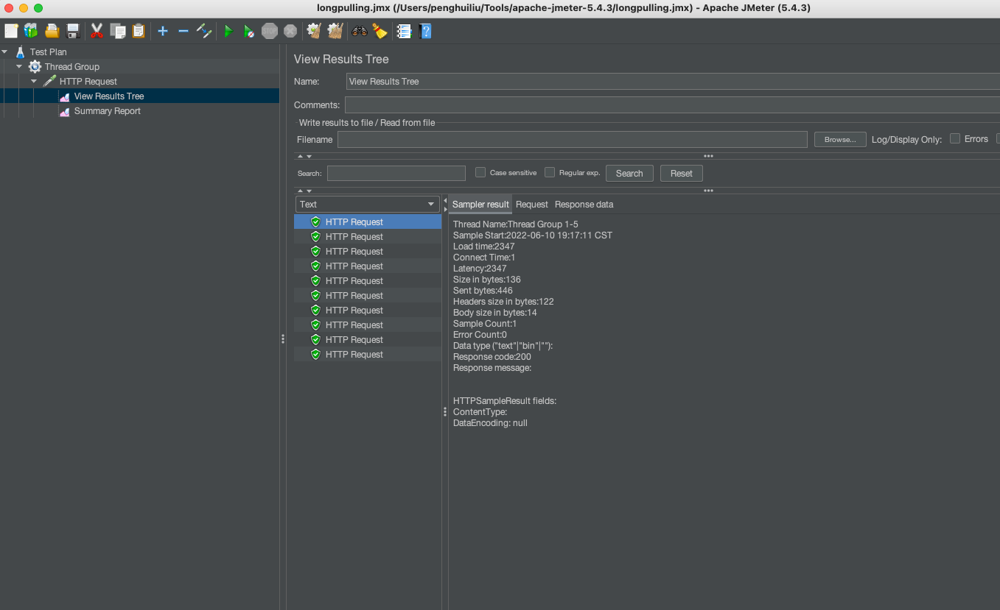

# AsyncContext异步处理Http请求 <!-- {docsify-ignore-all} -->


## AsyncContext

> `AsyncContext`是`Servlet 3.0`使Servlet 线程不再需要一直阻塞，直到业务处理完毕才能再输出响应，最后才结束该Servlet线程。在接收到请求之后，Servlet线程可以将耗时的操作委派给另一个线程来完成，自己在不生成响应的情况下返回至容器。针对业务处理较耗时的情况，这将大大减少服务器资源的占用，并且提高并发处理速度

> Servlet 3.0新增了异步处理，可以先释放容器分配给请求的线程与相关资源，减轻系统负担，原先释放了容器所分配线程的请求，其响应将被延后，可以在处理完成(例如长时间运算完成、所需资源已获得)时再对客户端进行响应。

在Servlet 3.0中，在`ServletRequest`上提供了`startAsync()`方法，该方法会根据请求的`ServletRequest`和`ServletResponse`创建`AsyncContext`对象。

```java
    @Override
    public AsyncContext startAsync() {
        return startAsync(getRequest(),response.getResponse());
    }

    @Override
    public AsyncContext startAsync(ServletRequest request,
            ServletResponse response) {
        if (!isAsyncSupported()) {
            IllegalStateException ise =
                    new IllegalStateException(sm.getString("request.asyncNotSupported"));
            log.warn(sm.getString("coyoteRequest.noAsync",
                    StringUtils.join(getNonAsyncClassNames())), ise);
            throw ise;
        }

        if (asyncContext == null) {
            asyncContext = new AsyncContextImpl(this);
        }

        asyncContext.setStarted(getContext(), request, response,
                request==getRequest() && response==getResponse().getResponse());
        asyncContext.setTimeout(getConnector().getAsyncTimeout());

        return asyncContext;
    }
```

请求调用`startAsync`后`Servlet`线程将会被释放，请求交由其他线程去处理，如果业务线程没有处理完，客户端将不会收到响应，直到调用`AsyncContext`的`complete()`和`dispatch(ServletContext context, String path)`方法为止，`dispatch`方法会根据`path`进行重定向。`AsyncContextImpl`大致代码如下：

```java
    @Override
    public void complete() {
        if (log.isDebugEnabled()) {
            logDebug("complete   ");
        }
        check();
        request.getCoyoteRequest().action(ActionCode.ASYNC_COMPLETE, null);
    }

    @Override
    public void dispatch() {
        check();
        String path;
        String cpath;
        ServletRequest servletRequest = getRequest();
        if (servletRequest instanceof HttpServletRequest) {
            HttpServletRequest sr = (HttpServletRequest) servletRequest;
            path = sr.getRequestURI();
            cpath = sr.getContextPath();
        } else {
            path = request.getRequestURI();
            cpath = request.getContextPath();
        }
        if (cpath.length() > 1) {
            path = path.substring(cpath.length());
        }
        if (!context.getDispatchersUseEncodedPaths()) {
            path = UDecoder.URLDecode(path, StandardCharsets.UTF_8);
        }
        dispatch(path);
    }
```

## AsyncContext使用示例及测试

### 示例

- 设置Tomcat线程数为1

```yml
server:
  port: 9099
  servlet:
    context-path: /server/v1
  # 设置Tomcat线程数为1
  tomcat:
    min-spare-threads: 1
    max-threads: 1
```

- Controller

```java
@RestController
public class AsyncTestController {

    private final ScheduledExecutorService timeoutChecker = new ScheduledThreadPoolExecutor(1, threadFactory);

    private static boolean result = false;


    @PostMapping("/async")
    public void async(@RequestBody Request re1, HttpServletRequest request, HttpServletResponse response) {
        // 创建AsyncContext
        AsyncContext asyncContext = request.startAsync(request, response);
        String name = re1.getUsername();
        // 设置处理超时时间2s
        asyncContext.setTimeout(2000L);
        // asyncContext监听
        asyncContext.addListener(new AsyncListener() {
            @Override
            public void onComplete(AsyncEvent asyncEvent) throws IOException {

            }

            @Override
            public void onTimeout(AsyncEvent asyncEvent) throws IOException {
                asyncContext.getResponse().getWriter().print(name + "：timeout");
                asyncContext.complete();
            }

            @Override
            public void onError(AsyncEvent asyncEvent) throws IOException {

            }

            @Override
            public void onStartAsync(AsyncEvent asyncEvent) throws IOException {

            }
        });
        // 定时处理业务，处理成功后asyncContext.complete();完成异步请求
        timeoutChecker.scheduleWithFixedDelay(() -> {
            try {
                if (result) {
                    asyncContext.getResponse().getWriter().print(name);
                    asyncContext.complete();
                }
            } catch (IOException e) {
                e.printStackTrace();
            }
        }, 0, 100L, TimeUnit.MILLISECONDS);
    }

    // 模拟业务处理完成
    @PostMapping("/notify")
    public void notify(Boolean s) {
        result = s;
    }
}
```

### 测试结果

- 测试指标

并发5，两个循环


- 测试结果

10条并发请求都能够处理，并且处理的时间都是2s左右（因为设置的超时时间是2s），通过该测试结果可以看出，使用`AsyncContext`可以在容器资源有限的情况下处理更多的请求，这在高并发场景下就比较有用了。





## AsyncContext应用场景

使用`AsyncContext`实现的Http长轮询在许多的中间件的信息同步场景中应用广泛，例如Nacos配置中心和Apache Shenyu网关。


## AsyncContext在公司业务场景中的应用介绍

### 背景

&nbsp; &nbsp; 公司一个系统是`Netty`实现的TCP协议的服务，其中的一个业务是设备请求后台接口查询支付结果，接口的处理逻辑是收到请求后就将请求放到一个队列中，然后由业务线程异步处理，当收到支付结果完成后将响应给客户端支付结果，该接口的超时时间是2s，如果2s查不到支付结果就返回给客户端查不到结果，客户端收到该错误后重新发起查询，直到客户端的整个业务超时。


&nbsp; &nbsp; 公司由于服务架构调整，要将该系统改造成基于SpringBoot的Http协议接口，如果”支付结果查询接口“不做机制的变更，就会导致每一次结果查询都会阻塞等待队列中查询支付结果的查询，因为支付是异步的，所以支付结果查询会比较耗时，如果机制不改那么如果并发增大的话会导致服务器的处理请求线程全部被打满，整个服务对于其他请求，其他业务都变得不可用了，这个结果是不可以接受的。


### AsyncContext解决生产问题

&nbsp; &nbsp; 基于`示例`中的demo进行业务改造

开启异步，设置整个异步接口处理的超时时间（2s），设置Listener主要用于处理接口超时，阻塞队列处理查询支付结果，查到结果后调用complete完成该长轮询，如果2s没有查到结果，那就返回查询超时，客户端继续轮询。

