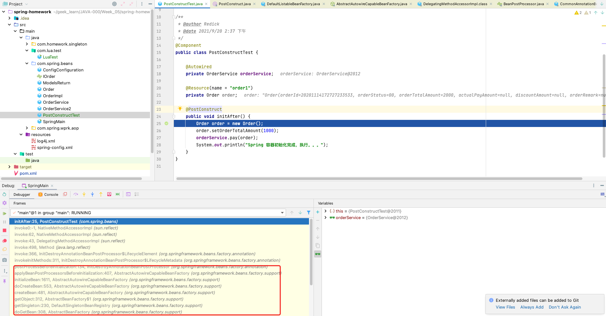

# Spring框架@PostConstruct注解详解 <!-- {docsify-ignore-all} -->


## 前言

&nbsp; &nbsp; 本文简单来看一下Spring框架@PostConstruct注解的原理。

## 业务背景


&nbsp; &nbsp; 在某些业务场景下我们需要程序在启动的时候就加载某些数据，比如，在程序启动的过程中需要从数据库中加载数据并缓存到程序的内存中。

### 通过依赖查找实现

&nbsp; &nbsp; 针对这个场景最直观的做法是我在容器的启动过程当中，通过`依赖查找`的方式获取到mapper，然后从数据库中获取数据并缓存到内存中。实现方式如下：

```java

@Slf4j
public class MainClass {

    public static ClassPathXmlApplicationContext context = null;

    private static CountDownLatch shutdownLatch = new CountDownLatch(1);

    public static void main(String[] args) throws Exception {
        // 加载spring上下文
        context = new ClassPathXmlApplicationContext(new String[]{"spring-config.xml"});
        context.start();
        // 从数据库获取数据并缓存到内存
        // 1.从容器中获取mapper
        ItpcsConfigMapper itpcsConfigMapper = (ItpcsConfigMapper) context.getBean("itpcsConfigMapper");
        // 2.从数据库中获取数据
        List<ItpcsConfig> RuleResultSet = itpcsConfigMapper.selectAll();
        // 3.将数据加载到PropertyMap中
        RuleResultSet.forEach(itpcsConfig -> PropertyMap.add(itpcsConfig.getName(), itpcsConfig.getValue()));
        
        context.registerShutdownHook();
        log.info(LogUtil.marker(), "System already started.");
        shutdownLatch.await();
    }
}
```

这么实现的确也没问题，但是如果有一种更加优雅的实现那就更好了，这个时候`@PostConstruct`注解就登场了。

### `@PostConstruct`注解实现


```java
@Slf4j
@Component
public class InitConfigParameter {


    @Resource
    private ItpcsConfigMapper itpcsConfigMapper;
 
    @PostConstruct
    public void init() throws Exception {
        // 将数据库中的参数加载到哈希表中
        List<ItpcsConfig> RuleResultSet = itpcsConfigMapper.selectAll();
        log.info(LogUtil.marker(RuleResultSet), "init propertyMap");
        RuleResultSet.forEach(itpcsConfig -> PropertyMap.add(itpcsConfig.getName(), itpcsConfig.getValue()));
    }
}
```

&nbsp; &nbsp; 使用`@PostConstruct`注解修饰的init方法就会在Spring容器的启动时自动的执行，下面我们看一下`@PostConstruct`注解是做和做到的这个能力。

## @PostConstruct注解原理

### `@PostConstruct`注解

```java
/**
 * The PostConstruct annotation is used on a method that needs to be executed
 * after dependency injection is done to perform any initialization. This
 * method MUST be invoked before the class is put into service. This
 * annotation MUST be supported on all classes that support dependency
 * injection. The method annotated with PostConstruct MUST be invoked even
 * if the class does not request any resources to be injected. Only one
 * method can be annotated with this annotation. The method on which the
 * PostConstruct annotation is applied MUST fulfill all of the following
 *
 * 省略...
 */
@Documented
@Retention (RUNTIME)
@Target(METHOD)
public @interface PostConstruct {
}
```

&nbsp; &nbsp; `@PostConstruct`注解的源码注释文档描述了该注解的功能：描述了这个注解被用于需要在依赖注入完成后执行的方法上。其他注释描述了一些该注解的必要条件；那么他究竟是如何实现的在依赖注入完成后执行方法呢，下面我们通过简单测试和源码一起分析一下。

### `@PostConstruct`注解源码分析

&nbsp; &nbsp; 一开始，根本无从下手，根本不知道看哪部分的源码，所以这里我们要debug一下被`@PostConstruct`注解修饰的方法，然后根据`idea`上的debug调用链看一下方法调用流程来进行追溯源头，示例代码，debug过程如下：

#### **示例代码**

&nbsp; &nbsp; 示例代码中的`OrderService`和`Order`为测试依赖注入顺序的，这里先不考虑，后面再说。

```java
@Component
public class PostConstructTest {

    @Autowired
    private OrderService orderService;

    @Resource(name = "order1")
    private Order order;

    @PostConstruct
    public void initAfter() {
        Order order = new Order();
        order.setOrderTotalAmount(1000);
        orderService.pay(order);
        System.out.println("Spring 容器初始化完成，执行。。。");
    }
}
```

&nbsp; &nbsp; 从debug图中能够看出，`@PostConstruct`注解修饰的方法也是在创建bean，初始化bean的过程中执行的，具体执行从debug的调用链上来看初步判定是反射实现的。




#### **源码分析**

> **CommonAnnotationBeanPostProcessor#postProcessMergedBeanDefinition**

&nbsp; &nbsp; 我们先忽略bean创建示例和初始化等过程，先定位到`CommonAnnotationBeanPostProcessor#postProcessMergedBeanDefinition`方法，别问我是咋定位的，我也是debug和启动日志的搜索定位到的。该方法调用其父类的`postProcessMergedBeanDefinition`，其父类是`InitDestroyAnnotationBeanPostProcessor`，从调用链中也能够看出。这里要注意一下`CommonAnnotationBeanPostProcessor`的构造方法，可以看到构造方法中初始化了initAnnotationType和destroyAnnotationType，initAnnotationType初始化的值就是PostConstruct注解的类，后面就会用到了。


```java
	public CommonAnnotationBeanPostProcessor() {
		setOrder(Ordered.LOWEST_PRECEDENCE - 3);
		setInitAnnotationType(PostConstruct.class);
		setDestroyAnnotationType(PreDestroy.class);
		ignoreResourceType("javax.xml.ws.WebServiceContext");
	}

	@Override
	public void postProcessMergedBeanDefinition(RootBeanDefinition beanDefinition, Class<?> beanType, String beanName) {
		super.postProcessMergedBeanDefinition(beanDefinition, beanType, beanName);
		if (beanType != null) {
			InjectionMetadata metadata = findResourceMetadata(beanName, beanType, null);
			metadata.checkConfigMembers(beanDefinition);
		}
	}
```

> **InitDestroyAnnotationBeanPostProcessor#postProcessMergedBeanDefinition**

下面代码做了以下几件事：

1. `postProcessMergedBeanDefinition`方法获取bean生命周期元数据`findLifecycleMetadata`负责具体的获取元数据的流程。
2. `findLifecycleMetadata`方法先从lifecycleMetadataCache缓存中获取元数据，获取不到就掉用`buildLifecycleMetadata`构造元数据，我这里`lifecycleMetadataCache`缓存不为空，往下走，从缓存中根据`Class`获取，获取不到的话掉用`buildLifecycleMetadata`构造元数据并且放到缓存中，这里用到了双重检查+对象锁的方式来解决并发问题。
						if (method.getAnnotation(initAnnotationType) != null) {
3. `buildLifecycleMetadata`方法构造bean生命周期元数据，这里用了do-while循环来构建`LifecycleElement`，跳出循环的触发条件是`targetClass`等于null或者是Object类，循环中的`ReflectionUtils.doWithLocalMethods`中的`doWith`回掉方法负责初始化`LifecycleElement`，`initAnnotationType`和`destroyAnnotationType`分别在`CommonAnnotationBeanPostProcessor`的构造方法中初始化的`@PostConstruct`和`@PreDestroy`注解，简单来说这里主要构造bean生命周期元数据并将`@PostConstruct`和`@PreDestroy`注解修饰的方法记录到bean生命周期元数据中。

```java
	@Override
	public void postProcessMergedBeanDefinition(RootBeanDefinition beanDefinition, Class<?> beanType, String beanName) {
		if (beanType != null) {
			LifecycleMetadata metadata = findLifecycleMetadata(beanType);
			metadata.checkConfigMembers(beanDefinition);
		}
	}

	private LifecycleMetadata findLifecycleMetadata(Class<?> clazz) {
		if (this.lifecycleMetadataCache == null) {
			// Happens after deserialization, during destruction...
			return buildLifecycleMetadata(clazz);
		}
		// Quick check on the concurrent map first, with minimal locking.
		LifecycleMetadata metadata = this.lifecycleMetadataCache.get(clazz);
		if (metadata == null) {
			synchronized (this.lifecycleMetadataCache) {
				metadata = this.lifecycleMetadataCache.get(clazz);
				if (metadata == null) {
					metadata = buildLifecycleMetadata(clazz);
					this.lifecycleMetadataCache.put(clazz, metadata);
				}
				return metadata;
			}
		}
		return metadata;
	}

	private LifecycleMetadata buildLifecycleMetadata(final Class<?> clazz) {
		final boolean debug = logger.isDebugEnabled();
		LinkedList<LifecycleElement> initMethods = new LinkedList<LifecycleElement>();
		LinkedList<LifecycleElement> destroyMethods = new LinkedList<LifecycleElement>();
		Class<?> targetClass = clazz;

		do {
			final LinkedList<LifecycleElement> currInitMethods = new LinkedList<LifecycleElement>();
			final LinkedList<LifecycleElement> currDestroyMethods = new LinkedList<LifecycleElement>();

			ReflectionUtils.doWithLocalMethods(targetClass, new ReflectionUtils.MethodCallback() {
				@Override
				public void doWith(Method method) throws IllegalArgumentException, IllegalAccessException {
					if (initAnnotationType != null) {
						if (method.getAnnotation(initAnnotationType) != null) {
							LifecycleElement element = new LifecycleElement(method);
							currInitMethods.add(element);
							if (debug) {
								logger.debug("Found init method on class [" + clazz.getName() + "]: " + method);
							}
						}
					}
					if (destroyAnnotationType != null) {
						if (method.getAnnotation(destroyAnnotationType) != null) {
							currDestroyMethods.add(new LifecycleElement(method));
							if (debug) {
								logger.debug("Found destroy method on class [" + clazz.getName() + "]: " + method);
							}
						}
					}
				}
			});

			initMethods.addAll(0, currInitMethods);
			destroyMethods.addAll(currDestroyMethods);
			targetClass = targetClass.getSuperclass();
		}
		while (targetClass != null && targetClass != Object.class);

		return new LifecycleMetadata(clazz, initMethods, destroyMethods);
	}
```

> **检查依赖注入**

&nbsp; &nbsp; 我的测试代码中注入了`orderService`和`order1`，创建`PostConstructTest`实例并构建了bean的生命周期元数据后进行bean的属性赋值和初始化，并且会检查依赖注入情况，发现依赖了`orderService`和`order1`会对其进行依赖注入。如果需要注入的bean没有被创建，会先创建和初始化需要被注入的bean，这里先不细说这部分，感兴趣的同学可以自行debug研究以下的元吗，下面的元吗省略了其他的代码，只保留了属性赋值的入口和bean初始化的入口。

```java
try {

    省略...

    // 属性赋值
	populateBean(beanName, mbd, instanceWrapper);
	if (exposedObject != null) {
        // bean初始化
		exposedObject = initializeBean(beanName, exposedObject, mbd);
	}

    省略...

}
```

> **PostConstructTest初始化完成掉用@PostConstruct注解修饰的方法**

- **AbstractAutowireCapableBeanFactory#applyBeanPostProcessorsBeforeInitialization**

```java
	@Override
	public Object applyBeanPostProcessorsBeforeInitialization(Object existingBean, String beanName)
			throws BeansException {

		Object result = existingBean;
		for (BeanPostProcessor processor : getBeanPostProcessors()) {
			result = processor.postProcessBeforeInitialization(result, beanName);
			if (result == null) {
				return result;
			}
		}
		return result;
	}
```

- **InitDestroyAnnotationBeanPostProcessor#postProcessBeforeInitialization方法**

&nbsp; &nbsp; 这里通过`CommonAnnotationBeanPostProcessor`掉用到`InitDestroyAnnotationBeanPostProcessor#postProcessBeforeInitialization`方法，该方法主要的逻辑是通过bean的声明周期元数据`LifecycleMetadata`的`invokeInitMethods`方法来通过反射调用`@PostConstruct`和`@PreDestroy`注解来修饰的方法。

```java
	@Override
	public Object postProcessBeforeInitialization(Object bean, String beanName) throws BeansException {
		LifecycleMetadata metadata = findLifecycleMetadata(bean.getClass());
		try {
            // 调用`@PostConstruct`和`@PreDestroy`注解来修饰的方法
			metadata.invokeInitMethods(bean, beanName);
		}
		catch (InvocationTargetException ex) {
			throw new BeanCreationException(beanName, "Invocation of init method failed", ex.getTargetException());
		}
		catch (Throwable ex) {
			throw new BeanCreationException(beanName, "Failed to invoke init method", ex);
		}
		return bean;
	}
```

- **LifecycleMetadata#invokeInitMethods方法**

&nbsp; &nbsp; 该方法主要就是遍历`initMethodsToIterate`反射调用方法。

```java
		public void invokeInitMethods(Object target, String beanName) throws Throwable {
			Collection<LifecycleElement> initMethodsToIterate =
					(this.checkedInitMethods != null ? this.checkedInitMethods : this.initMethods);
			if (!initMethodsToIterate.isEmpty()) {
				boolean debug = logger.isDebugEnabled();
				for (LifecycleElement element : initMethodsToIterate) {
					if (debug) {
						logger.debug("Invoking init method on bean '" + beanName + "': " + element.getMethod());
					}
                    // LifecycleElement element
					element.invoke(target);
				}
			}
		}
```

- **LifecycleElement#invoke方法**

&nbsp; &nbsp; 反射调用`@PostConstruct`和`@PreDestroy`注解来修饰的方法。

```java
		public void invoke(Object target) throws Throwable {
			ReflectionUtils.makeAccessible(this.method);
			this.method.invoke(target, (Object[]) null);
		}
```


## 总结

&nbsp; &nbsp; `@PostConstruct`注解的原理大致就分析完毕了，总结一下，在Spring容器刷新创建bean实例时会构建bean生命周期元数据，在元数据中会保存`@PostConstruct`和`@PreDestroy`注解修饰的方法，然后在bean属性赋值阶段会进行bean的依赖注入检查如果依赖的bean没有被创建则会创建依赖的bean并进行依赖注入，最后在bean的初始化过程中会执行`postProcessBeforeInitialization`方法，该方法在bean初始化之前执行，`postProcessBeforeInitialization`该方法会通过bean的声明周期元数据通过反射进行方法调用，这就实现了`@PostConstruct`注解的原理，`@PreDestroy`和`@PostConstruct`的原理类似这里就不过多介绍了。