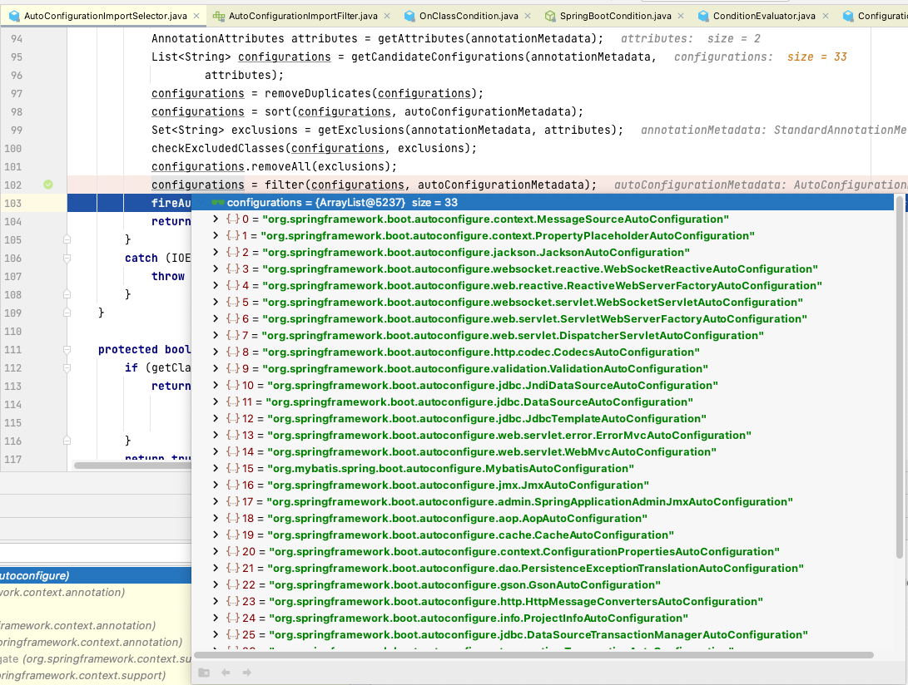

# SpringBoot自动装配 <!-- {docsify-ignore-all} -->

- 什么是SpringBoot自动装配
- SpringBoot怎么实现的自动装配


注：源码解析部分基于Spring5.0.4 SpringBoot版本为2.0.0.RELEASE


## 什么是SpringBoot自动装配

&nbsp; &nbsp; 在使用SpringBoot开发应用程序的时候我们能够极其快速的就搭建出一个可以丝滑运行的工程代码，这得益于SpringBoot的自动装配能力，但是对于自动装配，Spring Framework早就已经实现了这个功能，SpringBoot是在这个基础上做了优化，其机制就像是SPI。但是大多数的开发人员可能仅仅听到过自动装配，并且一提到自动装配就想到SpringBoot，但究竟自动装配是怎么实现的呢？按需装配又是怎么一回事却没有深究其理。

> SpringBoot在启动的时候会扫描外部引用的jar包中/META-INF/spring.factories文件，然后根据文件中的配置加载到Spring容器中，对于外部的jar来说，要支持SpringBoot就按照SpringBoot自动装配的规范封装对应的starter即可。

&nbsp; &nbsp; 在使用Spring Framework搭建项目需要依赖第三方库时，除了要引入第三方的jar之外，还需要进行相应的配置，也许是xml配置，也许是java配置，总之这很麻烦，但如果使用SpringBoot，我们就只需要引入相应的starter并且在配置文件`application.properties`或`application.yml`文件中添加少量的配置即可，例如，项目中使用redis，那就直接在maven中引入`spring-boot-starter-data-redis`的starter然后再通过少量的注解或者配置就可以使用第三方组件了。


## SpringBoot怎么实现的自动装配


### 注解

&nbsp; &nbsp; 首先对于一个开发人员最直观的就是SpringBoot提供的自动装配注解`@EnableAutoConfiguration`，这个注解就是声明自动装配的，但是通常情况下我们都不使用这个注解，而是使用`@SpringBootApplication`这个注解，该注解使一个复合注解它是`@EnableAutoConfiguration`、`@ComponentScan`、`@SpringBootConfiguration`注解的集合，这三个注解的作用分别是，开启SpringBoot自动装配、扫描启动类所在包下所有被`@Service`,`@Component`,`@Controller`等注解修饰的Bean、在上下文注册bean一般修饰配置类。

&nbsp; &nbsp; `@EnableAutoConfiguration`注解是声明自动装配的，但是其实自动装配怎么实现的我们还是一头雾水，但是仔细看`@EnableAutoConfiguration`这个注解的代码其实能够发现，这个注解`@Import`了`AutoConfigurationImportSelector`这个类，`@Import`注解作用就是将`AutoConfigurationImportSelector`初始化到Spring上下文，所以`AutoConfigurationImportSelector`其实就是SpringBoot自动装配的一个实现了。下面我们通过分析下这个类。

### AutoConfigurationImportSelector.java

#### 该类的继承关系如下：

红框中的继承关系是实现自动装配的核心，其核心的接口是`ImportSelector`，`AutoConfigurationImportSelector`实现了该接口并且重写了`selectImports`方法，方法返回需要装配的类的全路径名的字符串数组。


#### **下面是AutoConfigurationImportSelector#selectImports具体实现的代码**

```java
    /**
    AnnotationMetadata 注解元数据
    */
    @Override
	public String[] selectImports(AnnotationMetadata annotationMetadata) {
        // 1. 是否开启自动装配开关
		if (!isEnabled(annotationMetadata)) {
			return NO_IMPORTS;
		}
		try {
            // 2.读取所有自动装配的bean的元数据
			AutoConfigurationMetadata autoConfigurationMetadata = AutoConfigurationMetadataLoader
					.loadMetadata(this.beanClassLoader);
            // 3.注解属性exclude和excludeName属性
			AnnotationAttributes attributes = getAttributes(annotationMetadata);
            // 4.读取spring-boot-autoconfigure包META-INF/spring.factories中所有自动装配的bean
			List<String> configurations = getCandidateConfigurations(annotationMetadata,
					attributes);
            // 5.去重
			configurations = removeDuplicates(configurations);
            // 6.根据@Order注解排序
			configurations = sort(configurations, autoConfigurationMetadata);
            // 7.排除指定不要需要自动装配的class
			Set<String> exclusions = getExclusions(annotationMetadata, attributes);
			checkExcludedClasses(configurations, exclusions);
			configurations.removeAll(exclusions);
            // 8.过滤自动装配的bean，做到按需装配
			configurations = filter(configurations, autoConfigurationMetadata);
			fireAutoConfigurationImportEvents(configurations, exclusions);
			return StringUtils.toStringArray(configurations);
		}
		catch (IOException ex) {
			throw new IllegalStateException(ex);
		}
	}
```

##### **第一步，自动装配开关是否开启**

1. 判读`spring.boot.enableautoconfiguration`配置，如果没有配置默认是true代表默认开启自动装配，否则如果显示配置了false就不进行自动装配返回一个空的字符串数组。

```java
    protected boolean isEnabled(AnnotationMetadata metadata) {
		if (getClass() == AutoConfigurationImportSelector.class) {
			// 1
			return getEnvironment().getProperty(
					EnableAutoConfiguration.ENABLED_OVERRIDE_PROPERTY, Boolean.class,
					true);
		}
		return true;
	}
```

##### **第二步，读取所有自动装配的bean**

1. 读取META-INF/spring-autoconfigure-metadata.properties中所有自动装配bean的元数据
2. 将读取到的所有自动装配的bean初始化到Properties中
3. 将所有自动装配的bean加载到AutoConfigurationMetadata

```java
	public static AutoConfigurationMetadata loadMetadata(ClassLoader classLoader) {
		return loadMetadata(classLoader, PATH);
	}

	static AutoConfigurationMetadata loadMetadata(ClassLoader classLoader, String path) {
		try {
			// 1. META-INF/spring-autoconfigure-metadata.properties
			Enumeration<URL> urls = (classLoader != null ? classLoader.getResources(path)
					: ClassLoader.getSystemResources(path));
			Properties properties = new Properties();
			while (urls.hasMoreElements()) {
				// 2
				properties.putAll(PropertiesLoaderUtils
						.loadProperties(new UrlResource(urls.nextElement())));
			}
			// 3
			return loadMetadata(properties);
		}
		catch (IOException ex) {
			throw new IllegalArgumentException(
					"Unable to load @ConditionalOnClass location [" + path + "]", ex);
		}
	}

	static AutoConfigurationMetadata loadMetadata(Properties properties) {
		return new PropertiesAutoConfigurationMetadata(properties);
	}

	...
```

##### **第三步，获取@EnableAutoConfiguration注解exclude和excludeName属性**

1. 获取@EnableAutoConfiguration注解name
2. 初始化exclude和excludeName属性，该属性是排除不需要自动装配的bean的配置

```java
    protected AnnotationAttributes getAttributes(AnnotationMetadata metadata) {
        // 1
		String name = getAnnotationClass().getName();
        // 2
		AnnotationAttributes attributes = AnnotationAttributes
				.fromMap(metadata.getAnnotationAttributes(name, true));
		Assert.notNull(attributes,
				"No auto-configuration attributes found. Is " + metadata.getClassName()
						+ " annotated with " + ClassUtils.getShortName(name) + "?");
		return attributes;
	}
```

##### **第四步，读取spring-boot-autoconfigure包META-INF/spring.factories中所有自动装配的bean**


简单的看一下下面的代码，下面的代码是从spring-boot-autoconfigure包META-INF/spring.factories获取自动装配bean的列表的过程。

```java
    protected List<String> getCandidateConfigurations(AnnotationMetadata metadata,
			AnnotationAttributes attributes) {
        // 1
		List<String> configurations = SpringFactoriesLoader.loadFactoryNames(
				getSpringFactoriesLoaderFactoryClass(), getBeanClassLoader());
		Assert.notEmpty(configurations,
				"No auto configuration classes found in META-INF/spring.factories. If you "
						+ "are using a custom packaging, make sure that file is correct.");
		return configurations;
	}

    public static List<String> loadFactoryNames(Class<?> factoryClass, @Nullable ClassLoader classLoader) {
		String factoryClassName = factoryClass.getName();
        // 2
		return loadSpringFactories(classLoader).getOrDefault(factoryClassName, Collections.emptyList());
	}

	private static Map<String, List<String>> loadSpringFactories(@Nullable ClassLoader classLoader) {
		MultiValueMap<String, String> result = cache.get(classLoader);
		if (result != null)
			return result;
		try {
            // 4
			Enumeration<URL> urls = (classLoader != null ?
					classLoader.getResources(FACTORIES_RESOURCE_LOCATION) :
					ClassLoader.getSystemResources(FACTORIES_RESOURCE_LOCATION));
			result = new LinkedMultiValueMap<>();
			while (urls.hasMoreElements()) {
				URL url = urls.nextElement();
				UrlResource resource = new UrlResource(url);
				Properties properties = PropertiesLoaderUtils.loadProperties(resource);
				for (Map.Entry<?, ?> entry : properties.entrySet()) {
					List<String> factoryClassNames = Arrays.asList(
							StringUtils.commaDelimitedListToStringArray((String) entry.getValue()));
					result.addAll((String) entry.getKey(), factoryClassNames);
				}
			}
			cache.put(classLoader, result);
			return result;
		}
		catch (IOException ex) {
			throw new IllegalArgumentException("Unable to load factories from location [" +
					FACTORIES_RESOURCE_LOCATION + "]", ex);
		}
	}
```

#### **第五步，自动装配bean去重**

这一步没什么好说的使用Set做去重。

```java
    protected final <T> List<T> removeDuplicates(List<T> list) {
		return new ArrayList<>(new LinkedHashSet<>(list));
	}
```

#### **第六步，根据@Order注解排序**

这一步也没什么好说的，根绝@Order注解将自动装配的Bean先排序

```java
    private List<String> sort(List<String> configurations,
			AutoConfigurationMetadata autoConfigurationMetadata) throws IOException {
		configurations = new AutoConfigurationSorter(getMetadataReaderFactory(),
				autoConfigurationMetadata).getInPriorityOrder(configurations);
		return configurations;
	}
```

#### **第七步，根据第三步exclude和excludeName属性排除指定不要需要自动装配的class**

这里也没什么好说的，根据第三步的exclude和excludeName得到一个要排除自动装配的bean的集合，然后removeAll移除

```java

    @Override
	public String[] selectImports(AnnotationMetadata annotationMetadata) {
		if (!isEnabled(annotationMetadata)) {
			return NO_IMPORTS;
		}
		try {
			...
			Set<String> exclusions = getExclusions(annotationMetadata, attributes);
			checkExcludedClasses(configurations, exclusions);
			configurations.removeAll(exclusions);
			...
		}
		catch (IOException ex) {
			throw new IllegalStateException(ex);
		}
	}

    protected Set<String> getExclusions(AnnotationMetadata metadata,
			AnnotationAttributes attributes) {
		Set<String> excluded = new LinkedHashSet<>();
		excluded.addAll(asList(attributes, "exclude"));
		excluded.addAll(Arrays.asList(attributes.getStringArray("excludeName")));
		excluded.addAll(getExcludeAutoConfigurationsProperty());
		return excluded;
	}
```

#### **第八步，过滤不需要自动装配的bean，做到按需装配**

&nbsp; &nbsp; 在这个步骤中，会过滤掉不需要自动装配的bean，我们会发现`configurations`变小了，这里过滤的流程比较复杂，这其中核心逻辑基本都是现在`OnClassCondition`和`SpringBootCondition`类中，具体的逻辑由于特别多我们忽略掉，可以看到过滤后需要自动装配的bean由110个剩下了33个。



&nbsp; &nbsp; 这里实现过滤自动装配bean的核心是`@ConditionalOnXXX`注解，只有满足配置类的`@ConditionalOnXXX`条件才会实现自动装配，再实现自定义的starter时，我们也可以使用这个方案来实现自动装配。这里以Redis配置的自动装配来看一下；

1. `@ConditionalOnClass(RedisOperations.class)`该代码意思是检查`RedisOperations`是否存在，存在了才会加载，否则不会加载
2. 2和3是同一个注解，意思是，只有当括号中配置的bean不存在时才会加载，这样做的目的是有时候我们会自己写配置而不用自动装配的配置，这么做目的是为了防止重复加载。

```java
@Configuration
// 1 
@ConditionalOnClass(RedisOperations.class)
@EnableConfigurationProperties(RedisProperties.class)
@Import({ LettuceConnectionConfiguration.class, JedisConnectionConfiguration.class })
public class RedisAutoConfiguration {

	@Bean
	// 2
	@ConditionalOnMissingBean(name = "redisTemplate")
	public RedisTemplate<Object, Object> redisTemplate(
			RedisConnectionFactory redisConnectionFactory) throws UnknownHostException {
		RedisTemplate<Object, Object> template = new RedisTemplate<>();
		template.setConnectionFactory(redisConnectionFactory);
		return template;
	}

	@Bean
	// 3
	@ConditionalOnMissingBean(StringRedisTemplate.class)
	public StringRedisTemplate stringRedisTemplate(
			RedisConnectionFactory redisConnectionFactory) throws UnknownHostException {
		StringRedisTemplate template = new StringRedisTemplate();
		template.setConnectionFactory(redisConnectionFactory);
		return template;
	}

}
```

&nbsp; &nbsp; 下面介绍一下所有有关自动装配bean过滤的`@ConditionalOnXXX`注解。

- **@ConditionalOnBean**：当容器里有指定 Bean 的条件下
- **@ConditionalOnMissingBean**：当容器里没有指定 Bean 的情况下
- **@ConditionalOnSingleCandidate**：当指定 Bean 在容器中只有一个，或者虽然有多个但是指定首选 Bean
- **@ConditionalOnClass**：当类路径下有指定类的条件下
- **@ConditionalOnMissingClass**：当类路径下没有指定类的条件下
- **@ConditionalOnProperty**：指定的属性是否有指定的值
- **@ConditionalOnResource**：类路径是否有指定的值
- **@ConditionalOnExpression**：基于 SpEL 表达式作为判断条件
- **@ConditionalOnJava**：基于 Java 版本作为判断条件
- **@ConditionalOnJndi**：在 JNDI 存在的条件下差在指定的位置
- **@ConditionalOnNotWebApplication**：当前项目不是 Web 项目的条件下
- **@ConditionalOnWebApplication**：当前项目是 Web 项 目的条件下


## 总结

&nbsp; &nbsp; SpringBoot通过`@EnableAutoConfiguration`注解声明开启自动装配，`@SpringBootApplication`注解是一个注解的组合，它包含了`@EnableAutoConfiguration`，SpringBoot自动装配的核心是现是在`AutoConfigurationImportSelector#selectImports`方法中，其实现了`ImportSelector`接口并重写了`selectImports`方法，自动装配的的大致步骤是通过`SpringFactoriesLoader`扫描部引用的jar包中/META-INF/spring.factories文件文件，然后去重，排除等操作，最后进行按需装配，其按需装配的实现是基于`@Conditional`注解，例如`@ConditionalOnBean`注解表示在容器中存在指定的bean或者存在指定的类才会加载，否则就会过滤掉。