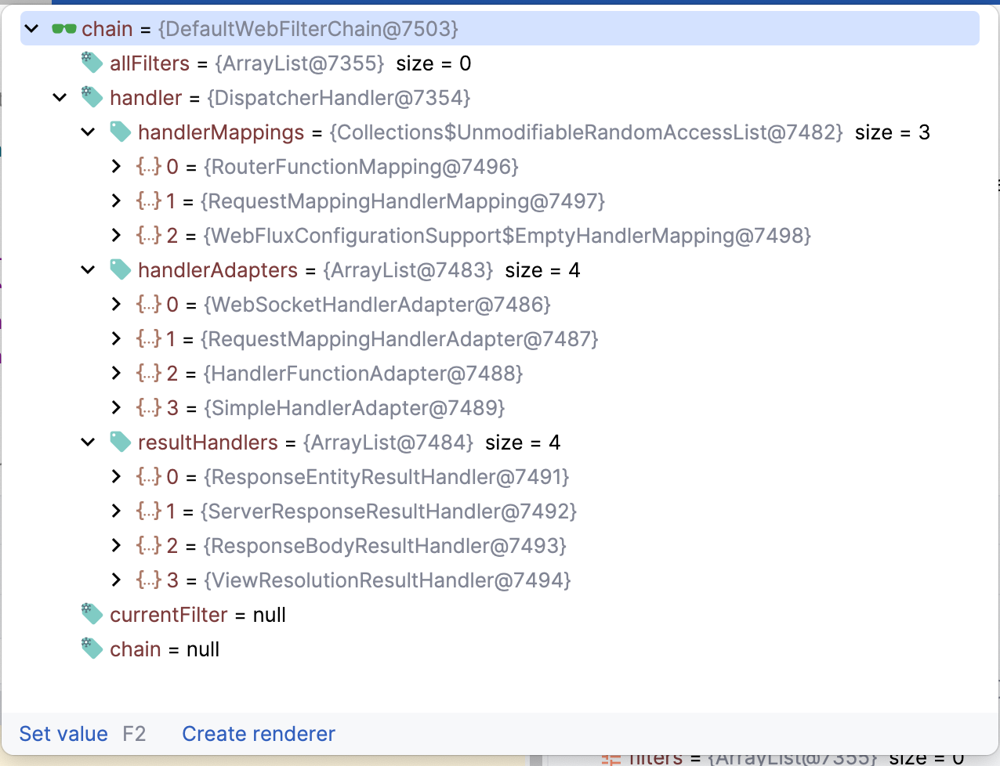

# Spring WebFlux处理请求过程 <!-- {docsify-ignore-all} -->


### Web过滤器链构造

​    服务启动过程中构造DefaultWebFilterChain链，DefaultWebFilterChain成员变量中最重要的就是WebHandler，WebHandler实现是DispatcherHandler，DefaultWebFilterChain的数据如下：




### 请求梳理流程

##### 顺序

​    DefaultWebFilterChain#filter->DispatcherHandler#handle->AbstractHandlerMapping#getHandler->DispatcherHandler#invokeHandler->HandlerFunctionAdapter#handle->业务的Hander


##### DefaultWebFilterChain#filter

```java
	@Override
	public Mono<Void> filter(ServerWebExchange exchange) {
		return Mono.defer(() ->
				this.currentFilter != null && this.chain != null ?
						invokeFilter(this.currentFilter, this.chain, exchange) :
						this.handler.handle(exchange));// 走DispatcherHandler的handler方法
	}
```


##### DispatcherHandler#handle

```java
	@Override
	public Mono<Void> handle(ServerWebExchange exchange) {
		if (this.handlerMappings == null) {
			return createNotFoundError();
		}
		if (CorsUtils.isPreFlightRequest(exchange.getRequest())) {
			return handlePreFlight(exchange);
		}
		return Flux.fromIterable(this.handlerMappings)
				.concatMap(mapping -> mapping.getHandler(exchange)) // AbstractHandlerMapping#getHandler获取到具体handler
				.next()
				.switchIfEmpty(createNotFoundError())
				.flatMap(handler -> invokeHandler(exchange, handler))
				.flatMap(result -> handleResult(exchange, result));
	}
```


##### AbstractHandlerMapping#getHandler

```java
	@Override
	public Mono<Object> getHandler(ServerWebExchange exchange) {
    // getHandlerInternal会走到子类RouterFunctionMapping获取到具体的Handler
		return getHandlerInternal(exchange).map(handler -> {
			if (logger.isDebugEnabled()) {
				logger.debug(exchange.getLogPrefix() + "Mapped to " + handler);
			}
			ServerHttpRequest request = exchange.getRequest();
			if (hasCorsConfigurationSource(handler) || CorsUtils.isPreFlightRequest(request)) {
				CorsConfiguration config = (this.corsConfigurationSource != null ?
						this.corsConfigurationSource.getCorsConfiguration(exchange) : null);
				CorsConfiguration handlerConfig = getCorsConfiguration(handler, exchange);
				config = (config != null ? config.combine(handlerConfig) : handlerConfig);
				if (config != null) {
					config.validateAllowCredentials();
				}
				if (!this.corsProcessor.process(config, exchange) || CorsUtils.isPreFlightRequest(request)) {
					return NO_OP_HANDLER;
				}
			}
			return handler;
		});
	}
```


##### DispatcherHandler#invokeHandler

​    获取到具体Handler后，通过DispatcherHandler#invokeHandler去调用

```java
	private Mono<HandlerResult> invokeHandler(ServerWebExchange exchange, Object handler) {
		if (ObjectUtils.nullSafeEquals(exchange.getResponse().getStatusCode(), HttpStatus.FORBIDDEN)) {
			return Mono.empty();  // CORS rejection
		}
		if (this.handlerAdapters != null) {
			for (HandlerAdapter handlerAdapter : this.handlerAdapters) {
				if (handlerAdapter.supports(handler)) {
          // 这里实际执行的Adapter是HandlerFunctionAdapter，因为我们配置的是RouterFunction
					return handlerAdapter.handle(exchange, handler);
				}
			}
		}
		return Mono.error(new IllegalStateException("No HandlerAdapter: " + handler));
	}
```


##### HandlerFunctionAdapter#handle

```java
	@Override
	public Mono<HandlerResult> handle(ServerWebExchange exchange, Object handler) {
    // HandlerFunction是处理请求的handler接口，这里的handlerFunction实际就是我们@Bean配置的HandlerFunction
		HandlerFunction<?> handlerFunction = (HandlerFunction<?>) handler;
		ServerRequest request = exchange.getRequiredAttribute(RouterFunctions.REQUEST_ATTRIBUTE);
    // 这里就调用到了我们用来处理这个网络请求自己写的业务handler
		return handlerFunction.handle(request)
				.map(response -> new HandlerResult(handlerFunction, response, HANDLER_FUNCTION_RETURN_TYPE));// 处理结果
	}
```


##### WebFlux配置

```java
@Configuration
public class WebConfiguration {

    // 配置RouterFunction
    @Bean
    public RouterFunction<ServerResponse> route(@NonNull ProxyReactiveWebHandler webHandler) {
        return RouterFunctions.route(POST("/ruuby-push-proxy/message/push/v0").and(accept(APPLICATION_JSON)), webHandler::sendMessage);
    }
}
```


##### 业务的Hander

```java
@Component
@Slf4j
public class ProxyReactiveWebHandler {

    @Resource
    private RedisRegistry redisRegistry;

    @LogMarker(businessDescription = "proxy-推送消息")
    public Mono<ServerResponse> sendMessage(ServerRequest request) {
        Mono<SendMessageRequest> requestMono = request.bodyToMono(SendMessageRequest.class);
        return ServerResponse.ok()
                .contentType(MediaType.APPLICATION_JSON)
                .body(requestMono.flatMap(this::ret), SendMessageResponse.class);
    }

    private Mono<SendMessageResponse> ret(SendMessageRequest request) {
        Mono<Protocol> protocolMono = redisRegistry.discovery(request.getUserID());
        return protocolMono.flatMap(protocol -> {
            try {
                return Mono.just(OkHttp3Util.doPost(protocol.getUri(), JsonUtil.toJsonStr(request)));
            } catch (IOException e) {
                return Mono.error(new RuntimeException(e));
            }
        }).flatMap(r -> Mono.just(JsonUtil.toJavaBean(SendMessageResponse.class, r)))
                .switchIfEmpty(Mono.defer(() -> {
                    log.info(LogUtil.marker(), "未发现WebSocket链接");
                    return Mono.just(new SendMessageResponse("00000000", "成功", null));
                }));
    }
}

```


