# Spring WebFlux对比Spring MVC压测对比

## 目标

- 50 100 200 300 并发分别压测基于Spring WebFlux和Spring MVC的程序
- 总结

## 准备工作

- 准备一个基于Spring WebFlux和一个基于Spring MVC的工程
- apache-jmeter-3.3.2：压测工具
- jvisualVM：JVM指标监控

## 开始压测

### 指标1：50 并发，压测1分钟

- **Spring MVC**

- - jmeter压测报告

    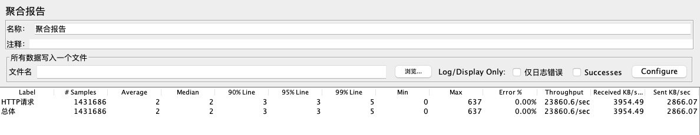

- - JVM监控

    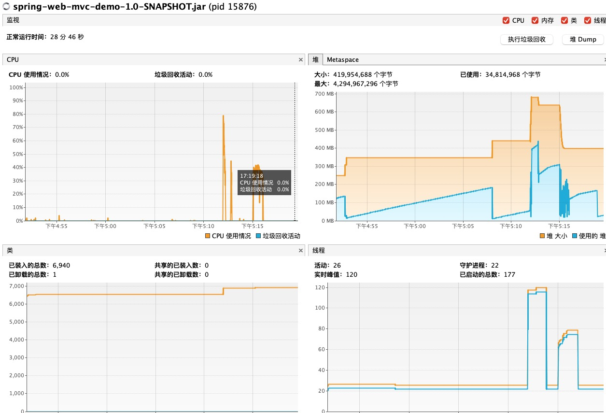 

- **Spring WebFlux**

- - jmeter压测报告

    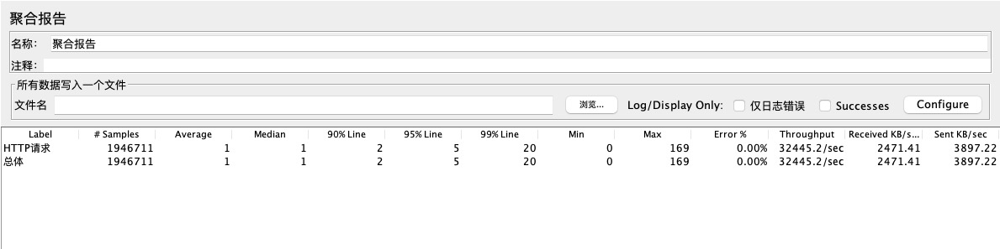

- - JVM监控

    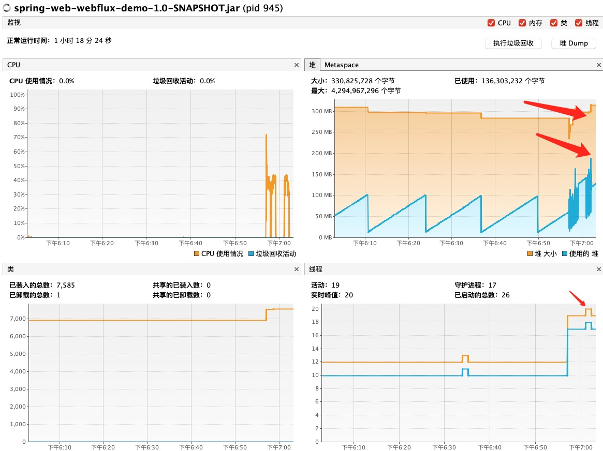 

 

### 指标2：100 并发，压测1分钟

- **Spring MVC**

- - jmeter压测报告

    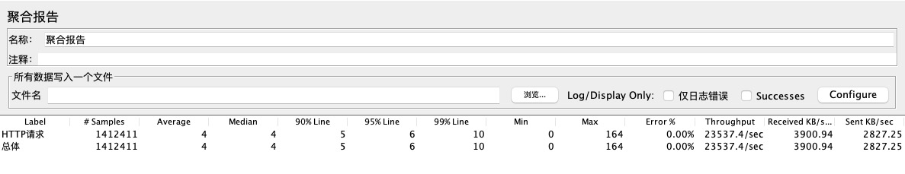

- - JVM监控

    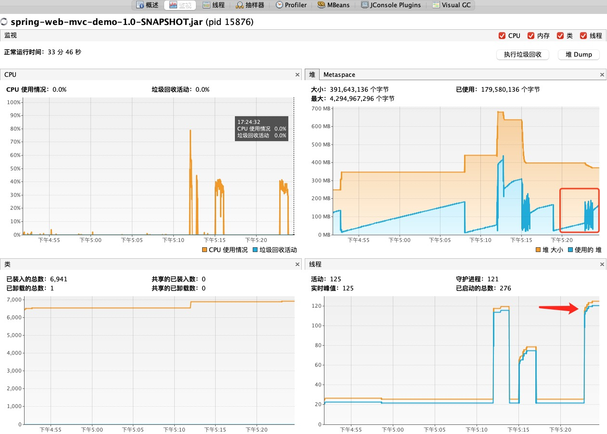 

- **Spring WebFlux**

- - jmeter压测报告

    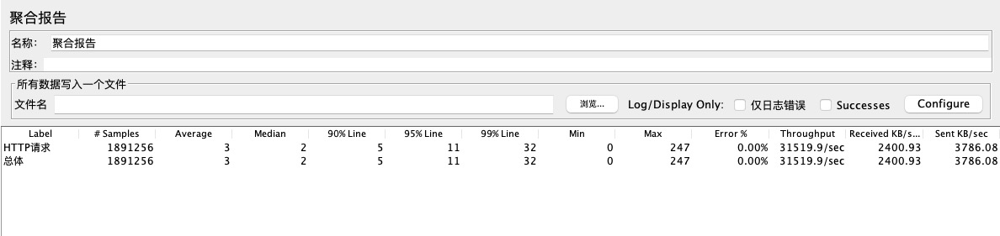

- - JVM监控

    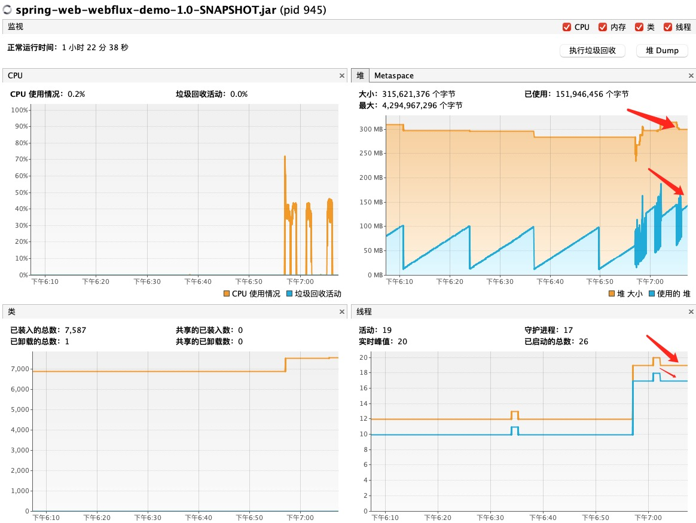 

 

### 指标3：200 并发，压测1分钟

- **Spring MVC**

- - jmeter压测报告

    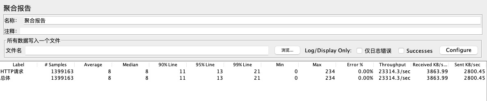

- - JVM监控

    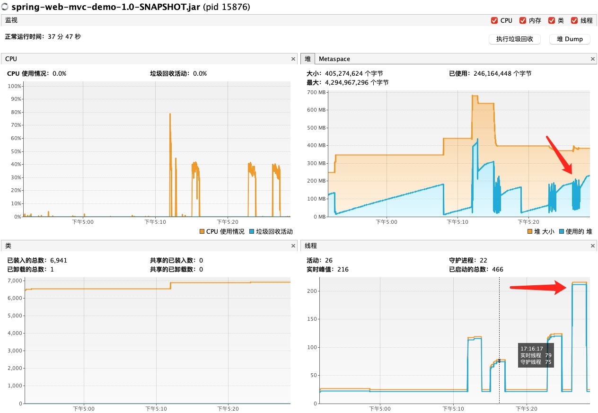 

- **Spring WebFlux**

- - jmeter压测报告

    

- - JVM监控

    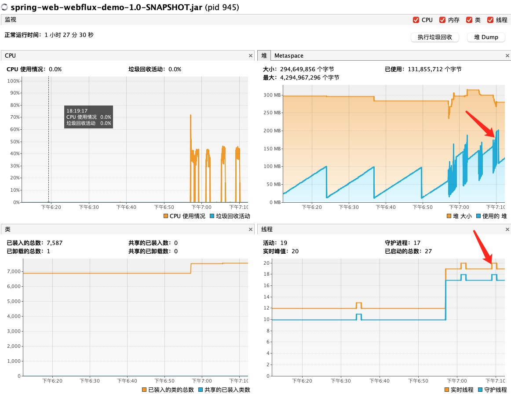 

 

### 指标4：300 并发，压测1分钟

- **Spring MVC**

- - jmeter压测报告

    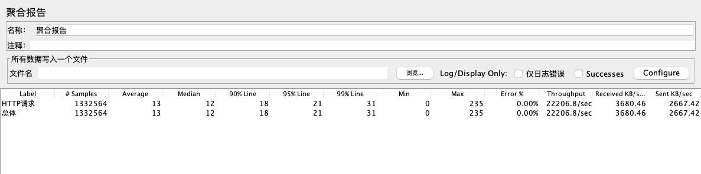

- - JVM监控

    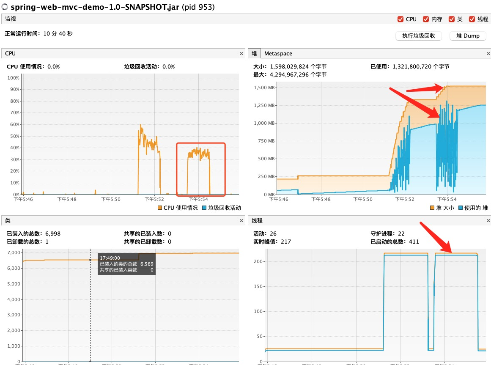 

- **Spring WebFlux**

- - jmeter压测报告

    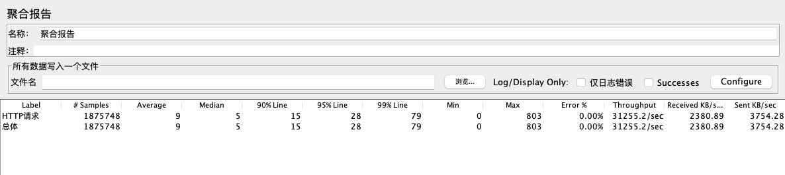

- - JVM监控

    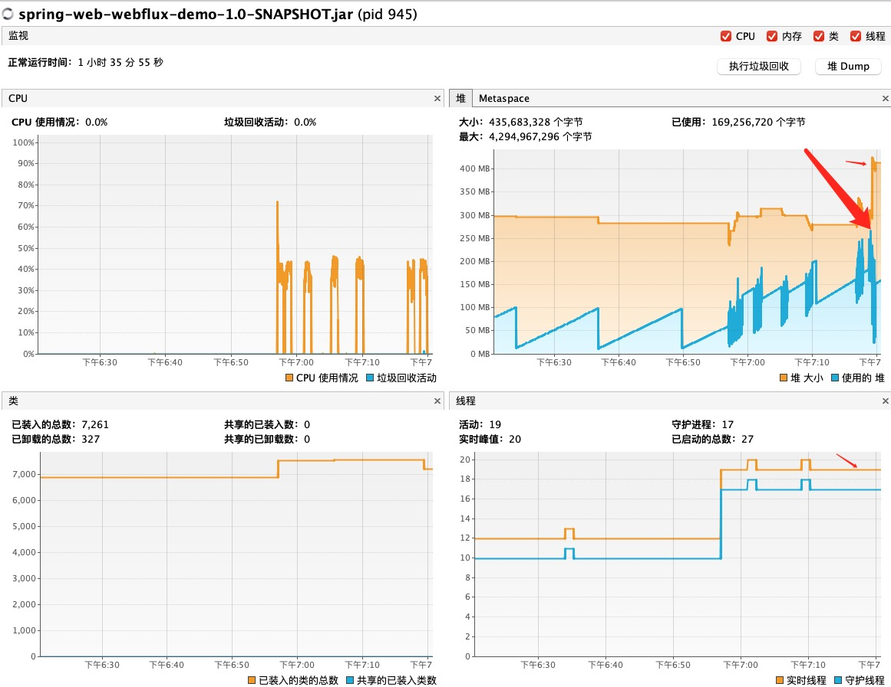 

## 总结

**Spring WebFlux 压测数据统计**

| 指标 | 总请求数 | TPS | 最大响应时间 | 最小响应时间 | 平均响应时间 | 最大堆大小 | CPU | Max Thread Number |
| --- | --- | --- | --- | --- | --- | --- | --- | --- |
| 50并发/分钟 | 1946711 | 32445.2 | 169 | 0 | 1 | 310M左右 | 44%左右 | 20 |
| 100并发/分钟 | 1891256 | 31519.9 | 247 | 0 | 3 | 310M左右 | 46%左右 | 19 |
| 200并发/分钟 | 1920013 | 31995.4 | 285 | 0 | 6 | 280M左右 | 45%左右 | 20 |
| 300并发/分钟 | 1875748 | 31255.2 | 803 | 0 | 9 | 410M左右 | 45%左右 | 19 |

**Spring MVC 压测数据统计**

| 指标 | 总请求数 | TPS | 最大响应时间 | 最小响应时间 | 平均响应时间 | 最大堆大小 | CPU | Max Thread Number |
| --- | --- | --- | --- | --- | --- | --- | --- | --- |
| 50并发/分钟 | 1431685 | 23860.6 | 637 | 0 | 2 | 700M左右 | 42%左右 | 最高120 |
| 100并发/分钟 | 1412411 | 23537.4 | 164 | 0 | 4 | 400M左右 | 42%左右 | 最高125 |
| 200并发/分钟 | 1399163 | 23314.3 | 234 | 0 | 8 | 400左右 | 45%左右 | 最高216 |
| 300并发/分钟 | 1332564 | 22206.8 | 235 | 0 | 13 | 最高达到了1.5GB以上 | 41%左右 | 最高217 |

**结论**

&nbsp; &nbsp; 在未进行任何参数调优的情况下，四次压测结果显示Spring WebFlux性能更优秀，单位时间处理请求数更多，TPS更高（高很多，提高35%以上），并且，在内存使用和线程资源上也更加优秀，Spring WebFlux在四次压测中处理任务的线程数几乎是不变的，只有十几个，而Spring MVC并发越高创建的任务线程也越多，这都得益于Spring WebFlux使用的Netty+Reactor异步非阻塞的模式。