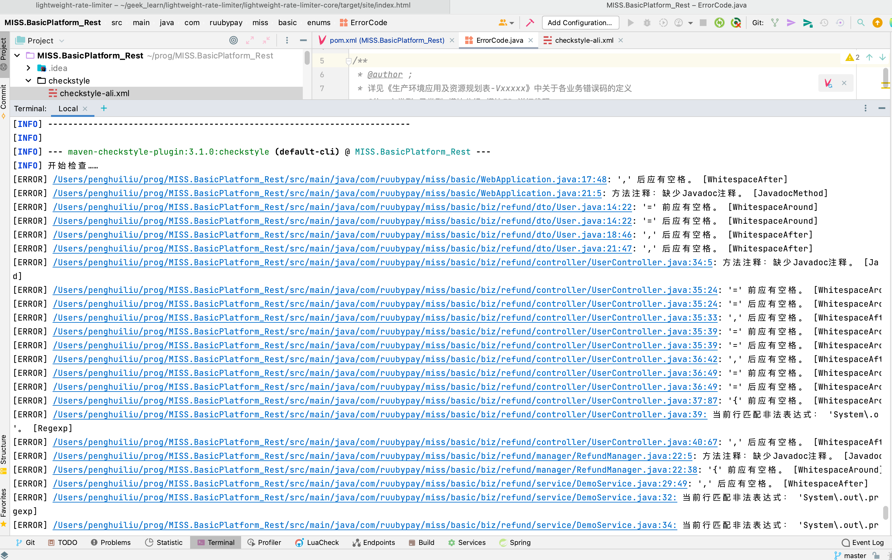

# 使用Checkstyle规范项目 <!-- {docsify-ignore-all} -->

## 什么是Checkstyle

&nbsp; &nbsp; `Checkstyle`是一种开发工具，帮助程序员编写符合编码标准的`Java`代码。它自动化了检查`Java`代码的过程，从而使人们避免了这项无聊(但重要)的任务。这使它成为希望实施编码标准的项目的理想选择。`Checkstyle`是高度可配置的，并且可以支持几乎任何编码标准。提供了一个支持Sun代码规范和谷歌Java风格的示例配置文件。

## 使用Checkstyle目的

&nbsp; &nbsp; 养成好的编码习惯，统一编码风格，规范代码增强可读性，对bug提前预警。

## Checkstyle官网地址

https://checkstyle.sourceforge.io/index.html

在这里可以找到所有配置的详解。

## checkstyle plugin与checkstyle的版本对应关系

http://maven.apache.org/plugins/maven-checkstyle-plugin/history.html

## 在项目中使用

### Manve配置

配置`reporting`生成`checkstyle`报表，`reporting`标签用于`site`阶段，使用`mvn site`命令即可生成相关报表，平时开发过程中可以不使用报表，一个大项目生成报表很耗时

```xml
    <reporting>
        <plugins>
            <plugin>
                <groupId>org.apache.maven.plugins</groupId>
                <artifactId>maven-checkstyle-plugin</artifactId>
                <version>3.1.0</version>
                <reportSets>
                    <reportSet>
                        <reports>
                            <report>checkstyle</report>
                        </reports>
                    </reportSet>
                </reportSets>
            </plugin>
        </plugins>
    </reporting>
```

配置`checkstyle`插件，使用`mvn checkstyle:checkstyle`或`mvn clean install`都会进行个格式检查。

```xml
    <build>
        <pluginManagement>
            <plugins>
                <!-- compiler在maven声明周期内置，所以后面不用声明也可使用 -->
                <plugin>
                    <groupId>org.apache.maven.plugins</groupId>
                    <artifactId>maven-compiler-plugin</artifactId>
                    <version>3.7.0</version>
                    <configuration>
                        <source>${maven.compiler.source}</source>
                        <target>${maven.compiler.target}</target>
                        <encoding>UTF-8</encoding>
                    </configuration>
                </plugin>
                <!-- 公共checkstyle标准配置，可以在子模块中覆盖，修改自定义选项 -->
                <plugin>
                    <groupId>org.apache.maven.plugins</groupId>
                    <artifactId>maven-checkstyle-plugin</artifactId>
                    <version>3.1.0</version>
                    <configuration>
                        <!-- checkstyle配置文件位置 -->
                        <configLocation>checkstyle/checkstyle-ali.xml</configLocation>
                        <includeTestSourceDirectory>false</includeTestSourceDirectory>
                        <consoleOutput>true</consoleOutput>
                        <encoding>UTF-8</encoding>
                        <skip>false</skip>
                        <!--这里是说当前这个配置是什么错误级别。如果配置的是error，那么扫描到不符合条件的，就是打印error。checkstyle里允许的错误级别有error, warning, info. -->
                        <violationSeverity>error</violationSeverity>
                        <!-- 是否打断命令执行，错误的时候会停止。否则，错误会生成报告，但不会阻止命令执行。 -->
                        <failsOnError>false</failsOnError>
                    </configuration>
                    <executions>
                        <execution>
                            <id>validate</id>
                            <phase>validate</phase>
                            <goals>
                                <goal>checkstyle</goal>
                            </goals>
                        </execution>
                    </executions>
                </plugin>
            </plugins>
        </pluginManagement>
        <plugins>
            <!--所有子模块都要执行的plugin-->
            <plugin>
                <groupId>org.apache.maven.plugins</groupId>
                <artifactId>maven-checkstyle-plugin</artifactId>
            </plugin>
            <plugin>
                <groupId>org.apache.maven.plugins</groupId>
                <artifactId>maven-site-plugin</artifactId>
                <version>3.7.1</version>
            </plugin>
        </plugins>
    </build>
```

### 使用Checkstyle进行代码格式检查

#### 使用mvn checkstyle:checkstyle进行个时间查

```powershell
➜  MISS.BasicPlatform_Rest git:(master) ✗ mvn checkstyle:checkstyle
```

执行检查命令后如有格式不符合规范会提示

 


#### mvn site检查并生成报表

```shell
➜  MISS.BasicPlatform_Rest git:(master) ✗ mvn site
```

这种方式会生成项目的报表，包括依赖，项目结构，项目代码格式规范等等，生成的报表就是html的静态页面，如下：

注：这种方式会非常耗时，不建议使用

 
