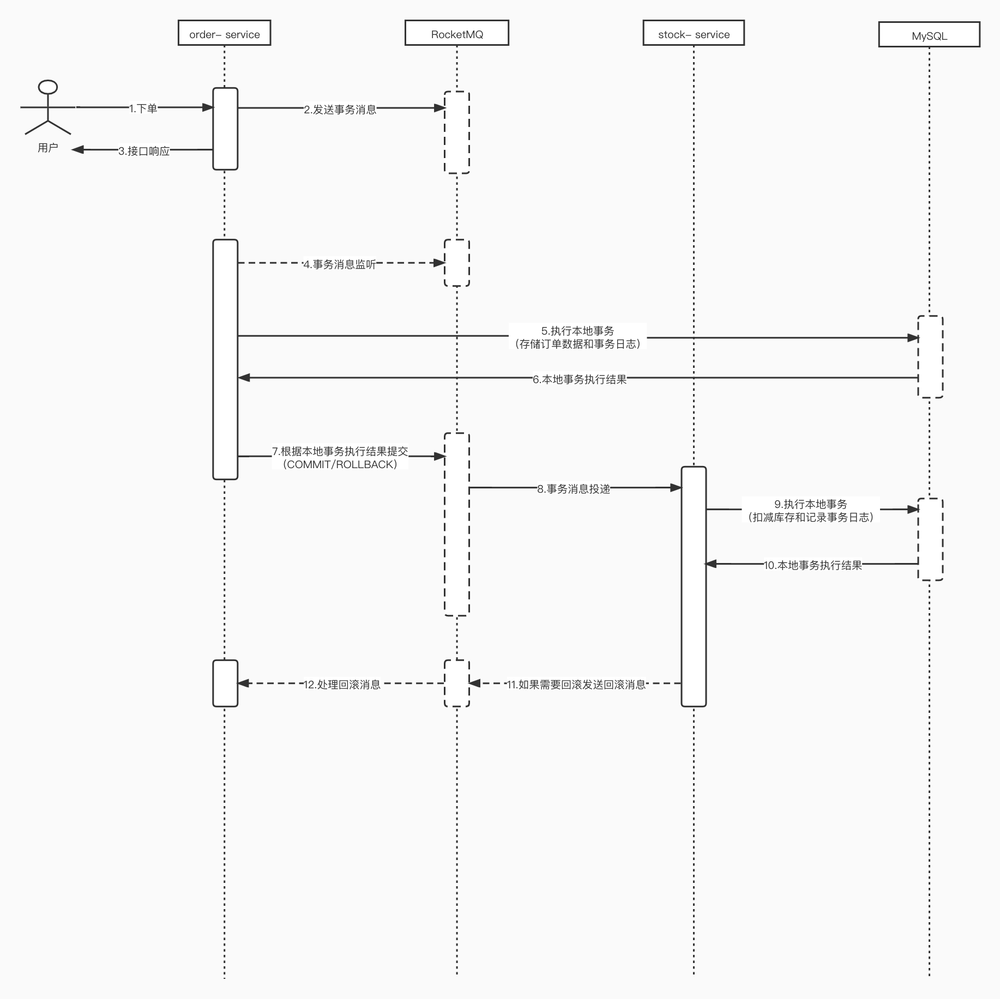
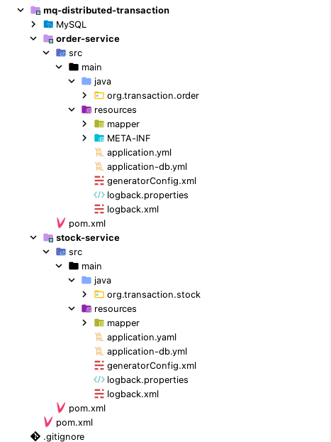

# 可靠消息最终一致性分布式事务 <!-- {docsify-ignore-all} -->

## 分布式事务

&nbsp; &nbsp; 在后端的系统开发中，都会使用到关系型数据库，文件，等等数据存储，并且在系统运行过程中都会遇到事务问题，所谓事务包含四个基本要素：原子性，一致性，隔离性和持久性，这里以关系型数据库MySQL为例，MySQL的InnoDB引擎提供了事务的支持；在单机单进程环境下，通过MySQL的事务的就可以实现事务的特性，但是系统架构一旦上升到分布式系统架构，单机事务就无法保证整个分布式系统的事务特性了。例如：订单服务发起下单，下单过程成功要调用库存接口扣减库存，但是由于网络超时，下游服务异常，下游服务业务异常等情况，需要回滚的时候，订单服务并不能感知到何时回滚，或者说无法收到回滚通知。

&nbsp; &nbsp; 对于分布式事务问题，业界有几种普遍的方案，如：XA-强一致性方案，两阶段提交，三阶段提交，TCC分布式事务，BASE柔性事务，DTP模型，可靠消息最终一致性分布式事务，最大努力通知。本篇以`可靠消息最终一致性分布式事务`为例，本篇以一个简单的下单，扣减库存的电商案例实现分布式事务的demo。

## 可靠消息最终一致性分布式事务流程



&nbsp; &nbsp; 这里简单画了一个时序图来解释可靠消息最终一致性分布式事务的流程：

- **用户下单：** 该接口的流程就是用户发起一个下单请求，该请求会向`RocketMQ`发送Half消息，如果发送消息产生异常会返回下单失败，否则返回成功。
- **订单服务执行本地事务：** 订单服务监听Half下单消息执行本地事务，存储下单数据和事务日志，并根据本地事务的执行结果向RocketMQ发送`COMMIT`或`ROLLBACK`。
- **订单服务提供本地事务执行结果查询：** 该步骤在时序图中没有体现出来，这里说明，如果RocketMQ没有收到消息的`COMMIT`或`ROLLBACK`，业务方提供用于查询事务状态的方法，该方法查询本地事务的执行结果，向RocketMQ发送`COMMIT`或`UNKNOWN`。
- **订单服务扣减库存：** 订单服务向RocketMQ发送`COMMIT`。RocketMQ就会投递消息到消息的消费者，这里消费者是库存服务，库存服务收到事务消息后，执行本地事务，就是扣减库存和记录事务日志。
- **事务回滚：** 如果库存服务在扣减库存的时候异常，无法扣减库存时，发送回滚消息到RocketMQ，订单服务收到该消息后回滚下单操作；这里回滚方式仍然可以使用事务消息，当然也可用RPC接口，然后定时任务重试等等。

<span style="color:red;">注：以上流程都应支持幂等</span>

## 可靠消息最终一致性分布式事务依赖组件

- **MySQL 5.7：**提供数据库支持
- **RocketMQ：**可靠消息支持，支持事务消息

## 编码实现

<span style="color:red;">注：默认MySQL，RcoketMQ环境都已具备；并且实现仅做demo项目使用，意在介绍“可靠消息最终一致性分布式事务”原理；</span>

### 数据库建表语句

```SQL
-- 订单表
CREATE TABLE `order` (
                         id BIGINT(20) NOT NULL AUTO_INCREMENT COMMENT '主键',
                         order_no VARCHAR(64) COMMENT '订单号',
                         product_id BIGINT(20) COMMENT '商品id',
                         pay_count int(11) COMMENT '购买数量',
                         create_time datetime  COMMENT '创建时间',
                         PRIMARY KEY (`id`),
                         UNIQUE KEY `order_no_index` (`order_no`) USING BTREE
);

-- 库存表
CREATE TABLE `stock` (
                         id BIGINT(20) NOT NULL AUTO_INCREMENT COMMENT '主键',
                         product_id BIGINT(20) COMMENT '商品id',
                         total_count int(11) COMMENT '总数',
                         create_time datetime  COMMENT '创建时间',
                         PRIMARY KEY (`id`),
                         UNIQUE KEY `product_id_idx` (`product_id`) USING BTREE
);

-- 事务日志
CREATE TABLE `tx_log` (
                          id BIGINT(20) NOT NULL AUTO_INCREMENT COMMENT '主键',
                          tx_no VARCHAR(64) COMMENT '事务号',
                          create_time datetime  COMMENT '创建时间',
                          UNIQUE KEY `tx_no_index` (`tx_no`) USING BTREE,
                          PRIMARY KEY (`id`)
);
```

### 代码实现

<span style="color:red;">注：该demo的order服务和stock服务使用的数据库是不同的，分别是order库和stock库来；order库包含order表和tx_log表；stock表包含stock表和tx_log表</span>

#### 搭建项目

- 项目结构如下，这就是个例子，自己想怎么做都可以



- **POM**

&nbsp; &nbsp; 这两个服务的POM依赖可以完全一样，这里以其中之一为例：

```xml
<?xml version="1.0" encoding="UTF-8"?>
<project xmlns="http://maven.apache.org/POM/4.0.0"
         xmlns:xsi="http://www.w3.org/2001/XMLSchema-instance"
         xsi:schemaLocation="http://maven.apache.org/POM/4.0.0 http://maven.apache.org/xsd/maven-4.0.0.xsd">
    <parent>
        <artifactId>spring-boot-starter-parent</artifactId>
        <groupId>org.springframework.boot</groupId>
        <version>2.2.6.RELEASE</version>
        <relativePath/>
    </parent>
    <modelVersion>4.0.0</modelVersion>

    <artifactId>order-service</artifactId>

    <properties>
        <maven.compiler.source>8</maven.compiler.source>
        <maven.compiler.target>8</maven.compiler.target>
        <druid.version>1.1.10</druid.version>
    </properties>

    <dependencies>
        <dependency>
            <groupId>org.springframework.boot</groupId>
            <artifactId>spring-boot-starter-web</artifactId>
        </dependency>
        <dependency>
            <groupId>org.springframework.boot</groupId>
            <artifactId>spring-boot-autoconfigure</artifactId>
        </dependency>
        <dependency>
            <groupId>org.springframework.boot</groupId>
            <artifactId>spring-boot-starter-undertow</artifactId>
        </dependency>
        <dependency>
            <groupId>org.springframework.boot</groupId>
            <artifactId>spring-boot-configuration-processor</artifactId>
        </dependency>
        <dependency>
            <groupId>org.springframework.boot</groupId>
            <artifactId>spring-boot-starter-test</artifactId>
        </dependency>
        <dependency>
            <groupId>org.apache.rocketmq</groupId>
            <artifactId>rocketmq-spring-boot-starter</artifactId>
            <version>2.0.2</version>
        </dependency>
        <dependency>
            <groupId>com.alibaba</groupId>
            <artifactId>druid</artifactId>
            <version>${druid.version}</version>
        </dependency>
        <dependency>
            <groupId>com.alibaba</groupId>
            <artifactId>druid-spring-boot-starter</artifactId>
            <version>${druid.version}</version>
        </dependency>
        <dependency>
            <groupId>mysql</groupId>
            <artifactId>mysql-connector-java</artifactId>
            <version>5.1.18</version>
        </dependency>
        <dependency>
            <groupId>com.baomidou</groupId>
            <artifactId>mybatis-plus-boot-starter</artifactId>
            <version>3.4.2</version>
        </dependency>
        <dependency>
            <groupId>org.projectlombok</groupId>
            <artifactId>lombok</artifactId>
            <version>1.18.12</version>
        </dependency>
        <dependency>
            <groupId>ch.qos.logback</groupId>
            <artifactId>logback-classic</artifactId>
            <version>1.2.0</version>
        </dependency>
        <dependency>
            <groupId>ch.qos.logback</groupId>
            <artifactId>logback-core</artifactId>
            <version>1.2.0</version>
        </dependency>
        <dependency>
            <groupId>org.slf4j</groupId>
            <artifactId>slf4j-api</artifactId>
            <version>1.7.22</version>
        </dependency>
    </dependencies>

    <build>
        <finalName>order-service</finalName>
        <plugins>
            <plugin>
                <groupId>org.mybatis.generator</groupId>
                <artifactId>mybatis-generator-maven-plugin</artifactId>
                <version>1.3.2</version>
                <configuration>
                    <verbose>true</verbose>
                    <overwrite>true</overwrite>
                </configuration>
            </plugin>
        </plugins>
    </build>
</project>
```

#### 订单服务

- **application.yml**

```yml
server:
  port: 8081
  servlet:
    context-path: /order
  tomcat:
    uri-encoding: UTF-8

spring:
  main:
    allow-bean-definition-overriding: true
  profiles:
    include: db # application-db.yml
    active: db
  output:
    ansi:
      enabled: detect
  application:
    name: order-service-svc
rocketmq:
  name-server: 192.168.58.45:9876
  producer:
    group: order-group
```

- **application-db.yml**

```yml
spring:
  datasource:
    url: jdbc:mysql://127.0.0.1:3316/tx-order?useUnicode=true&characterEncoding=UTF-8&useOldAliasMetadataBehavior=true&autoReconnect=true&failOverReadOnly=false&useSSL=false
    username: root
    password: admin123
    driver-class-name: com.mysql.jdbc.Driver
    platform: mysql
    type: com.alibaba.druid.pool.DruidDataSource
    # 下面为连接池的补充设置，应用到上面所有数据源中
    # 初始化大小，最小，最大
    initialSize: 10
    minIdle: 5
    maxActive: 20
    # 配置获取连接等待超时的时间
    maxWait: 60000
    # 配置间隔多久才进行一次检测，检测需要关闭的空闲连接，单位是毫秒
    timeBetweenEvictionRunsMillis: 3600000
    # 配置一个连接在池中最小生存的时间，单位是毫秒
    minEvictableIdleTimeMillis: 3600000
    validationQuery: select 1 from dual
    testWhileIdle: true
    testOnBorrow: false
    testOnReturn: false
    # 打开PSCache，并且指定每个连接上PSCache的大小
    poolPreparedStatements: true
    maxPoolPreparedStatementPerConnectionSize: 20
    maxOpenPreparedStatements: 20
    # 配置监控统计拦截的filters，去掉后监控界面sql无法统计，'wall'用于防火墙
    filters: stat
    # 通过connectProperties属性来打开mergeSql功能；慢SQL记录
    # connectionProperties: druid.stat.mergeSql=true;druid.stat.slowSqlMillis=5000

mybatis-plus:
  global-config:
    db-config:
      id-type: auto
      field-strategy: not-empty
      table-underline: true
      db-type: mysql
      logic-delete-value: 1 # 逻辑已删除值(默认为 1)
      logic-not-delete-value: 0 # 逻辑未删除值(默认为 0)
  configuration:
    jdbc-type-for-null: 'null'
  mapper-locations: classpath*:mapper/*.xml  #注意：一定要对应mapper映射xml文件的所在路径
  type-aliases-package: io.transaction.order.entity.*   # 注意：对应实体类的路径
```

- **MyBatis配置**

```java
@Configuration
@EnableTransactionManagement(proxyTargetClass = true)
@MapperScan(value = {"org.transaction.order.mapper"})
public class MyBatisConfiguration {

    @Bean
    public PaginationInnerInterceptor paginationInterceptor() {
        return new PaginationInnerInterceptor();
    }
}
```

- **下单接口**

```java
@RestController
@Slf4j
public class OrderController {

    private final OrderMapper orderMapper;
    private final OrderService orderService;

    @Autowired
    public OrderController(OrderMapper orderMapper, OrderService orderService) {
        this.orderMapper = orderMapper;
        this.orderService = orderService;
    }

    @PostMapping("/submitOrder")
    public String submitOrder(@RequestBody SubmitOrderDTO dto) {
        log.info("开始提交订单");
        try {
            orderService.submitOrder(dto.getProductId(), dto.getPayCount());
            return "SUCCESS";
        } catch (Exception e) {
            e.printStackTrace();
        }
        return "FAILED";
    }
}
```

- **请求参数**

```java
@Data
@AllArgsConstructor
@NoArgsConstructor
public class SubmitOrderDTO implements Serializable {

    /**
    * 商品编号
    */
    private Long productId;
    /**
    * 购买数量
    */
    private Integer payCount;
}
```

- **订单处理接口及实现**

```java
public interface OrderService {

    /**
     * 提交订单并且保存事务消息
     * @param txMessage 事务消息
     */
    void submitOrderAndSaveTxNo(TxMessage txMessage);

    /**
     * 提交订单
     * @param productId 产品ID
     * @param payCount 购买数量
     */
    void submitOrder(Long productId, Integer payCount);
}
```

OrderServiceImpl.java

```java
@Service
@Slf4j
public class OrderServiceImpl implements OrderService {

    private final RocketMQTemplate rocketMQTemplate;
    private final TxLogMapper txLogMapper;
    private final OrderMapper orderMapper;

    @Autowired
    public OrderServiceImpl(RocketMQTemplate rocketMQTemplate, TxLogMapper txLogMapper, OrderMapper orderMapper) {
        this.rocketMQTemplate = rocketMQTemplate;
        this.txLogMapper = txLogMapper;
        this.orderMapper = orderMapper;
    }

    @Transactional(rollbackFor = Exception.class)
    @Override
    public void submitOrderAndSaveTxNo(TxMessage txMessage) {
        // 根据事务号检查订单是否存在
        int count = txLogMapper.getCount(txMessage.getTxNo());
        if (0 != count) {
            log.info("存在事务：[{}]", txMessage.getTxNo());
            return;
        }
        Date date = new Date();
        // 生成订单
        Order order = new Order();
        order.setOrderNo(txMessage.getOrderNo());
        order.setCreateTime(date);
        order.setPayCount(txMessage.getPayCount());
        order.setProductId(txMessage.getProductId());
        log.info("开始存储订单：[{}]", order.toString());
        int res = orderMapper.saveOrder(order);
        if (res > 0) {
            // 记录事务日志
            TxLog txLog = new TxLog();
            txLog.setTxNo(txMessage.getTxNo());
            txLog.setCreateTime(date);
            log.info("开始记录事务日志：[{}]", txLog.toString());
            txLogMapper.saveTxLog(txLog);
        }
    }

    @Override
    public void submitOrder(Long productId, Integer payCount) {
        // 发送事务消息
        TxMessage txMessage = new TxMessage();
        // 全局事务编号
        String txNo = UUID.randomUUID().toString();
        txMessage.setProductId(productId);
        txMessage.setPayCount(payCount);
        txMessage.setTxNo(txNo);
        txMessage.setOrderNo(UUID.randomUUID().toString());
        String jsonString = JSONObject.toJSONString(txMessage);
        Message<String> msg = MessageBuilder.withPayload(jsonString).build();
        rocketMQTemplate.sendMessageInTransaction("tx_order_group", "topic_txmsg", msg, null);
    }
}
```

- **事务消息处理**

消息结构

```java
@Data
@AllArgsConstructor
@NoArgsConstructor
public class TxMessage implements Serializable {

    /**
     * 商品id
     */
    private Long productId;

    /**
     * 商品购买数量
     */
    private Integer payCount;

    /**
     * 全局事务编号
     */
    private String txNo;

    /**
     * 订单号
     */
    private String orderNo;
}
```

事务消息监听OrderTxMessageListener

```java
@Slf4j
@Component
@RocketMQTransactionListener(txProducerGroup = "tx_order_group")
public class OrderTxMessageListener implements RocketMQLocalTransactionListener {

    private final OrderService orderService;

    private final TxLogMapper txLogMapper;

    @Autowired
    public OrderTxMessageListener(OrderService orderService, TxLogMapper txLogMapper) {
        this.orderService = orderService;
        this.txLogMapper = txLogMapper;
    }

    @Override
    @Transactional(rollbackFor = Exception.class)
    public RocketMQLocalTransactionState executeLocalTransaction(Message message, Object o) {
        try {
            // 执行本地事务
            log.info("开始执行本地事务");
            // 提交订单并保存事务消息
            log.info("提交订单保存事务日志");
            TxMessage txMessage = getTxMessage(message);
            orderService.submitOrderAndSaveTxNo(txMessage);
            // 返回commit
            return RocketMQLocalTransactionState.COMMIT;
        } catch (Exception e) {
            e.printStackTrace();
            // rollback
            log.info("执行回滚");
            return RocketMQLocalTransactionState.ROLLBACK;
        }
    }

    @Override
    public RocketMQLocalTransactionState checkLocalTransaction(Message message) {
        // 根据事务号检查是否存在本地事务
        TxMessage txMessage = getTxMessage(message);
        int count = txLogMapper.getCount(txMessage.getTxNo());
        if (0 != count) {
            log.info("存在事务，可以提交事务消息：[{}]", txMessage.getTxNo());
            return RocketMQLocalTransactionState.COMMIT;
        }
        // 存在就commit，否则unknown
        return RocketMQLocalTransactionState.UNKNOWN;
    }

    private TxMessage getTxMessage(Message message) {
        String messageString = new String((byte[]) message.getPayload());
        return JSONObject.parseObject(messageString, TxMessage.class);
    }
}
```

- **持久层实现**

OrderMapper

```java
@Repository
public interface OrderMapper {

    Order selectByOrderNo(@Param("orderNo") String orderNo);

    int saveOrder(@Param("order") Order order);

    int deleteByOrderNo(@Param("orderNo") String orderNo);
}
```

OrderMapper.xml

```xml
<?xml version="1.0" encoding="UTF-8"?>
<!DOCTYPE mapper PUBLIC "-//mybatis.org//DTD Mapper 3.0//EN" "http://mybatis.org/dtd/mybatis-3-mapper.dtd">
<mapper namespace="org.transaction.order.mapper.OrderMapper" >

  <select id="selectByOrderNo" resultType="org.transaction.order.entity.Order" >
    select
    id as id, order_no as orderNo, pay_count as payCount, create_time as createTimes
    from `order`
    where order_no = #{orderNo};
  </select>

  <insert id="saveOrder" parameterType="org.transaction.order.entity.Order">
    insert into `order` (order_no, product_id, pay_count, create_time) values (#{order.orderNo}, #{order.productId}, #{order.payCount}, #{order.createTime});
  </insert>

  <delete id="deleteByOrderNo">
    delete from `order` where order_no = #{orderNo};
  </delete>
</mapper>
```

TxLogMapper

```java
@Repository
public interface TxLogMapper {

    int getCount(@Param("txNo") String txNo);

    int saveTxLog(@Param("txLog")TxLog txLog);
}
```

TxLogMapper.xml

```xml
<?xml version="1.0" encoding="UTF-8" ?>
<!DOCTYPE mapper PUBLIC "-//mybatis.org//DTD Mapper 3.0//EN" "http://mybatis.org/dtd/mybatis-3-mapper.dtd" >
<mapper namespace="org.transaction.order.mapper.TxLogMapper" >
    <select id="getCount" resultType="java.lang.Integer">
        select count(*) from tx_log where tx_no = #{txNo}
    </select>

    <insert id="saveTxLog" parameterType="org.transaction.order.entity.TxLog">
        insert into `tx_log` (tx_no, create_time) values (#{txLog.txNo}, #{txLog.createTime});
    </insert>
</mapper>
```

#### 库存服务

- **application.yml**

```yml
server:
  port: 8082
  servlet:
    context-path: /stock
  tomcat:
    uri-encoding: UTF-8
  #设置编码为UTF-8


mybatis-plus:
  mapper-locations: classpath*:mapper/*.xml  #注意：一定要对应mapper映射xml文件的所在路径
  type-aliases-package: io.transaction.stock.entity.*   # 注意：对应实体类的路径


spring:
  main:
    allow-bean-definition-overriding: true
  profiles:
    include: db
    active: db
  output:
    ansi:
      enabled: detect
  application:
    name: tx-msg-stock

  http:
    encoding:
      charset: UTF-8
      enabled: true
      force: true

rocketmq:
  name-server: 192.168.58.45:9876
  producer:
      group: stock-group
```

- **application-db.yml**

&nbsp; &nbsp; 订单服务的基本实现与订单服务相似或相同这里省略部分代码，如：事务消息结构，Mybatis配置，持久层

```yml
spring:
  datasource:
    url: jdbc:mysql://127.0.0.1:3316/tx-stock?useUnicode=true&characterEncoding=UTF-8&useOldAliasMetadataBehavior=true&autoReconnect=true&failOverReadOnly=false&useSSL=false
    username: root
    password: admin123
    driver-class-name: com.mysql.jdbc.Driver
    platform: mysql
    type: com.alibaba.druid.pool.DruidDataSource
    # 下面为连接池的补充设置，应用到上面所有数据源中
    # 初始化大小，最小，最大
    initialSize: 10
    minIdle: 5
    maxActive: 20
    # 配置获取连接等待超时的时间
    maxWait: 60000
    # 配置间隔多久才进行一次检测，检测需要关闭的空闲连接，单位是毫秒
    timeBetweenEvictionRunsMillis: 3600000
    # 配置一个连接在池中最小生存的时间，单位是毫秒
    minEvictableIdleTimeMillis: 3600000
    validationQuery: select 1 from dual
    testWhileIdle: true
    testOnBorrow: false
    testOnReturn: false
    # 打开PSCache，并且指定每个连接上PSCache的大小
    poolPreparedStatements: true
    maxPoolPreparedStatementPerConnectionSize: 20
    maxOpenPreparedStatements: 20
    # 配置监控统计拦截的filters，去掉后监控界面sql无法统计，'wall'用于防火墙
    filters: stat
    # 通过connectProperties属性来打开mergeSql功能；慢SQL记录
    # connectionProperties: druid.stat.mergeSql=true;druid.stat.slowSqlMillis=5000

mybatis-plus:
  global-config:
    db-config:
      id-type: auto
      field-strategy: not-empty
      table-underline: true
      db-type: mysql
      logic-delete-value: 1 # 逻辑已删除值(默认为 1)
      logic-not-delete-value: 0 # 逻辑未删除值(默认为 0)
  configuration:
    jdbc-type-for-null: 'null'
  mapper-locations: classpath*:mapper/*.xml  #注意：一定要对应mapper映射xml文件的所在路径
  type-aliases-package: io.transaction.stock.entity.*   # 注意：对应实体类的路径
```

- **扣件库存接口及实现**

```java
public interface StockService {

    /**
     * 减少库存
     * @param txMessage 事务消息
     * @throws Exception 异常
     */
    void deleteStock(TxMessage txMessage) throws Exception;
}
```

StockService实现

```java
@Service
@Slf4j
public class StockServiceImpl implements StockService {

    private final TxLogMapper txLogMapper;
    private final StockMapper stockMapper;

    @Autowired
    public StockServiceImpl(TxLogMapper txLogMapper, StockMapper stockMapper) {
        this.txLogMapper = txLogMapper;
        this.stockMapper = stockMapper;
    }

    @Transactional(rollbackFor = Exception.class)
    @Override
    public void deleteStock(TxMessage txMessage) throws Exception {
        // 检查本地事务
        int count = txLogMapper.getCount(txMessage.getTxNo());
        if (count != 0) {
            log.info("存在事务：[{}]", txMessage.getTxNo());
            return;
        }
        // 根据产品ID获取库存
        Stock stock = stockMapper.getStockByProductId(txMessage.getProductId());
        // 检查库存情况是否可以下单
        if (txMessage.getPayCount() > stock.getTotalCount()) {
            log.info("库存不足");
            // TODO 通知order-service回滚
            throw new Exception("库存不足");
        }
        Date date = new Date();
        // 扣减库存
        stockMapper.updateStock(txMessage.getProductId(), txMessage.getPayCount());
        log.info("扣减库存成功");
        // 记录事务日志
        TxLog txLog = new TxLog();
        txLog.setTxNo(txMessage.getTxNo());
        txLog.setCreateTime(date);
        txLogMapper.saveTxLog(txLog);
        log.info("记录事务日志成功");
    }
}
```

- **下单事务消息监听**

```java
@Component
@Slf4j
@RocketMQMessageListener(consumerGroup = "tx_stock_group", topic = "topic_txmsg")
public class StockTxMessageConsumer implements RocketMQListener<String> {

    private final StockService stockService;
    private final RocketMQTemplate rocketMQTemplate;


    @Autowired
    public StockTxMessageConsumer(StockService stockService, RocketMQTemplate rocketMQTemplate) {
        this.stockService = stockService;
        this.rocketMQTemplate = rocketMQTemplate;
    }

    @SneakyThrows
    @Override
    public void onMessage(String s) {
        // 根据消息扣减库存
        log.info("开始扣减库存");
        TxMessage txMessage = deserialization(s);
        try {
            stockService.deleteStock(txMessage);
        } catch (Exception e) {
            e.printStackTrace();
            log.info("发生异常，通知上游回滚");
            rollback(txMessage);
        }

    }

    private void rollback(TxMessage txMessage) {
        String jsonString = JSONObject.toJSONString(txMessage);
        Message<String> msg = MessageBuilder.withPayload(jsonString).build();
        rocketMQTemplate.asyncSend("topic_tx_rollback_msg", msg, new SendCallback() {
            @Override
            public void onSuccess(SendResult sendResult) {
                log.info("回滚消息发送结果：[{}]", sendResult.getSendStatus());
            }

            @Override
            public void onException(Throwable throwable) {
                throwable.printStackTrace();
                log.error("回滚消息发送异常");
            }
        });
    }

    private TxMessage deserialization(String msg) {
        return JSONObject.parseObject(msg, TxMessage.class);
    }
}

```

## 总结

源代码可在笔者github找到：https://github.com/Redick01/my-transaction

- 参考：《深入理解分布式事务》