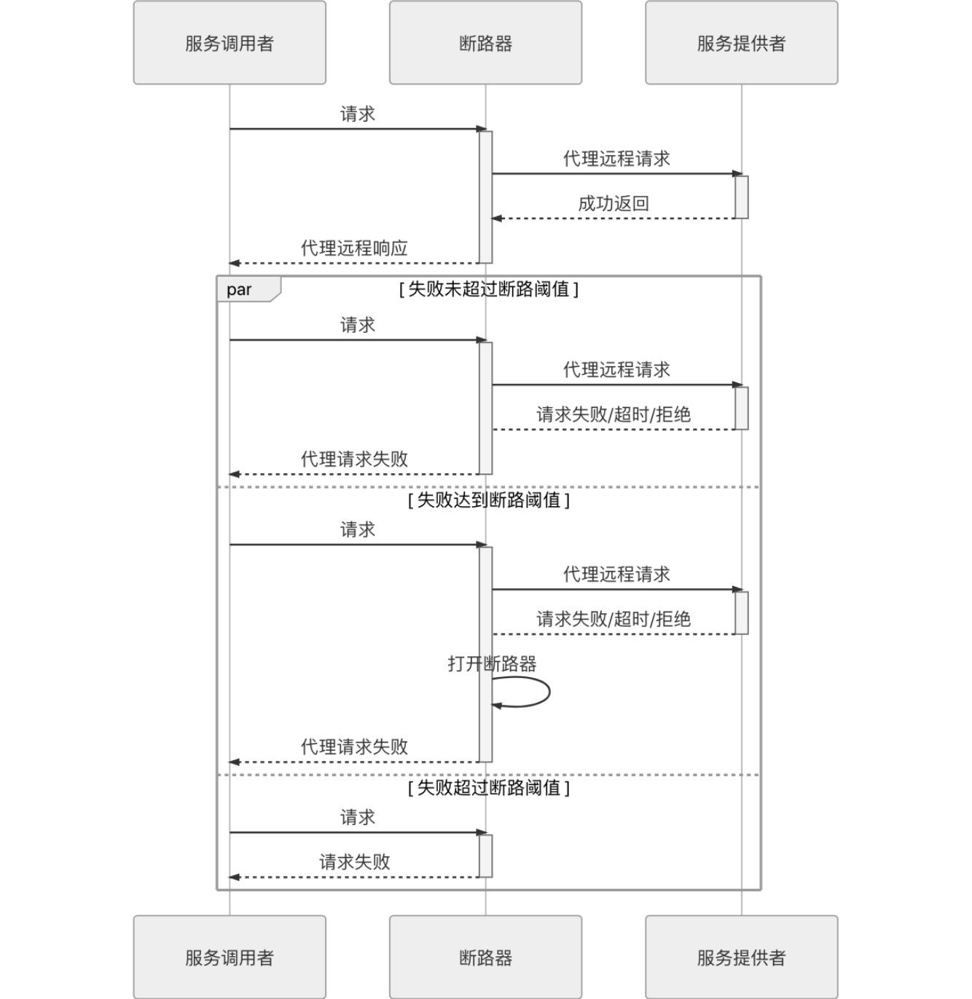
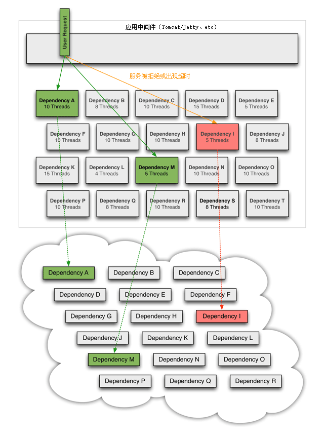

# 基于公司系统存在的问题产生的微服务架构下的容错性设计思考 <!-- {docsify-ignore-all} -->

容错性设计是微服务架构的⼀个核⼼准则。当我们引⼊微服务架构后，随着拆分的服务越来越多，不可避免地遇到以下的问题。

1. 服务A崩溃，导致所有的上游服务异常，造成级联反应；
2. 突发出现⼤量请求，⽽服务A的处理能⼒有限，⼤部分请求直到超时都没有得到响应；
3. 服务对接第三方，由于第三方系统问题，导致公司系统出现连带问题；

要落实容错性设计原则，除了观念上的转变之外，还需要学习⼀些常⽤的容错策略及容错设计模式，扩充我们的武器库，作为具体的编码和设计实践的指导。容错策略指的是“⾯对故障，我们该做些什么”，容错设计模式指的是“要实现某种容错策略，我们该怎么做”。

## 容错策略

- **1 故障转移（Failover）**

  服务多副本，⼀个节点故障，转移到另⼀个节点。需限制调⽤次数。对于⾮幂等服务，故障转移的重试可能产⽣脏数据，这时可以考虑快速失败，直接返回调⽤失败。
  
- **2 快速失败（Failfast）**

  我们希望我们的组件能够快速失败（fail fast），因为我们不想等待断开的实例直到超时。这不仅浪费资源，而且还会让用户体验变得糟糕。我们的服务是互相调用的，所以在这些延误已成定局之前，应该特别注意防止那些悬挂超时的操作，我们的第一想法大多数都是控制超时时间，使超时时间粒度更细，但是超时时间很不好评估，并且当超时时间达到秒级的话仍然应对不了流量洪峰。使用超时来进行快速失败我觉得是一种反模式，后面会写到断路器模式来进行快速失败。

- **3 安全失败（Failsafe）**

  调⽤链中的旁路逻辑，例如⽇志，执⾏失败了不返回失败，⽽是返回默认结果。

- **4 沉默失败（Failslient）**

  当请求失败后，就默认服务提供者⼀定时间内⽆法再对外提供服务，不再向它分配请求流
  量，将错误隔离开来，避免对系统其他部分产⽣影响，此即为沉默失败策略。

- **5 故障恢复（Failback）**
  
  故障恢复⼀般不单独存在，⽽是作为其他容错策略的补充措施，⼀般在微服务管理框架中，
  如果设置容错策略为故障恢复的话，通常默认会采⽤快速失败加上故障恢复的策略组合。例
  如服务调⽤出错了以后，将该次调⽤失败的信息存⼊⼀个消息队列/数据库等中，然后由系统⾃动开始
  异步重试调⽤。
  

- **6 并⾏调⽤ （Forking）**
  
  指⼀开始就同时向多个服务副本发起调⽤，只要有其中任何⼀个返回成功，那调⽤便宣告成
  功，这是⼀种在关键场景中使⽤更⾼的执⾏成本换取执⾏时间和成功概率的策略。

- **7 ⼴播调⽤（Broadcast）**

  同时发起多个调⽤，要求所有的请求全部都成功，这次调⽤才算是成功，任何⼀个服务提供
  者出现异常都算调⽤失败，⼴播调⽤通常会被⽤于实现“刷新分布式缓存”这类的操作。

- **8 限流器和负载开关**

  限流是指在一段时间内，定义某个客户或应用可以接收或处理多少个请求的技术。例如，通过限流，你可以过滤掉产生流量峰值的客户和微服务，或者可以确保你的应用程序在自动扩展（Auto Scaling）失效前都不会出现过载的情况。

- **9 重试逻辑（Retry Logic）**

  使用重试的过程应该是非常小心的，因为大量的重试可能会让系统变得更糟，甚至是阻止系统的恢复，
  在分布式系统中，微服务系统重试可能触发多个其他请求或重试，并导致级联效应。为最小化重试的影响，你应该减少重试的数量，并使用指数退避算法（exponential backoff algorithm）来持续增加重试之间的延迟，直到达到最大限制。

## 容错设计模式

​    为了实现各种各样的容错策略，开发⼈员总结出了⼀些被实践证明是有效的服务容错设计模式，譬如微服务中常⻅的断路器模式、舱壁隔离模式，超时重试模式，等等。⼀些流量控制模式也可以划分到这个范畴⾥，如滑动时间窗模式、漏桶模式、令牌桶模式等。

- **1 断路器模式**

   断路器模式是微服务架构中最基础的容错设计模式。断路器的基本原理其实很好理解，由断路器代理服务调⽤者的远程请求。执⾏过程中统计请求失败等请求异常的次数，当失败次数达到阈值时，断路器的状态变为“OPEN”，直接返回调⽤失败，不再真正地执⾏远程请求。通过断路器对远程服务的熔断，避免因持续的失败或拒绝⽽消耗资源，或因持续的超时⽽堆积请求，最终的⽬的就是避免雪崩效应的出现。由此可⻅，断路器本质是⼀种快速失败策略的实现⽅式。

 

  从调⽤序列来看，断路器就是⼀种有限状态机，断路器模式就是根据⾃身状态变化⾃动调整代理请求策略的过程。断路器⼀般包括以下三种状态：

  **CLOSED**：表示断路器关闭，此时的远程请求会真正发送给服务提供者。断路器刚刚建⽴时默认处于这种状态，此后将持续监视远程请求的数量和执⾏结果，决定是否要进⼊OPEN状态。

  **OPEN**：表示断路器开启，此时不会进⾏远程请求，直接给服务调⽤者返回调⽤失败的信息，以实现快速失败策略。

  **HALF OPEN**：这是⼀种中间状态。当进⼊OPEN状态⼀段时间以后，将“⾃动”（⼀般是由下⼀次请求⽽不是计时器触发的）切换到HALF OPEN状态。该状态下，会放⾏⼀次远程调⽤，然后根据这次调⽤的结果成功与否，转换为CLOSED或者OPEN状态，以实现断路器的弹性恢复。

 

看到这⾥我们可以想下触发`CLOSED` 到 `OPEN`状态的条件应该是怎样的。⽐较简单的⽅案是统计⼀定时间内请求的失败次数，例如10秒内20次，但是如果请求量较多的情况下，可能错误的⽐率完全在可以接受的范围内，并不需要熔断。我们看下Hystrix的触发熔断的条件：
  - ⼀段时间（譬如10秒以内）内请求数量达到⼀定阈值（譬如20个请求）。这个条件的意思是如果请求本身就很少，那就⽤不着断路器介⼊。
  - ⼀段时间（譬如10秒以内）内请求的故障率（发⽣失败、超时、拒绝的统计⽐例）到达⼀定阈值（譬如50%）。这个条件的意思是如果请求本身都能正确返回，也⽤不着断路器介⼊。

以上两个条件同时满⾜时，断路器就会转变为OPEN状态。

- **2 舱壁隔离模式（Bulkhead）**

  舱壁隔离模式是常⽤的实现服务隔离的设计模式，舱壁这个词是来⾃造船业，它原本的意思是设计船时，要在每个区域设计独⽴的⽔密舱室，⼀旦某个舱室进⽔，也只是影响这个舱室中的货物，⽽不⾄于让整艘舰艇沉没。这种思想就很符合容错策略中失败静默策略。我们来看⼀个具体的场景，当分布式系统所依赖的某个服务，譬如下图中的“服务I”发⽣了超时，假设平均1秒钟内对该服务的调⽤会发⽣50次，这就意味着该服务如果⻓时间不结束的话，每秒会有50条⽤户线程被阻塞。如果这样的访问量⼀直持续，假设超时时间为20秒，20秒内将会阻塞掉1000条⽤户线程，此后才陆续会有⽤户线程因超时被释放出来，回归Tomcat的全局线程池中。如果超过了最⼤的线程池设置，意味着此时系统在外部将表现为所有服务的全⾯瘫痪，⽽不仅仅是只有涉及到“服务I”的功能不可⽤，因为Tomcat已经没有任何空余的线程来为其他请求提供服务了。

 

  **3. 线程池隔离**

  对于这类情况，⼀种可⾏的解决办法是为每个服务单独设⽴线程池，这些线程池默认不预置活动线程，只⽤来控制单个服务的最⼤连接数。譬如，对出问题的“服务I”设置了⼀个最⼤线程数为5的线程池，这时候它的超时故障就只会最多阻塞5条⽤户线程，⽽不⾄于影响全局。此时，其他不依赖“服务I”的⽤户线程依然能够正常对外提供服务，如下图所示。
 

  使⽤局部的线程池来控制服务的最⼤连接数有许多好处，当服务出问题时能够隔离影响，当服务恢复后，还可以通过清理掉局部线程池，瞬间恢复该服务的调⽤，⽽如果是Tomcat的全局线程池被占满，再恢复就会⼗分麻烦。但是，局部线程池有⼀个显著的弱点，它额外增加了CPU的开销，每个独⽴的线程池都要进⾏排队、调度和下⽂切换⼯作。

  **4. 信号量机制**

  还有⼀种更轻量的可以⽤来控制服务最⼤连接数的办法：信号量机制（Semaphore）。如果不考虑清理线程池、客户端主动中断线程这些额外的功能，仅仅是为了控制⼀个服务并发调⽤的最⼤次数，可以只为每个远程服务维护⼀个线程安全的计数器即可，并不需要建⽴局部线程池。具体做法是当服务开始调⽤时计数器加1，服务返回结果后计数器减1，⼀旦计数器超过设置的阈值就⽴即开始限流，在回落到阈值范围之前都不再允许请求了。由于不需要承担线程的排队、调度、切换⼯作，所以单纯维护⼀个作为计数器的信号量的性能损耗，相对于局部线程池来说⼏乎可以忽略不计。

- **5. 重试模式**

故障转移和故障恢复策略都需要对服务进⾏重复调⽤。重试的实现本身并不复杂，我们判断是否应该且是否能够对⼀个服务进⾏重试时，应同时满⾜以下⼏个前提条件：
  - 仅在主路逻辑的关键服务上进⾏同步的重试，不是关键的服务，⼀般不把重试作为⾸选容错⽅案，尤其不该进⾏同步重试。
  - 仅对由瞬时故障导致的失败进⾏重试。
  - 仅对具备幂等性的服务进⾏重试。
  - 重试必须有明确的终⽌条件，常⽤的终⽌条件有两种：
  - 超时中⽌
  - 次数中⽌

由于重试模式可以在⽹络链路的多个环节中去实现，譬如客户端发起调⽤时⾃动重试，⽹关中⾃动重试、负载均衡器中⾃动重试，等等，⽽且现在的微服务框架都⾜够便捷，只需设置⼀两个开关参数就可以开启对某个服务甚⾄全部服务的重试机制。多以对于重试的设置需要谨慎。举个例⼦：⼀套基于Netflix 微服务全家桶建设的微服务系统，如果同时在Zuul、Feign和Ribbon上都打开了重试功能，且不考虑重试被超时终⽌的话，那总重试次数就相当于它们的重试次数的乘积。假设它们都重试4次，理论上最多会产⽣⾼达4×4×4=64次调⽤请求。

## 容错库

- **Hystrix**
- **resilience4j**
- **Sentinel**