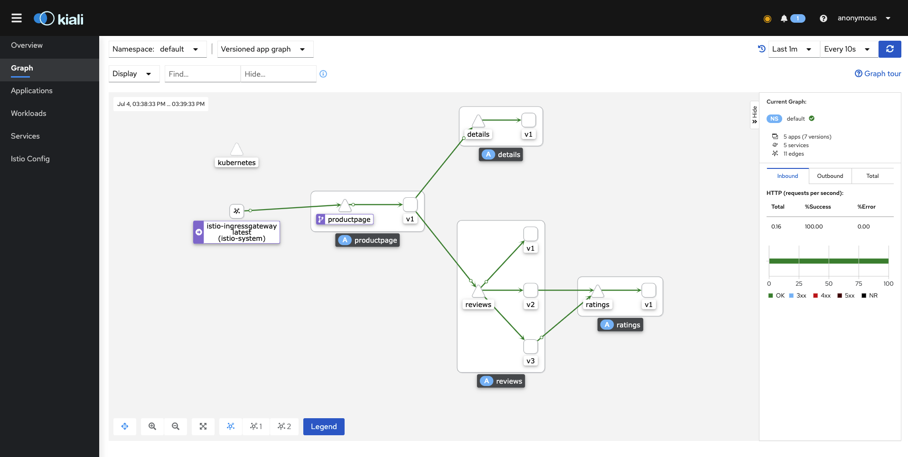
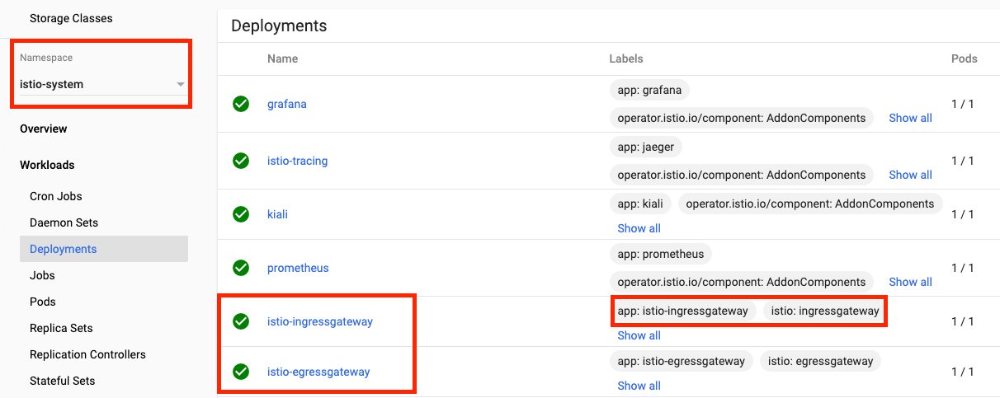

# Istio入口流量路由  <!-- {docsify-ignore-all} -->

- 网格可视化
- Gateway
- VirtualService


## 网格可视化Kiali

### 通过Istio插件安装（本文使用）

Istio 1.7+已经推出的所有功能于一身的yamls安装第三方插件组件，如Kiali，普罗米修斯，积家，Grafana和其他。

  这些仅用于演示，并未针对性能或安全性进行调整。

> **要使用您的 Istio 版本随附的一体式 yaml 安装 Kiali 服务器，请运行以下命令：**

```shell
liupenghui:istio-1.10.2 penghuiliu$ kubectl apply -f ${ISTIO_HOME}/samples/addons/kiali.yaml
customresourcedefinition.apiextensions.k8s.io/monitoringdashboards.monitoring.kiali.io created
serviceaccount/kiali created
configmap/kiali created
clusterrole.rbac.authorization.k8s.io/kiali-viewer created
clusterrole.rbac.authorization.k8s.io/kiali created
clusterrolebinding.rbac.authorization.k8s.io/kiali created
role.rbac.authorization.k8s.io/kiali-controlplane created
rolebinding.rbac.authorization.k8s.io/kiali-controlplane created
service/kiali created
deployment.apps/kiali created
```

> **安装Prometheus**

```shell
liupenghui:addons penghuiliu$ kubectl apply -f prometheus.yaml 
serviceaccount/prometheus created
configmap/prometheus created
clusterrole.rbac.authorization.k8s.io/prometheus created
clusterrolebinding.rbac.authorization.k8s.io/prometheus created
service/prometheus created
deployment.apps/prometheus created
```

> **安装Grafana**

```shell
liupenghui:addons penghuiliu$ kubectl apply -f grafana.yaml 
serviceaccount/grafana created
configmap/grafana created
service/grafana created
deployment.apps/grafana created
configmap/istio-grafana-dashboards created
configmap/istio-services-grafana-dashboards created
```

> **打开网格可视化**

```shell
liupenghui:istio-1.10.2 penghuiliu$ istioctl dashboard kiali
http://localhost:20001/kiali
```

> **多次访问Bookinfo示例http://localhost/productpage 流量图如下：**

从图中可以看出流量是从`istio-ingressgateway`流入到网格内部，所以Istio网关和VirtualService作为流量的入口代替了k8s的入口控制器（Ingress），`istio-ingressgateway`正是Istio提前配置好的网关



## 网关（ingressgateway）

&nbsp; &nbsp; Istio网关可以管理入站/出站网络流量，与Sidecar代理不同，网关主要被配置用于运行在网格边界的独立代理。与Kubernetes入口API这种控制进入系统流量的机制不同，网关的流量路有更加强大状语从句：灵活。因为是网关可以配置4-6层的负载均衡属性，对外如暴露的端口，TLS设置等，而应用层流量路由则交给VirtualService，它可以绑定到一个网关上。让你可以像管理网格中其他数据的平面流量一样去管理网关流量。

Istio 提供了一些采集配置网关（istio-ingressgateway 和 istio-egressgateway）供我们使用，下面是Bookinfo例子中的网关和配置。



 **<h3>bookinfo-gateway.yaml</h3>**
 
&nbsp; &nbsp; Bookinfo示例中网关使用了默认的`ingressgateway`，并让`HTTP`流量通过`80`端口进入`网格`，因此，访问`http://localhost/productpage`时HTTP流量便由istio-ingressgateway通过bookinfo-gateway暴露的80端口流量网络配置经格内。

> 注：这里主机设置为*，表示允许所有HTTP流量流向80端口如果你想指定域名可以将主机设置为需要的域名，这样便只有设置的域名才能通过的BookInfo网关将外部HTTP流量通过80端口流入排列内。

```yaml
apiVersion: networking.istio.io/v1alpha3
kind: Gateway
metadata:
  name: bookinfo-gateway
spec:
  selector:
    istio: ingressgateway # use istio default controller
  servers:
    - port:
        number: 80
        name: http
        protocol: HTTP
      hosts:
        - "*"
```

## VirtualService（虚拟服务）

&nbsp; &nbsp; Istio VirtualService配置如何在服务网格内将请求路由到服务，这基于Istio平台个人文库状语从句：提供的基本的连通性服务状语从句：发现能力。每个VirtualService包含一组路由规则，Istio按顺序评估它们，Istio将每个给定的请求匹配到 VirtualService 指定的特定目标地址。

下面是Bookinfo例子中的VirtualService，可以看到绑定了`bookinfo-gateway`网关，并声明了消费规则到`productpage`服务。
```yaml
apiVersion: networking.istio.io/v1alpha3
kind: VirtualService
metadata:
  name: bookinfo
spec:
  hosts:
  - "*"
  gateways:
  - bookinfo-gateway # 绑定网关
  http:
  - match: # 匹配的URL前缀
    - uri:
        exact: /productpage
    - uri:
        prefix: /static
    - uri:
        exact: /login
    - uri:
        exact: /logout
    - uri:
        prefix: /api/v1/products
    route:
    - destination:
        host: productpage # 后端服务
        port:
          number: 9080
```

因此，访问`http://localhost/productpage`时`HTTP`流量便由`istio-ingressgateway`通过`bookinfo-gateway`配置经`80`入口入口地址内，通过bookinfo`VirtualService`的路由规则，匹配到了`exact: /productpage`。最后，将流量端口了产品页面的`9080`端口。

```yaml
apiVersion: v1
kind: Service
metadata:
  name: productpage
  labels:
    app: productpage
    service: productpage
spec:
  ports:
  - port: 9080
    name: http
  selector:
    app: productpage
```

## 总结

&nbsp; &nbsp; **Istio通过网关管理网格入站网站流量，再通过VirtualService配置路由规则**，将请求路由到服务。**网关好比“园区” （网格）的门口管理员**管理着进来的“人” （流量），而**VirtualService则是园区里面每一条“家” （服务）的小径**。