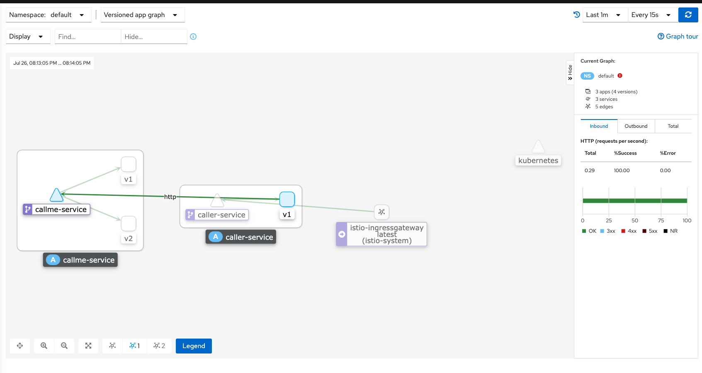

# Kubernetes上基于Istio和SpringBoot搭建服务网格 <!-- {docsify-ignore-all} -->

## 安装Istio

参考[Service Mesh - Kubernetes & Istio 开发环境搭建(Mac OS)](https://redick01.github.io/redick.github.io/#/blog/structure/servicemesh-two)

## 创建SpringBoot应用

&nbsp; &nbsp; 创建两个应用`callme-service`和`caller-service`，其中`callme-service`有两个版本v1和v2，`caller-service`是服务的调用方，`callme-service`是调用提供方，两个服务之间交互的流量由`Istio`管理，它将20%的请求发送到应用程序的v1版本，将80%的请求发送到该v2版本，并且还为33%的流量增加了三秒的延迟。应用的架构图如下：


[项目参考地址：](https://github.com/Redick01/sample-istio-services)

**callme-service**服务结构如下，该项目基于`SpringBoot`。


`CallmeController`提供Http接口，通过环境变量`VERSION`注入了一个版本号，`/ping`接口会返回版本号。

```java
@RestController
@RequestMapping("/callme")
public class CallmeController {

    private static final Logger LOGGER = LoggerFactory.getLogger(CallmeController.class);
    private static final String INSTANCE_ID = UUID.randomUUID().toString();
    private Random random = new Random();

    @Autowired
    BuildProperties buildProperties;
    @Value("${VERSION}")
    private String version;

    @GetMapping("/ping")
    public String ping() {
        LOGGER.info("Ping: name={}, version={}", buildProperties.getName(), version);
        return "I'm callme-service " + version;
    }

    @GetMapping("/ping-with-random-error")
    public ResponseEntity<String> pingWithRandomError() {
        int r = random.nextInt(100);
        if (r % 2 == 0) {
            LOGGER.info("Ping with random error: name={}, version={}, random={}, httpCode={}",
                    buildProperties.getName(), version, r, HttpStatus.GATEWAY_TIMEOUT);
            return new ResponseEntity<>("Surprise " + INSTANCE_ID + " " + version, HttpStatus.GATEWAY_TIMEOUT);
        } else {
            LOGGER.info("Ping with random error: name={}, version={}, random={}, httpCode={}",
                    buildProperties.getName(), version, r, HttpStatus.OK);
            return new ResponseEntity<>("I'm callme-service" + INSTANCE_ID + " " + version, HttpStatus.OK);
        }
    }

    @GetMapping("/ping-with-random-delay")
    public String pingWithRandomDelay() throws InterruptedException {
        int r = new Random().nextInt(3000);
        LOGGER.info("Ping with random delay: name={}, version={}, delay={}", buildProperties.getName(), version, r);
        Thread.sleep(r);
        return "I'm callme-service " + version;
    }

}
```

**caller-service**服务就不详细说明了，该项目基于`SpringBoot`，该项目提供一个`/ping`的`GET`接口，该接口实现了使用`RestTemplate`调用**callme-service**服务的`/ping`接口，代码如下：

```java
@RestController
@RequestMapping("/caller")
public class CallerController {

    private static final Logger LOGGER = LoggerFactory.getLogger(CallerController.class);

    @Autowired
    RestTemplate restTemplate;
    @Value("${VERSION}")
    private String version;

    @GetMapping("/ping")
    public String ping() {
        String response = restTemplate.getForObject("http://callme-service:8080/callme/ping", String.class);
        LOGGER.info("Calling: response={}", response);
        return "I'm caller-service " + version + ". Calling... " + response;
    }
}
```

## 在k8s上部署SpringBoot应用程序

**callme-service服务**

在k8s上创建两个VERSION不同的代码相同的应用`callme-service-v1`和`callme-service-v2`，VERSION分别为1和2

```yaml
apiVersion: apps/v1
kind: Deployment
metadata:
  name: callme-service-v1
spec:
  replicas: 1
  selector:
    matchLabels:
      app: callme-service
      version: v1
  template:
    metadata:
      labels:
        app: callme-service
        version: v1
    spec:
      containers:
        - name: callme-service
          image: piomin/callme-service
          imagePullPolicy: IfNotPresent
          ports:
            - containerPort: 8080
          env:
            - name: VERSION
              value: "v1"
---
apiVersion: apps/v1
kind: Deployment
metadata:
  name: callme-service-v2
spec:
  replicas: 1
  selector:
    matchLabels:
      app: callme-service
      version: v2
  template:
    metadata:
      labels:
        app: callme-service
        version: v2
    spec:
      containers:
        - name: callme-service
          image: piomin/callme-service
          imagePullPolicy: IfNotPresent
          ports:
            - containerPort: 8080
          env:
            - name: VERSION
              value: "v2"
---
apiVersion: v1
kind: Service
metadata:
  name: callme-service
  labels:
    app: callme-service
spec:
  type: ClusterIP
  ports:
  - port: 8080
    name: http
  selector:
    app: callme-service
```

**caller-service服务**

在k8s上创建VERSION=1的caller-service服务应用`caller-service`

```yaml
apiVersion: apps/v1
kind: Deployment
metadata:
  name: caller-service
spec:
  replicas: 1
  selector:
    matchLabels:
      app: caller-service
  template:
    metadata:
      name: caller-service
      labels:
        app: caller-service
        version: v1
    spec:
      containers:
      - name: caller-service
        image: piomin/caller-service
        imagePullPolicy: IfNotPresent
        ports:
        - containerPort: 8080
        env:
          - name: VERSION
            value: "v1"
---
apiVersion: v1
kind: Service
metadata:
  name: caller-service
  labels:
    app: caller-service
spec:
  type: NodePort
  ports:
    - port: 8080
      name: http
  selector:
    app: caller-service
```

## 创建Istio规则

**callme-service服务**

为`callme-service`创建两个Istio组件`DestinationRule`和`VirtualService`，`DestinationRule`标记版本子集，`VirtualService`定义路由配置，设置权重，此外，它为 33% 的请求注入了 3 秒的延迟。

```yaml
apiVersion: networking.istio.io/v1beta1
kind: DestinationRule
metadata:
  name: callme-service-destination
spec:
  host: callme-service
  subsets:
    - name: v1
      labels:
        version: v1
    - name: v2
      labels:
        version: v2
#  trafficPolicy: # --- enable for adding circuit breaker into DestinationRule
#    connectionPool:
#      http:
#        http1MaxPendingRequests: 1
#        maxRequestsPerConnection: 1
#        maxRetries: 0
#    outlierDetection:
#      consecutive5xxErrors: 3
#      interval: 30s
#      baseEjectionTime: 1m
#      maxEjectionPercent: 100
---
apiVersion: networking.istio.io/v1beta1
kind: VirtualService
metadata:
  name: callme-service-route
spec:
  hosts:
    - callme-service
  http:
    - route:
      - destination:
          host: callme-service
          subset: v2
        weight: 80
      - destination:
          host: callme-service
          subset: v1
        weight: 20
      retries:
        attempts: 3
        retryOn: gateway-error,connect-failure,refused-stream
      timeout: 0.5s
#      fault: # --- enable for inject fault into the route
#        delay:
#          percentage:
#            value: 33
#          fixedDelay: 3s
```

**caller-service服务**

创建`Gateway`，端口是80，hostname为`caller.example.com`

```yaml
apiVersion: networking.istio.io/v1beta1
kind: Gateway
metadata:
  name: caller-gateway
spec:
  selector:
    istio: ingressgateway
  servers:
    - port:
        number: 80
        name: http
        protocol: HTTP
      hosts:
        - "caller.example.com"
---
apiVersion: networking.istio.io/v1beta1
kind: DestinationRule
metadata:
  name: caller-service-destination
spec:
  host: caller-service
  subsets:
    - name: v1
      labels:
        version: v1
---
apiVersion: networking.istio.io/v1beta1
kind: VirtualService
metadata:
  name: caller-service-route
spec:
  hosts:
    - "caller.example.com"
  gateways:
    - caller-gateway
  http:
    - route:
        - destination:
            host: caller-service
            subset: v1
#      timeout: 0.5s # - to enable if using Istio fault on callme-service route
```

## 测试Istio Spring Boot程序通信

### 部署方式1，使用用Jib和Skaffold

部署应用程序的最快方法是使用Jib和Skaffold。首先，您转到目录callme-service并skaffold dev使用可选--port-forward参数执行命令。

启动callme-service
```shell
➜  sample-istio-services git:(master) ✗ cd callme-service
➜  callme-service git:(master) ✗ skaffold dev --port-forward
```

启动caller-service
```shell
➜  sample-istio-services git:(master) ✗ cd caller-service
➜  caller-service git:(master) ✗ skaffold dev --port-forward
```

### 部署方式2，发布docker镜像，编写应用的yaml文件和Istio的规则配置

- 发布docker

```shell
./mvnw spring-boot:build-image
```

- 创建tag

```shell
docker tag [image name]:[version] [tag]
如：
docker tag caller-service:1.0.0 piomin/caller-service
```

- k8s部署应用和运营istio规则

```shell
kubectl apply -f callme-service/k8s/deployment.yaml

kubectl apply -f caller-service/k8s/istio-rules.yaml
```

在k8s控制台查看应用


验证Istio Spring Boot 通信，HTTP/1.1 200 OK，通信成功了

```shell
➜  ~ curl -v -H "Host:caller.example.com" http://localhost/caller/ping
*   Trying ::1:80...
* Connected to localhost (::1) port 80 (#0)
> GET /caller/ping HTTP/1.1
> Host:caller.example.com
> User-Agent: curl/7.77.0
> Accept: */*
>
* Mark bundle as not supporting multiuse
< HTTP/1.1 200 OK
< content-type: text/plain;charset=UTF-8
< content-length: 55
< date: Mon, 26 Jul 2021 12:07:48 GMT
< x-envoy-upstream-service-time: 475
< server: istio-envoy
<
* Connection #0 to host localhost left intact
I'm caller-service v1. Calling... I'm callme-service v2%
```

看一下Istio控制台的服务调用链路




