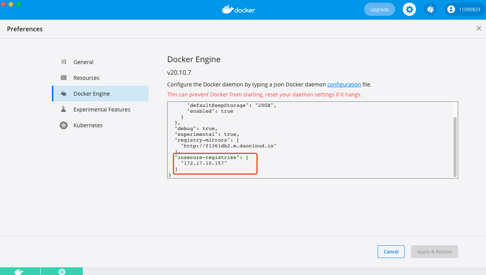
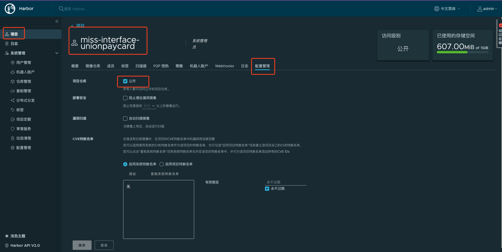
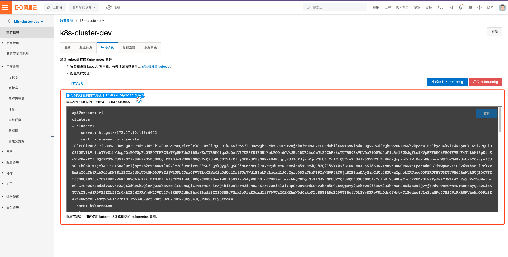
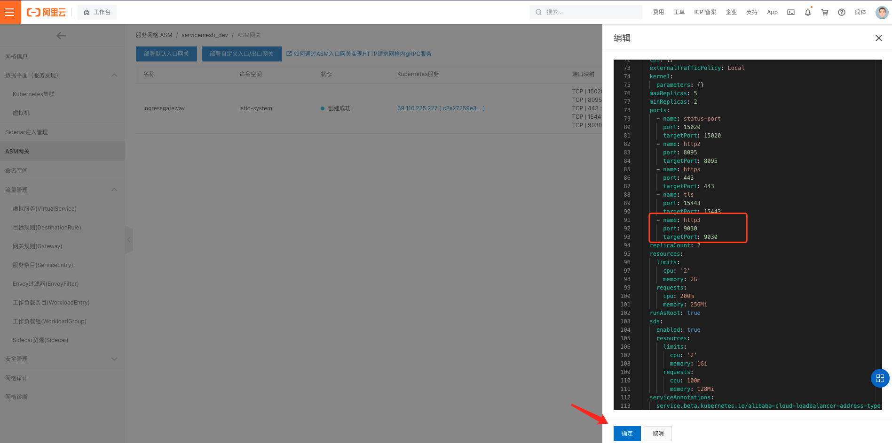

# 公司服务Service Mesh改造 <!-- {docsify-ignore-all} -->


## 产品选型

> 阿里云k8s集群，阿里云服务网格

官方文档地址：https://help.aliyun.com/product/147365.html?spm=5176.13895322.help.dexternal.69975fcfBXxgf5

> 自建Harbor镜像仓库

开发环境镜像仓库地址：http://172.17.10.157/harbor/projects

账号：admin

密码：Harbor12345

## 镜像推送、拉取问题

> 开发机器docker解决，docker login失败问题

```shell
~ docker login 172.17.10.157
~ Username:admin
~ Password:Harbor12345
报错 
Error response from daemon: Get https://172.17.10.157/v2/: net/http: request canceled while waiting for connection (Client.Timeout exceeded while awaiting headers)
```
报错原因：Docker docker registry交互默认使用的是HTTPS，我们搭建的harbor使用HTTP服务，所以会报错，解决办法是 linux环境修改/etc/docker/daemon.json

```shell
vim /etc/docker/daemon.json
{
"registry-mirrors": ["https://k728i8z5.mirror.aliyuncs.com"],
"insecure-registries":["172.17.10.157:5000"],
"insecure-registries":["172.17.10.157"] # 新增
}
```

macOs的Docker Desktop修改如下：




> 阿里云k8s集群拉取镜像失败问题解决
  
**harbor仓库权限设置公开：**

登陆Harbor-》项目-》选择项目-》配置管理-》项目仓库勾选公开



> Dockerfile构建，推送

- **Dockerfile编写**

以MISS.ABS.UnionPayCard服务为例
```yaml
# 公司镜像仓库基础镜像
FROM registry.ruubypay.net/library/centos-jdk:7.7.8u151
# 项目构建产物ADD到/opt/MISS.ABS.UnionPayCard，注意：构建产物要有配置文件
ADD target/release /opt/MISS.ABS.UnionPayCard
# 指定工作目录
WORKDIR /opt/MISS.ABS.UnionPayCard
# 容器启动执行命令
ENTRYPOINT ["sh","-c","java  -jar MISS.ABS.UNIONPAYCARD.jar"]
```

- **项目构建**

```shell
mvn clean package
```

- **镜像制作**

```shell
# 本地镜像构建
docker build -t miss-abs-unionpaycard:4.5.2.2 .
# 创建tag
docker tag miss-abs-unionpaycard:4.5.2.2 172.17.10.157/miss-abs-unionpaycard/2021.08.07:4.5.2.2
# 将镜像推送到远程仓库
docker push 172.17.10.157/miss-abs-unionpaycard/2021.08.07:4.5.2.2
```

## 阿里云k8s集群配置

> 本地kubectl登陆到阿里云k8s集群

**阿里云选择k8s集群-》集群信息-》连接信息-》将配置内容复制到计算机 $HOME/.kube/config 文件下**

**注意：事先备份一下config，以便于恢复本机k8s的使用**



> 阿里云k8s安全组修改

**注意：根据实际情况添加k8s集群的安全组，以便于直接通过pod的ip+端口访问应用**

> 阿里云k8s集群网关监听端口增加

当新增部署服务时，必须要在k8s集群增加健康监测的端口，该端口也用于应用访问，阿里云k8s集群ASM网关增加端口监听配置如下：

**服务网格-》选择网格-》ASM网格-》YAML-》在ports处新增端口号-》确定**，如下图：



## 应用部署

> 部署应用yaml文件编写

以miss-abs-unionpaycard服务为例，随便命名，这里叫deployment.yaml

```yaml
apiVersion: apps/v1 # 指定api版本，此值必须在kubectl api-versions中
kind: Deployment # 指定创建资源的角色/类型 这里资源类型可以是 Deployment、Job、Ingress、Service 等
metadata:
  labels: # 设定资源的标签
    app: miss-abs-unionpaycard
    version: 4.5.2.2
  name: miss-abs-unionpaycard-4.5.2.2
  namespace: default
spec: # 资源规范字段
  replicas: 1 # 声明副本数量
  selector: # 选择器
    matchLabels: # 匹配标签
      app: miss-abs-unionpaycard
  strategy: # 策略
    rollingUpdate: # 滚动更新
      maxSurge: 25% # 最大额外可以存在的副本数，可以为百分比，也可以为整数
      maxUnavailable: 25% # 在更新过程中能够进入不可用状态的 Pod 的最大值，可以为百分比，也可以为整数
    type: RollingUpdate # 滚动更新
  template: # 模版
    metadata: # 资源的元数据/属性
      creationTimestamp: null
      labels: # 设置资源的标签
        app: miss-abs-unionpaycard
        version: 4.5.2.2
    spec: # 资源规范字段
      containers:
        - command:
            - java
            - -XX:+PrintGCDetails
            - -XX:+PrintGCTimeStamps
            - -Xloggc:gc.log
            - -XX:+HeapDumpOnOutOfMemoryError
            - -XX:HeapDumpPath=oom.hprof
            - -jar
            - MISS.ABS.UNIONPAYCARD.jar
          name: miss-abs-unionpaycard # 容器名
          image: 172.17.10.157/miss-abs-unionpaycard/2021.08.09:4.5.2.2 # 容器使用的镜像地址
          imagePullPolicy: IfNotPresent # 每次Pod启动拉取镜像策略，三个选择 Always、Never、IfNotPresent
          # Always，每次都检查；Never，每次都不检查（不管本地是否有）；IfNotPresent，如果本地有就不检查，如果没有就拉取
          ports:
            - containerPort: 9030 # 容器对外开放端口
              protocol: TCP
          readinessProbe:
            failureThreshold: 3
            initialDelaySeconds: 60
            periodSeconds: 30
            successThreshold: 1
            tcpSocket:
              port: 9030
            timeoutSeconds: 1
---
apiVersion: v1
kind: Service # Service声明
metadata:
  name: miss-abs-unionpaycard-svc # Service名，与项目声明的服务名相同，网格内部的服务通过声明的服务名/接口的方式调用
  labels:
    app: miss-abs-unionpaycard
spec:
  type: ClusterIP
  ports:
    - port: 9030 # Service端口
      name: http
      targetPort: 9030 # 映射的容器的端口，和容器端口一样
  selector:
    app: miss-abs-unionpaycard
---
```

**部署应用**

```shell
kubectl apply -f deployment.yaml
```

> 定义Istio资源

以miss-abs-unionpaycard服务为例，以istio-respurce.yaml命名

```yaml
# 如果网格外部应用访问网格内应用，需要为其配置Istio 网关，否则不需要配置
apiVersion: networking.istio.io/v1beta1
kind: Gateway # Istio网关
metadata:
  name: miss-abs-unionpaycard-gw # Istio网关名称
  namespace: default
spec:
  selector:
    istio: ingressgateway # k8s集群网关
  servers:
    - hosts:
        - "*"
      port:
        number: 9030 # Istio网关暴露端口
        name: http
        protocol: HTTP
---
apiVersion: networking.istio.io/v1beta1
kind: DestinationRule # 规则
metadata:
  name: miss-abs-unionpaycard-destination
  namespace: default
spec:
  host: miss-abs-unionpaycard-svc
  subsets: # 子集
    - name: v1 # 子集名称
      labels:
        version: 4.5.2.2 # 资源版本
---
apiVersion: networking.istio.io/v1beta1
kind: VirtualService # 虚拟服务，用于定义负载等
metadata:
  name: miss-abs-unionpaycard-route
  namespace: default
spec:
  hosts:
  - "*"
  gateways:
  - miss-abs-unionpaycard-gw # Istio网关声明
  http:
  - match:
    - uri:
        prefix: / # 匹配前缀
    route:
    - destination:
        host: miss-abs-unionpaycard-svc # Service
        port:
          number: 9030 # 服务监听端口
        subset: v1 # Destination子集名
      weight: 100 # 权重
```

**创建Istio资源**

可以通过kubectl命令，也可以在阿里云页面上创建，由于开发人员可能没有权限登陆阿里云，所以这里只介绍kubectl命令创建
```
kubectl apply -f istio-respurce.yaml
```

> 查看部署情况

**查看pod部署情况**

```shell
➜  ~ kubectl get pods
NAME                                                   READY   STATUS    RESTARTS   AGE
miss-abs-unionpaycard-4.5.2.2-7d876676-sff45           2/2     Running   0          3h34m
miss-interface-unionpaycard-4.5.2.2-757cb787fb-5twc6   2/2     Running   0          5h10m
```

**查看pod详情**

```shell
➜  ~ kubectl describe pod miss-abs-unionpaycard-4.5.2.2-7d876676-sff45
Name:         miss-abs-unionpaycard-4.5.2.2-7d876676-sff45
Namespace:    default
Priority:     0
Node:         cn-beijing.172.17.90.204/172.17.90.204
Start Time:   Mon, 09 Aug 2021 16:35:23 +0800
Labels:       app=miss-abs-unionpaycard
              istio.io/rev=
              pod-template-hash=7d876676
              security.istio.io/tlsMode=istio
              service.istio.io/canonical-name=miss-abs-unionpaycard
              service.istio.io/canonical-revision=4.5.2.2
              version=4.5.2.2
Annotations:  kubernetes.io/psp: ack.privileged
              sidecar.istio.io/status:
                {"version":"6ed095e24483131ef58da6c06cb9def878fb9d1a1398306b51de25b72c1fbd26","initContainers":["istio-init"],"containers":["istio-proxy"]...
Status:       Running
IP:           172.17.70.177
IPs:
  IP:           172.17.70.177
Controlled By:  ReplicaSet/miss-abs-unionpaycard-4.5.2.2-7d876676
Init Containers:
  istio-init:
    Container ID:  docker://2951698054c03246b28247eb4a20472ae1b925b38ca72f49e66f392427c561cb
    Image:         registry-vpc.cn-beijing.aliyuncs.com/acs/proxyv2:1.8.6
    Image ID:      docker-pullable://registry-vpc.cn-beijing.aliyuncs.com/acs/proxyv2@sha256:c84cc6443bb34e499adfecf09ab2389c55d288b61be6e98c6ff8028f7bfb9bf8
    Port:          <none>
    Host Port:     <none>
    Args:
      istio-iptables

...
```

**查看service情况**

```shell
➜  ~ kubectl get services
NAME                              TYPE        CLUSTER-IP        EXTERNAL-IP   PORT(S)    AGE
kubernetes                        ClusterIP   192.168.0.1       <none>        443/TCP    45h
miss-abs-unionpaycard-svc         ClusterIP   192.168.137.70    <none>        9030/TCP   3h57m
miss-interface-unionpaycard-svc   ClusterIP   192.168.246.144   <none>        8095/TCP   5h12m
```

**进入容器**

```shell
➜  ~ kubectl exec -it miss-abs-unionpaycard-4.5.2.2-7d876676-sff45 -c miss-abs-unionpaycard -- /bin/bash
[root@miss-abs-unionpaycard-4 MISS.ABS.UnionPayCard]# ll
total 436
-rw-r--r-- 1 root root    620 Aug  9 16:23 application.properties
-rw-r--r-- 1 root root    863 Aug  9 16:23 application.properties.sample
-rw-r--r-- 1 root root   6103 Aug  9 16:23 -config-MISS.ABS.UNIONPAYCARD-1.0.0.zip
-rw-r--r-- 1 root root    597 Aug  9 16:23 config.properties
-rw-r--r-- 1 root root    597 Aug  9 16:23 config.properties.sample
-rw-r--r-- 1 root root   4033 Aug  9 19:31 gc.log
drwxr-xr-x 2 root root  12288 Aug  9 15:40 lib
drwxr-xr-x 4 root root   4096 Aug  9 16:35 logs
-rw-r--r-- 1 root root 398293 Aug  9 16:23 MISS.ABS.UNIONPAYCARD.jar
```

**网格可视化**

> 参考：https://help.aliyun.com/document_detail/200336.html?spm=a2c4g.11186623.6.637.50a0871ct87QKj

## 服务改造方案

> zk，rocketmq，redis，drds，rds等保持不变

### 网格内部服务

参考：https://cloud.tencent.com/developer/article/1635721?from=10680

> 基于OpenFeign改造

&nbsp; &nbsp; 网格内服务可以访问网格外部的云环境，如zk，rds，drds，redis，ECS，阿里云rocketMq等应用，所以如果只是应用容器化部署，那完全不需要改造，但是如果不改造的话，完全没有应用到服务网格的特性，意义不大，所以我们要对网格内的服务进行一定的改造，由于公司服务众多牵扯较大，所以我们选用业务量较小，服务相对独立的某一块业务进行改造，这里选用的是银联卡过闸相关服务。改造步骤如下：

- **去dubbo**

*因为服务相对独立，所以网格内的服务在不存在其他网格外服务调用的情况下，将不存在网格外服务调用的dubbo服务进行去dubbo化，全部改成SpringBoot的rest接口，这里去dubbo的改造方式的目的也是为了服务完全网格化，使得应用完全不依赖任何第三方组件*

- **Dubbo项目根目录改造**

1.  根 pom.xml 引入 SpringBoot parent，增加 spring-cloud-dependencies import 引用

2.  删除所有 dubbo 相关引用。

- **service-api改造**

1. pom.xml 增加 spring-cloud-starter-openfeign 引用。

2. 删除所有 Dubbo 相关引用、Dubbo 相关配置文件。

3. Dubbo 原有 facade 接口是标准的 JAVA 接口定义，与 Feign Restful 接口定义十分类似。这里可以在原有的 facade 接口基础上增加 @FeignClient、@RequestMapping 等注解，将一个普通的 facade 接口改造成一个 Feign Restful 接口，后续会使用 Feign 这个 Restful 框架来处理服务间调用等问题。由于 Feign本身是自带了 Ribbon 负载均衡，服务访问者经过负载均衡后会找到服务提供者的一个 IP+Port 进行调用，这与 K8S Service 要求的服务名调用的方式相冲突，所以必须想办法去掉  Feign 自带的负载均衡。好在 @FeignClient 可以手工指定一个固定的调用地址，这里可以把这个地址设置成 K8S Service 的 name 名称，从而实现了通过Feign 对 K8S Service 服务名调用的能力。此部分需要每个 facade 接口增加注解一次，改造工作量相对可控。

4. 由于 Feign 要求接口使用 Restful 格式，所以接口中的每个抽象方法都必须添加 @RequestMapping、@GetMapping、@PostMapping 等注解暴露成一个 Restful 资源地址。此部分改造涉及到每个 facade 接口的每个抽象方法，是整个方案里改动量最大的一部分。

5. 此部分整体改造工作量取决于原有的 Dubbo 项目包含多少个 facade 接口，以及每个 facade 包含多少个抽象方法。

改造前示例：

```java
public interface HelloService {
	String sayHello(String name);
}
```

改造后示例：

```java
@FeignClient(name = "dubbo-provider", url = "http://dubbo-provider:8001")
public interface HelloService {
	@GetMapping(value = "/apis/hello/{name}")
	String sayHello(@PathVariable String name);
}
```

- **service-provider改造**

1. pom.xml 增加 spring-boot-starter-web、spring-cloud-starter-openfeign 等引用，同时增加 SpringBoot mainClass 标准启动项配置。删除所有 Dubbo 相关引用、Dubbo 相关配置文件。

2. 增加 SpringBoot 启动类，增加 @SpringBootApplication、@EnableFeignClients 两个注解，配置 dubbo-provider 服务端口号。

3. xxxServiceImpl 服务实现类上增加 @RestController 注解，提供 consumer Restful 访问的能力。 这个需要每个服务实现类都加上 @RestController 注解，不要遗漏。

4. 此部分大都属于一次性改动，改造工作量相对可控。

改造后示例：

pom

```xml
<?xml version="1.0" encoding="UTF-8"?>
<project xmlns="http://maven.apache.org/POM/4.0.0" xmlns:xsi="http://www.w3.org/2001/XMLSchema-instance"
         xsi:schemaLocation="http://maven.apache.org/POM/4.0.0 http://maven.apache.org/xsd/maven-4.0.0.xsd">
    <modelVersion>4.0.0</modelVersion>

    <parent>
        ...
    </parent>

    <artifactId>dubbo-provider</artifactId>
    <name>dubbo-provider</name>

    <dependencies>
        <dependency>
            <groupId>io.xyzdemo.dubbo</groupId>
            <artifactId>dubbo-facade</artifactId>
        </dependency>
        <dependency>
            <groupId>org.springframework.boot</groupId>
            <artifactId>spring-boot-starter-web</artifactId>
        </dependency>
        <dependency>
            <groupId>org.springframework.cloud</groupId>
            <artifactId>spring-cloud-starter-openfeign</artifactId>
        </dependency>
    </dependencies>

    <build>
        ...
    </build>
</project>
```

改造后的 HelloServiceImpl.java 代码示例（改造前只是缺少 @RestController 注解，其他代码完全一致）：

```java
@RestController
public class HelloServiceImpl implements HelloService {
	public String sayHello(String name) {
		return String.format("hello %s! podIP is %s!", name, CommonUtils.getLocalIP());
	}
}
```

- **service-consumer改造**

1. pom.xml 增加 spring-boot-starter-web、spring-cloud-starter-openfeign 等引用，同时增加 SpringBoot mainClass 标准启动项配置。

2. 删除所有 Dubbo 相关引用、Dubbo 相关配置文件。

3. 增加 SpringBoot 启动类，增加 @SpringBootApplication、@EnableFeignClients（需要配置 basePackages 扫描包路径） 两个注解，并配置 dubbo-consumer 服务端口号。

4. 此部分大都属于一次性改动，改造工作量相对可控。

由于dubbo-consumer 项目改造与dubbo-provider 改造极其相似，这里不再贴出代码示例。

> 完全SpringBoot化

此种方式完全去掉原先的微服务api依赖，将provider和consumer所以的dubbo依赖去掉，将service-api同样删掉，consumer接口完全改造成SpringBoot的rest接口，provider通过restTemplate等Http客户端进行调用，调用方式如下

- **服务名声明**

*SpringBoot服务声明唯一的服务名，用于网格内部服务互相之间调用，网格内部服务可以通过http://服务名/接口名  的方式进行调用，声明方式如下：*

```properties
spring.application.name=miss-abs-unionpaycard-svc
```

### 网格内部与外部服务之间

- 网格外部服务如果既提供了dubbo接口又提供了http接口那就将网格内部服务调用网格外部服务使用http的方式。
- 网格外部服务通过Istio网关用http的方式调用网格内部服务