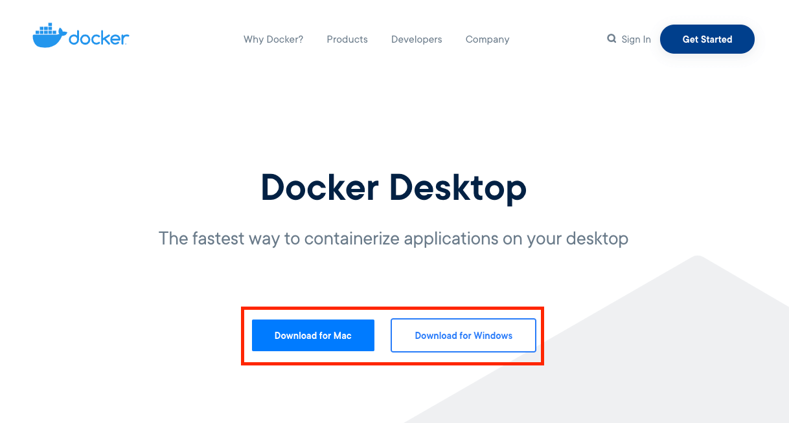
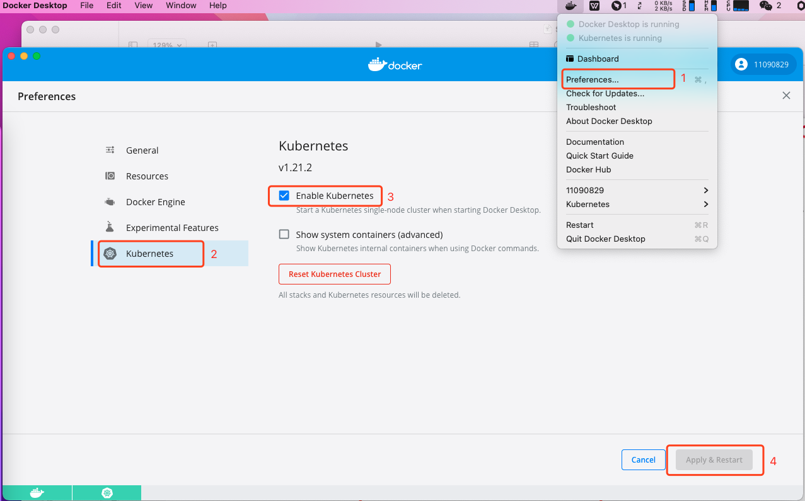
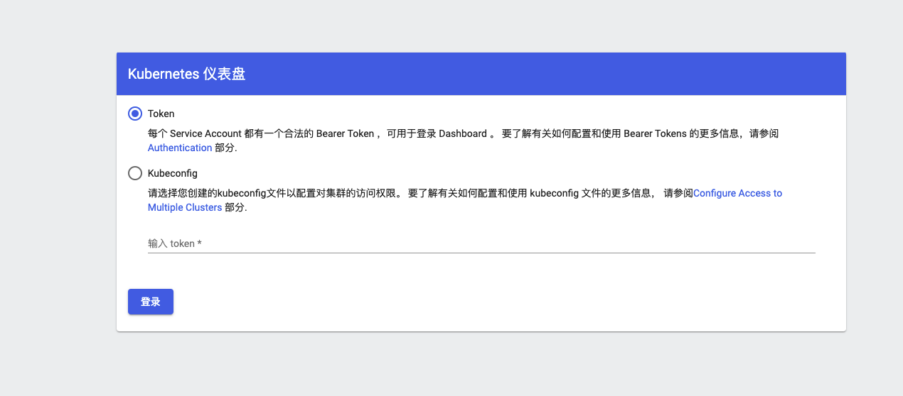
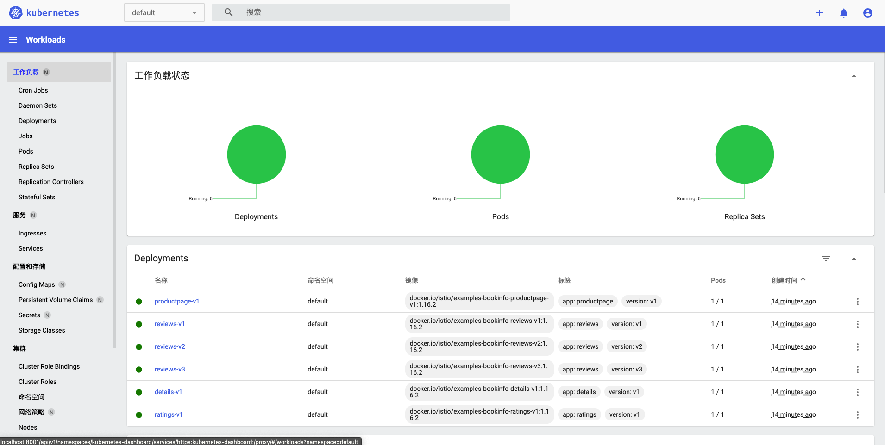
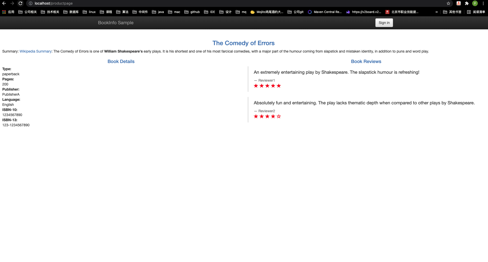

# Service Mesh - Kubernetes & Istio 开发环境搭建(Mac OS) <!-- {docsify-ignore-all} -->

&nbsp;
&nbsp; 
&nbsp;
&nbsp; 

- Kubernetes环境准备
- Istio

## 1.1. Kubernetes环境准备

### 1.1.1. 安装Docker Desktop

&nbsp; &nbsp; Istio 依托于 Kubernetes，因此，首先我们先安装 Kubernetes。Kubernetes 有许多安装的方法，包括：Minikube、kubeadm、Docker Desktop。本文选用较为便捷的 Docker Desktop。

&nbsp; &nbsp; 前往[Docker Desktop](https://www.docker.com/products/docker-desktop)官网选择对应系统安装包下载并安装。



### 1.1.2. 安装Kubernetes

- 打开Docker Desktop，点击Preferences，选择左侧的Kubernetes并勾选Enable Kubernetes，最后点击Apply&Restart



- **安装Kubernetes后，Kubernetes显示Running状态，打开Resource，在Advance中将CPU设置4个核心（至少4个），内存设置为至少8GB，点击Apply&Restart**


### 1.1.3. 验证Kubernetes

- 首先，先切换 Kubernetes 的 config 到 docker-desktop

```shell
liupenghui:~ penghuiliu$ kubectl config use docker-desktop
Switched to context "docker-desktop".
```

- 查看命名空间

```shell
liupenghui:~ penghuiliu$ kubectl get ns
NAME              STATUS   AGE
default           Active   3h35m
kube-node-lease   Active   3h35m
kube-public       Active   3h35m
kube-system       Active   3h35m
```

### 1.1.4. 部署dashboard

Kubernetes dashboard托管在`https://github.com/kubernetes/dashboard`

- yaml文件

```shell
wget https://raw.githubusercontent.com/kubernetes/dashboard/v2.3.1/aio/deploy/recommended.yaml
```

- 执行安装命令

```shell
liupenghui:~ penghuiliu$ kubectl apply -f recommended.yaml 
namespace/kubernetes-dashboard created
serviceaccount/kubernetes-dashboard created
service/kubernetes-dashboard created
secret/kubernetes-dashboard-certs created
secret/kubernetes-dashboard-csrf created
secret/kubernetes-dashboard-key-holder created
configmap/kubernetes-dashboard-settings created
role.rbac.authorization.k8s.io/kubernetes-dashboard created
clusterrole.rbac.authorization.k8s.io/kubernetes-dashboard created
rolebinding.rbac.authorization.k8s.io/kubernetes-dashboard created
clusterrolebinding.rbac.authorization.k8s.io/kubernetes-dashboard created
deployment.apps/kubernetes-dashboard created
service/dashboard-metrics-scraper created
deployment.apps/dashboard-metrics-scraper created
```

### 1.1.5. 查看dashboard

```shell
liupenghui:~ penghuiliu$ kubectl proxy
Starting to serve on 127.0.0.1:8001
```

打开[http://localhost:8001/api/v1/namespaces/kubernetes-dashboard/services/https:kubernetes-dashboard:/proxy/](http://localhost:8001/api/v1/namespaces/kubernetes-dashboard/services/https:kubernetes-dashboard:/proxy/)



这是因为权限的原因，可通过以下方法获取 Token。

首先，创建 ServiceAccount

```shell
liupenghui:kubernetes penghuiliu$ cat <<EOF | kubectl apply -f -
> apiVersion: v1
> kind: ServiceAccount
> metadata:
>   name: admin-user
>   namespace: kubernetes-dashboard
> EOF
serviceaccount/admin-user created
```

创建 ClusterRoleBinding 为 dashboard sa 授权集群权限 cluster-admin

```shell
liupenghui:kubernetes penghuiliu$ cat <<EOF | kubectl apply -f -
> apiVersion: rbac.authorization.k8s.io/v1
> kind: ClusterRoleBinding
> metadata:
>   name: admin-user
> roleRef:
>   apiGroup: rbac.authorization.k8s.io
>   kind: ClusterRole
>   name: cluster-admin
> subjects:
>   - kind: ServiceAccount
>     name: admin-user
>     namespace: kubernetes-dashboard
> EOF
clusterrolebinding.rbac.authorization.k8s.io/admin-user created
```

获取 Token1

```shell
liupenghui:kubernetes penghuiliu$ kubectl -n kubernetes-dashboard describe secret $(kubectl -n kubernetes-dashboard get secret | grep admin-user | awk '{print $1}')
Name:         admin-user-token-qvn2v
Namespace:    kubernetes-dashboard
Labels:       <none>
Annotations:  kubernetes.io/service-account.name: admin-user
              kubernetes.io/service-account.uid: ccd1f196-261f-484b-ba0d-d90c7666681b

Type:  kubernetes.io/service-account-token

Data
====
ca.crt:     1066 bytes
namespace:  20 bytes
token:      eyJhbGciOiJSUzI1NiIsImtpZCI6ImNxZkt4VnFnMEFwMTRzZjJJS1BzcWNIT1lCV1QyWkVaSUF3bGtSVjBxNzAifQ.eyJpc3MiOiJrdWJlcm5ldGVzL3NlcnZpY2VhY2NvdW50Iiwia3ViZXJuZXRlcy5pby9zZXJ2aWNlYWNjb3VudC9uYW1lc3BhY2UiOiJrdWJlcm5ldGVzLWRhc2hib2FyZCIsImt1YmVybmV0ZXMuaW8vc2VydmljZWFjY291bnQvc2VjcmV0Lm5hbWUiOiJhZG1pbi11c2VyLXRva2VuLXF2bjJ2Iiwia3ViZXJuZXRlcy5pby9zZXJ2aWNlYWNjb3VudC9zZXJ2aWNlLWFjY291bnQubmFtZSI6ImFkbWluLXVzZXIiLCJrdWJlcm5ldGVzLmlvL3NlcnZpY2VhY2NvdW50L3NlcnZpY2UtYWNjb3VudC51aWQiOiJjY2QxZjE5Ni0yNjFmLTQ4NGItYmEwZC1kOTBjNzY2NjY4MWIiLCJzdWIiOiJzeXN0ZW06c2VydmljZWFjY291bnQ6a3ViZXJuZXRlcy1kYXNoYm9hcmQ6YWRtaW4tdXNlciJ9.XsUoGF1gbw3xL7QM1C8e_Yx2LC3VoOMyaURfBAwKDJM_WqEZa2Q0M-hvWAZHO-xvxFCfcS-WeOMLd25rQGWI_yEk_QMxUBQbBFb8Hy9KwRCvGvXdg2OIo6MTdUfcrP0MNm51kATOQ6i2pRCMvInEq_uy0PNrDG36kK2e3Gk0_L_EeOqgAsFn-K-0vk0BkGK_YKgwPDTwbgGCsFxHQnSP1OnhC1YAW6_-rW-dHWZIitlhXcDCVv3k1MH17K1ztjpHxsSCBdkuSERyUe3ihZJXy8UTx9o9fNvQXHH56e5q0LT8VNbKTdjwjMzpEFQFyODzE9YctTKXPy0imtckyfut7Q
```

获取Token2

```shell
kubectl create token admin  --namespace kube-system
```


拷贝token，并粘贴，即可进入dashboard



至此，Kubernetes已安装完毕，下面将Istio安装到Kubernetes中。

## 1.2. Istio

### 1.2.1. 下载Istio

1、访问 [Istio release](https://github.com/istio/istio/releases/) 页面下载与您操作系统对应的安装文件。在 macOS 或 Linux 系统中，也可以通过以下命令下载最新版本的 Istio：

```shell
curl -L https://istio.io/downloadIstio | sh -
```

2、切换到 Istio 包所在目录下

```shell
liupenghui:kubernetes penghuiliu$ cd istio-1.10.2
liupenghui:istio-1.10.2 penghuiliu$ ll
total 48
drwxr-x---@  9 penghuiliu  staff    288  6 22 03:29 ./
drwxr-xr-x   5 penghuiliu  staff    160  7  2 23:25 ../
-rw-r--r--@  1 penghuiliu  staff  11348  6 22 03:29 LICENSE
-rw-r--r--@  1 penghuiliu  staff   5866  6 22 03:29 README.md
drwxr-x---@  3 penghuiliu  staff     96  6 22 03:29 bin/
-rw-r-----@  1 penghuiliu  staff    768  6 22 03:29 manifest.yaml
drwxr-xr-x@  5 penghuiliu  staff    160  6 22 03:29 manifests/
drwxr-xr-x@ 21 penghuiliu  staff    672  6 22 03:29 samples/
drwxr-xr-x@  5 penghuiliu  staff    160  6 22 03:29 tools/
liupenghui:istio-1.10.2
```
 注：安装目录包含如下内容：
- manifests/profiles/ 目录下，有 Kubernetes 相关的 YAML 安装文件
- samples/ 目录下，有示例应用程序
- bin/ 目录下，包含 istioctl 的客户端文件。istioctl 工具用于手动注入 Envoy sidecar 代理。

3、将**istioctl**客户端路径增加到 path 环境变量中，macOS 或 Linux 系统的增加方式如下：

```shell
$ export PATH=$PWD/bin:$PATH
```

4、验证安装

```shell
$ istioctl version --remote=false
1.10.2
```
  注：在使用 Bash 或 ZSH 控制台时，可以选择启动[auto-completion option](https://istio.io/latest/docs/ops/diagnostic-tools/istioctl/#enabling-auto-completion)。具体步骤如下：

- Linux Bash

```shell
$ cp tools/istioctl.bash ~
$ source ~/istioctl.bash
```

- macOS

```shell
$ cp tools/_istioctl ~
$ source ~/_istioctl
```

### 1.2.2. 安装 Istio

#### 1.2.2.1. 配置文件

istioctl 内置了几个[配置文件(config profiles)](https://istio.io/latest/docs/setup/additional-setup/config-profiles/)供我们选择。

```shell
liupenghui:istio-1.10.2 penghuiliu$ istioctl profile list
Istio configuration profiles:
    default
    demo
    empty
    external
    minimal
    openshift
    preview
    remote
```
这些配置文件提供了对 Istio 控制平面和 Istio 数据平面 sidecar 的定制内容。 你可以从 Istio 内置配置文件的其中一个开始入手，然后根据您的特定需求进一步自定义配置文件。当前提供以下几种内置配置文件:

- **default**：根据默认的安装选项启用组件 (建议用于生产部署)。
- **demo**：这一配置具有适度的资源需求，旨在展示 Istio 的功能。它适合运行 Bookinfo 应用程序和相关任务。 这是通过快速开始指导安装的配置，但是您以后可以通过自定义配置 启用其他功能来探索更高级的任务。
- **minimal**：使用 Istio 的流量管理功能所需的最少组件集。
- **remote**：用于配置多集群网格的远程集群。
- **empty**：什么都不部署。 这可用作自定义配置的基本配置文件。
- **preview**: preview 配置文件包含实验性功能。 目的是探索 Istio 的新功能。 不能保证稳定性，安全性和性能-使用风险自负。

如果你想进一步[自定义安装 Istio 和 addons](https://istio.io/latest/docs/setup/install/istioctl/#customizing-the-configuration)，你可以在`istioctl install`的时候增加`--set <key>=<value>`配置项

如果你想查看配置文件中都有那些配置，可以通过`profile dump`命令：
```shell
liupenghui:istio-1.10.2 penghuiliu$ istioctl profile dump demo
2021-07-02T15:46:04.560200Z     info    proto: tag has too few fields: "-"
apiVersion: install.istio.io/v1alpha1
kind: IstioOperator
spec:
  components:
    base:
      enabled: true
    cni:
      enabled: false
    egressGateways:
    - enabled: true
      k8s:
        resources:
          requests:
            cpu: 10m
            memory: 40Mi
      name: istio-egressgateway
...
```

### 1.2.3. 安装

为了更接近生产环境。因此，这里选用**default**配置文件部署Istio。

```shell
liupenghui:istio-1.10.2 penghuiliu$ istioctl install --set profile=default
This will install the Istio 1.10.2 default profile with ["Istio core" "Istiod" "Ingress gateways"] components into the cluster. Proceed? (y/N) y
✔ Istio core installed                                                                                                                                                      
✔ Istiod installed                                                                                                                                                          
✔ Ingress gateways installed                                                                                                                                                
✔ Installation complete

Thank you for installing Istio 1.10.  Please take a few minutes to tell us about your install/upgrade experience!  https://forms.gle/KjkrDnMPByq7akrYA
```

#### 1.2.3.1. 启动自动注入

通过以下命令，为 default 命名空间开启 sidecar 自动注入。

```shell
liupenghui:istio-1.10.2 penghuiliu$ kubectl label namespace default istio-injection=enabled
namespace/default labeled
```

#### 1.2.3.2. 验证Istio

1、部署 Bookinfo 例子程序

```shell
liupenghui:istio-1.10.2 penghuiliu$ kubectl apply -f samples/bookinfo/platform/kube/bookinfo.yaml 
service/details created
serviceaccount/bookinfo-details created
deployment.apps/details-v1 created
service/ratings created
serviceaccount/bookinfo-ratings created
deployment.apps/ratings-v1 created
service/reviews created
serviceaccount/bookinfo-reviews created
deployment.apps/reviews-v1 created
deployment.apps/reviews-v2 created
deployment.apps/reviews-v3 created
service/productpage created
serviceaccount/bookinfo-productpage created
deployment.apps/productpage-v1 created
```

2、验证 services & pods

```shell
liupenghui:istio-1.10.2 penghuiliu$ kubectl get services
NAME          TYPE        CLUSTER-IP       EXTERNAL-IP   PORT(S)    AGE
details       ClusterIP   10.102.67.51     <none>        9080/TCP   2m31s
kubernetes    ClusterIP   10.96.0.1        <none>        443/TCP    5h6m
productpage   ClusterIP   10.98.232.233    <none>        9080/TCP   2m30s
ratings       ClusterIP   10.101.141.135   <none>        9080/TCP   2m31s
reviews       ClusterIP   10.99.79.75      <none>        9080/TCP   2m30s
liupenghui:istio-1.10.2 penghuiliu$ kubectl get pods -w
NAME                              READY   STATUS    RESTARTS   AGE
details-v1-79f774bdb9-9qk7b       2/2     Running   0          4m8s
productpage-v1-6b746f74dc-52w7g   2/2     Running   0          4m8s
ratings-v1-b6994bb9-8wn5g         2/2     Running   0          4m8s
reviews-v1-545db77b95-hb65f       2/2     Running   0          4m8s
reviews-v2-7bf8c9648f-65qrx       2/2     Running   0          4m8s
reviews-v3-84779c7bbc-j9kk6       2/2     Running   0          4m8s
```

3、验证服务访问

```shell
liupenghui:istio-1.10.2 penghuiliu$ kubectl exec -it $(kubectl get pod -l app=ratings -o jsonpath='{.items[0].metadata.name}') -c ratings -- curl productpage:9080/productpage | grep -o "<title>.*</title>"
<title>Simple Bookstore App</title>
```

4、部署 gateway

```shell
liupenghui:istio-1.10.2 penghuiliu$  kubectl apply -f samples/bookinfo/networking/bookinfo-gateway.yaml
gateway.networking.istio.io/bookinfo-gateway created
virtualservice.networking.istio.io/bookinfo created
```

确认部署

```shell
liupenghui:istio-1.10.2 penghuiliu$ kubectl get gateway
NAME               AGE
bookinfo-gateway   36s
```

5、获取访问路径

```shell
liupenghui:istio-1.10.2 penghuiliu$ kubectl get services -n istio-system
NAME                   TYPE           CLUSTER-IP      EXTERNAL-IP   PORT(S)                                      AGE
istio-ingressgateway   LoadBalancer   10.96.90.225    localhost     15021:30494/TCP,80:31586/TCP,443:30107/TCP   26m
istiod                 ClusterIP      10.98.207.134   <none>        15010/TCP,15012/TCP,443/TCP,15014/TCP        29m
```

通过查看`istio-ingressgateway`的`EXTERNAL-IP`为`localhost`，可得知访问地址为 http://localhost/productpage



## 1.3. 小结

至此，我们已经将 Kubernetes & Istio 开发环境搭建完毕

## 1.4. 参考

[Service Mesh - Istio](https://makeoptim.com/service-mesh/kubernetes-istio-setup)