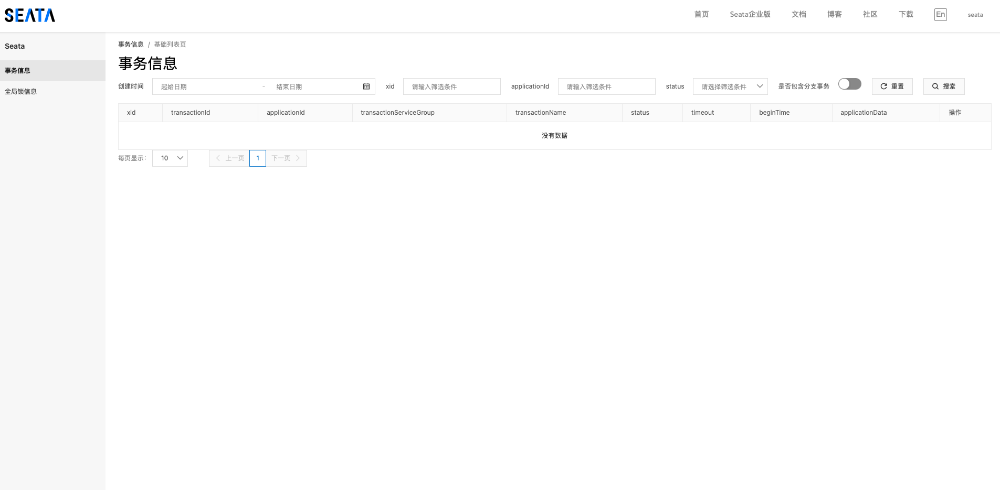

# Spring Cloud Alibaba-分布式事务Seata（安装Seata Server） <!-- {docsify-ignore-all} -->


> 注：以Nacos为配置中心、注册中心，以db为数据存储，并且已安装Nacos和数据库


## 下载Seata Server

[下载](https://github.com/seata/seata/releases)Seata Server，并解压到服务器。


## 启动Seata Server

#### 数据库建表

​    打开seata/script/server/db文件夹，数据库表初始化脚本就在这个文件夹下 选择对应数据库的初始化脚本去数据库执行即可，我这里使用`mysql.sql`脚本文件。

#### 初始化配置到Nacos

- 按需修改seata/script/config-center/config.txt

​    该配置可作为配置模式为file的配置数据，也作为初始化Nacos配置中心配置的配置模板，可以提前将该配置文件内容修改成正确的再执行数据同步脚本把配置数据同步到Nacos。

- 同步配置到Nacos

​    进入seata/script/config-center/nacos文件夹，执行如下脚本：

​    -h nacos host 

​    -p nacos port

​    -g nacos group

​    -t nacos 命名空间

​    -u nacos用户名

​    -p nacos密码

```shell
➜  nacos nacos-config.sh -h localhost -p 8848 -g SEATA_GROUP -t 5a3c7d6c-f497-4d68-a71a-2e5e3340b3ca -u username -w password
```

> 注：在同步配置时如果有配置项值是空的会报nacos-config.sh: line 88: [: too many arguments，这个不影响正常配置同步，这是因为是空的所以报错了，如果这个值实际上是有的提前修改好config.txt或在配置同步后自己从nacos手动添加上这个配置也可以

- 同步后结果


#### 修改Seata Server配置文件

- application.yml修改

​    打开文件夹seata/conf，打开application.yml文件，按照如下配置修改config，registry，store配置即可

```yaml
seata:
  config:
    # support: nacos, consul, apollo, zk, etcd3
    type: nacos
    nacos:
      server-addr: 127.0.0.1:8848
      group : "SEATA_GROUP"
      namespace: "acbe9e62-36d7-4feb-b137-d04b6c6c164e"
      username: "nacos"
      password: "nacos"
  registry:
    # support: nacos, eureka, redis, zk, consul, etcd3, sofa
    type: nacos
    nacos:
      server-addr: 127.0.0.1:8848
      group : "SEATA_GROUP"
      namespace: "acbe9e62-36d7-4feb-b137-d04b6c6c164e"
      username: "nacos"
      password: "nacos"
  store:
    # support: file 、 db 、 redis
    mode: db
    db:
      datasource: druid
      db-type: mysql
      driver-class-name: com.mysql.jdbc.Driver
      url: jdbc:mysql://127.0.0.1:3316/seata?rewriteBatchedStatements=true
      user: root
      password: admin123
      min-conn: 5
      max-conn: 100
      global-table: global_table
      branch-table: branch_table
      lock-table: lock_table
      distributed-lock-table: distributed_lock
      query-limit: 100
      max-wait: 5000
```

#### 启动Seata Server

```shell
sh seata-server.sh -h 127.0.0.1 -p 8091 -m db
```

- 控制台

​    浏览器输入http://localhost:7091，用户名：seata 密码：seata



