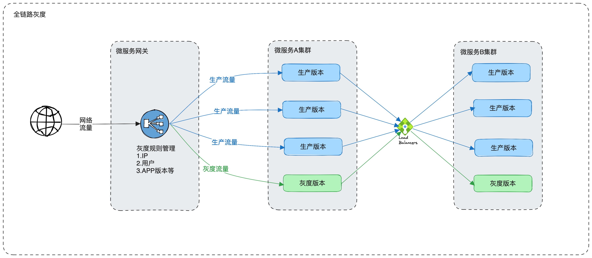
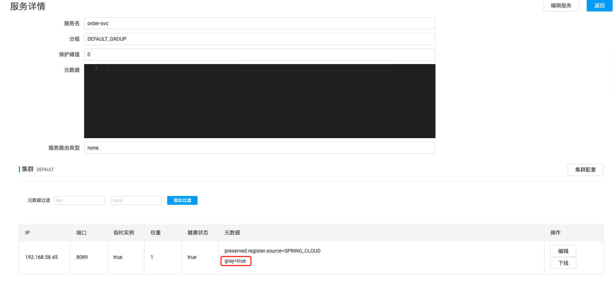
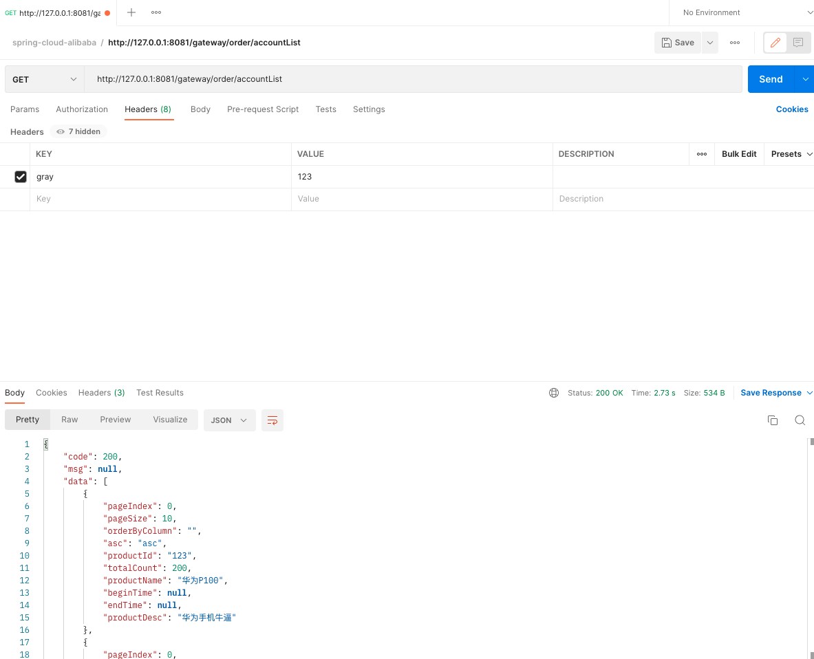

# Spring Cloud Alibaba-全链路灰度设计 <!-- {docsify-ignore-all} -->


## 灰度发布概念

-- 摘自百度百科

​    灰度发布（又名金丝雀发布）是指在黑与白之间，能够平滑过渡的一种发布方式。在其上可以进行A/B testing，即让一部分用户继续用产品特性A，一部分用户开始用产品特性B，如果用户对B没有什么反对意见，那么逐步扩大范围，把所有用户都迁移到B上面来。灰度发布可以保证整体系统的稳定，在初始灰度的时候就可以发现、调整问题，以保证其影响度。

​    对比灰度发布，还有蓝绿发布，滚动发布，笔者在工作中用到最多的是滚动发布，滚动发布也并不能平滑的将一部分指定的流量切到新系统上，只能做到切部分流量这部分流量是无法指定的也是随机的，所以基于此笔者就着手做全链路灰度发布相关的研究。蓝绿发布，滚动发布的具体概念自行Google吧。


## 灰度发布架构

​    这里我画了一个图，简单描述一下灰度发布，这里有微服务A集群和微服务B集群，每个集群中蓝颜色的是生产实例，绿色就代表发布的灰度版本实例；可以看到网络流量是通过微服务网关为入口流入微服务集群，所以这里微服务网关就负责过滤流量管理灰度规则等，流量经过微服务网关后，可以看到灰度流量就指向了灰度版本，微服务A通过RPC调用微服务B时也通过loadbalancer也将灰度流量发到了微服务B的灰度实例上，这里图中实际缺少了一个点，就是流量由微服务网关和微服务A集群中间也是有个loadbalancer的。



​    通过上面的图和对于灰度发布架构的描述，我这里总结一下实现微服务全链路灰度发布的核心：

1. 微服务过滤流量并管理灰度发布规则；
2. loadbalancer负责进行灰度流量的重新路由；


## Spring Cloud Alibaba技术架构下的灰度发布实现

​    实现灰度发布的技术方案有很多，比如Nginx + Lua脚本方式，Nginx即可以作为微服务网关又可以做负载均衡；再比如Service Mesh技术Istio + Envoy，Istio作为控制平台管理下发灰度规则，Envoy作为网络调用组件，如果是Service Mesh技术架构可以完全采用这种架构。如果是传统的微服务架构就有可能需要自己研发一套灰度发布的组件，所以通过上面对灰度发布架构的研究，我们大致知道了如何实现灰度发布系统，我这里就基于Spring Cloud Alibaba传统微服务架构实现全链路灰度发布功能。


### 基础设计

   实现灰度发布需要终端应用（客户端）和服务端做一些约定，这个约定就代表着是否是灰度发布的客户端的网络调用，当然如果不做约定也是可以实现灰度功能的，这就需要服务端的组件对流量做更细致的过滤，比如从网络调用的报文中过滤出灰度发布应用的网络调用，这对服务端来说显然更加麻烦，也不利于维护，所以我这里采用客户端和服务端约定的方式来设计。

 #### HttpHeader设计

​    客户端和服务端在Http请求头中约定一个固定字段来标识，此标识可以代表“是否走灰度”，也可以设置成一个“用户ID”，“客户端IP”等，如果是“用户ID”，“客户端IP”那就在网关层有个配置，网关匹配到对应的参数就走灰度。

​    HttpHeader增加`gray`字段作为灰度标记

```json
{
  "gray":"123"
}
```


### Spring Cloud Gateway改造 

​    Spring Cloud Gateway在架构中是微服务网关，在灰度发布的作用就是管理灰度发布规则，设置灰度标记到HttpHeader并且传递下去。管理灰度发布规则需要一个配置，我这里选择放到配置文件当中，先实现一个Spring的自定义配置绑定，代码如下：

```java
@Configuration
@RefreshScope
@ConfigurationProperties("spring.cloud.gateway.gray")
@Data
public class GrayProperties {

    /**
     * 灰度开关
     */
    private Boolean enabled;

    /**
     * 灰度匹配内容
     */
    private List<String> matches = new ArrayList<>();
}

```

对应的在Spring Cloud Gateway的application.yml中的配置示例如下：

```yaml
spring:
  cloud:
    gateway:
      gray:
        enabled: true
        matches: 
          - 123
          - 456
          - 10.1.1.10
```

解释下配置文件，`spring.cloud.gateway.gray.enabled`控制开启关闭灰度发布，`spring.cloud.gateway.gray.matches`配置的是灰度发布规则匹配，该值是一个list，也就是说只要匹配到`HttpHeaders`中的`gray`的值就走灰度发布逻辑。

#### Spring Cloud Gateway实现灰度发布过滤器

   这个过滤器是灰度发布流量过滤的一个核心，大致逻辑是通过处理`HttpHeaders`中的`gray`值决定是够要走灰度发布，如果走灰度发布将`HttpHeaders`中的`gray`值设置为`true`即可，这里也可以和客户端约定两个字段，一个是匹配规则，一个灰度控制，我这里就把它放在一个字段中了。

   当`spring.cloud.gateway.gray.enabled`为false是不会走到这个过滤器，还有一点要注意，必须要实现`Ordered`接口，并且设置其顺序为`Ordered.HIGHEST_PRECEDENCE`，因为灰度发布过滤这属于一个最高等级的过滤器，要先执行。

​    为了保证线程隔离，通过`GrayRequestContextHolder`存取灰度标记。

```java
@Component
@ConditionalOnProperty(value = "spring.cloud.loadbalancer.gray.enabled", havingValue = "true")
@AllArgsConstructor
public class GrayscalePublishFilter implements GlobalFilter, Ordered {

    private final GrayProperties grayProperties;

    @Override
    public Mono<Void> filter(ServerWebExchange exchange, GatewayFilterChain chain) {
        try {
            GrayRequestContextHolder.setGrayTag(false);
            if (grayProperties.getEnabled()) {
                var headers = exchange.getRequest().getHeaders();
                if (headers.containsKey("gray")) {
                    List<String> grayValues = headers.get("gray");
                    if (!Objects.isNull(grayValues) && grayValues.size() > 0) {
                        // 灰度标记为true，直接走灰度
                        String grayValue = grayValues.get(0);
                        // 配置中的值匹配到header中的灰度值，走灰度（可是用户ID，IP，APP版本号等等，只要匹配到就走灰度）
                        if (grayProperties.getMatches().stream().anyMatch(grayValue::equals)) {
                            GrayRequestContextHolder.setGrayTag(true);
                        }
                    }
                }
                var newRequest = exchange.getRequest().mutate()
                        .header("gray", GrayRequestContextHolder.getGrayTag().toString())
                        .build();
                var newExchange = exchange.mutate()
                        .request(newRequest)
                        .build();
                return chain.filter(newExchange);
            }
            return chain.filter(exchange);
        } finally {
            GrayRequestContextHolder.remove();
        }
    }

    @Override
    public int getOrder() {
        return Ordered.HIGHEST_PRECEDENCE;
    }
}
```

```java
public class GrayRequestContextHolder {

    private static final ThreadLocal<Boolean> GARY_TAG = new ThreadLocal<>();

    public static void setGrayTag(final Boolean tag) {
        GARY_TAG.set(tag);
    }

    public static Boolean getGrayTag() {
        return GARY_TAG.get();
    }

    public static void remove() {
        GARY_TAG.remove();
    }
}
```


### 自定义Loadbalancer

​    这里基础的LoadBalancer框架使用的是Spring Cloud LoadBalancer，所以需要引入LoadBalancer，代码如下：

```xml
				<dependency>
            <groupId>org.springframework.cloud</groupId>
            <artifactId>spring-cloud-loadbalancer</artifactId>
        </dependency>
```

​    我这里的是将负载均衡作为一个单独模块开发的，如果有需要灰度发布的微服务引用该模块并且配置自定义Loadbalancer即可，Loadbalancer的核心逻辑是根据HttpHeaders中的灰度发布标记，从服务发现的服务列表中筛选出灰度发布的机器实例，然后再通过loadbalancer算法就行负载均衡返回一个服务实例，RPC调用不用管，我这里使用的是OpenFeign作为RPC框架。

​    Spring Cloud LoadBalancer自定义Loadbalancer实现ReactorServiceInstanceLoadBalancer接口，代码如下：

getInstances方法包含了筛选服务列表逻辑，如果从HttpHeaders中获取到gary字段并且该字段值是`true`就走灰度发布；至于负载均衡逻辑完全拷贝了`spring cloud gateway`的`RoundRobinLoadBalancer`的负载均衡逻辑。

```java
@Slf4j
public class GrayscaleLoadBalancer implements ReactorServiceInstanceLoadBalancer {

    final AtomicInteger position;

    final String serviceId;

    private final ObjectProvider<ServiceInstanceListSupplier> serviceInstanceListSupplierProvider;

    public GrayscaleLoadBalancer(String serviceId, ObjectProvider<ServiceInstanceListSupplier> serviceInstanceListSupplierProvider) {
        this(new Random().nextInt(1000), serviceId, serviceInstanceListSupplierProvider);
    }

    public GrayscaleLoadBalancer(int seedPosition, String serviceId, ObjectProvider<ServiceInstanceListSupplier> serviceInstanceListSupplierProvider) {
        this.position = new AtomicInteger(seedPosition);
        this.serviceId = serviceId;
        this.serviceInstanceListSupplierProvider = serviceInstanceListSupplierProvider;
    }

    @Override
    public Mono<Response<ServiceInstance>> choose(Request request) {
        ServiceInstanceListSupplier supplier = serviceInstanceListSupplierProvider
                .getIfAvailable(NoopServiceInstanceListSupplier::new);
        return supplier.get(request).next()
                .map(serviceInstances -> processInstanceResponse(supplier, serviceInstances, request));
    }

    private Response<ServiceInstance> processInstanceResponse(ServiceInstanceListSupplier supplier,
                                                              List<ServiceInstance> serviceInstances,
                                                              Request request) {
        Response<ServiceInstance> serviceInstanceResponse = getInstanceResponse(serviceInstances, request);
        if (supplier instanceof SelectedInstanceCallback && serviceInstanceResponse.hasServer()) {
            ((SelectedInstanceCallback) supplier).selectedServiceInstance(serviceInstanceResponse.getServer());
        }
        return serviceInstanceResponse;
    }

    private Response<ServiceInstance> getInstanceResponse(List<ServiceInstance> instances, Request request) {
        if (instances.isEmpty()) {
            if (log.isWarnEnabled()) {
                log.warn("No servers available for service: " + serviceId);
            }
            return new EmptyResponse();
        }
        // 获取ServiceInstance列表

        instances = getInstances(instances, request);
        // Do not move position when there is only 1 instance, especially some suppliers
        // have already filtered instances
        if (instances.size() == 1) {
            return new DefaultResponse(instances.get(0));
        }

        // Ignore the sign bit, this allows pos to loop sequentially from 0 to
        // Integer.MAX_VALUE
        int pos = this.position.incrementAndGet() & Integer.MAX_VALUE;

        ServiceInstance instance = instances.get(pos % instances.size());

        return new DefaultResponse(instance);
    }

    private List<ServiceInstance> getInstances(List<ServiceInstance> instances, Request request) {
        DefaultRequest<RequestDataContext> defaultRequest = Convert
                .convert(new TypeReference<DefaultRequest<RequestDataContext>>() {
                }, request);
        RequestDataContext dataContext = defaultRequest.getContext();
        RequestData requestData = dataContext.getClientRequest();
        HttpHeaders headers = requestData.getHeaders();
        // 获取灰度标记
        String gray = CollectionUtil.get(headers.get("gray"), 0);
        // 灰度标记不为空并且标记为true, 筛选ServiceInstance
        if (StringUtils.isNotBlank(gray) && StringUtils.equals("true", gray)) {
            return instances.stream()
                    .filter(instance -> StringUtils.isNotBlank(instance.getMetadata().get(GrayConstant.HEADER_GRAY_TAG))
                            && gray.equals(instance.getMetadata().get(GrayConstant.HEADER_GRAY_TAG)))
                    .collect(Collectors.toList());
        } else {
            return instances;
        }
    }
}
```

配置自定义LoadBalancer，代码如下：

```java
@Configuration
public class LoadBalancerGrayAutoConfiguration {

    @Bean
    @ConditionalOnProperty(value = "spring.cloud.loadbalancer.gray.enabled", havingValue = "true", matchIfMissing = true)
    @ConditionalOnBean(LoadBalancerClientFactory.class)
    public ReactorLoadBalancer<ServiceInstance> grayReactorLoadBalancer(Environment environment,
                                                                        LoadBalancerClientFactory loadBalancerClientFactory) {
        String name = environment.getProperty(LoadBalancerClientFactory.PROPERTY_NAME);
        return new GrayscaleLoadBalancer(name, loadBalancerClientFactory.getLazyProvider(name, ServiceInstanceListSupplier.class));
    }
}
```

#### 微服务注册元信息修改

微服务注册增加灰度服务标记配置，微服务注册到服务注册中心（Nacos）时通过附加元数据的方式来标记该服务是一个灰度发布的微服务

```yaml
spring:
  cloud:
    nacos:
      discovery:
        metadata:
          gray: true
```

#### 自定义LoadBalancer使用

通过如下配置开启自定义LoadBalancer。

```yaml
spring:
  cloud:
    loadbalancer:
      gray:
        enabled: true
```

代码中配置LoadBalancer，在微服务启动类上通过注解开启使用自定义LoadBalancer。

```java
@SpringBootApplication
@EnableDiscoveryClient
@LoadBalancerClients(defaultConfiguration = {LoadBalancerGrayAutoConfiguration.class})
public class GateWayApplication {

    public static void main(String[] args) {
        SpringApplication.run(GateWayApplication.class, args);
    }
}
```


## 测试

三个微服务ruuby-gateway，order-svc，account-svc，调用的关系式通过ruuby-gateway调用order-svc，order-svc内部通过OpenFeign调用

account-svc，现在order-svc，account-svc服务都是灰度版本，测试自定义LoadBalancer效果，下面是服务元数据中的灰度标记



我们在Postman中设置HttpHeaders的灰度标记gray，设置其值为123，因为我们在网关中配置的matches中有123。




##### 代码放到了github上[地址]()

