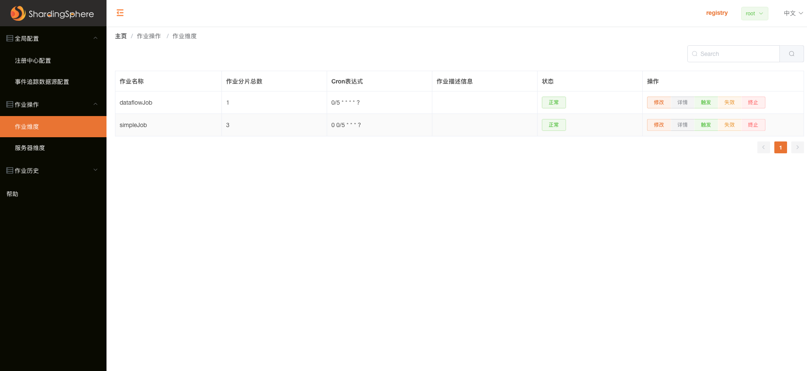

# Spring Cloud Alibaba-集成Elastic-JOB-Lite <!-- {docsify-ignore-all} -->


​    Elastic-Job是一个分布式任务调度框架，它拥有弹性调度，作业治理，资源管控等特性，个人觉得对比XXL—JOB更适合任务资源较多需要分布式资源协调，处理数据量大的场景，当然这也是我司的场景，至于技术选型他俩之间的详细对比，网上也有相关资料，这里不再赘述。

​    Elastic-Job分为 Elastic-Job-Lite和 Elastic-Job-Cloud两个项目， Elastic-Job-Cloud额外提供资源治理、应用分发以及进程隔离等功能，这里不对 Elastic-Job-Cloud做过多介绍，只介绍 Elastic-Job-Lite的使用。详细使用参考 Elastic-Job官网。


## Elastic-Job-Lite使用


### pom依赖

```xml
				<dependency>
            <groupId>org.apache.shardingsphere.elasticjob</groupId>
            <artifactId>elasticjob-lite-spring-boot-starter</artifactId>
            <version>3.0.3</version>
        </dependency>
```


### Spring Boot配置介绍

#### 注册中心配置

可配置属性：

| 属性名                          | 是否必填 | 描述             |
| :------------------------------ | :------- | ---------------- |
| server-lists                    | 是       | 注册中心         |
| namespace                       | 是       | 命名空间         |
| base-sleep-time-milliseconds    | 否       | zk客户端基础配置 |
| max-sleep-time-milliseconds     | 否       | zk客户端基础配置 |
| max-retries                     | 否       | 最大重试次数     |
| session-timeout-milliseconds    | 否       | 会话超时时间     |
| connection-timeout-milliseconds | 否       | 连接超时时间     |
| digest                          | 否       | zk授权配置       |

配置示例：

```yaml
elasticjob:
  reg-center:
    server-lists: localhost:2181
    namespace: elasticjob-lite-springboot
```

#### 任务配置

配置前缀：`elasticjob.jobs`

可配置属性：

| 属性名                           | 是否必填 | 描述                                  |
| :------------------------------- | :------- | ------------------------------------- |
| elasticJobClass / elasticJobType | 是       | 任务Class/类型（护持关系）            |
| cron                             | 否       | cron表达式                            |
| timeZone                         | 否       | 时区                                  |
| jobBootstrapBeanName             | 否       | job在spring容器中bean名字             |
| shardingTotalCount               | 是       | 分片总数                              |
| shardingItemParameters           | 否       | 分片对应参数，如：0=xxx,1=yyy         |
| jobParameter                     | 否       | job参数                               |
| monitorExecution                 | 否       | 监控开关                              |
| failover                         | 否       | 故障转移开关                          |
| misfire                          | 否       | job是否需要执行不执行的任务           |
| maxTimeDiffSeconds               | 否       | job与注册中心时间的最大差值           |
| reconcileIntervalMinutes         | 否       | 重新调整分片的时间间隔，默认：10分钟  |
| jobShardingStrategyType          | 否       | 分片策略                              |
| jobExecutorServiceHandlerType    | 否       | 任务线程池的类型（CPU、单线程）       |
| jobErrorHandlerType              | 否       |                                       |
| jobListenerTypes                 | 否       | 任务监听类型（别名，key）             |
| description                      | 否       | 任务描述                              |
| props                            | 否       | 任务其他的参数                        |
| disabled                         | 否       | job是否启动                           |
| overwrite                        | 否       | 是否覆盖注册中心配置数据，默认：false |

配置示例：

```yaml
elasticjob:
  reg-center:
    server-lists: localhost:2181
    namespace: elasticjob-lite-springboot
  jobs:
    simpleJob:
      elasticJobClass: io.redick.cloud.job.AccountSimpleJob
      cron: 0 0/5 * * * ?
      shardingTotalCount: 3
      overwrite: true
    dataflowJob:
      elasticJobClass: io.redick.cloud.job.AccountDataFlowJob
      cron: 0/5 * * * * ?
      shardingTotalCount: 1
      overwrite: true
      # reconcileIntervalMinutes: 1
      # props:
      #   streaming:
      #     process: true
```

#### 作业信息导出配置

配置前缀：`elasticjob.dump`

| 属性名  | 缺省值 | 是否必填 |
| :------ | :----- | :------- |
| enabled | true   | 否       |
| port    |        | 是       |

Spring Boot 提供了作业信息导出端口快速配置，只需在配置中指定导出所用的端口号即可启用导出功能。 如果没有指定端口号，导出功能不会生效。

配置参考：

```yaml
  dump:
    enabled: true
    port: 9888
```


导出：

```shell
echo "dump@jobName" | nc <任意一台作业服务器IP> 9888
```


#### Job代码开发

##### SimpleJob

```java
@Slf4j
@Component
public class AccountSimpleJob implements SimpleJob {
    @Override
    @LogMarker(businessDescription = "Simple job作业执行")
    public void execute(ShardingContext shardingContext) {
        log.info(LogUtil.marker(), "Simple job");
    }
}
```

##### DataflowJob

```java
@Slf4j
@Component
public class AccountDataFlowJob implements DataflowJob<String> {

    @Override
    public List<String> fetchData(ShardingContext shardingContext) {
        return Stream.of("1", "2", "3", "4").collect(Collectors.toList());
    }

    @Override
    public void processData(ShardingContext shardingContext, List<String> list) {
        log.info(LogUtil.marker(list), "Processing data");
    }
}
```


## Elastic-Job-Lite UI安装


[下载]([**https://dlcdn.apache.org/shardingsphere/elasticjob-ui-3.0.2/apache-shardingsphere-elasticjob-3.0.2-lite-ui-bin.tar.gz**](https://dlcdn.apache.org/shardingsphere/elasticjob-ui-3.0.2/apache-shardingsphere-elasticjob-3.0.2-lite-ui-bin.tar.gz) )


解压：apache-shardingsphere-elasticjob-3.0.2-lite-ui-bin.tar

运行：

```shell
➜  bin sh start.sh
```

默认登录用户密码可以参考conf下的application.properties文件



