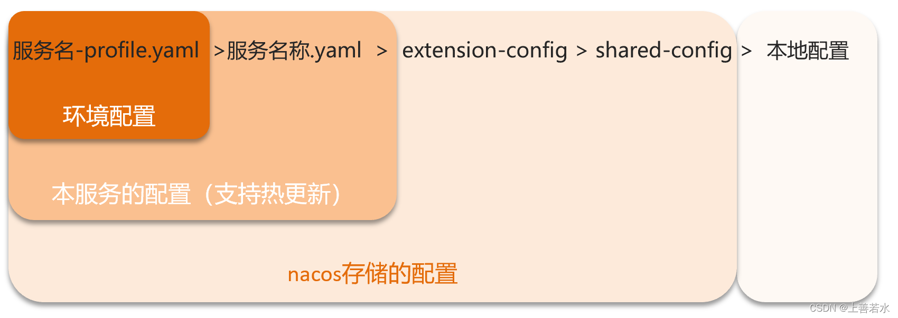

# Spring Cloud Alibaba-共享Nacos配置文件 <!-- {docsify-ignore-all} -->

## 多服务共享配置

#### 方式一

```yaml
server:
  port: 8082
spring:
  application:
    name: userservice # 服务名称
  profiles:
    active: dev # 环境
  cloud:
    nacos:
      server-addr: localhost:8848 # Nacos地址
      config:
        file-extension: yaml # 文件后缀名
        shared-configs: # 多微服务间共享的配置列表
          - dataId: common.yaml # 要共享的配置文件id
```

#### 方式二

```yaml
server:
  port: 8082
spring:
  application:
    name: userservice # 服务名称
  profiles:
    active: dev # 环境
  cloud:
    nacos:
      server-addr: localhost:8848 # Nacos地址
      config:
        file-extension: yaml # 文件后缀名
        extension-configs: # 多微服务间共享的配置列表
          - dataId: extend.yaml # 要共享的配置文件id
```

#### 加载配置优先级

