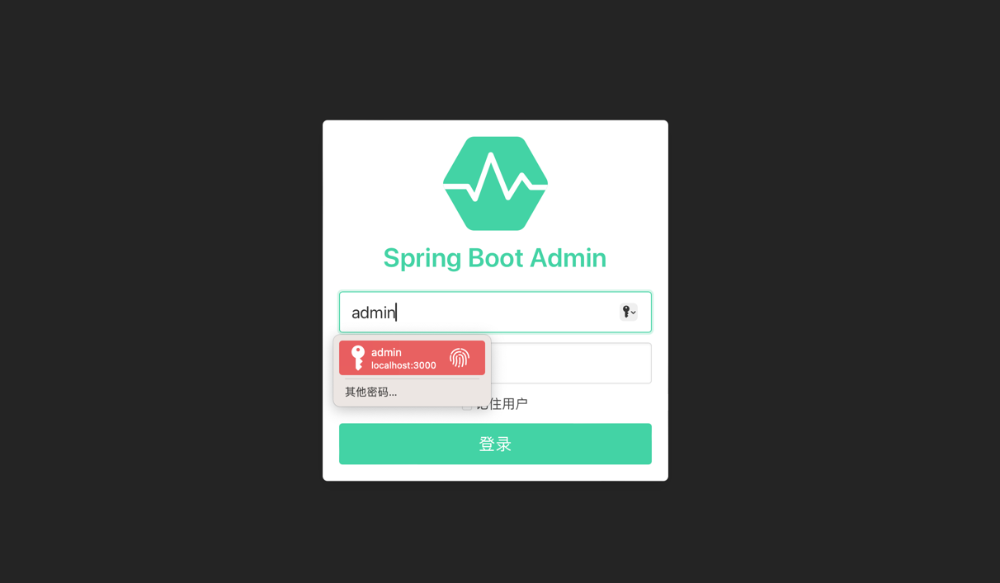
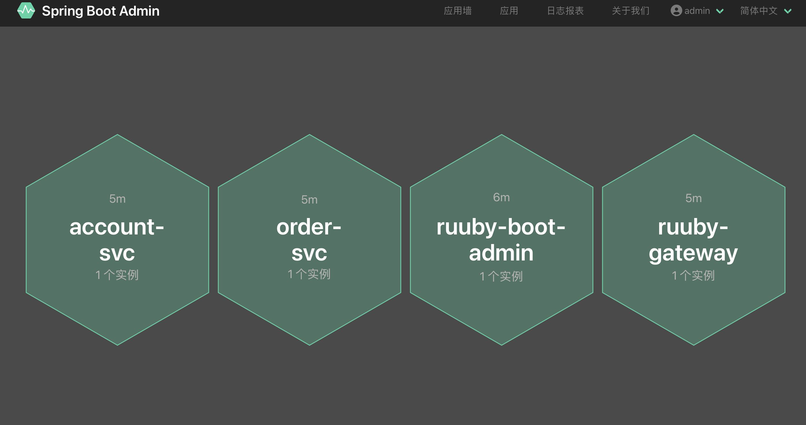
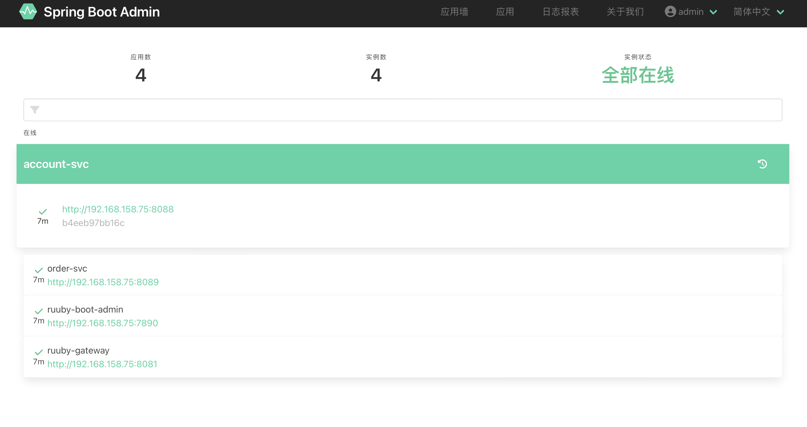
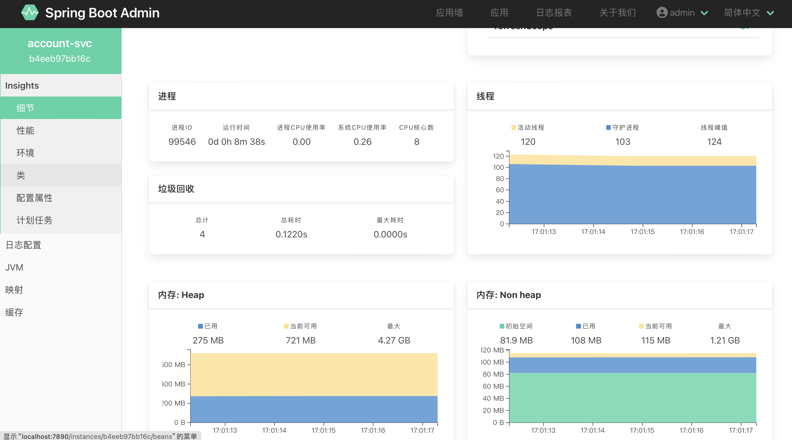

# Spring Cloud Alibaba-整合Spring Boot Admin <!-- {docsify-ignore-all} -->

## 前言

  Spring Boot 有一个非常好用的监控和管理的源软件,这个软件就是spring boot admin,该软件能够将Actuator中的信息进行图形化的展示,也可以监控 
Spring Boot 应用的健康状况,提供实时报警功能.

主要的功能点有：
- 显示应用程序的监控状态
- 应用程序上下线监控
- 查看JVM,线程信息
- 可视化的查看日志以及下载日志文件
- 动态切换日志级别
- http请求信息跟踪
- 其他功能点...

  本篇文章将介绍通过Nacos作为注册中心，是的Spring Boot Admin自动进行服务发现进行微服务监控。

## Spring Boot Admin服务端搭建

- Spring Boot版本 2.7.7
- Spring Cloud版本 2021.0.5
- Spring Cloud Alibaba版本 2021.0.4.0

### Maven依赖

```xml
    <dependencies>
        <!-- bootstrap 启动器 -->
        <dependency>
          <groupId>org.springframework.cloud</groupId>
          <artifactId>spring-cloud-starter-bootstrap</artifactId>
        </dependency>
      
        <dependency>
          <groupId>com.alibaba.cloud</groupId>
          <artifactId>spring-cloud-starter-alibaba-nacos-discovery</artifactId>
        </dependency>
        <dependency>
            <groupId>org.springframework.boot</groupId>
            <artifactId>spring-boot-starter-web</artifactId>
        </dependency>

        <dependency>
            <groupId>de.codecentric</groupId>
            <artifactId>spring-boot-admin-starter-server</artifactId>
            <version>2.7.10</version>
        </dependency>

        <!--监控-->
        <dependency>
            <groupId>org.springframework.boot</groupId>
            <artifactId>spring-boot-starter-actuator</artifactId>
        </dependency>

        <!--整合权限账号 -->
        <dependency>
            <groupId>org.springframework.boot</groupId>
            <artifactId>spring-boot-starter-security</artifactId>
        </dependency>
    </dependencies>
```

### Spring Boot启动配置文件bootstrap.yml

```yaml
server:
  port: 7890

spring:
  application:
    name: boot-admin
  cloud:
    # 注册中心配置
    nacos:
      username: "nacos"
      password: "nacos"
      discovery:
        server-addr: 127.0.0.1:8848
        # namespace id
        namespace: 3ef5e608-6ee8-4881-8e50-ed47a5a04af2
  # Spring Boot Admin的UI登录使用Spring Security控制       
  security:
    user:
      name: admin
      password: admin123
# 指标采集端点
management:
  endpoints:
    web:
      exposure:
        include: '*'
  endpoint:
    health:
      show-details: always
```

### Spring Security配置

```Java
@Configuration
public class SecurityConfiguration extends WebSecurityConfigurerAdapter {

    private final String adminContextPath;

    public SecurityConfiguration(AdminServerProperties adminServerProperties) {
        this.adminContextPath = adminServerProperties.getContextPath();
    }

    @Override
    protected void configure(HttpSecurity http) throws Exception {
        SavedRequestAwareAuthenticationSuccessHandler successHandler = new SavedRequestAwareAuthenticationSuccessHandler();
        successHandler.setTargetUrlParameter("redirectTo");
        successHandler.setDefaultTargetUrl(adminContextPath + "/");

        http.authorizeRequests()
                .antMatchers(adminContextPath + "/login",
                        adminContextPath + "/assets/**",
                        adminContextPath + "/manage/**",
                        adminContextPath + "/actuator/**").permitAll()
                .anyRequest().authenticated()
                .and()
                .formLogin().loginPage(adminContextPath + "/login").successHandler(successHandler)
                .and()
                .logout().logoutUrl(adminContextPath + "/logout")
                .and()
                .csrf().disable();
    }
}
```

### 服务端启动类

```Java
@SpringBootApplication
@EnableAdminServer
@EnableDiscoveryClient
public class AdminApplication {

    public static void main(String[] args) {
        SpringApplication.run(AdminApplication.class, args);
    }
}
```

## 客户端程序

  客户端增加Actuator采集指标端点配置
  
```yaml
# 指标采集
management:
  health:
    redis:
      enabled: false
    sentinel:
      enabled: false
    ldap:
      enabled: false
  endpoints:
    web:
      exposure:
        include: "*"
  endpoint:
    health:
      show-details: always
```

## 效果

##### 登录页



##### 应用墙


##### 应用

                                                          
##### 应用细节



