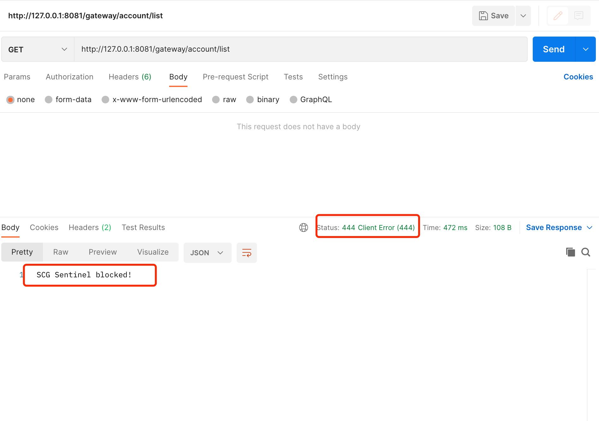

# Spring Cloud Gateway-系统保护Sentinel集成 <!-- {docsify-ignore-all} -->


## Sentinel介绍

​    随着微服务的流行，服务和服务之间的稳定性变得越来越重要。Sentinel 是面向分布式、多语言异构化服务架构的流量治理组件，主要以流量为切入点，从流量路由、流量控制、流量整形、熔断降级、系统自适应过载保护、热点流量防护等多个维度来帮助开发者保障微服务的稳定性。 --- 摘自官网

## Spring Cloud Gateway集成Sentinel

### pom依赖

​    添加spring cloud gateway sentinel的starter依赖。

```xml
<!-- SpringCloud Alibaba Sentinel Gateway -->
<dependency>
    <groupId>com.alibaba.cloud</groupId>
    <artifactId>spring-cloud-alibaba-sentinel-gateway</artifactId>
</dependency>
```

### Sentinel配置

​    引入starter依赖后只需要一些配置就可以实现网关对于后端API的流控，降级等功能，具体的实现starter提供实现，Spring Cloud Gateway可以让`spring-cloud-alibaba-sentinel-gateway`中的自动化配置生效，配置前缀前缀为`spring.cloud.sentinel.filter.scg`。

- Spring Cloud Alibaba Sentinel 提供了这些配置选项

| 配置项                                                  | 含义                                                         | 默认值            |
| :------------------------------------------------------ | ------------------------------------------------------------ | ----------------- |
| `spring.cloud.sentinel.enabled`                         | Sentinel自动化配置是否生效                                   | true              |
| `spring.cloud.sentinel.eager`                           | 是否提前触发 Sentinel 初始化                                 | false             |
| `spring.cloud.sentinel.transport.port`                  | 应用与Sentinel控制台交互的端口，应用本地会起一个该端口占用的HttpServer（可以不配置） | 8719              |
| `spring.cloud.sentinel.transport.dashboard`             | Sentinel 控制台地址（可以配置host:port,这样就不用单独配置port） |                   |
| `spring.cloud.sentinel.transport.heartbeat-interval-ms` | 应用与Sentinel控制台的心跳间隔时间                           |                   |
| `spring.cloud.sentinel.transport.client-ip`             | 此配置的客户端IP将被注册到 Sentinel Server 端                |                   |
| `spring.cloud.sentinel.filter.order`                    | Servlet Filter的加载顺序。Starter内部会构造这个filter        | Integer.MIN_VALUE |
| `spring.cloud.sentinel.filter.url-patterns`             | 数据类型是数组。表示Servlet Filter的url pattern集合          | /*                |
| `spring.cloud.sentinel.filter.enabled`                  | Enable to instance CommonFilter                              | true              |
| `spring.cloud.sentinel.metric.charset`                  | metric文件字符集                                             | UTF-8             |
| `spring.cloud.sentinel.metric.file-single-size`         | Sentinel metric 单个文件的大小                               |                   |
| `spring.cloud.sentinel.metric.file-total-count`         | Sentinel metric 总文件数量                                   |                   |
| `spring.cloud.sentinel.log.dir`                         | Sentinel 日志文件所在的目录                                  |                   |
| `spring.cloud.sentinel.log.switch-pid`                  | Sentinel 日志文件名是否需要带上pid                           | false             |
| `spring.cloud.sentinel.servlet.block-page`              | 自定义的跳转 URL，当请求被限流时会自动跳转至设定好的 URL     |                   |
| `spring.cloud.sentinel.flow.cold-factor`                | [https://github.com/alibaba/Sentinel/wiki/%E9%99%90%E6%B5%81---](https://github.com/alibaba/Sentinel/wiki/限流---) %E5%86%B7%E5%90%AF%E5%8A%A8[冷启动因子] | 3                 |
| `spring.cloud.sentinel.zuul.order.pre`                  | SentinelZuulPreFilter 的 order                               | 10000             |
| `spring.cloud.sentinel.zuul.order.post`                 | SentinelZuulPostFilter 的 order                              | 1000              |
| `spring.cloud.sentinel.zuul.order.error`                | SentinelZuulErrorFilter 的 order                             | -1                |
| `spring.cloud.sentinel.scg.fallback.mode`               | Spring Cloud Gateway 熔断后的响应模式(选择 `redirect` or `response`) |                   |
| `spring.cloud.sentinel.scg.fallback.redirect`           | Spring Cloud Gateway 响应模式为 'redirect' 模式对应的重定向 URL |                   |
| `spring.cloud.sentinel.scg.fallback.response-body`      | Spring Cloud Gateway 响应模式为 'response' 模式对应的响应内容 |                   |
| `spring.cloud.sentinel.scg.fallback.response-status`    | Spring Cloud Gateway 响应模式为 'response' 模式对应的响应码  | 429               |
| `spring.cloud.sentinel.scg.fallback.content-type`       | Spring Cloud Gateway 响应模式为 'response' 模式对应的 content-type | application/json  |

> 请注意。这些配置只有在 Servlet 环境下才会生效，RestTemplate 和 Feign 针对这些配置都无法生效

​    表格中的配置看似很多，实际上应用的并不多，有些配置使用默认值即可，根据实际需求配置响应参数即可，这里我给出一个我本地的一个配置示例，配置直接使用可能有问题，因为我这里只摘取了`spring.cloud.gateway.sentinel`的相关配置，仅供参考。

```yaml
spring:
  application:
    name: ruuby-gateway
  profiles:
    active: dev
  cloud:
    gateway:
      routes:
        - id: account-svc
          uri: lb://account-svc
          predicates:
            - Path=/gateway/account/**
          filters:
            - StripPrefix=1
    sentinel:
    	# 取消控制台懒加载
      eager: true
      transport:
        # 控制台地址
        dashboard: 127.0.0.1:8080
      filter:
        enabled: true
      # 配置默认fallback，也可以编码自定义fallback  
        scg.fallback:
            mode: response
            response-status: 444
            response-body: 1234
        scg:
          order: -100
```

​    配置完成后启动网关，这时候可以在`Sentinel`控制台中看到gateway已经注册到了Sentinel控制台，但是没有任何资源，这时候需要手动创建资源，资源就是Sentinel系统保护的一个单元。在Spring Cloud Gateway中配置的资源可以是url，也可以是转发服务的服务id，也就是服务发现的service，如上配置中的`account-svc`，所以我们在`Sentinel`控制台就可以创建熔断或限流规则，我这里创建了一个流控规则，API名称就是`account-svc`，API类型是`Route ID`，阈值类型是`QPS`，单机的阈值是0，如下图：


​    这就意味着一个请求都不会转发到account-svc服务的请求，因为阈值设置为0，请求结果如下：


`account-svc`是一个使用`Spring Cloud Alibaba`开发脚手架开发的一个业务服务，后面在讲到服务发现注册的时候会把该服务的一些代码写出来，也可以参考GitHub。


### Sentinel集成Nacos作为数据源

​    在生产系统中，我们往往不会对接Sentinel的控制台，而且想在服务启动时就已经把Sentinel控制的资源配置好，这个时候我们可以将Sentinel控制的数据源配置起来，这里就以Nacos为例，将Sentinel的资源配置通过Nacos配置中心管理。

​    `spring-cloud-alibaba-sentinel-gateway`starter中已经提供了Sentinel DataSource的相关依赖，我们在使用时只需要配置即可。配置内容如下：

> 注意：文章中的所有配置都在Nacos配置中心，关于配置配置参考 [Spring Cloud Gateway-基础搭建](../../../blog/structure/spring-cloud-alibaba/sca-3.md)

- ruuby-gateway-dev.yml配置

```yaml
server:
  port: 8081

spring:
  application:
    name: ruuby-gateway
  profiles:
    active: dev
  cloud:
    nacos:
      username: "nacos"
      password: "nacos"
      discovery:
        # 服务注册中心地址
        server-addr: 127.0.0.1:8848
        # 阿里云平台ak，sk
        # access-key:
        # secret-key:
        namespace: 3ef5e608-6ee8-4881-8e50-ed47a5a04af2
      config:
        server-addr: 127.0.0.1:8848
        # 阿里云平台ak，sk
        # access-key:
        # secret-key:
        # 配置文件格式
        file-extension: yml
        shared-configs:
          - ${spring.application.name}-${spring.profiles.active}.${spring.cloud.nacos.config.file-extension}
        namespace: 3ef5e608-6ee8-4881-8e50-ed47a5a04af2
        group: DEFAULT-GROUP
    gateway:
      routes:
        - id: account-svc
          uri: lb://account-svc
          predicates:
            - Path=/gateway/account/**
          filters:
            - StripPrefix=1
    sentinel:
      # 取消控制台懒加载
      eager: true
      transport:
        # 控制台地址
        dashboard: 127.0.0.1:8080
      # nacos配置持久化
      datasource:
        ds1:
          nacos:
            server-addr: 127.0.0.1:8848
            dataId: ${spring.application.name}-sentinel-${spring.profiles.active}.json
            namespace: 3ef5e608-6ee8-4881-8e50-ed47a5a04af2
            groupId: DEFAULT_GROUP
            data-type: json
            rule-type: gw-flow
      filter:
        enabled: true
      # 配置默认fallback，也可以编码自定义fallback  
      scg.fallback:
          mode: response
          response-status: 444
          response-body: 1234
      scg:
        order: -100
```

​    `spring.cloud.sentinel.datasource`配置制定数据源，数据源可以是多个，这里使用的是`nacos`，配置的Sentinel规则的配置文件是`${spring.application.name}-sentinel-${spring.profiles.active}.json`也就是`ruuby-gateway-sentinel-dev.json`，配置内容格式为`json`，该配置内容如下：

```json
[
    {
        "resource": "account-svc",
        "count": 5,
        "grade": 0,
        "limitApp": "default"
    }
]
```

​    启动网关，这时可以在Sentinel控制台上看到我们在json文件中配置好的流控规则，如下图：


​    这时如果在Nacos修改参数会同步到Sentinel控制台，但是从Sentinel控制台修改参数不会同步到Nacos配置中心，所以生产上如果使用Nacos作为Sentinel数据源的话，建议从Nacos上修改Sentinel资源参数。

### 自定义降级响应

​    通过上面的实验，我们可以知道通过配置`spring.cloud.gateway.sentinel.filter.scg.fallback`可以实现服务降级后的返回，Spring Cloud Gateway Sentinel也提供了接口让开发人员实现自定义的服务降级响应，只要实现`BlockRequestHandler`即可，代码如下：

```java
@Slf4j
public class SentinelFallbackHandler implements BlockRequestHandler {

    @Override
    public Mono<ServerResponse> handleRequest(ServerWebExchange serverWebExchange,
            Throwable throwable) {
        log.info(LogUtil.marker(), "SCG Sentinel blocked!");
        return ServerResponse
                .status(444)
                .contentType(MediaType.APPLICATION_JSON)
                .body(BodyInserters.fromValue("SCG Sentinel blocked!"));
    }
}
```

​    自定义降级配置代码如下：

```java
@Configuration
public class GatewayConfiguration {

    @Bean
    @Order(Ordered.HIGHEST_PRECEDENCE)
    public SentinelFallbackHandler sentinelFallbackHandler() {
        return new SentinelFallbackHandler();
    }
}
```

> 注：使用自定义降级时不能配置spring.cloud.gateway.sentinel.filter.scg.fallback，配置的优先级是大于自定义实现的

​    测试结果如下：

