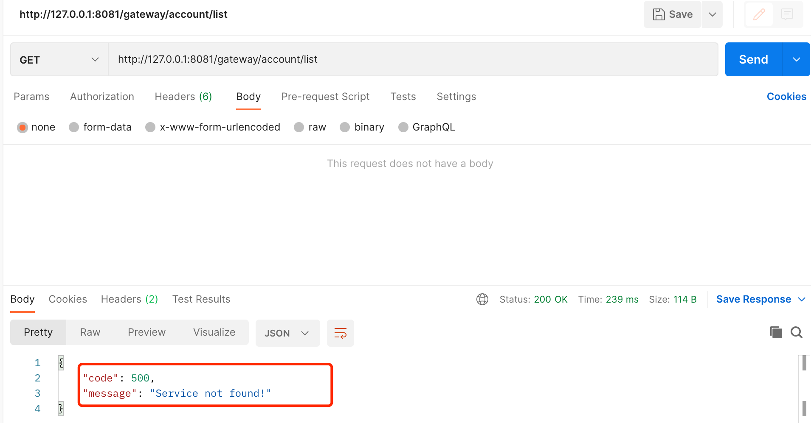

# Spring Cloud Gateway-自定义全局异常处理和过滤器 <!-- {docsify-ignore-all} -->

## 自定义全局异常处理

​    `Spring Cloud Gateway`基于`Spring Webflux`实现的，已经提供了接口`ErrorWebExceptionHandler`用于实现了自定义异常处理，我们自定义的异常处理代码如下：

```java
@Slf4j
public class GatewayExceptionHandler implements ErrorWebExceptionHandler {

    @Override
    public Mono<Void> handle(ServerWebExchange exchange, Throwable ex) {
        ServerHttpResponse response = exchange.getResponse();
        if (exchange.getResponse().isCommitted()) {
            return Mono.error(ex);
        }
        String message;
        if (ex instanceof NotFoundException) {
            message = "Service not found!";
        } else if (ex instanceof ResponseStatusException) {
            ResponseStatusException responseStatusException = (ResponseStatusException) ex;
            message = responseStatusException.getMessage();
        } else {
            message = "Service internal error!";
        }
        log.error(LogUtil.exceptionMarker(), message + "path:" + exchange.getRequest().getPath(), ex);
        return ServletUtils.webFluxResponseWriter(response, message);
    }
}
```

​    将自定义的异常处理注入到Spring中，代码如下：

```java
@Configuration
public class GatewayConfiguration {

    @Bean
    @Order(-1)
    public GatewayExceptionHandler gatewayExceptionHandler() {
        return new GatewayExceptionHandler();
    }
}
```

​    将网关代理的服务`account-svc`停掉，验证自定义异常处理：




## 过滤器

​    在之前的文章[Spring Cloud Gateway-日志格式化及链路追踪插件集成](blog/structure/spring-cloud-alibaba/sca-4.md)已经介绍过`Spring Cloud Gateway`的过滤器，这里我们在回顾一下，并且再聊一下过滤器除了链路追踪中使用还有什么使用场景，下面是`Spring Cloud Gateway`的过滤器的介绍。

- 全局过滤器：`GlobalFilter`，这是一个接口，实现了该接口并实现`filter`方法，所有的请求都会经过该过滤器。
- 局部过滤器：`AbstractGatewayFilterFactory`，它是一个抽象类，继承该抽象类，并重写`apply`方法后需要在网关的配置文件中配置过滤器，如果不配置是不会流经该过滤器的，具体配置项是`spring.cloud.gateway.routes[].filters`。

### 过滤器在Spring Cloud Gateway中的应用

​    在网关层一些通用的处理，或者说某些代理的API需要有一个通用的处理的时候，过滤器是一个很好的选择；全局过滤器就是适用于所有经过网关的请求都要做通用处理的场景，例如：链路追踪，Xss攻击拦截等；局部过滤器适用于某一类API或某个API需要有特殊的处理的场景，如：鉴权，黑名单，响应请求加解密等场景。

​    下面针对鉴权，黑名单，Xss攻击拦截，简单介绍一下实现，其中会涉及到Spring自定义配置绑定的相关使用

#### Xss攻击拦截过滤器

​    因为Xss攻击拦截的代码比较多，这里不写那么多了，可以参考GitHub上[源码](https://github.com/Redick01/spring-cloud-alibaba-framework/tree/master/ruuby-gateway)，也可以根据这个过滤器的实现去实现自己的Xss攻击过滤器。

```java
@Component
@ConditionalOnProperty(value = "security.xss.enabled", havingValue = "true")
@AllArgsConstructor
public class XssFilter implements GlobalFilter, Ordered {

    private final XssProperties xssProperties;

    @Override
    public Mono<Void> filter(ServerWebExchange exchange, GatewayFilterChain chain) {

        if (!xssProperties.getEnabled()) {
            return chain.filter(exchange);
        }
        ServerHttpRequest request = exchange.getRequest();
        // GET DELETE method request not filtered.
        HttpMethod httpMethod = request.getMethod();
        if (null == httpMethod || HttpMethod.GET == httpMethod || HttpMethod.DELETE == httpMethod) {
            return chain.filter(exchange);
        }
        // 非json请求不过滤
        if (!isJsonRequest(request)) {
            return chain.filter(exchange);
        }
        // excludeUrls列表中的URL不过滤
        String url = request.getURI().getPath();
        if (matchExcludeUrls(url, xssProperties.getExcludeUrls())) {
            return chain.filter(exchange);
        }
        // Xss过滤
        ServerHttpRequestDecorator decorator = requestDecorator(exchange);
        return chain.filter(exchange);
    }

    private boolean isJsonRequest(ServerHttpRequest request) {
        String header = request.getHeaders().getFirst(HttpHeaders.CONTENT_TYPE);
        return StringUtils.startsWithIgnoreCase(header, MediaType.APPLICATION_JSON_VALUE);
    }

    private boolean matchExcludeUrls(String url, List<String> excludeUrls) {
        if (StringUtils.isBlank(url)) {
            return false;
        }
        for (String pattern : excludeUrls) {
            AntPathMatcher matcher = new AntPathMatcher();
            return matcher.match(url, pattern);
        }
        return false;
    }

    private ServerHttpRequestDecorator requestDecorator(ServerWebExchange exchange) {

        ServerHttpRequestDecorator decorator = new ServerHttpRequestDecorator(exchange.getRequest()) {
            @Override
            public Flux<DataBuffer> getBody() {
                Flux<DataBuffer> body = super.getBody();
                return body.buffer().map(db -> {
                    DataBufferFactory dataBufferFactory = new DefaultDataBufferFactory();
                    DataBuffer join = dataBufferFactory.join(db);
                    byte[] content = new byte[join.readableByteCount()];
                    join.read(content);
                    DataBufferUtils.release(join);
                    String bodyStr = new String(content, StandardCharsets.UTF_8);
                    // 防xss攻击过滤
                    bodyStr = EscapeUtil.clean(bodyStr);
                    // 转成字节
                    byte[] bytes = bodyStr.getBytes();
                    NettyDataBufferFactory nettyDataBufferFactory = new NettyDataBufferFactory(ByteBufAllocator.DEFAULT);
                    DataBuffer buffer = nettyDataBufferFactory.allocateBuffer(bytes.length);
                    buffer.write(bytes);
                    return buffer;
                });
            }

            @Override
            public org.springframework.http.HttpHeaders getHeaders()
            {
                org.springframework.http.HttpHeaders httpHeaders = new org.springframework.http.HttpHeaders();
                httpHeaders.putAll(super.getHeaders());
                // 由于修改了请求体的body，导致content-length长度不确定，因此需要删除原先的content-length
                httpHeaders.remove(org.springframework.http.HttpHeaders.CONTENT_LENGTH);
                httpHeaders.set(org.springframework.http.HttpHeaders.TRANSFER_ENCODING, "chunked");
                return httpHeaders;
            }
        };
        return decorator;
    }

    @Override
    public int getOrder() {
        return -100;
    }
}
```

#### 黑名单过滤器

​    黑名单过滤器是一个局部过滤器，只有配置了才会生效，这里的实现逻辑也比较简单，就是url匹配到就被黑名单过滤器拦截，代码如下：

```java
@Component
public class BlackListUrlFilter extends AbstractGatewayFilterFactory<BlackListUrlFilter.Config> {

    public BlackListUrlFilter() {
        super(Config.class);
    }

    @Override
    public GatewayFilter apply(Config config) {
        return (exchange, chain) -> {
            String url = exchange.getRequest().getURI().getPath();
            if (config.match(url)) {
                // ServletUtils代码参考GitHub源码
                return ServletUtils.webFluxResponseWriter(exchange.getResponse(),
                        "This url:" + url + " in url black list!");
            }
            return chain.filter(exchange);
        };
    }

    public static class Config {

        private List<String> blackListUrl;

        private final List<Pattern> blackListPattern = new ArrayList<>();

        private boolean match(String url) {
            return !blackListPattern.isEmpty()
                    && blackListPattern.stream().anyMatch(pattern -> pattern.matcher(url).find());
        }

        public List<String> getBlackListUrl() {
            return blackListUrl;
        }

        public void setBlackListUrl(List<String> blackListUrl) {
            this.blackListUrl = blackListUrl;
            this.blackListPattern.clear();
            this.blackListUrl.forEach(b -> this.blackListPattern.add(Pattern.compile(b.replaceAll("\\*\\*", "(.*?)"), Pattern.CASE_INSENSITIVE)));
        }
    }
}
```

#### 鉴权过滤器

​    鉴权过滤器也是局部过滤器，配置鉴权过滤器的Service或API才会走到这个过滤器，鉴权过滤器代码如下：

```java
@Component
public class AuthFilter extends AbstractGatewayFilterFactory<AuthFilter.Config> {

    @Autowired
    private SignHandler signHandler;

    public AuthFilter() {
        super(AuthFilter.Config.class);
    }

    @Override
    public GatewayFilter apply(Config config) {

        return (exchange, chain) -> signHandler.sign(exchange, chain, config);
    }

    public static class Config {

        /**
         * 鉴权类型
         * jwt/sign
         */
        private String type = "jwt";

        /**
         * 签名算法类型
         * MD5withRSA,SHA1withRSA,SHA256withRSA,Hash
         */
        private String signType;

        private String publicKey;

        public String getType() {
            return type;
        }

        public void setType(String type) {
            this.type = type;
        }

        public String getSignType() {
            return signType;
        }

        public void setSignType(String signType) {
            this.signType = signType;
        }

        public String getPublicKey() {
            return publicKey;
        }

        public void setPublicKey(String publicKey) {
            this.publicKey = publicKey;
        }
    }
}
```

​    鉴权是可以支持不同类型的，如，JWT，签名验证等等，所以这里设计一个鉴权接口`Sign`如下，如果想扩展鉴权类型，实现Sign接口扩展即可

```java
public interface Sign {

    Mono<Void> verifySign(ServerWebExchange exchange, GatewayFilterChain chain, AuthFilter.Config config);
}
```

​    鉴权处理器代码如下，鉴权扩展借鉴了SPI的思想

```java
@Component
public class SignHandler {

    @Autowired
    private Map<String, Sign> signMap = new ConcurrentHashMap<>();

    public Mono<Void> sign(ServerWebExchange exchange, GatewayFilterChain chain, AuthFilter.Config config) {
        Sign sign = signMap.get(config.getType());
        return sign.verifySign(exchange, chain, config);
    }
}
```

