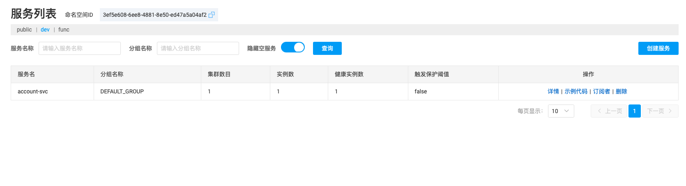
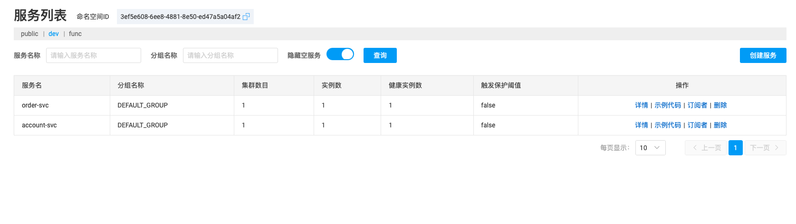
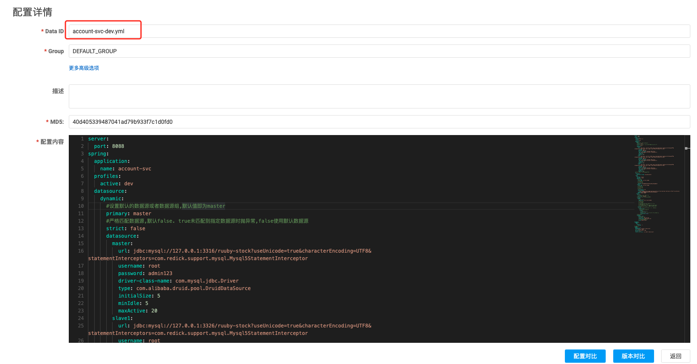
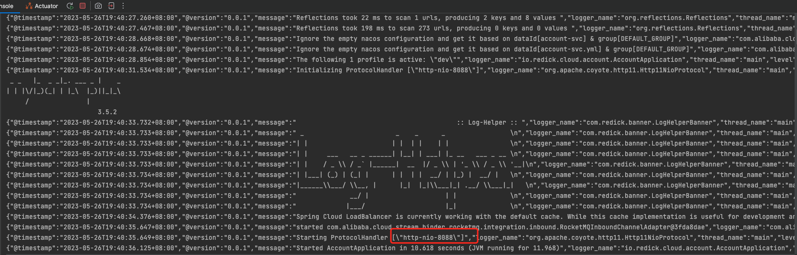
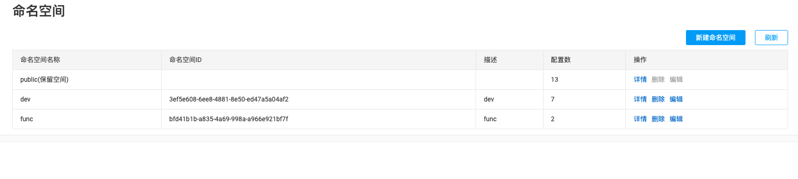

# Spring Cloud Alibaba-服务注册发现与配置中心Nacos <!-- {docsify-ignore-all} -->


## Nacos介绍

​    Nacos /nɑ:kəʊs/ 是 Dynamic Naming and Configuration Service的首字母简称，一个更易于构建云原生应用的动态服务发现、配置管理和服务管理平台。

​    Nacos 致力于帮助您发现、配置和管理微服务。Nacos 提供了一组简单易用的特性集，帮助您快速实现动态服务发现、服务配置、服务元数据及流量管理。

​    Nacos 帮助您更敏捷和容易地构建、交付和管理微服务平台。 Nacos 是构建以“服务”为中心的现代应用架构 (例如微服务范式、云原生范式) 的服务基础设施。    - 摘自官网


## 服务注册发现Nacos Discovery

​    Nacos服务注册发现可以将服务自动注册到Nacos Server上并且能够感知刷新某个服务实例的服务列表。

### 引入Nacos Discovery

​    在pom.xml中引入artifact ID 为 `spring-cloud-starter-alibaba-nacos-discovery` 的 starter。

```xml
<dependency>
    <groupId>com.alibaba.cloud</groupId>
    <artifactId>spring-cloud-starter-alibaba-nacos-discovery</artifactId>
</dependency>
```

### Provider和Consumer示例

​    下面简单搭建Provider和Consumer示例，`RPC`使用`RestTemplate`，负载均衡器使用`spring-cloud-starter-loadbalancer`。

#### Provider

- pom依赖

```xml
<?xml version="1.0" encoding="UTF-8"?>
<project xmlns="http://maven.apache.org/POM/4.0.0"
    xmlns:xsi="http://www.w3.org/2001/XMLSchema-instance"
    xsi:schemaLocation="http://maven.apache.org/POM/4.0.0 http://maven.apache.org/xsd/maven-4.0.0.xsd">
    <modelVersion>4.0.0</modelVersion>
    <parent>
        <groupId>io.redick.cloud</groupId>
        <artifactId>ruuby-account</artifactId>
        <version>${revision}</version>
    </parent>
    
    <artifactId>ruuby-account-svc</artifactId>

    <packaging>jar</packaging>
    
    <dependencies>
        <dependency>
            <groupId>org.springframework.boot</groupId>
            <artifactId>spring-boot-starter-web</artifactId>
        </dependency>
        <dependency>
            <groupId>com.alibaba.cloud</groupId>
            <artifactId>spring-cloud-starter-alibaba-nacos-discovery</artifactId>
        </dependency>
    </dependencies>

</project>
```

- application.yml配置

```yaml
server:
  port: 8088
spring:
  application:
    name: account-svc
  cloud:
    nacos:
      username: "nacos"
      password: "nacos"
      discovery:
        # 服务注册中心地址
        server-addr: 127.0.0.1:8848
        # 阿里云平台ak，sk
        # access-key:
        # secret-key:
```

- 启动服务端示例

```java
@SpringBootApplication
@EnableDiscoveryClient
public class AccountApplication {

    public static void main( String[] args ) {
        SpringApplication.run(AccountApplication.class, args);
    }
    
    @GetMapping(path = "/echo/{string}")
    public String echo(@PathVariable String string) {
        return "Hello Nacos Discovery " + string;
    }
}
```

- Nacos端服务注册列表

​    启动服务后可以在Nacos管理端的服务管理->服务列表中看到注册的`account-svc`服务。



#### Consumer

- pom依赖

```xml
<?xml version="1.0" encoding="UTF-8"?>
<project xmlns="http://maven.apache.org/POM/4.0.0"
    xmlns:xsi="http://www.w3.org/2001/XMLSchema-instance"
    xsi:schemaLocation="http://maven.apache.org/POM/4.0.0 http://maven.apache.org/xsd/maven-4.0.0.xsd">
    <modelVersion>4.0.0</modelVersion>
    <parent>
        <groupId>io.redick.cloud</groupId>
        <artifactId>ruuby-account</artifactId>
        <version>${revision}</version>
    </parent>
    
    <artifactId>ruuby-account-svc</artifactId>

    <packaging>jar</packaging>
    
    <dependencies>
        <dependency>
            <groupId>org.springframework.boot</groupId>
            <artifactId>spring-boot-starter-web</artifactId>
        </dependency>
        <dependency>
            <groupId>com.alibaba.cloud</groupId>
            <artifactId>spring-cloud-starter-alibaba-nacos-discovery</artifactId>
        </dependency>
        <dependency>
            <groupId>org.springframework.cloud</groupId>
            <artifactId>spring-cloud-starter-loadbalancer</artifactId>
        </dependency>
    </dependencies>

</project>
```

- application.yml配置

```yaml
server:
  port: 8089
spring:
  application:
    name: order-svc
  cloud:
    nacos:
      username: "nacos"
      password: "nacos"
      discovery:
        # 服务注册中心地址
        server-addr: 127.0.0.1:8848
        # 阿里云平台ak，sk
        # access-key:
        # secret-key:
```

- 服务启动示例

```java
@SpringBootApplication
@EnableDiscoveryClient
@AllArgsConstructor
public class OrderApplication {
  
  	private final LoadBalancerClient loadBalancerClient;

    private final RestTemplate restTemplate;

    public static void main(String[] args) {
        SpringApplication.run(OrderApplication.class, args);
    }
  
  	@GetMapping("/echo")
    public String echo(){
        ServiceInstance serviceInstance = loadBalancerClient.choose("account-svc");
        String url = String.format("http://%s:%s/echo/%s", serviceInstance.getHost(), serviceInstance.getPort(), appName);
        return restTemplate.getForObject(url, String.class);
    }
        
    @Bean
    public RestTemplate restTemplate(){
        return new RestTemplate();
    }

}
```

​    这个示例中使用了`RestTemplate`加`LoadBalancerClient`形式进行RPC和负载均衡，也可以使用`OpenFeign`，测试接口`echo`中的逻辑如下：

1. 使用`LoadBalancerClient`根据服务ID`account-svc`获取到负载到的某一个实例对象`ServiceInstance`；
2. 根据实例对象`ServiceInstance`获取到`host`，`port`并构建url；
3. 通过`RestTemplate`进行RPC调用。

- Nacos服务列表



- 测试结果

​    调用`order-svc`服务的`echo`接口，结果如下：

```shell
➜  ~ curl -X GET http://127.0.0.1:8089/order/echo
Hello Nacos Discovery order-svc
```

### Nacos Discovery Starter其他配置选项

| 配置项              | Key                                              | 默认值                       | 说明                                                         |
| ------------------- | ------------------------------------------------ | ---------------------------- | ------------------------------------------------------------ |
| 服务端地址          | `spring.cloud.nacos.discovery.server-addr`       |                              | Nacos Server 启动监听的ip地址和端口                          |
| 服务名              | `spring.cloud.nacos.discovery.service`           | `${spring.application.name}` | 注册的服务名                                                 |
| 权重                | `spring.cloud.nacos.discovery.weight`            | `1`                          | 取值范围 1 到 100，数值越大，权重越大                        |
| 网卡名              | `spring.cloud.nacos.discovery.network-interface` |                              | 当IP未配置时，注册的IP为此网卡所对应的IP地址，如果此项也未配置，则默认取第一块网卡的地址 |
| 注册的IP地址        | `spring.cloud.nacos.discovery.ip`                |                              | 优先级最高                                                   |
| 注册的IP地址类型    | `spring.cloud.nacos.discovery.ip-type`           | `IPv4`                       | 可以配置IPv4和IPv6两种类型，如果网卡同类型IP地址存在多个，希望制定特定网段地址，可使用`spring.cloud.inetutils.preferred-networks`配置筛选地址 |
| 注册的端口          | `spring.cloud.nacos.discovery.port`              | `-1`                         | 默认情况下不用配置，会自动探测                               |
| 命名空间            | `spring.cloud.nacos.discovery.namespace`         |                              | 常用场景之一是不同环境的注册的区分隔离，例如开发测试环境和生产环境的资源（如配置、服务）隔离等 |
| AccessKey           | `spring.cloud.nacos.discovery.access-key`        |                              | 当要上阿里云时，阿里云上面的一个云账号名                     |
| SecretKey           | `spring.cloud.nacos.discovery.secret-key`        |                              | 当要上阿里云时，阿里云上面的一个云账号密码                   |
| Metadata            | `spring.cloud.nacos.discovery.metadata`          |                              | 使用Map格式配置，用户可以根据自己的需要自定义一些和服务相关的元数据信息 |
| 日志文件名          | `spring.cloud.nacos.discovery.log-name`          |                              |                                                              |
| 集群                | `spring.cloud.nacos.discovery.cluster-name`      | `DEFAULT`                    | Nacos集群名称                                                |
| 接入点              | `spring.cloud.nacos.discovery.endpoint`          |                              | 地域的某个服务的入口域名，通过此域名可以动态地拿到服务端地址 |
| 是否集成Ribbon      | `ribbon.nacos.enabled`                           | `true`                       | 一般都设置成true即可                                         |
| 是否开启Nacos Watch | `spring.cloud.nacos.discovery.watch.enabled`     | `true`                       | 可以设置成false来关闭 watch                                  |


##  服务注册发现Nacos Config

​    Nacos提供了group ID 为 `com.alibaba.cloud` 和 artifact ID 为 `spring-cloud-starter-alibaba-nacos-config` 的 starter来快速实现配置管理功能。

### 引入Nacos Config

```xml
<dependency>
    <groupId>com.alibaba.cloud</groupId>
    <artifactId>spring-cloud-starter-alibaba-nacos-config</artifactId>
</dependency>
```

### 快速接入

​    这里以`account-svc`服务为例

- application.yml配置

​    本地配置文件指定指定Nacos配置中心的`addr`，配置中心上的共享配置的`dataId`的格式是`${spring.application.name}-${spring.profiles.active}.${spring.cloud.nacos.config.file-extension}`，所以要在Nacos创建dataId为`account-svc-dev.yml`的配置文件

```yaml
spring:
  application:
    name: account-svc
  profiles:
    active: dev
  cloud:
    nacos:
      username: "nacos"
      password: "nacos"
      config:
        server-addr: 127.0.0.1:8848
        # namespace id 如果有则配置
        # namespace: 3ef5e608-6ee8-4881-8e50-ed47a5a04af2
        # 阿里云平台ak，sk
        # access-key:
        # secret-key:
        # 配置文件格式
        file-extension: yml
        shared-configs:
          - ${spring.application.name}-${spring.profiles.active}.${spring.cloud.nacos.config.file-extension}
```

- Nacos创建配置



- 服务启动验证

​    服务启动成功，读取到了Nacos配置中心的配置内容，启动了服务的端口号为8088。



- 配置文件读取

```java
@SpringBootApplication
@EnableDiscoveryClient
public class AccountApplication {

    @Value("${server.port}")
    private String port;

    @PostConstruct
    public void init() {
        System.out.println("port: " + port);
    }

    public static void main( String[] args ) {
        SpringApplication.run(AccountApplication.class, args);
    }
}
```

启动服务，控制台输出读取到的port内容：

```shell
port: 8088
```

- 通过`Environment`读取配置内容：

```java
@SpringBootApplication
@EnableDiscoveryClient
public class AccountApplication {

    public static void main( String[] args ) {
        ConfigurableApplicationContext context = SpringApplication.run(AccountApplication.class, args);
        String port = context.getEnvironment().getProperty("server.port");
        System.err.println("server port :" + port);
        TimeUnit.SECONDS.sleep(1);
    }
}
```

启动服务，控制台输出如下内容：

```shell
server port :8088
```

### 配置自动刷新

可以通过配置 `spring.cloud.nacos.config.refresh.enabled=false` 来关闭动态刷新。

### profile粒度控制

​    Nacos配置加载可以支持不同的粒度，通过`spring.profiles.active`控制生效的配置，在开发，测试，生产环境间可以按规范切换。

```yaml
spring:
  profiles:
    active: dev
```

### 自定义namespace配置

​    如果不配置namespace，那么默认的namespace就是public，但是在实际系统中可能会存在多个namespace，Nacos Config通过`spring.cloud.nacos.config.namespace`来控制其namespace，如下图：

> 注：namespace的配置值是namespace id



### 支持自定义Group

​    在没有明确指定 `${spring.cloud.nacos.config.group}` 配置的情况下， 默认使用的是 DEFAULT_GROUP 。如果需要自定义自己的 Group，可以通过以下配置来实现：

```yaml
spring:
  cloud:
    nacos:
      config:
        group: DEVELOP_GROUP
```

### 支持自定义扩展Data Id配置

​    Nacos Config 从 0.2.1 版本后，可支持自定义 Data Id 的配置，配置自定义扩展dataId如下：

```properties
spring.cloud.nacos.config.server-addr=127.0.0.1:8848

# config external configuration
# 1、Data Id 在默认的组 DEFAULT_GROUP,不支持配置的动态刷新
spring.cloud.nacos.config.ext-config[0].data-id=ext-config-common01.properties

# 2、Data Id 不在默认的组，不支持动态刷新
spring.cloud.nacos.config.ext-config[1].data-id=ext-config-common02.properties
spring.cloud.nacos.config.ext-config[1].group=GLOBALE_GROUP

# 3、Data Id 既不在默认的组，也支持动态刷新
spring.cloud.nacos.config.ext-config[2].data-id=ext-config-common03.properties
spring.cloud.nacos.config.ext-config[2].group=REFRESH_GROUP
spring.cloud.nacos.config.ext-config[2].refresh=true
```

- 通过 `spring.cloud.nacos.config.ext-config[n].data-id` 的配置方式来支持多个 Data Id 的配置。
- 通过 `spring.cloud.nacos.config.ext-config[n].group` 的配置方式自定义 Data Id 所在的组，不明确配置的话，默认是 DEFAULT_GROUP。
- 通过 `spring.cloud.nacos.config.ext-config[n].refresh` 的配置方式来控制该 Data Id 在配置变更时，是否支持应用中可动态刷新， 感知到最新的配置值。默认是不支持的。

> 注：多个 Data Id 同时配置时，他的优先级关系是 `spring.cloud.nacos.config.ext-config[n].data-id` 其中 n 的值越大，优先级越高。
>
> `spring.cloud.nacos.config.ext-config[n].data-id` 的值必须带文件扩展名，文件扩展名既可支持 properties，又可以支持 yaml/yml。 此时 `spring.cloud.nacos.config.file-extension` 的配置对自定义扩展配置的 Data Id 文件扩展名没有影响。

通过自定义扩展的 Data Id 配置，既可以解决多个应用间配置共享的问题，又可以支持一个应用有多个配置文件。

为了更加清晰的在多个应用间配置共享的 Data Id ，你可以通过以下的方式来配置：

```
spring.cloud.nacos.config.shared-dataids=bootstrap-common.properties,all-common.properties
spring.cloud.nacos.config.refreshable-dataids=bootstrap-common.properties
```

可以看到：

- 通过 `spring.cloud.nacos.config.shared-dataids` 来支持多个共享 Data Id 的配置，多个之间用逗号隔开。
- 通过 `spring.cloud.nacos.config.refreshable-dataids` 来支持哪些共享配置的 Data Id 在配置变化时，应用中是否可动态刷新， 感知到最新的配置值，多个 Data Id 之间用逗号隔开。如果没有明确配置，默认情况下所有共享配置的 Data Id 都不支持动态刷新。

> 通过 `spring.cloud.nacos.config.shared-dataids` 来支持多个共享配置的 Data Id 时， 多个共享配置间的一个优先级的关系我们约定：按照配置出现的先后顺序，即后面的优先级要高于前面。
>
> 通过 `spring.cloud.nacos.config.shared-dataids` 来配置时，Data Id 必须带文件扩展名，文件扩展名既可支持 properties，也可以支持 yaml/yml。 此时 `spring.cloud.nacos.config.file-extension` 的配置对自定义扩展配置的 Data Id 文件扩展名没有影响。
>
> `spring.cloud.nacos.config.refreshable-dataids` 给出哪些需要支持动态刷新时，Data Id 的值也必须明确给出文件扩展名。

### 配置优先级

Nacos Config 目前提供了三种配置能力从 Nacos 拉取相关的配置

- A: 通过 `spring.cloud.nacos.config.shared-dataids` 支持多个共享 Data Id 的配置
- B: 通过 `spring.cloud.nacos.config.ext-config[n].data-id` 的方式支持多个扩展 Data Id 的配置
- C: 通过内部相关规则(应用名、应用名+ Profile )自动生成相关的 Data Id 配置

若三种配置同时使用，优先级由高到低依次为: A -→ B -→ C

### 关闭Nacos Config自动化配置

通过设置 `spring.cloud.nacos.config.enabled = false` 来完全关闭 `Spring Cloud Nacos Config`

### 更多关于Nacos Config Starter的配置项

| 配置项                           | Key                                            | 默认值          | 说明                                                         |
| -------------------------------- | ---------------------------------------------- | --------------- | ------------------------------------------------------------ |
| 服务端地址                       | `spring.cloud.nacos.config.server-addr`        |                 | Nacos Server 启动监听的ip地址和端口                          |
| 配置对应的 DataId                | `spring.cloud.nacos.config.name`               |                 | 先取 prefix，再取 name，最后取 spring.application.name       |
| 配置对应的 DataId                | `spring.cloud.nacos.config.prefix`             |                 | 先取 prefix，再取 name，最后取 spring.application.name       |
| 配置内容编码                     | `spring.cloud.nacos.config.encode`             |                 | 读取的配置内容对应的编码                                     |
| GROUP                            | `spring.cloud.nacos.config.group`              | `DEFAULT_GROUP` | 配置对应的组                                                 |
| 文件扩展名                       | `spring.cloud.nacos.config.fileExtension`      | `properties`    | 配置项对应的文件扩展名，目前支持 properties 和 yaml(yml)     |
| 获取配置超时时间                 | `spring.cloud.nacos.config.timeout`            | `3000`          | 客户端获取配置的超时时间(毫秒)                               |
| 接入点                           | `spring.cloud.nacos.config.endpoint`           |                 | 地域的某个服务的入口域名，通过此域名可以动态地拿到服务端地址 |
| 命名空间                         | `spring.cloud.nacos.config.namespace`          |                 | 常用场景之一是不同环境的配置的区分隔离，例如开发测试环境和生产环境的资源（如配置、服务）隔离等 |
| AccessKey                        | `spring.cloud.nacos.config.accessKey`          |                 | 当要上阿里云时，阿里云上面的一个云账号名                     |
| SecretKey                        | `spring.cloud.nacos.config.secretKey`          |                 | 当要上阿里云时，阿里云上面的一个云账号密码                   |
| Nacos Server 对应的 context path | `spring.cloud.nacos.config.contextPath`        |                 | Nacos Server 对外暴露的 context path                         |
| 集群                             | `spring.cloud.nacos.config.clusterName`        |                 | 配置成Nacos集群名称                                          |
| 共享配置                         | `spring.cloud.nacos.config.sharedDataids`      |                 | 共享配置的 DataId, "," 分割                                  |
| 共享配置动态刷新                 | `spring.cloud.nacos.config.refreshableDataids` |                 | 共享配置中需要动态刷新的 DataId, "," 分割                    |
| 自定义 Data Id 配置              | `spring.cloud.nacos.config.extConfig`          |                 | 属性是个集合，内部由 `Config` POJO 组成。`Config` 有 3 个属性，分别是 `dataId`, `group` 以及 `refresh` |


## 参考

参考Spring Cloud Alibaba官方[文档](https://spring-cloud-alibaba-group.github.io/github-pages/hoxton/zh-cn/index.html#_服务注册发现_nacos_discovery)