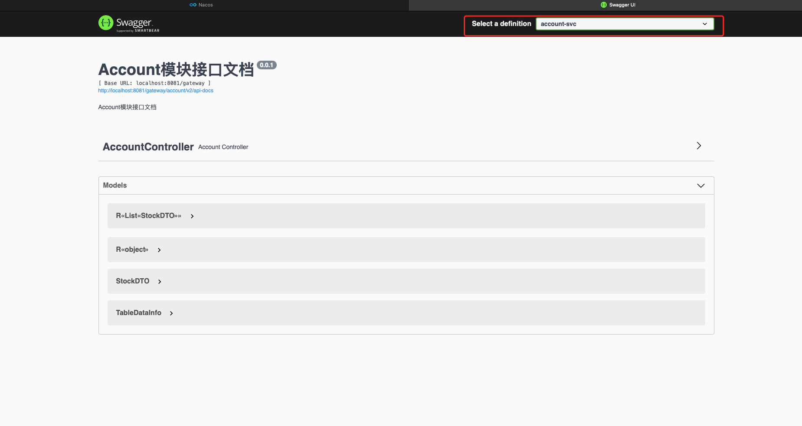

# Spring Cloud Alibaba-Swagger3集成 <!-- {docsify-ignore-all} -->

## Spring Cloud Gateway集成


#### pom依赖

```xml
        <dependency>
            <groupId>io.springfox</groupId>
            <artifactId>springfox-swagger-ui</artifactId>
            <version>3.0.0</version>
        </dependency>
        <dependency>
            <groupId>io.springfox</groupId>
            <artifactId>springfox-swagger2</artifactId>
            <version>3.0.0</version>
        </dependency>
```


#### swagger-resources代码

```java
@RestController
@RequestMapping("/swagger-resources")
public class SwaggerController {

    @Autowired(required = false)
    private SecurityConfiguration securityConfiguration;

    @Autowired(required = false)
    private UiConfiguration uiConfiguration;

    private final SwaggerResourcesProvider swaggerResources;

    @Autowired
    public SwaggerController(SwaggerResourcesProvider swaggerResources) {
        this.swaggerResources = swaggerResources;
    }

    @GetMapping("/configuration/security")
    public Mono<ResponseEntity<SecurityConfiguration>> securityConfiguration() {
        return Mono.just(new ResponseEntity<>(
                Optional.ofNullable(securityConfiguration).orElse(
                        SecurityConfigurationBuilder.builder().build()),
                HttpStatus.OK));
    }

    @GetMapping("/configuration/ui")
    public Mono<ResponseEntity<UiConfiguration>> uiConfiguration() {
        return Mono.just(new ResponseEntity<>(
                Optional.ofNullable(uiConfiguration).orElse(UiConfigurationBuilder.builder().build()), HttpStatus.OK));
    }

    @SuppressWarnings("rawtypes")
    @GetMapping("")
    public Mono<ResponseEntity> swaggerResources() {
        return Mono.just((new ResponseEntity<>(swaggerResources.get(), HttpStatus.OK)));
    }
}
```

#### SwaggerProvider

```java
@Component
public class SwaggerProvider implements SwaggerResourcesProvider, WebFluxConfigurer {

    /**
     * Swagger2默认的url后缀
     */
    private static final String SWAGGER_URL = "/v2/api-docs";

    @Lazy
    @Autowired
    private RouteLocator routeLocator;

    @Autowired
    private GatewayProperties gatewayProperties;

    @Override
    public List<SwaggerResource> get() {
        List<SwaggerResource> resourceList = new ArrayList<>();
        List<String> routes = new ArrayList<>();
        // 获取网关中配置的route
        routeLocator.getRoutes().subscribe(route -> routes.add(route.getId()));

        gatewayProperties.getRoutes().stream()
                .filter(routeDefinition -> routes.contains(routeDefinition.getId()))
                .forEach(routeDefinition -> routeDefinition.getPredicates().stream()
                        .filter(predicateDefinition -> "Path".equalsIgnoreCase(predicateDefinition.getName()))
                        .forEach(predicateDefinition ->
                                resourceList.add(swaggerResource(routeDefinition.getId()
                                        , predicateDefinition.getArgs().get(NameUtils.GENERATED_NAME_PREFIX + "0").replace("/**", SWAGGER_URL)))));
        return resourceList;
    }

    @Override
    public void addResourceHandlers(ResourceHandlerRegistry registry) {
        registry.addResourceHandler("/swagger-ui/**")
                .addResourceLocations("classpath:/META-INF/resources/webjars/springfox-swagger-ui/");
    }

    private SwaggerResource swaggerResource(String name, String location) {
        SwaggerResource swaggerResource = new SwaggerResource();
        swaggerResource.setName(name);
        swaggerResource.setLocation(location);
        swaggerResource.setSwaggerVersion("2.0");
        return swaggerResource;
    }
}
```

## 业务服务集成

​    业务服务众多，所以这里将Swagger集成封装成一个jar包。

#### pom依赖

```xml
<?xml version="1.0" encoding="UTF-8"?>
<project xmlns="http://maven.apache.org/POM/4.0.0"
    xmlns:xsi="http://www.w3.org/2001/XMLSchema-instance"
    xsi:schemaLocation="http://maven.apache.org/POM/4.0.0 http://maven.apache.org/xsd/maven-4.0.0.xsd">
    <modelVersion>4.0.0</modelVersion>
    <parent>
        <groupId>io.redick.cloud</groupId>
        <artifactId>ruuby-modules</artifactId>
        <version>${revision}</version>
    </parent>
    
    <artifactId>ruuby-module-swagger</artifactId>

    <packaging>jar</packaging>

    <dependencies>
        <dependency>
            <groupId>org.springframework.boot</groupId>
            <artifactId>spring-boot-starter-web</artifactId>
        </dependency>

        <dependency>
            <groupId>org.springframework.boot</groupId>
            <artifactId>spring-boot-starter-actuator</artifactId>
        </dependency>

        <!-- Swagger -->
        <dependency>
            <groupId>io.springfox</groupId>
            <artifactId>springfox-boot-starter</artifactId>
            <version>${swagger.fox.version}</version>
        </dependency>
    </dependencies>
</project>
```

#### 开启Swagger注解

```java
@Target({ElementType.TYPE})
@Retention(RetentionPolicy.RUNTIME)
@Documented
@Inherited
@Import({SwaggerAutoConfiguration.class})
public @interface EnableRuubySwagger {

}
```

#### Swagger自定义配置

​    基于`@ConfigurationProperties`提供自定义配置绑定，业务服务可以自定义配置服务信息

```java
@ConfigurationProperties("swagger")
@Data
public class SwaggerProperties {

    /**
     * 是否开启swagger
     */
    private Boolean enabled = false;

    /**
     * swagger会解析的包路径
     **/
    private String basePackage = "";

    /**
     * swagger会解析的url规则
     **/
    private List<String> basePath = new ArrayList<>();

    /**
     * 在basePath基础上需要排除的url规则
     **/
    private List<String> excludePath = new ArrayList<>();

    /**
     * 标题
     **/
    private String title = "";

    /**
     * 描述
     **/
    private String description = "";

    /**
     * 版本
     **/
    private String version = "";

    /**
     * 许可证
     **/
    private String license = "";

    /**
     * 许可证URL
     **/
    private String licenseUrl = "";

    /**
     * 服务条款URL
     **/
    private String termsOfServiceUrl = "";

    /**
     * host信息
     **/
    private String host = "";

    /**
     * 联系人信息
     */
    private Contact contact = new Contact();

    public static class Contact {
        /**
         * 联系人
         **/
        private String name = "";
        /**
         * 联系人url
         **/
        private String url = "";
        /**
         * 联系人email
         **/
        private String email = "";

        public String getName() {
            return name;
        }

        public void setName( String name ) {
            this.name = name;
        }

        public String getUrl() {
            return url;
        }

        public void setUrl( String url ) {
            this.url = url;
        }

        public String getEmail() {
            return email;
        }

        public void setEmail( String email ) {
            this.email = email;
        }
    }
}
```

#### Spring MVC配置

​    实现`WebMvcConfigurer`接口，配置swagger资源

```java
public class SwaggerWebMvcConfiguration implements WebMvcConfigurer {

    @Override
    public void addResourceHandlers(ResourceHandlerRegistry registry) {
        registry.addResourceHandler("/swagger-ui/**")
                .addResourceLocations("classpath:/META-INF/resources/webjars/springfox-swagger-ui/")
                .resourceChain(false);
    }

    @Override
    public void addViewControllers(ViewControllerRegistry registry) {
        registry.addViewController("/swagger-ui/")
                .setViewName("forward:/swagger-ui/index.html");
    }
}
```

#### Swagger集成的配置类

```java
@Configuration
@EnableOpenApi
@EnableAutoConfiguration
@ConditionalOnProperty(name = "swagger.enabled", matchIfMissing = true)
public class SwaggerAutoConfiguration {

    @Bean
    @ConditionalOnMissingBean
    public SwaggerProperties swaggerProperties() {
        return new SwaggerProperties();
    }

    @Bean
    public SwaggerWebMvcConfiguration swaggerWebMvcConfiguration() {
        return new SwaggerWebMvcConfiguration();
    }

    @Bean
    @ConditionalOnMissingBean
    public Docket api(SwaggerProperties swaggerProperties) {
        return new Docket(DocumentationType.SWAGGER_2)
                .globalResponses(HttpMethod.GET, new ArrayList<>())
                .globalResponses(HttpMethod.PUT, new ArrayList<>())
                .globalResponses(HttpMethod.POST, new ArrayList<>())
                .globalResponses(HttpMethod.DELETE, new ArrayList<>())
                .apiInfo(apiInfo(swaggerProperties))
                .produces(Sets.newHashSet("application/json"))
                // 是否开启
                .enable(swaggerProperties.getEnabled()).select()
                // 扫描的路径包
                .apis(RequestHandlerSelectors.basePackage(swaggerProperties.getBasePackage()))
                // 指定路径处理PathSelectors.any()代表所有的路径
                .paths(PathSelectors.any())
                .paths(PathSelectors.ant("/error").negate())
                .paths(PathSelectors.ant("/actuator/**").negate())
                .build().pathMapping("/");
    }

    private ApiInfo apiInfo(SwaggerProperties swaggerProperties) {
        return new ApiInfoBuilder()
                .title(swaggerProperties.getTitle())
                .description(swaggerProperties.getDescription())
                .license(swaggerProperties.getLicense())
                .licenseUrl(swaggerProperties.getLicenseUrl())
                .termsOfServiceUrl(swaggerProperties.getTermsOfServiceUrl())
                .contact(new Contact(swaggerProperties.getContact().getName(), swaggerProperties.getContact().getUrl(), swaggerProperties.getContact().getEmail()))
                .version(swaggerProperties.getVersion())
                .build();
    }

    /**
     * 增加如下配置可解决Spring Boot 2.6.x以上 与Swagger 3.0.0 不兼容问题
     **/
    @Bean
    public WebMvcEndpointHandlerMapping webEndpointServletHandlerMapping(WebEndpointsSupplier webEndpointsSupplier
            , ServletEndpointsSupplier servletEndpointsSupplier
            , ControllerEndpointsSupplier controllerEndpointsSupplier
            , EndpointMediaTypes endpointMediaTypes
            , CorsEndpointProperties corsProperties
            , WebEndpointProperties webEndpointProperties
            , Environment environment) {
        List<ExposableEndpoint<?>> allEndpoints = new ArrayList<>();
        Collection<ExposableWebEndpoint> webEndpoints = webEndpointsSupplier.getEndpoints();
        allEndpoints.addAll(webEndpoints);
        allEndpoints.addAll(servletEndpointsSupplier.getEndpoints());
        allEndpoints.addAll(controllerEndpointsSupplier.getEndpoints());
        String basePath = webEndpointProperties.getBasePath();
        EndpointMapping endpointMapping = new EndpointMapping(basePath);
        boolean shouldRegisterLinksMapping = this.shouldRegisterLinksMapping(webEndpointProperties, environment, basePath);
        return new WebMvcEndpointHandlerMapping(endpointMapping, webEndpoints, endpointMediaTypes, corsProperties.toCorsConfiguration(), new EndpointLinksResolver(allEndpoints, basePath), shouldRegisterLinksMapping, null);
    }
    private boolean shouldRegisterLinksMapping(WebEndpointProperties webEndpointProperties, Environment environment, String basePath) {
        return webEndpointProperties.getDiscovery().isEnabled() && (StringUtils.hasText(basePath) || ManagementPortType.get(environment).equals(ManagementPortType.DIFFERENT));
    }
}
```


## 可用性测试

#### 业务系统集成

​    业务系统引入封装好的Swagger包

#### 业务系统application.yml配置

​     配置文件中增加如下配置

```yaml
swagger:
  enabled: true
  basePackage: io.redick.cloud.account
  title: Account模块接口文档
  description: Account模块接口文档
  version: 0.0.1
  terms-of-service-ur: io.redick.cloud.account
springfox:
  documentation:
    swagger:
      v2:
        # Swagger api 文档数据接口
        path: /account/v2/api-docs
```


#### 测试

访问网关的Swagger UI，http://localhost:8081/swagger-ui/index.html?urls.primaryName=account-svc

