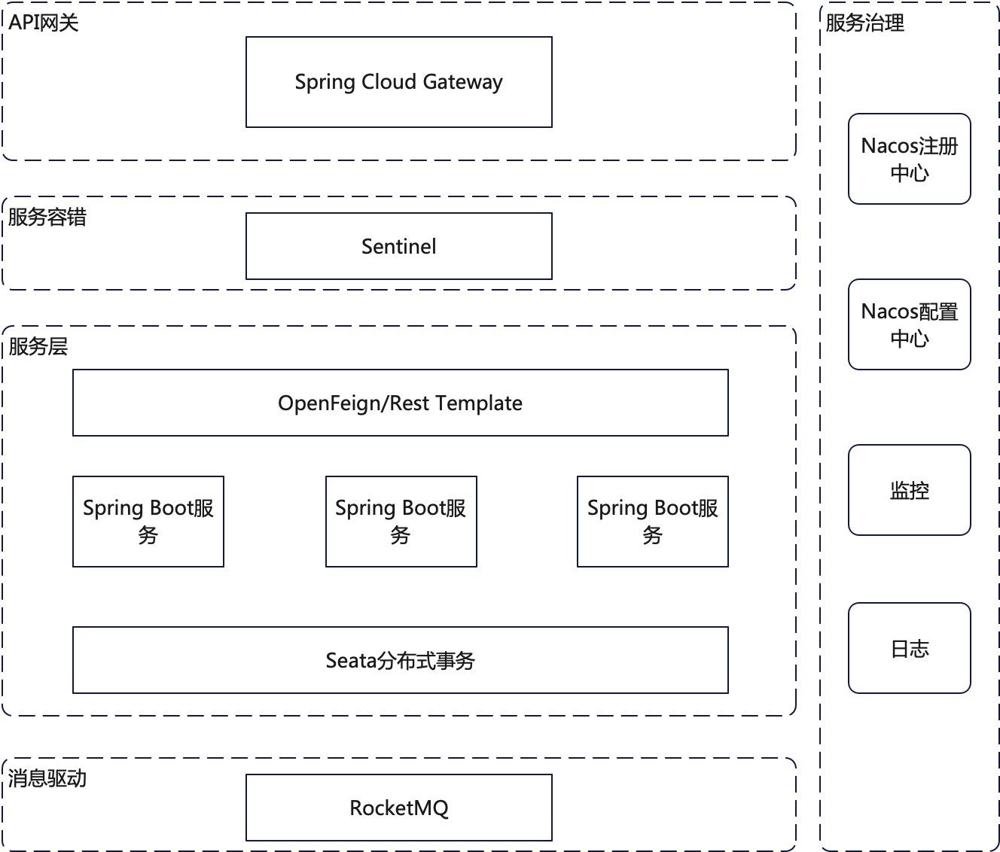

# Spring Cloud Alibaba 对比 Spring Cloud <!-- {docsify-ignore-all} -->

## Spring Cloud Netflix与Spring Cloud Alibaba开源组件对比

|         | Spring Cloud Netflix                                 | Spring Cloud Alibaba                            |
|---------|------------------------------------------------------|-------------------------------------------------|
| 注册中心    | Eureka（Eureka 2.0孵化失败）                               | Nacos （性能强劲，感知能力更强）                             |
| 配置中心    | Spring Cloud Config （搭建复杂，约定多，设计繁重，没有界面，上手难）         | Nacos  （搭建简单，可视化界面，配置管理更高效，学习成本低）               |
| API网关   | Zuul/Spring Cloud Gateway （Spring Cloud Gateway性能更好） | Spring Cloud Gateway （Spring Cloud Gateway性能更好） |                  |
| 服务容错    | Hystrix    （2020年停止维护）                               | Sentienl    （可视化配置，上手更容易）                       |
| 负载均衡    | Ribbon                                               | Spring Cloud LoadBalancer                       |
| RPC组件   | Spring Cloud OpenFeign/Rest Template                 | Spring Cloud OpenFeign/Rest Template            |                 |
| 分布式事务   |                                                      | Seata                                           |
| 分布式链路追踪 | Spring Cloud Sleuth                                  | Spring Cloud Sleuth/Skywalking                  |
| 消息驱动    | Spring Cloud Stream Kafka                            | Spring Cloud Stream RocketMQ                    |
| 分布式调度   | -                                                    | -                                               |

### 对比结果

如果选择 Spring Cloud 体系，就要思考选择哪一个 Spring Cloud 套件。目前最流行的，可能是 Netflix 提供的 Spring Cloud Netflix 套件。但是
Netflix 开始减少在开源领域的投入，在2018年以后逐步开始停止维护其组件。如下：

1. Netflix 将 Feign 捐献给 OpenFeign 社区
2. Eureka2.0孵化失败，开源停止，使用后果自负
3. Hystrix停止维护
4. Spring Cloud 官方团队不考虑提供 Zuul 2 的支持，由Spring Cloud Gateway代替
5. Ribbon 进入维护状态，不再进行扩展功能开发

## Spring Cloud Alibaba开源组件和商业组件对比

Spring Cloud Alibaba提供开源组件支持并且不，还有自家阿里云商业版组件的支持

|       | 开源组件                                 | 阿里云商业组件                              |
|-------|--------------------------------------|--------------------------------------|
| 注册中心  | Nacos                                | ANS                                  |
| 配置中心  | Nacos                                | ACM                                  |
| API网关 | Spring Cloud Gateway                 | -                                    |
| 服务容错  | Sentinel                             | AHAS                                 |
| 负载均衡  | Spring Cloud LoadBalancer            | -                                    |
| RCP组件 | Spring Cloud OpenFeign/Rest Template | Spring Cloud OpenFeign/Rest Template |
| 分布式事务 | Seata                                | -                                    |
| 分布式调度 | -                                    | SchedulerX                           |
| 链路追踪  | Spring Cloud Sleuth/Skywalking       | -                                    |
| 消息驱动  | Spring Cloud Stream RocketMQ         | Apache RocketMQ                      |
| 对象存储  | -                                    | OSS                                  |
| 短信服务  | -                                    | SMS                                  |

## Spring Cloud Alibaba构建微服务架构
