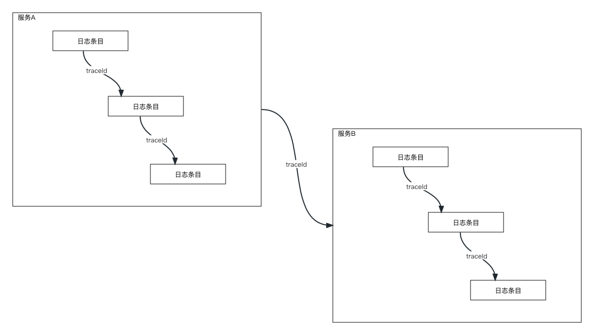

# 日志级别链路追踪及规范  <!-- {docsify-ignore-all} -->


## 实现日志链路追踪目的

### 开发查日志过程中遇到的痛点

1. 开发的代码没有打印合理的日志，无法根据请求参数定位请求日志
2. 定位到请求日志后无法检索出一条完整请求链路上的所有日志
3. 分布式场景下日志链路追踪能力缺失
4. 日志中没有自定义业务标签，无法多维度分析
5. 无法统计分析系统业务接口RT分布情况
6. 无法直接定位RT耗时较大的逻辑和代码
7. 上下游定位同一请求困难
8. 打印日志没有形成统一规范，五花八门
9. 日志打印数据脱敏
10. 多线程、异步处理链路追踪断裂

### 运维需求

1. 格式化日志内容（json），方便logstash解析


## 实现

### 什么是链路追踪？

​    击鼓传花，一个请求的完整的链路可以通过一个唯一的traceId能够串起来，通过traceId可以将链路上的所有日志都可以快速检索出来（不论是日志文件，还是通过ELK平台）



### 技术选型

logback：基础日志组件

logstash-logback-encoder：日志格式化组件，将日志格式化成json，方便logstash日志数据解析

### 底层技术支持

* MDC：通过MDCAdapter接口实现数据存取，该接口是SPI，logback的MDCAdapter实现是基于ThreadLocal，默认情况下MDC的每个条目都将显示为LoggingEvent中的字段，也可以在logback.xml的encoder中配置显示或者排除MDC中的字段。例如：

> 包含：

```xml
<encoder class = "net.logstash.logback.encoder.LogstashEncoder">
  <includeMdcKeyName>key1ToInclude</includeMdcKeyName>
  <includeMdcKeyName>key2ToInclude</includeMdcKeyName>
</encoder>
```

> 排除

```xml
<encoder class = "net.logstash.logback.encoder.LogstashEncoder">
  <excludeMdcKeyName>key1ToExclude</excludeMdcKeyName>
  <excludeMdcKeyName>key2ToExclude</excludeMdcKeyName>
</enco
```

* 动态代理

* java反射
* logstash-logback-encoder自定义的日志标签

### 实现日志链路追踪的几个关键点

- 方法开始、结束时入参与出参打印及方法执行耗时计算
- 链路追踪traceId生成
- 跨进程链路信息传递
- 跨进程调用耗时计算
- 多线程，异步场景链路信息传递
- 日志中自定义业务标签设置
- 参数脱敏

#### 方法开始、结束时入参与出参打印及方法执行耗时计算

​    AOP+反射实现

#### 链路信息生成实现

​    基于UUID或Skywalking TraceId生成traceId

#### 跨进程链路信息传递与调用耗时计算实现

​    跨进程链路信息传递意思是通过网络协议调用其他服务，或执行数据库语句，Redis命令等将链路信息传递，并计算调用耗时；跨进程链路信息传递实现的思路大致如下：

1. Web拦截器，即Spring MVC的HandlerInterceptor接口；
2. RPC框架或中间件提供的过滤器或拦截器；（dubbo,HttpClitnt,OkHttp,gRPC,Spring Cloud Gateway,Spring Webflux,motan,Spring Cloud Stream,MySQL,RestTemplate,hutool HttpClient, Netty,forest）
3. 参数包装（OpenFeign，消息队列）
4. 动态代理（Jedis,Lettuce,spirng data redis）

#### 多线程、异步场景链路信息传递

   基于阿里 `transmittable-thread-local`工具实现，实现细节：

1. 重写MDCAdapter
2. 通过 `transmittable-thread-local`提供的线程池修饰JUC线程池或spring framework线程池框架

#### 日志中自定义业务标签设置

​    logstash-logback-encoder组件提供能力，支持在json格式的日志中自定义标签字段

#### 参数脱敏

​    提供格式固定的、简单的参数脱敏处理，需要通过annotation标记java bean中的属性。


