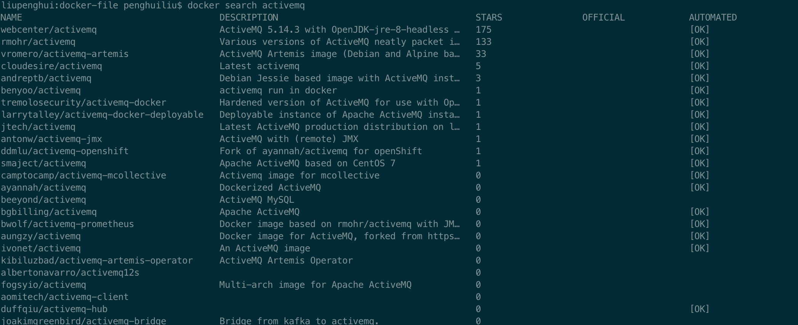
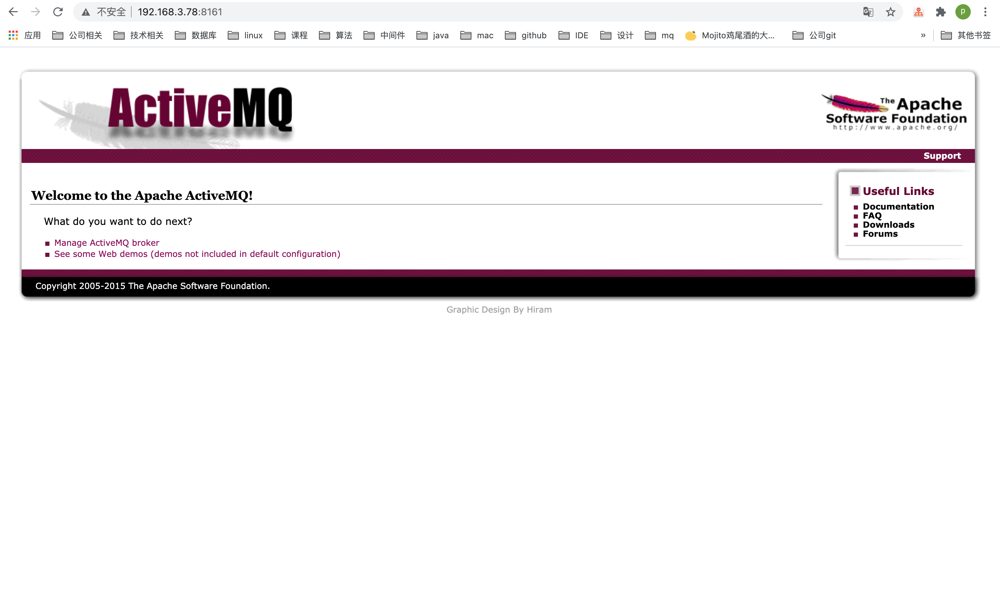

# 消息队列

## 一.传统系统间通信方式及缺点
    1.文件：不及时，很不方便
    2.Socket：长链接，使用不便利，多数情况不如RPC
    3.数据库：扫表处理数据不够实时
    4.RPC：同步处理，压力过大时无法做到缓冲

## 二.期望的通信方式
    1.可以实现异步的消息通信 
    2.可以简化参与各方的复杂依赖关系 
    3.可以在请求量很大的时候，缓冲一下 > 类比线程池里的Queue（削峰填谷）
    4.某些情况下能保障消息的可靠性，甚至顺序

## 三.MQ的四大作用
    1.异步通信：异步通信，减少线程等待，特别是处理批量等大事务、耗时操作。 
    2.系统解耦：系统不直接调用，降低依赖，特别是不在线也能保持通信最终完成。 
    3.削峰平谷：压力大的时候，缓冲部分请求消息，类似于背压处理。 
    4.可靠通信：提供多种消息模式、服务质量、顺序保障等。

## 四.消息处理模式与消息协议

### 消息处理模式
- 点对点：PTP，Point-To-Point对应Queue，生产者生产的消息只能被一个消费者消费掉。
- 发布订阅模式：生产者生产的消息，可以被多个订阅了Topic的消费者消费到。

### 消息处理的保障
三种QoS（注意：这是消息语义的，不是业务语义的）： 
- At most once，至多一次，消息可能丢失但是不会重复发送；
- At least once，至少一次，消息不会丢失，但是可能会重复； 
- Exactly once，精确一次，每条消息肯定会被传输一次且仅一次。 
  
消息处理的事务性： 
- 通过确认机制实现事务性； 
- 可以被事务管理器管理，甚至可以支持XA。

### 消息的有序性
    同一个Topic或Queue的消息，保证按顺序投递

    注意：如果做了消息分区，或者批量预取之类的操作，可能就没有顺序了。

## 五.消息中间件ActiveMQ

### 主要功能
    1. 多种语言和协议编写客户端。 语言: Java, C, C++, C#, Ruby, Perl, Python, PHP等 应用协议: OpenWire,Stomp REST,WS Notification,XMPP,AMQP 2. 完全支持JMS1.1和J2EE 1.4规范 (持久化,XA消息,事务) 
    3. 与Spring很好地集成，也支持常见J2EE服务器
    4. 支持多种传送协议:in-VM,TCP,SSL,NIO,UDP,JGroups,JXTA
    5. 支持通过JDBC和journal提供高速的消息持久化
    6. 实现了高性能的集群模式

### 搭建ActiveMQ服务，这里还是使用Docker搭建ActiveMQ服务

#### 1.查找ActiveMQ镜像并下载
    docker search activemq

    docker pull rmohr/activemq

#### 2.运行容器
    docker run --name activemq -d -p 61616:61616 -p 8161:8161 rmohr/activemq

    说明：
    --name通常容器名称和镜像名称一致，
    -p命令端口最好宿主机和应用一致
    61616：客户端连接ActiveMQ的端口
    8161：管理界面端口

#### 3.查看运行状态
    docker ps

    CONTAINER ID        IMAGE               COMMAND                  CREATED             STATUS              PORTS                                                                                   NAMES
    8f412fb4580f        rmohr/activemq      "/bin/sh -c 'bin/act…"   4 seconds ago       Up 3 seconds        1883/tcp, 5672/tcp, 0.0.0.0:8161->8161/tcp, 61613-61614/tcp, 0.0.0.0:61616->61616/tcp   activemq

#### 4.访问监控页面

    http://192.168.3.78:8161/

#### 5.至此，ActiveMQ服务搭建完毕